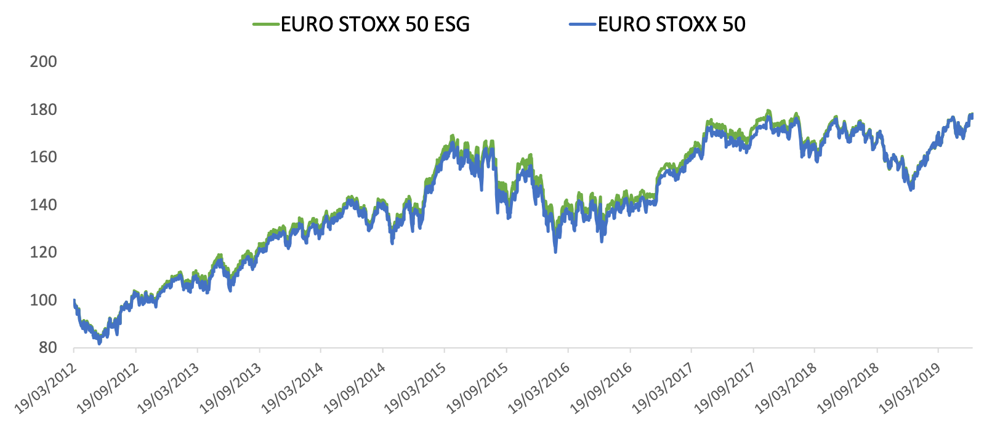

The European markets play a crucial role in the global financial landscape, with the EURO STOXX 50 index serving as a key benchmark for the performance of major blue-chip stocks within the Eurozone. Established in 1998, the EURO STOXX 50 represents 50 of the largest and most liquid stocks in the euro area, providing investors with a snapshot of the overall economic health and corporate performance within Europe. Its composition includes leading companies across diverse sectors from countries such as Germany, France, Spain, and Italy, reflecting the geographical diversity of the European economy.

Algorithmic trading, a modern approach to executing trades using automated and pre-programmed trading instructions, has transformed the trading environment across global markets. With its roots tracing back to the late 20th century, algorithmic trading has gained prominence due to its ability to process complex data at high speeds and execute orders with precision. This technological advancement has not only enhanced market efficiency but also encouraged the development of new trading strategies that capitalize on statistical models and real-time data analysis.



The objectives of this article include a thorough exploration of the interaction between the EURO STOXX 50 index and algorithmic trading. By examining the unique characteristics of the index alongside the operational mechanics of algorithmic trading, we aim to provide valuable insights into how these two elements converge to influence market dynamics in Europe. Such understanding is essential for stakeholders looking to harness the potential of algorithmic trading while navigating the intricacies of the European financial markets.

Understanding the dynamics of algorithmic trading within the European context is critical due to the region's complex regulatory environment and diverse economic landscape. As algorithmic trading evolves, it poses both opportunities and challenges for market participants, influencing everything from liquidity and volatility to the strategies employed by institutional investors. This article sets the stage for a detailed exploration of the strategies, benefits, and challenges associated with algorithmic trading, particularly its implementation within the EURO STOXX 50 index framework.

By investigating these facets, the article aims to equip traders, investors, and regulatory bodies with a comprehensive understanding of how algorithmic trading strategies can be effectively implemented and managed in European markets. This insight is crucial as stakeholders seek to balance innovation with market stability, ensuring robust and efficient trading practices for the future.

## Table of Contents

## Understanding the EURO STOXX 50 Stock Index

The EURO STOXX 50 is a prominent stock index that serves as a key benchmark for the performance of leading blue-chip companies in the Eurozone. The index was introduced in February 1998 and is maintained by STOXX Limited, a subsidiary of Deutsche Börse Group. Its structure is composed of 50 highly capitalized and liquid stocks, representing leading companies from 11 Eurozone countries, including Germany, France, and the Netherlands. This diversity captures a comprehensive snapshot of the Eurozone's economic landscape.

The components of the EURO STOXX 50 are selected based on free-float market capitalization, ensuring that only the largest and most stable companies are included. This criterion aims to reflect the economic strength and stability of these companies in the Eurozone, providing investors with a reliable measure of the region's corporate health. The index undergoes annual reviews in September to account for shifts in market dynamics and to ensure that it remains a relevant benchmark.

Historically, the EURO STOXX 50 has played a significant role as an indicator of economic trends in Europe. It offers insights into the financial health of the Eurozone, with its performance serving as a barometer for economic growth, investor sentiment, and market stability. Comparing the EURO STOXX 50 with other major indices like the FTSE 100 and DAX 30 showcases its unique strength in capturing the collective performance of Eurozone blue-chip stocks, as opposed to the FTSE 100's focus on the UK and DAX 30's emphasis on the German market.

The performance trends of the EURO STOXX 50 frequently reflect the overall health of the European economy. During periods of economic prosperity, the index tends to rise, signifying robust growth and investor confidence. Conversely, during economic downturns, the index typically declines, indicating challenges within the market environment. This relationship affirms the index's critical role in gauging economic stability across the Eurozone.

In summary, the EURO STOXX 50 is a vital measure of the Eurozone's large-cap equity market, offering insights into the region's economic performance. Its carefully selected components, based on stringent criteria, provide investors with a reliable benchmark for assessing Eurozone blue-chip stocks, making it an integral tool for economic analysis and investment strategy in Europe.

## The Role of Algorithmic Trading in Modern Markets

Algorithmic trading, often abbreviated as algo trading, refers to the use of computer algorithms to automate trading decisions in financial markets. These algorithms are based on pre-defined criteria, such as timing, price, and [volume](/wiki/volume-trading-strategy), enabling traders to execute orders at speeds unmatched by human capabilities. Over recent decades, [algorithmic trading](/wiki/algorithmic-trading) has transformed the landscape of global financial markets, becoming increasingly prevalent due to advancements in technology and data analytics.

The benefits of algorithmic trading are numerous. Primarily, it offers significant speed and precision, allowing trades to be executed in fractions of a second. This efficiency is crucial in markets where asset prices can change rapidly. Additionally, algorithmic trading reduces transaction costs by eliminating human intermediaries and minimizing the bid-ask spread. The automation of trading strategies also ensures consistency and removes emotional decision-making from the equation, potentially leading to more disciplined and reliable trading results.

Algorithmic trading significantly impacts market [liquidity](/wiki/liquidity-risk-premium) and [volatility](/wiki/volatility-trading-strategies). By facilitating rapid buying and selling, algo trading enhances liquidity, making it easier for market participants to enter and [exit](/wiki/exit-strategy) positions without causing significant price fluctuations. However, this increased activity can also lead to higher market volatility, as the sheer volume and speed of trades can amplify price movements, especially in less liquid markets.

High-frequency trading ([HFT](/wiki/high-frequency-trading-strategies)) is a subset of algorithmic trading characterized by the execution of a large number of orders at extremely high speeds. HFT firms often operate in milliseconds, exploiting [arbitrage](/wiki/arbitrage) opportunities that persist for brief moments. While HFT can contribute to market liquidity, it is also associated with potential risks, such as predatory trading practices and system disruptions, which can exacerbate market instability.

Several case studies illustrate the profound effects of algorithmic strategies on market dynamics. For instance, the 2010 Flash Crash, where the Dow Jones Industrial Average plummeted nearly 1,000 points within minutes, highlighted the vulnerabilities of markets dominated by algos. An investigation revealed that an excessive sell order triggered a series of automated trades, leading to a feedback loop that caused the sudden collapse. Such events underscore the need for robust risk management practices and regulatory oversight to mitigate the potential downsides of algorithmic trading.

In conclusion, algorithmic trading plays a pivotal role in modern markets. Its ability to enhance speed, precision, and efficiency in executing trades provides clear advantages, although it also presents challenges, particularly concerning market stability and regulatory compliance. As technology continues to evolve, the prevalence and sophistication of algorithmic trading strategies are likely to increase, shaping the future of financial markets globally.

## Algo Trading Strategies for the EURO STOXX 50

Algorithmic trading strategies for the EURO STOXX 50 are diverse, leveraging advanced technologies and quantitative methods to efficiently execute trades. Among these strategies, several common approaches stand out, each utilizing different techniques tailored to capitalize on specific market conditions.

**Technical Analysis and Quantitative Models**

Technical analysis involves using historical price data and trading volumes to forecast future market movements. Traders apply various chart patterns, indicators, and statistical measures to identify potential trading opportunities within the EURO STOXX 50 index. Popular technical indicators include moving averages, Bollinger Bands, and the Relative Strength Index (RSI). 

Quantitative models enhance technical analysis by introducing mathematical methods to the trading decision-making process. These models often apply statistical and econometric techniques to develop predictive models that can optimize trading strategies. For example, regression analysis can be employed to identify and quantify variables that significantly influence stock prices within the EURO STOXX 50. 

A simple moving average crossover strategy might involve buying when a short-term moving average crosses above a long-term moving average, and selling when the opposite occurs. In Python, this can be represented as:

```python
import pandas as pd

def moving_average_strategy(prices, short_window=20, long_window=100):
    signals = pd.DataFrame(index=prices.index)
    signals['signal'] = 0.0
    signals['short_mavg'] = prices.rolling(window=short_window, min_periods=1, center=False).mean()
    signals['long_mavg'] = prices.rolling(window=long_window, min_periods=1, center=False).mean()
    signals['signal'][short_window:] = np.where(signals['short_mavg'][short_window:] > signals['long_mavg'][short_window:], 1.0, 0.0)
    signals['positions'] = signals['signal'].diff()

    return signals
```

**Statistical Arbitrage**

Statistical arbitrage is another prominent strategy that traders use within the EURO STOXX 50 index. This method involves identifying price discrepancies between correlated securities and executing trades to exploit these temporary inefficiencies. Statistical arbitrage often uses techniques like [pair trading](/wiki/pair-trading), where two correlated stocks are traded based on the divergence and convergence of their price ratios.

A pair trading strategy might involve the use of the z-score, a statistical measure that describes a value's relation to the mean of a group of values. For two stocks with prices $A_t$ and $B_t$, the z-score can be calculated as:

$$
z = \frac{(A_t - B_t) - \mu}{\sigma}
$$

Where $\mu$ is the mean and $\sigma$ the standard deviation of the difference $(A_t - B_t)$. Trades would be conducted when the z-score exceeds a threshold value, indicating mispricing.

**Machine Learning and AI-Driven Strategies**

Machine learning and [artificial intelligence](/wiki/ai-artificial-intelligence) have transformed algorithmic trading, allowing models to learn from complex data patterns without explicit programming. In the EURO STOXX 50 context, these technologies enable enhanced decision-making by processing vast amounts of historical data to predict future trends.

Machine learning algorithms, such as random forests, support vector machines, and neural networks, are often applied to develop predictive models that recognize patterns and relationships within financial data. For instance, a predictive model could be trained to classify market conditions as bullish or bearish based on historical price movements and macroeconomic indicators.

**Risk Management Techniques**

Algorithmic trading in the EURO STOXX 50 requires meticulous risk management to ensure that potential losses are kept within acceptable boundaries. Various techniques are employed to mitigate risks, such as the use of stop-loss and take-profit orders, diversification, and hedging strategies. Implementing these measures helps traders manage their exposure and protect against adverse market moves.

Risk parity, a technique that allocates capital based on the risk of individual assets, can be instrumental in balancing exposure within an algorithmic trading portfolio. This approach ensures that each investment contributes equally to the overall portfolio risk, promoting a more balanced risk-return profile.

In summary, algorithmic trading strategies tailored for the EURO STOXX 50 involve a blend of technical analysis, quantitative models, [statistical arbitrage](/wiki/statistical-arbitrage), and [machine learning](/wiki/machine-learning), underpinned by robust risk management techniques. These strategies aim to optimize trading performance by accurately forecasting market movements, exploiting inefficiencies, and effectively managing risks.

## Benefits and Challenges of Algorithmic Trading in EURO STOXX 50

Algorithmic trading has introduced numerous advantages for market participants focused on the EURO STOXX 50 index, transforming the way trading is executed and managed. One of the primary benefits is the enhancement of trade execution speed, allowing traders to capitalize on minute price movements that occur within microseconds. This capability is particularly useful in a highly liquid market like the EURO STOXX 50, where even small price changes can lead to profitable opportunities.

Moreover, algorithmic trading provides precision in order execution by minimizing human error and ensuring trades are executed at optimal prices. This precision is achieved through pre-defined algorithms and strategies that assess multiple data points swiftly. Consequently, transaction costs are significantly reduced due to automated processes and the ability to execute trades at the best possible prices.

Despite these advantages, algorithmic trading on the EURO STOXX 50 is not without its challenges. Regulatory scrutiny is a major concern, particularly within the European markets where complex frameworks such as the Markets in Financial Instruments Directive II (MiFID II) impose stringent requirements on transparency and fairness. Compliance with these regulations demands significant resources from trading firms, including investments in advanced technology and legal expertise.

Technological dependencies further compound these challenges. Algorithmic trading systems require robust and reliable infrastructure to function effectively. Any technical failure or latency in data transmission can lead to significant financial losses, highlighting the need for continuous investments in technology and risk management frameworks.

Algorithmic trading also influences traditional investing practices by shifting the focus from human-driven decision-making to data-driven strategies. This transition can marginalize traditional investors who may lack access to sophisticated trading technologies and strategies. The competitive edge gained through algorithms can create an uneven playing field, wherein technologically advanced traders consistently outperform conventional investors.

Notably, algorithmic trading carries potential risks such as flash crashes, which are abrupt and severe market downturns often triggered by automated trade executions. These events can disrupt market stability and erode investor confidence. Mitigating such risks involves implementing robust risk management systems and circuit breakers designed to pause trading during extreme volatility.

Finding a balance between innovation and market stability is crucial for the sustainable development of algorithmic trading in the EURO STOXX 50. As technology continues to evolve, fostering an environment that encourages innovation while maintaining a stable and transparent market is essential. This balance will ensure that the benefits of algorithmic trading can be leveraged without compromising the integrity and stability of the financial markets.

Ultimately, the integration of algorithmic trading within the EURO STOXX 50 presents both opportunities and challenges. Stakeholders must navigate these complexities carefully, aligning technological advancements with regulatory frameworks and investor interests to harness its full potential.

## Regulatory Landscape and Future Trends

The regulatory framework governing algorithmic trading in Europe is a critical aspect of ensuring transparent, fair, and efficient markets. The Markets in Financial Instruments Directive II (MiFID II) is one of the cornerstone regulations impacting algorithmic trading in the region. Implemented in January 2018, MiFID II aims to enhance the robustness of European financial markets through increased transparency, reporting requirements, and investor protection measures [1].

MiFID II imposes stringent requirements on algorithmic trading. It mandates that firms engaging in algorithmic trading strategies must have effective systems and controls to mitigate trading-related risks. These include synchronization of business clocks for trade timestamping, ensuring algorithms undergo thorough testing before deployment, and maintaining records of orders executed through algorithms. The regulation's emphasis on transparency and auditability aims to prevent market abuse and ensure markets operate in an orderly manner [2].

The evolving landscape of algorithmic trading in Europe is significantly influenced by these regulatory changes. Market participants have increasingly focused on compliance, leading to investments in technology and processes to align with regulatory demands. This evolution has driven improvements in risk management practices and bolstered the market's overall resilience. Firms must also adapt to ongoing updates in regulatory policies, necessitating agile strategies that can accommodate changes without disrupting trading operations.

Looking towards the future, algorithmic trading technology and methodology are expected to undergo significant advancements. One emerging trend is the integration of machine learning and artificial intelligence to enhance algorithmic strategies. These technologies enable more sophisticated data analysis and decision-making processes, allowing for adaptive strategies that can respond dynamically to market conditions. Furthermore, advances in big data analytics and the increasing availability of high-quality data sets provide opportunities to refine trading models and improve prediction accuracy [3].

As algorithmic trading capabilities advance, the EURO STOXX 50 trading strategies will likely be shaped by these trends. Strategies may become more data-driven, leveraging comprehensive historical and real-time data to optimize trade execution. The ability to process large volumes of data rapidly will support high-frequency trading and statistical arbitrage strategies tailored to the EURO STOXX 50 index. Moreover, the continued development of AI-driven trading algorithms presents potential for enhanced risk-adjusted returns.

In summary, the regulatory landscape in Europe, exemplified by MiFID II, plays a crucial role in shaping algorithmic trading practices. As technology advances and regulations evolve, market participants trading indices like the EURO STOXX 50 must remain vigilant and adaptive. The interplay between regulation and innovation will ultimately dictate the future of algorithmic trading in European financial markets.

**References:**

1. Markets in Financial Instruments Directive II (MiFID II), European Securities and Markets Authority (ESMA).
2. Kaushik Balakrishnan, "Algorithmic Trading and its Regulation in Europe," Journal of Financial Regulation, 2020.
3. James B. Overdahl and Michael A. Piwowar, "Algorithmic Trading and the Role of Big Data and AI," Regulation and Governance, 2021.

## Conclusion

The exploration of the EURO STOXX 50 and its relationship with algorithmic trading reveals a transformative landscape in European markets. The EURO STOXX 50, as a pivotal benchmark for European blue-chip stocks, acts as a barometer for the region's economic vitality. It serves as a touchstone for investors gauging the performance of the European economy, with its composition reflecting geographical and sectoral diversity. Algorithmic trading, characterized by its speed, precision, and cost-effectiveness, has significantly reshaped trading practices, offering both opportunities and challenges to market participants.

One of the primary benefits of algorithmic trading is enhanced efficiency through the automation of trading processes, which reduces human error and allows for real-time decision-making. This has led to improved liquidity and tighter spreads, benefiting both traders and the broader market ecosystem. However, challenges persist, notably in terms of regulatory scrutiny and technological reliance, which demand robust oversight and infrastructure resilience. The potential for flash crashes and other systemic risks necessitates comprehensive risk management strategies to ensure market stability.

Looking ahead, the future of trading practices in European markets will be defined by a balance between embracing technological advancement and maintaining rigorous regulatory standards. Stakeholders must remain vigilant and adaptable, staying abreast of regulatory updates and technological innovations. As technology continues to evolve, there is a promising avenue for the integration of machine learning and AI-driven strategies, which hold the potential to further refine trading models and enhance decision-making processes.

A call-to-action for market participants involves a commitment to ongoing education and adaptation to ensure competitiveness in a rapidly changing financial landscape. By fostering a culture of innovation and strategic risk management, stakeholders can effectively harness the benefits of algorithmic trading. The continued exploration and integration of technology within trading strategies will be paramount to navigating the future of European financial markets.

## References & Further Reading

[1]: [Markets in Financial Instruments Directive II (MiFID II), European Securities and Markets Authority (ESMA)](https://www.esma.europa.eu/publications-and-data/interactive-single-rulebook/mifid-ii)

[2]: Balakrishnan, Kaushik. "Algorithmic Trading and its Regulation in Europe." *Journal of Financial Regulation*, 2020.

[3]: Overdahl, James B., and Piwowar, Michael A. "Algorithmic Trading and the Role of Big Data and AI." *Regulation and Governance*, 2021.

[4]: Aldridge, Irene. ["High-Frequency Trading: A Practical Guide to Algorithmic Strategies and Trading Systems."](https://www.amazon.com/High-Frequency-Trading-Practical-Algorithmic-Strategies/dp/1118343506) Wiley, 2nd Edition.

[5]: De Prado, Marcos López. ["Advances in Financial Machine Learning."](https://www.amazon.com/Advances-Financial-Machine-Learning-Marcos/dp/1119482089) Wiley, 2018.

[6]: Jansen, Stefan. ["Machine Learning for Algorithmic Trading."](https://github.com/stefan-jansen/machine-learning-for-trading) Packt Publishing, 2nd Edition.

[7]: Chan, Ernest P. ["Quantitative Trading: How to Build Your Own Algorithmic Trading Business."](https://github.com/ftvision/quant_trading_echan_book) Wiley, 2009.