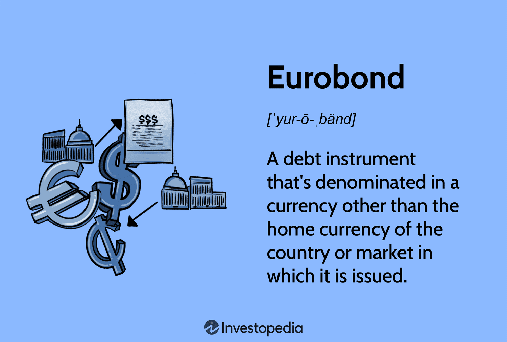

## Table of Contents

## What is a Eurobond?

A Eurobond is a type of bond that is issued in a currency different from the currency of the country where it is issued. For example, a bond issued in Japan but denominated in euros would be called a Eurobond. These bonds are typically issued by multinational corporations, governments, and international organizations to raise money from investors around the world.

Eurobonds are attractive to investors because they can be a way to diversify their investment portfolios. Since they are often issued in major currencies like the euro or the U.S. dollar, they can provide a stable investment option for people who want to invest in a currency other than their own. Additionally, Eurobonds are usually not subject to the same regulations as domestic bonds, which can make them easier and less costly to issue.

## Who can issue a Eurobond?

Eurobonds can be issued by different types of organizations. Governments, big companies, and international groups like the World Bank can all issue Eurobonds. They use these bonds to borrow money from investors all over the world.

These organizations choose to issue Eurobonds because they can reach a lot of investors. When they issue a Eurobond, they can attract people who want to invest in a different currency, like the euro or the U.S. dollar. This helps them raise money more easily and sometimes at a lower cost than other types of bonds.

## What are the typical currencies used for Eurobonds?

Eurobonds are usually issued in big currencies like the euro and the U.S. dollar. These are popular because many people around the world trust these currencies. They are seen as stable and good for investing.

Sometimes, Eurobonds can also be issued in other strong currencies like the British pound or the Japanese yen. These currencies are also trusted by investors and can attract people who want to invest in them. Using different currencies helps the issuers reach more investors and raise money more easily.

## How does the issuance process of a Eurobond work?

When an organization wants to issue a Eurobond, they start by choosing a currency and a bank to help them. This bank is called the lead manager. The lead manager helps the organization figure out how much money they want to raise and how to make the bond attractive to investors. They work together to set the bond's [interest rate](/wiki/interest-rate-trading-strategies), which is the amount investors will earn for lending their money. The organization also decides how long the bond will last before investors get their money back.

Once everything is set, the lead manager helps sell the Eurobond to investors around the world. They might use other banks to help with the selling, and these banks are called underwriters. The underwriters buy the bonds from the organization and then sell them to investors. The money from these sales goes to the organization that issued the bond. After the bonds are sold, the organization has to pay interest to the investors regularly until the bond's term ends, at which point they pay back the full amount borrowed.

## What are the advantages of Eurobonds for issuers?

Eurobonds are good for issuers because they can reach more investors from around the world. When an organization issues a Eurobond, it can attract people who want to invest in a strong currency like the euro or the U.S. dollar. This means the issuer can raise a lot of money more easily. Also, because Eurobonds are not as regulated as other bonds, it can be cheaper and simpler for the issuer to borrow money this way.

Another advantage is that Eurobonds help issuers spread their risk. By borrowing in different currencies, an organization can protect itself if one currency loses value. This makes their financial situation more stable. Plus, when issuers work with banks to sell Eurobonds, those banks often help them get better terms and lower interest rates. This can save the issuer money over time.

## What are the advantages of Eurobonds for investors?

Eurobonds are good for investors because they can help them spread their money across different countries and currencies. This means if one country's economy is not doing well, the investor's money in other places might still be safe. Also, since Eurobonds are often in strong currencies like the euro or the U.S. dollar, investors feel more secure because these currencies are trusted around the world.

Another advantage is that Eurobonds can give investors a chance to earn a good return on their money. Because these bonds are issued by big organizations like governments or big companies, they are seen as safe investments. Plus, the interest rates on Eurobonds can be attractive, helping investors make more money over time.

## What are the potential risks and disadvantages of investing in Eurobonds?

One risk of investing in Eurobonds is that they can be affected by changes in currency values. If an investor buys a Eurobond in a different currency and that currency loses value, the investor's money could be worth less when they get it back. Also, if the country where the Eurobond is issued has economic problems, it might make the bond less valuable or harder to sell.

Another disadvantage is that Eurobonds might not be as easy to buy and sell as other types of investments. They are often sold in big amounts, so smaller investors might find it hard to get into the market. Also, because Eurobonds are less regulated, there might be less information available about them, which can make it harder for investors to make good choices.

## How do Eurobonds differ from domestic bonds?

Eurobonds and domestic bonds are different in a few key ways. A Eurobond is a bond that is issued in a currency different from the country where it is sold. For example, a bond sold in Japan but in euros is a Eurobond. On the other hand, a domestic bond is issued in the currency of the country where it is sold. So, if a bond is sold in Japan and in yen, it's a domestic bond. This difference in currency can affect how investors see the bond and how much they are willing to pay for it.

Another difference is that Eurobonds are often less regulated than domestic bonds. This means that the rules about how they can be sold and what information has to be shared with investors might be less strict. This can make Eurobonds easier and cheaper for the issuer to sell, but it can also make them riskier for investors because they might not have as much information to make a good decision. Domestic bonds, on the other hand, usually have to follow strict rules set by the country's government, which can make them safer but sometimes more costly for the issuer.

## What role do Eurobonds play in global finance?

Eurobonds are very important in global finance because they help big organizations, like governments and companies, borrow money from all over the world. When these organizations issue Eurobonds, they can reach investors in different countries who want to invest in strong currencies like the euro or the U.S. dollar. This makes it easier for them to raise a lot of money. Plus, because Eurobonds are less regulated, it can be cheaper and simpler for these organizations to borrow this way.

For investors, Eurobonds offer a way to spread their money across different countries and currencies. This can help them manage risk because if one country's economy is not doing well, their investments in other places might still be safe. However, Eurobonds also come with risks, like changes in currency values or economic problems in the country where the bond is issued. Overall, Eurobonds help connect the world's financial markets and make it easier for money to move around the globe.

## How are Eurobonds taxed?

Eurobonds are usually taxed based on where the investor lives, not where the bond is issued. This means if you live in the United States and buy a Eurobond, you will have to pay taxes according to U.S. tax laws. Different countries have different rules about how Eurobonds are taxed, so it's important for investors to know the tax laws in their own country.

One advantage of Eurobonds is that they can sometimes be taxed less than other types of investments. This is because Eurobonds are often seen as foreign investments, and some countries have special tax rules for them. For example, some countries might not withhold taxes on the interest paid from Eurobonds, which can save investors money. However, investors should always check with a tax advisor to understand how Eurobonds will be taxed in their specific situation.

## What are the regulatory requirements for issuing Eurobonds?

Eurobonds are not as tightly controlled by rules as domestic bonds. This means that the groups issuing Eurobonds do not have to follow as many strict rules about how they sell the bonds or what information they share with investors. For example, they do not have to go through the same detailed checks that domestic bonds need. This makes it easier and often cheaper for them to get money from investors around the world.

However, there are still some rules that Eurobond issuers must follow. They need to follow the rules of the country where the bond is being sold, even if it's in a different currency. Also, if the Eurobond is sold in more than one country, the issuer might need to follow the rules of each of those countries. This can make things a bit more complicated, but it's still usually less strict than the rules for domestic bonds.

## Can you explain a case study of a successful Eurobond issuance?

In 2019, the Republic of Poland issued a Eurobond that was very successful. Poland wanted to borrow money to help pay for different projects and programs. They decided to issue a Eurobond in euros because they knew many investors around the world would be interested in buying it. The bond was for 10 years and offered a good interest rate, which made it attractive to investors. Poland worked with big banks like BNP Paribas and Citigroup to help sell the bond. In the end, they raised over 1 billion euros, which was more than they expected. This showed that investors trusted Poland and were happy to invest in its future.

The success of Poland's Eurobond was important for a few reasons. First, it helped Poland get the money it needed for its projects without having to borrow in its own currency, the zloty. This was good because it protected Poland from changes in the value of the zloty. Second, the Eurobond attracted investors from all over the world, which showed that Poland was seen as a safe and good place to invest. This made it easier for Poland to borrow money in the future. Overall, the Eurobond helped Poland manage its money better and showed how useful Eurobonds can be for countries looking to borrow money on the world stage.

## References & Further Reading

[1]: Helleiner, E. (1994). ["States and the reemergence of global finance: from Bretton Woods to the 1990s."](https://www.jstor.org/stable/10.7591/j.ctt1tm7jgx) Cornell University Press.

[2]: Fabozzi, F. J., & Markowitz, H. M. (Eds.). (2011). ["The Theory and Practice of Investment Management."](https://onlinelibrary.wiley.com/doi/book/10.1002/9781118267028) John Wiley & Sons.

[3]: Lopez de Prado, M. (2018). ["Advances in Financial Machine Learning."](https://www.amazon.com/Advances-Financial-Machine-Learning-Marcos/dp/1119482089) Wiley.

[4]: Deacon, M., Derry, A., & Mirfendereski, D. (2004). ["Inflation-indexed Securities."](https://www.amazon.com/Inflation-indexed-Securities-Bonds-Swaps-Derivatives/dp/0470868120) John Wiley & Sons.