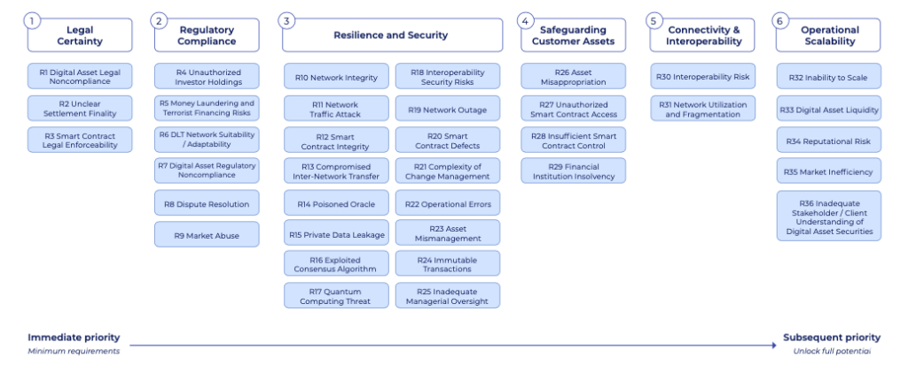

The financial market landscape in Europe has undergone significant transformation due to the operations of key infrastructure providers such as Euroclear and Clearstream. Both entities have played a pivotal role in shaping the modern securities market by providing essential financial services, thereby ensuring the smooth functioning of transactions across European exchanges. As financial markets continue to evolve, the integration of algorithmic trading mechanisms has further revolutionized how securities transactions are conducted, offering unprecedented speed and efficiency.

Algorithmic trading, which employs advanced algorithms to automate trading strategies, has become a cornerstone of modern financial markets. This technological advancement allows trades to be executed at a pace and precision that were previously unattainable. The role of Euroclear and Clearstream extends beyond traditional securities settlement and custody; they provide the critical infrastructure needed to support the high-frequency, high-volume nature of algorithmic trading. Their operations bolster transaction security and efficiency, underpinning the broader stability of Europe’s financial system.



In this article, we explore the instrumental role these institutions play in supporting algorithmic trading activities, alongside the comprehensive suite of financial services they offer. As the landscape of trading continues to shift towards more technology-driven approaches, Euroclear and Clearstream remain at the forefront, ensuring that the evolving demands of the market are met with resilience and innovation.

## Table of Contents

## Understanding Euroclear and Clearstream

Euroclear and Clearstream are fundamental components of the financial market infrastructure within the Eurozone, playing a critical role in the securities industry. These organizations provide essential services that support the robustness and efficiency of the financial markets, which are increasingly reliant on the rapid execution and settlement capabilities necessitated by algorithmic trading.

Euroclear serves as an international central securities depository, facilitating the settlement of securities transactions in a secure and streamlined manner. It acts as a custodian, holding securities in electronic form and ensuring their safe transfer between parties. This settlement process is crucial for maintaining order and trust in financial exchanges, as it ensures that securities and payment transactions are completed in a timely and accurate manner. Additionally, Euroclear supports collateral management, which is vital for reducing counterparty risk in financial transactions. By offering these services, Euroclear contributes to the liquidity and stability of the financial markets.

Similarly, Clearstream operates as a premier provider of post-trade services, including custody and settlement. It provides a seamless infrastructure that allows for the efficient transfer of securities and funds, thereby facilitating the rapid pace required by modern trading activities. Clearstream's robust systems are designed to handle the complexities of cross-border transactions, making it a key player in the global securities market. The institution also offers collateral management services that help financial institutions optimize their resources and meet regulatory requirements.

Both Euroclear and Clearstream are indispensable in enabling secure and efficient transactions on European exchanges. Their services ensure that the high volumes of securities traded daily are settled promptly and accurately, a necessity in a market where [algorithmic trading](/wiki/algorithmic-trading) plays an increasingly significant role. These institutions provide the backbone for market operations, ensuring the continuity and reliability of financial exchanges across Europe.

## The Role of Algorithmic Trading in Financial Markets

Algorithmic trading is a process where complex algorithms are utilized to automate trading strategies and execute trades at speeds that surpass human abilities. These algorithms are designed to make decisions about the timing, price, and quantity of trades, vastly improving the efficiency of financial transactions.

One of the primary advantages of algorithmic trading is the optimization of transaction costs. By automating the trading process, algorithms can pinpoint the most favorable times to execute trades, thus minimizing the cost per transaction. This is particularly useful in high-frequency trading scenarios, where even a millisecond can yield significant financial benefits.

Additionally, algorithmic trading helps reduce market impact. Large orders can be broken down into smaller pieces and executed over time, minimizing disruptions to the market that could affect prices. This strategic fragmentation ensures that trades are executed more discreetly, maintaining market stability.

Moreover, these strategies enable traders to leverage price trends effectively. By analyzing vast datasets and historical trends, algorithms can predict price movements and adjust trading strategies accordingly. This predictive capability enhances the ability to capitalize on short-term price fluctuations, which would be nearly impossible manually.

The efficiency and reliability of these rapid transactions are supported by robust financial infrastructures like Euroclear and Clearstream. These institutions play a critical role in the back-end processing, ensuring that the settlement and custody of securities happen seamlessly. Their infrastructures are equipped to handle the significant [volume](/wiki/volume-trading-strategy) of transactions that algorithmic trading generates, supporting the ongoing demand for speed and accuracy in financial markets.

In conclusion, algorithmic trading continues to transform financial markets by offering enhanced speed, cost-efficiency, and strategic execution of trades. Euroclear and Clearstream are fundamental to maintaining the integrity and efficiency of these operations, thereby reinforcing their critical role in contemporary trading environments.

## Euroclear’s Services in Support of Algo Trading

Euroclear operates as a central securities depository, providing essential infrastructure for the financial markets, especially in the context of algorithmic trading. It serves as a custodial trustee, ensuring that major financial institutions can rely on its robust systems for efficient securities settlement and custody management.

The primary contribution of Euroclear to algorithmic trading is its commitment to swift settlement and accurate record-keeping. Such capabilities are crucial for maintaining the stability and efficiency of algorithmic transactions, which often occur at velocities beyond human execution. This reliability is vital for high-frequency trading operations, where even minor delays can lead to significant financial discrepancies.

Integration with modern technologies has further enhanced Euroclear's ability to support these demanding operations. In particular, Euroclear's exploration into distributed ledger technology (DLT) positions it at the forefront of innovation in financial markets infrastructure. DLT can offer a decentralized means of monitoring and executing transactions, providing an additional layer of security and efficiency. This integration is not just theoretical; by using DLT, Euroclear can potentially reduce settlement times, lower costs, and improve transparency across its operations.

Consider the theoretical example of a trade executed via algorithmic trading that involves several steps across different trading platforms. Euroclear's infrastructure ensures that each of these steps, from trade initiation to settlement, is accurately synchronized and recorded. This accuracy minimizes the risk of discrepancies and bolsters confidence among traders relying on automated strategies.

In terms of code, Euroclear might utilize sophisticated algorithms to ensure these processes are completed accurately. A simplistic example in Python could be:

```python
def settle_trade(trade, ledger):
    # Simulate verification of trade
    if verify_trade(trade):
        # Record in a distributed ledger
        ledger.append(trade)
        return "Settlement successful"
    else:
        return "Settlement failed"

def verify_trade(trade):
    # Placeholder for verification logic
    return True

# Sample ledger and trade
ledger = []
trade = {"id": 101, "amount": 10000, "currency": "EUR"}

status = settle_trade(trade, ledger)
print(status)
```

This code snippet represents a highly simplified model simulating trade settlement incorporating verification and ledger logging. In practice, Euroclear would deploy far more complex and secure systems.

Euroclear's proactive approach in integrating advanced technologies such as DLT ensures it meets the needs of modern financial markets. By maintaining a robust infrastructure, Euroclear directly supports the effective functioning of algorithmic trading, thereby enhancing the [liquidity](/wiki/liquidity-risk-premium) and integrity of the broader financial system.

## Clearstream's Contribution to Computational Trading

Clearstream is a key player in the financial market infrastructure sector, particularly in its contributions to computational trading. As a central provider of securities settlement and custody management, Clearstream's infrastructure is designed to efficiently manage the high volume and velocity of transactions inherent in algorithmic trading. This capability is crucial as computational trading strategies rely on executing large numbers of transactions at high speeds to capitalize on short-term market inefficiencies and price discrepancies.

Clearstream's robust technological framework supports these demands by providing seamless integration with trading platforms and ensuring rapid settlement processes. By minimizing latency in trade execution and settlement, Clearstream enhances the performance of algorithmic trading systems. The company's infrastructure is designed to ensure scalability and reliability, meeting the needs of high-frequency traders who require consistent and uninterrupted access to financial markets.

A significant aspect of Clearstream's contribution is its commitment to innovation, particularly in exploring digital assets and interoperability solutions. As the financial industry increasingly moves towards digitalization, Clearstream has been proactive in adapting its services to accommodate new asset classes and technological advancements. By leveraging blockchain and distributed ledger technologies, Clearstream aims to streamline processes and improve the transparency and security of transactions, thereby facilitating a more efficient trading environment.

Moreover, Clearstream's focus on interoperability is pivotal in a market landscape characterized by diverse systems and platforms. The company's efforts to ensure seamless interaction between different market participants and systems highlight its forward-thinking approach. This adaptability is essential for managing the complexities of modern trading ecosystems and supporting the evolution of markets that are progressively driven by advanced computational strategies. 

In summary, Clearstream's comprehensive solutions for securities settlement and custody management, combined with its focus on digital assets and interoperability, play a crucial role in supporting and enhancing the efficiency of algorithmic trading. Its infrastructure not only accommodates the current demands of computational trading but is also well-positioned to adapt to future technological and market developments.

## Challenges and Opportunities in Algo Trading

The rapid evolution of algorithmic trading has introduced complexities that financial markets must navigate effectively. One primary challenge is market [volatility](/wiki/volatility-trading-strategies). Algorithmic trading, with its reliance on speed and efficiency, can exacerbate short-term market fluctuations. This occurs as algorithms react to price changes or market news at speeds unattainable by human traders, potentially leading to erratic market movements. An example is the 'flash crash' phenomenon, where sudden drastic drops in market prices occur within a short timeframe due to automated trading mechanisms.

Another significant challenge is the requirement for robust regulatory frameworks. The fast-paced nature of algorithmic trading demands regulations that can keep up with technological advancements and prevent market abuse such as spoofing and layering. Regulatory bodies need to ensure that market stability is not compromised and that there is sufficient oversight to handle the speed and complexity of algorithmic transactions.

However, algorithmic trading presents several opportunities, particularly through the integration of [artificial intelligence](/wiki/ai-artificial-intelligence) (AI) and big data analytics. AI can enhance decision-making processes in trading by evaluating vast amounts of data to identify trading signals and trends that might not be evident to human analysts. The application of AI reduces transaction costs and market impact, optimizing trading strategies and improving overall market efficiency. Moreover, big data analytics can provide insights into market behavior, offering increased transparency and aiding in the prediction of market trends.

Euroclear and Clearstream are strategically positioned to address these challenges and leverage opportunities within algorithmic trading. Their advanced infrastructure and continuous innovation in services ensure that they can adapt to the rapid changes in financial markets. By investing in technology enhancements and aligning with updated regulatory requirements, these institutions contribute to market stability and efficiency. Their capability to evolve and incorporate new technologies means they can provide the necessary support for the dynamic demands of algorithmic trading, ensuring seamless transaction processing and settlement. This adaptability is crucial for maintaining market integrity and fostering a resilient trading environment in an era of technological transformation.

## Conclusion

Euroclear and Clearstream play a critical role in the infrastructure that supports algorithmic trading across Europe. By ensuring the seamless execution and settlement of trades, they contribute significantly to the overall integrity and liquidity of the financial markets. These institutions facilitate the timely processing of trades, helping to maintain a stable market environment that is conducive to the fast-paced nature of algorithmic trading.

Algorithmic trading, which involves executing trades based on pre-defined criteria at speeds unattainable by human traders, relies heavily on the infrastructure provided by entities like Euroclear and Clearstream. Their advanced systems ensure that trades are settled accurately and efficiently, minimizing the risks of discrepancies that could disrupt market operations. The robustness of their infrastructure helps mitigate potential market volatility introduced by high-frequency trading strategies, thus safeguarding the financial markets’ stability.

As technology continues to advance, the landscape of financial markets will further evolve, and the importance of Euroclear and Clearstream’s roles will only increase. Their ongoing investment in technological enhancements, such as the integration of distributed ledger technologies and the exploration of digital asset services, positions them well to adapt to future developments in algorithmic trading. These innovations not only improve trading efficiency but also enhance transparency and security, crucial components for maintaining market trust.

In conclusion, Euroclear and Clearstream are not only foundational to the current functioning of algorithmic trading but also pivotal in shaping its future. As the financial markets continue to evolve with technological advancements, these institutions will remain essential in ensuring the resilience and efficiency of trading systems, thereby supporting the broader economic framework.

## References & Further Reading

[1]: ["The Role of Central Securities Depositories in Financial Stability: A Systemic Risk Perspective"](https://www.iosrjournals.org/iosr-jbm/papers/Vol22-issue9/Series-3/E2209035457.pdf) by the European Central Bank

[2]: Degryse, H., de Jong, F., & van Kervel, V. (2015). ["The Impact of Dark Trading and Visible Fragmentation on Market Quality"](https://academic.oup.com/rof/article/19/4/1587/1567671). Journal of Finance.

[3]: Pozsar, Z., Adrian, T., Ashcraft, A. B., & Boesky, H. (2013). ["Shadow Banking"](https://www.newyorkfed.org/medialibrary/media/research/staff_reports/sr458.pdf). Federal Reserve Bank of New York Staff Report.

[4]: Roşu, I. (2009). ["A Dynamic Model of the Limit Order Book"](https://people.hec.edu/rosu/wp-content/uploads/sites/43/2020/03/limit_RFS_2009.pdf). Review of Financial Studies.

[5]: Capponi, A., & Cheng, W. A. (2016). ["Systemic Risk: The Dynamics Under Central Clearing"](https://www.financialresearch.gov/working-papers/files/OFRwp-2015-08_Systemic-Risk-The-Dynamics-under-Central-Clearing.pdf). Journal of Economic Dynamics and Control.