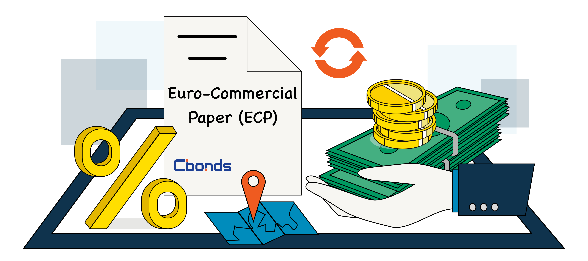

## Table of Contents

## What is Eurocommercial Paper?

Eurocommercial Paper, often shortened to ECP, is a type of short-term debt that companies use to borrow money. It's called "Eurocommercial" because it's usually issued in Europe, but it can be in any currency, not just the Euro. Companies issue ECP to get quick cash for their short-term needs, like paying bills or managing cash flow. The money borrowed through ECP is typically paid back within a year, often even sooner.

ECP is different from regular bonds because it's not meant to last long. It's more like a short-term loan that companies can use when they need money fast. Investors who buy ECP are usually big banks or financial institutions looking for a safe place to park their money for a short time. Because ECP is short-term and considered low risk, it usually has a lower interest rate than longer-term debts.

## Who typically issues Eurocommercial Paper?

Eurocommercial Paper, or ECP, is usually issued by big companies that need quick cash for a short time. These companies can be from any industry, like manufacturing, technology, or finance. They use ECP to help with things like paying bills, managing daily expenses, or covering costs until they get paid by their customers. Because ECP is short-term, it's a good way for companies to get money without having to commit to long-term debt.

Sometimes, banks and other financial institutions also issue ECP. They might do this to manage their own cash flow or to meet short-term funding needs. These institutions often have a lot of experience with different kinds of financial products, so they know how to use ECP effectively. Overall, ECP is a flexible tool that helps a variety of organizations manage their money in the short term.

## What are the typical maturities of Eurocommercial Paper?

Eurocommercial Paper, or ECP, usually has a short time before it needs to be paid back. Most ECP matures in less than a year, often between one day and 270 days. This short time frame is what makes ECP different from other types of borrowing, like bonds, which can last for many years.

Companies like ECP because they can get money quickly and don't have to commit to paying it back over a long period. This makes ECP a good choice for managing short-term needs, like paying bills or waiting for customers to pay them. Because ECP is short-term, it's seen as less risky, which means it usually has a lower [interest rate](/wiki/interest-rate-trading-strategies) than longer-term debts.

## How does Eurocommercial Paper differ from commercial paper issued in the U.S.?

Eurocommercial Paper (ECP) and U.S. commercial paper are both short-term debt instruments used by companies to borrow money quickly, but they have some key differences. ECP is issued in Europe and can be denominated in any currency, not just the Euro. This means a company can issue ECP in dollars, pounds, or any other currency they need. On the other hand, U.S. commercial paper is issued in the United States and is usually denominated in U.S. dollars. This makes ECP more flexible in terms of currency options.

Another difference is in the regulations and how they are sold. ECP is subject to European regulations, which can be different from U.S. regulations. For example, ECP often has a wider range of maturities, from one day up to a year, while U.S. commercial paper typically matures within 270 days. Also, ECP is often sold through a network of dealers across Europe, which can make it easier for companies to reach a broader market. U.S. commercial paper, however, is usually sold directly to investors or through dealers within the U.S. market. These differences in regulation and distribution can affect how companies choose to use these financial tools.

## What are the benefits of issuing Eurocommercial Paper?

Issuing Eurocommercial Paper (ECP) gives companies a fast and flexible way to get money. Companies can borrow what they need for a short time, usually less than a year. This helps them pay bills, manage daily costs, or wait for customers to pay them. Because ECP can be in any currency, companies can choose the one that works best for them. This flexibility makes ECP a good choice for companies that do business in different countries.

Another benefit of ECP is that it's often cheaper than other types of borrowing. Since ECP is short-term and seen as low risk, it usually has a lower interest rate than longer-term debts. This means companies can save money on interest costs. Plus, ECP is easy to issue and doesn't come with the strict rules that some other types of borrowing have. This makes it a simple and cost-effective way for companies to manage their money in the short term.

## What are the risks associated with investing in Eurocommercial Paper?

Investing in Eurocommercial Paper (ECP) comes with some risks. One big risk is that the company issuing the ECP might not be able to pay it back when it's due. This is called default risk. If a company runs into financial trouble, investors could lose their money. Another risk is that the value of ECP can go down if interest rates go up. When rates rise, new ECP might offer higher returns, making the older ECP less attractive and worth less.

There's also the risk that comes from changes in the currency the ECP is issued in. If the ECP is in a different currency than the investor's home currency, changes in exchange rates can affect how much money the investor gets back. If the investor's home currency gets stronger, the value of the ECP in their home currency could go down. Lastly, ECP is usually sold in large amounts, so it might not be easy for small investors to buy and sell it. This can make it harder to get out of the investment quickly if needed.

## How is Eurocommercial Paper rated?

Eurocommercial Paper, or ECP, is rated by special companies called credit rating agencies. These agencies look at how likely a company is to pay back the money it borrows. They give the ECP a rating, like AAA, AA, A, or BBB, to show how safe the investment is. A higher rating, like AAA, means the ECP is seen as very safe because the company is expected to pay back the money on time. A lower rating, like BBB, means there's more risk that the company might not pay back the money.

The ratings help investors decide if they want to buy ECP. If an investor wants a safe place to put their money, they might choose ECP with a high rating. But if they're willing to take more risk for a chance at a higher return, they might look at ECP with a lower rating. The ratings are important because they give investors a quick way to understand the risk of investing in ECP without having to do a lot of research on their own.

## What role do dealers play in the Eurocommercial Paper market?

Dealers are important in the Eurocommercial Paper (ECP) market. They help companies sell their ECP to investors. When a company wants to issue ECP, it works with dealers to find buyers. Dealers know a lot of investors, so they can quickly match the company with people who want to buy ECP. This makes it easier and faster for companies to get the money they need.

Dealers also help keep the ECP market running smoothly. They buy ECP from companies and then sell it to investors. This means they take on some risk, but it also helps make sure there's always someone ready to buy or sell ECP. By doing this, dealers help keep the market active and make it easier for companies to use ECP to manage their money.

## How does the issuance process of Eurocommercial Paper work?

When a company wants to issue Eurocommercial Paper (ECP), it starts by working with dealers. These dealers are like middlemen who help the company find investors willing to buy the ECP. The company tells the dealers how much money it needs and for how long. The dealers then reach out to their network of investors, like banks and financial institutions, to see if they want to buy the ECP. Once the dealers find enough buyers, the company issues the ECP, and the investors give the company the money it needs.

After the ECP is issued, the company uses the money for its short-term needs, like paying bills or managing cash flow. The ECP usually needs to be paid back within a year, often even sooner. When it's time to pay back the ECP, the company gives the money back to the investors, along with any interest that was agreed upon. If everything goes well, the company gets the money it needs quickly, and the investors get their money back with a little extra for their investment.

## What are the regulatory requirements for issuing Eurocommercial Paper in the European Union?

In the European Union, companies that want to issue Eurocommercial Paper (ECP) need to follow some rules. The main rule is that they have to follow the Prospectus Regulation. This means they need to give investors a document called a prospectus. The prospectus tells investors important things about the ECP, like how much money the company is borrowing, for how long, and what the risks are. This helps investors make smart choices about whether to buy the ECP.

There are also some other rules that companies need to follow. For example, they need to make sure they're not breaking any rules about how they sell the ECP. They might need to work with dealers who know the rules and can help them sell the ECP the right way. Also, some countries in the EU might have their own extra rules that companies need to follow. But overall, the main thing is that companies need to be honest and clear with investors about what they're selling.

## How has the Eurocommercial Paper market evolved over the past decade?

Over the past decade, the Eurocommercial Paper (ECP) market has grown and changed a lot. More companies are using ECP to get quick money for short-term needs. This is because ECP is flexible and can be in any currency, which helps companies that do business in different countries. Also, the way ECP is sold has changed. Now, companies use technology and online platforms to reach more investors faster. This has made the ECP market bigger and easier to use.

There have been some challenges too. During times like the financial crisis or the COVID-19 pandemic, the ECP market faced some ups and downs. When things got tough, some investors were scared to buy ECP because they worried about companies not paying back the money. But the market bounced back quickly because ECP is seen as a safe and short-term way to invest. Overall, the ECP market has become a key tool for companies to manage their money, and it keeps getting better and more useful over time.

## What are the future trends and challenges facing the Eurocommercial Paper market?

The Eurocommercial Paper (ECP) market is likely to keep growing and changing in the future. One big trend is that more companies will use technology to issue and sell ECP. This means they can reach more investors faster and easier using online platforms. Also, because more companies do business all over the world, ECP will be even more important for them. They can borrow money in different currencies, which helps them manage their cash better. As more people learn about ECP and how useful it is, the market will probably get bigger and more active.

But there are also some challenges the ECP market might face. One challenge is that big events, like another financial crisis or a global health emergency, could make investors scared to buy ECP. If investors think companies might not pay back the money, they might not want to invest. Another challenge is that rules and regulations could change. If new rules make it harder for companies to issue ECP, it could slow down the market. Even with these challenges, the ECP market is strong and flexible, so it should keep helping companies get the money they need in the short term.

## References & Further Reading

[1]: ["The Eurocommercial Paper Market and Its Role in Corporate Finance."](https://fastercapital.com/content/Eurocommercial-Paper--Exploring-its-Significance-in-Corporate-Finance.html) International Finance Review, Vol. 3, 2002.

[2]: ["Algorithmic Trading and DMA: An introduction to direct access trading strategies"](https://www.amazon.com/Algorithmic-Trading-DMA-introduction-strategies/dp/0956399207) by Barry Johnson

[3]: ["MiFID II/MiFIR"]. (2020). European Securities and Markets Authority. Retrieved from https://www.esma.europa.eu/policy-rules/mifid-ii-and-mifir

[4]: Treleaven, P., Galas, M., & Lalchand, V. (2013). ["Algorithmic Trading Review."](https://www.researchgate.net/publication/262239006_Algorithmic_Trading_Review) Communications of the ACM, 56(11), 76-85.

[5]: ["The Handbook of European Debt Market Instruments"](https://www.ecb.europa.eu/press/intro/events/shared/pdf/20190621/20190621_eddi_presentation.pdf) by Moorad Choudhry

[6]: Chaboud, A., Chiquoine, B., Hjalmarsson, E., & Vega, C. (2014). ["Rise of the Machines: Algorithmic Trading in the Foreign Exchange Market."](https://papers.ssrn.com/sol3/papers.cfm?abstract_id=1501135) International Finance Discussion Papers, Number 1104.

[7]: ["Volatility and Risk in Financial Markets"](https://www.researchgate.net/publication/379531552_FINANCIAL_MARKET_VOLATILITY_AND_RISK_MANAGEMENT_STRATEGIES) by Luc Bauwens, Christian M. Hafner, and Sebastien Laurent