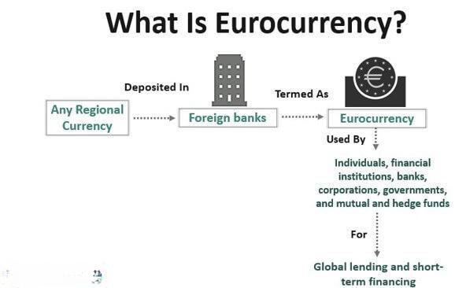

The international finance currency market represents a multifaceted and rapidly evolving segment of the global economy, integral to international trade and investment. This market facilitates the exchange of currencies across borders, impacting everything from multinational corporations to individual investors. Among the numerous components driving its evolution, Eurocurrency and algorithmic trading emerge as pivotal forces.

Eurocurrency, defined as deposits of a currency held outside its home market, plays a critical role in global finance. It enhances liquidity and flexibility, allowing for more efficient capital allocation across countries. The Eurocurrency market is, therefore, fundamental in facilitating international trade and finance, enabling entities to access a broader range of financial products and opportunities irrespective of geographical boundaries. This market operates with minimal regulation, providing various financial instruments such as Eurocurrency loans, deposits, and Eurobonds, which are instrumental in fostering international capital flow.



In parallel, algorithmic trading has reshaped how trading is conducted in the currency markets. Leveraging sophisticated computer algorithms, it automates the trading process based on predefined criteria, enhancing the speed and efficiency with which trades are executed. The rise of algorithmic trading is particularly notable in the Forex markets, where the rapid execution of orders and strategic market movements can offer significant advantages. The adoption of algorithmic strategies is driven by technological advancements, allowing traders to implement complex strategies that can operate continuously and adjust to market conditions efficiently.

This article aims to analyze the intricacies of Eurocurrency and examine the profound impact that algorithmic trading strategies have on currency markets. Understanding these components is crucial for grasping how the international finance currency market functions and continues to transform in response to technological and economic shifts. As the landscape progresses, the fusion of Eurocurrency with algorithmic trading strategies will likely present novel opportunities and challenges for market participants.

## Table of Contents

## Understanding Eurocurrency

Eurocurrency refers to deposits of a currency that are held outside their home country. These deposits are denominated in a currency different from the country where the bank holding the deposit resides. For instance, a US dollar deposit held in a bank outside the United States is termed as Eurodollar. Similarly, a Japanese yen held outside of Japan is known as Euroyen.

The Eurocurrency market is essential in facilitating international trade and finance by providing a mechanism for entities to access foreign currencies. By holding funds in Eurocurrency accounts, corporations, governments, and financial institutions can conduct transactions efficiently without the need for immediate currency conversion. This capability supports international trade by allowing companies to transact in various currencies, thereby avoiding exchange rate risks associated with currency conversion.

A critical advantage of the Eurocurrency market is that it operates largely outside of the jurisdiction and regulation of the currency's home country. This lack of regulation often results in higher interest rates on deposits and lower interest rates on loans compared to domestic markets, making it an attractive option for both borrowers and lenders seeking better financial terms.

An important example of Eurocurrency is the Eurodollar market, which emerged in the mid-20th century. It has grown significantly, driven by factors such as increasing international trade and the need for more cross-border financing options. The Eurodollar market has become a key component of the global financial system by offering a platform for dollar-denominated deposits and loans. This market enhances global [liquidity](/wiki/liquidity-risk-premium) and provides an alternative source of funds for international borrowers.

In summary, Eurocurrency markets play a pivotal role in the global financial system by facilitating the flow of capital across borders, reducing currency conversion risks, and offering more attractive borrowing and lending conditions. This results in increased efficiency and fluidity in international trade and finance.

## The Eurocurrency Market: Structure and Participants

The Eurocurrency market is a decentralized and unregulated global market that facilitates the lending and borrowing of currencies outside their country of origin. This market plays a crucial role in the international financial system by enabling institutions to access capital and manage liquidity efficiently. Because the Eurocurrency market operates outside domestic regulatory frameworks, it offers greater flexibility and competitive interest rates for borrowers and lenders.

### Participants in the Eurocurrency Market

1. **Commercial Banks**: These are the primary players in the Eurocurrency market. Commercial banks accept currency deposits from clients outside their home countries and often lend these funds to other banks or financial institutions. By performing intermediary roles, they provide liquidity and facilitate the efficient allocation of capital across borders.

2. **Central Banks**: Although less active than commercial banks, central banks participate in the Eurocurrency market to influence domestic liquidity and manage foreign reserves. By participating in this market, central banks can affect exchange rates and stabilize their domestic currencies without directly intervening in domestic markets.

3. **Corporations**: Multinational corporations use the Eurocurrency market to manage their global cash flows and hedge against currency risks. By accessing Eurocurrency loans, corporations can take advantage of lower interest rates compared to domestic markets and reduce their overall financing costs.

4. **Investment Funds**: Investment funds, including hedge funds and mutual funds, engage in the Eurocurrency market to diversify their portfolios and manage risk. These entities seek to maximize returns by investing in Eurocurrency products that offer favorable interest rates and liquidity.

### Financial Products in the Eurocurrency Market

The Eurocurrency market provides a variety of financial products that cater to the diverse needs of its participants:

- **Eurocurrency Loans**: These are loans issued in a currency different from the domestic currency of the financial institution providing the loan. Eurocurrency loans offer competitive interest rates and are used by corporations and governments to finance international projects and operations.

- **Eurocurrency Deposits**: Deposits made in banks outside the currency's country of origin are known as Eurocurrency deposits. These deposits can earn higher interest rates due to the lack of reserve requirements and regulatory constraints that typically apply in domestic markets.

- **Eurobonds**: Eurobonds are international bonds issued in a currency not native to the country where it is issued. These bonds are used by corporations and governments to raise large sums of money from international investors. Eurobonds are typically issued in major currencies like the US dollar, euro, or yen and are attractive due to their favorable tax treatment and liquidity.

The Eurocurrency market provides essential flexibility and opportunities for participants to manage capital efficiently and effectively navigate the global financial landscape.

## Algorithmic Trading: A Game Changer

Algorithmic trading automates the buying and selling of financial instruments through computerized systems that execute trades based on pre-defined criteria. This approach offers numerous advantages, particularly within the foreign exchange (Forex) markets, and has gained significant traction with the trading of the Euro.

The rise of [algorithmic trading](/wiki/algorithmic-trading) in Forex markets is attributed to its efficiency and speed, which mitigate human errors and emotional biases, resulting in more consistent trading outcomes. Traders can execute complex strategies that adapt to ever-changing market conditions in milliseconds, a feat unachievable through manual trading. For example, execution algorithms can determine the optimal size and timing for trades to reduce the impact on market prices.

Technological advancements have been pivotal in the widespread adoption of algorithmic trading strategies. High-frequency trading ([HFT](/wiki/high-frequency-trading-strategies)) is a subset that relies on sophisticated algorithms operating at lightning speed, often processing thousands of trades within seconds. This rapid execution capability leverages minimal pricing discrepancies across different exchanges for profit, a process known as [arbitrage](/wiki/arbitrage). Additionally, [machine learning](/wiki/machine-learning) algorithms can analyze vast amounts of historical and real-time data to refine strategies and forecasts continuously.

The adoption of algorithmic trading is fueled by enhanced computing power, more reliable data feeds, and improved connectivity between trading platforms. Major trading platforms now offer application programming interfaces (APIs) that allow traders to integrate custom algorithms seamlessly. Python, a popular programming language in the finance sector, provides libraries such as NumPy and pandas for quantitative analysis, further streamlining the development of sophisticated trading strategies.

Overall, algorithmic trading has transformed traditional Forex methods, offering enhanced precision, reduced transaction costs, and the capacity to harness vast data arrays for more informed decision-making. As technology continues to advance, algorithmic trading is likely to evolve, further embedding its presence in modern financial markets.

## Effective Algorithmic Trading Strategies

Trend-following, arbitrage, and [momentum](/wiki/momentum)-based strategies are fundamental approaches within algorithmic trading employed in Eurocurrency markets. These strategies leverage mathematical and statistical models to capitalize on market trends and inefficiencies.

Trend-following strategies involve analyzing historical price movements to predict future price directions. Traders typically use technical analysis tools like moving averages to identify trends. For instance, a simple moving average (SMA) is calculated by averaging a security's price over a set number of periods. The formula for a simple moving average over $n$ periods is given by:

$$
SMA = \frac{P_1 + P_2 + \ldots + P_n}{n}
$$

In Python, a simple moving average can be calculated as follows:

```python
import pandas as pd

def calculate_sma(prices, window):
    return prices.rolling(window=window).mean()

# Example usage:
# prices is a pandas Series of historical prices
sma_50 = calculate_sma(prices, 50)
sma_200 = calculate_sma(prices, 200)
```

Traders often use the crossover of short-term and long-term moving averages as trading signals, where a short-term SMA crossing above a long-term SMA may indicate a buying opportunity, and vice versa for a selling signal.

Arbitrage strategies aim to exploit price discrepancies between different markets or financial instruments. In Eurocurrency trading, arbitrageurs might seek price differences between currency pair prices across various exchanges or economic instruments. The goal of arbitrage is to secure risk-free profit through simultaneous buying and selling, often requiring high-frequency trading capabilities and rapid execution.

Momentum-based strategies focus on securities exhibiting strong trends based on recent performance metrics. These strategies are predicated on the notion that securities trending strongly will likely continue in the same direction. Momentum can be quantified using indicators like the Relative Strength Index (RSI), which measures the speed and change of price movements.

Effective risk management is essential in algorithmic trading, especially in volatile Eurocurrency markets. Stop-loss orders are a common tool used to limit potential losses. A stop-loss order automatically sells a security when it reaches a specified price, thereby helping mitigate significant losses in fast-moving markets. It is crucial to optimize the placement of stop-loss orders based on factors like [volatility](/wiki/volatility-trading-strategies), which can be measured using standard deviation.

To summarize, successful implementation of algorithmic trading strategies in Eurocurrency markets necessitates a combination of technical analysis, statistical models, and robust risk management practices. These strategies enable traders to take advantage of market trends and inefficiencies while carefully managing potential risks.

## Benefits and Challenges of Eurocurrency Algo Trading

Eurocurrency trading, particularly when augmented by algorithmic trading strategies, provides distinct benefits including higher interest rates and enhanced global liquidity. Due to the offshore nature of Eurocurrency markets, banks can offer attractive interest rates on deposits and loans beyond domestic regulatory constraints. This environment fosters a more efficient allocation of capital across borders, facilitating an increase in global liquidity. The presence of this liquidity is crucial for traders, as it offers the potential for executing large trades with minimal market impact, thereby reducing transaction costs.

However, this advantageous trading landscape is accompanied by significant challenges. A primary concern is the regulatory risk arising from the largely unregulated nature of Eurocurrency markets. Unlike domestic markets, Eurocurrency transactions often occur outside the purview of a single national regulatory authority, complicating compliance efforts. Traders must stay informed about changes in international banking regulations that could impact their activities.

Additionally, robust risk management frameworks are essential due to the inherent risks in Eurocurrency trading. Currency and [interest rate](/wiki/interest-rate-trading-strategies) risks are prominent, as fluctuations in exchange rates and interest rates can significantly impact returns. Effective risk management strategies might include the use of hedging instruments such as futures and options, which can mitigate exposure to adverse movements in currency or interest rates.

For example, consider a Eurocurrency trader focused on the interest rate differentials between the Euro and the U.S. dollar. The trader could implement a [carry](/wiki/carry-trading) trade strategy, borrowing in a currency with low interest rates and investing in a currency with higher rates, such as:

$$
\text{Profit} = (i_{high} - i_{low}) \times \text{Leverage} \times \text{Principal}
$$

where $i_{high}$ is the interest rate of the currency invested in, and $i_{low}$ is the interest rate of the currency borrowed. While this strategy can be profitable, it exposes the trader to the risk of interest rate shifts that could erode the anticipated gains.

In conclusion, while Eurocurrency trading enhanced by algorithmic strategies offers compelling advantages such as elevated interest rates and liquidity, it simultaneously imposes challenges that require diligent regulatory compliance and sophisticated risk management. Traders capable of adeptly navigating these complexities will likely find significant opportunities in this evolving financial landscape.

## Conclusion

The integration of Eurocurrency markets and algorithmic trading strategies is a substantial development in the international finance currency market, presenting numerous opportunities for traders. Eurocurrency offers a platform characterized by higher interest rates and enhanced global liquidity, which, when combined with sophisticated algorithmic trading strategies, provides a potent toolset for market participants looking to optimize their trading outcomes.

Traders who possess a deep understanding of both Eurocurrency markets and algorithmic trading are uniquely positioned to capitalize on these opportunities. With the right blend of knowledge, technology, and strategic insight, traders can craft trading strategies that efficiently leverage the benefits of Eurocurrency's liquidity and cross-border advantages. Algorithmic trading, with its ability to process vast amounts of data and execute trades with precision and speed, serves as a crucial ally in navigating the complex and volatile financial landscape. By using techniques such as trend-following, arbitrage, and risk management strategies like stop-loss orders, traders can enhance their ability to mitigate risks and maximize profitability.

Looking ahead, the international finance currency market will undoubtedly continue to evolve with technological advancements and shifting economic conditions. The expansion of computational power and machine learning in trading systems is expected to further refine algorithmic trading strategies, making them even more robust and adaptive to market changes. Economic shifts, including fluctuating interest rates and global policy changes, will also shape market dynamics, offering both challenges and opportunities for traders.

In summary, the convergence of Eurocurrency markets and algorithmic trading strategies equips traders with powerful tools to navigate an ever-changing financial landscape. By staying informed and continuously refining their approaches, traders can achieve significant success in the international finance currency market.

## References & Further Reading

[1]: Allen, L., Moessner, R., & Nelson, W. R. (2001). ["Liquidity in Emerging Markets."](https://www.semanticscholar.org/paper/Central-Bank-Co-Operation-and-International-in-the-Moessner-Allen/d984574994c3cc19a16ff06c153a5d5829f0f12c) BIS Papers No. 2, Bank for International Settlements.

[2]: Augier, M., & March, J. G. (2002). ["The Economics of Choice, Change, and Organization: Essays in Honor of Richard M. Cyert."](https://www.jstor.org/stable/3556652) Edward Elgar Publishing.

[3]: Coffey, N. (2022). ["The Eurocurrency Market."](https://fastercapital.com/content/Currency-markets--Unraveling-the-Eurocurrency-Phenomenon.html) Board of Governors of the Federal Reserve System.

[4]: Lopez de Prado, M. (2018). ["Advances in Financial Machine Learning."](https://www.amazon.com/Advances-Financial-Machine-Learning-Marcos/dp/1119482089) Wiley.

[5]: Nolan, J., & Bastiaans, C. (1997). ["A Brief History of Eurocurrency Markets."](https://www.semanticscholar.org/paper/Parameter-estimation-and-data-analysis-for-stable-Nolan/af95b3d14dd74ea30a2f62df2a3c1668c440f04c) Practical Market Research.