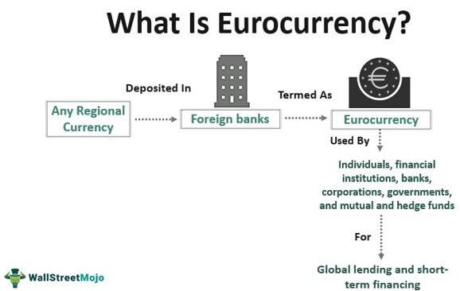

## Table of Contents

## What is the Eurocurrency market?

The Eurocurrency market is a part of the international financial system where banks lend and borrow money in currencies outside their home country. For example, if a bank in Japan lends US dollars to a bank in Germany, that transaction happens in the Eurocurrency market. The term "Eurocurrency" doesn't mean the money has to be in Euros; it just means the currency is being used outside its country of origin. This market is very important because it helps businesses and governments get the foreign currency they need to operate internationally.

The Eurocurrency market is known for being very flexible and efficient. It operates 24 hours a day, which means banks and businesses can do transactions whenever they need to, no matter where they are in the world. Because there are fewer regulations compared to domestic markets, banks can often offer better interest rates. This makes the Eurocurrency market attractive for both borrowers and lenders. However, the lack of regulation also means there can be more risk involved.

## How did the Eurocurrency market originate?

The Eurocurrency market started after World War II. At that time, many countries had strict rules about moving money in and out of their countries. These rules made it hard for businesses and banks to work with foreign currencies. Because of this, banks began to keep money in foreign currencies outside their home countries. For example, American dollars were kept in European banks, which is why it's called the Eurocurrency market even though it's not just about the Euro.

The market really grew in the 1950s and 1960s. One big reason was the Cold War. The Soviet Union wanted to keep its dollars safe from being taken by the U.S. government, so they moved their dollars to European banks. This helped the Eurocurrency market grow. Also, as more countries started trading with each other, they needed a way to use different currencies easily. The Eurocurrency market became a big help for this, and it has kept growing ever since.

## What are the main types of Eurocurrencies?

The main types of Eurocurrencies are based on the most commonly used currencies in the world. The most common Eurocurrency is the Eurodollar, which is the U.S. dollar held outside the United States. Other important Eurocurrencies include the Euroyen, which is the Japanese yen held outside Japan, and the Euroeuro, which is the Euro held outside the Eurozone countries.

Besides these, there are also Eurocurrencies based on other major world currencies like the British pound, known as the Europound, and the Swiss franc, known as the Euroswiss. These Eurocurrencies are used because they are from countries with strong economies and stable financial systems. Banks and businesses around the world use these Eurocurrencies to do business with each other, even if they are not in the countries where the currencies come from.

## What are the key features of the Eurocurrency market?

The Eurocurrency market is a place where banks and businesses can lend and borrow money in different currencies outside their home country. It's like a big, global money market that never sleeps. Because it's open all the time, people can do transactions whenever they need to, no matter where they are in the world. This makes it very convenient for everyone involved.

Another key feature is that the Eurocurrency market has fewer rules than domestic markets. This means banks can offer better interest rates, which is good for both borrowers and lenders. But, because there are fewer rules, there can also be more risk. People need to be careful when they use this market. Even with the risks, the Eurocurrency market is very important because it helps businesses and governments get the foreign money they need to work internationally.

## How does the Eurocurrency market differ from domestic currency markets?

The Eurocurrency market and domestic currency markets are different in some big ways. The Eurocurrency market is where banks and businesses lend and borrow money in a currency that's not from their own country. For example, a bank in Japan might lend US dollars to a bank in Germany. This happens all over the world and never stops, so you can do transactions any time you need to. On the other hand, domestic currency markets are where people lend and borrow money in their own country's currency, like US dollars in the US. These markets usually have set hours and are only open during certain times of the day.

Another difference is the rules. The Eurocurrency market has fewer rules than domestic markets. This means banks can offer better interest rates because they don't have to follow as many regulations. It's good for borrowers and lenders because they can get better deals. But, because there are fewer rules, there's also more risk. If something goes wrong, there might not be as much protection. Domestic markets, on the other hand, have more rules to protect everyone involved, but this can sometimes make things more expensive or harder to do.

Overall, the Eurocurrency market is very important for international business because it helps people get the foreign money they need. It's flexible and can be used anytime, anywhere. But it's also riskier than domestic markets, which are more regulated and safer but can be less convenient and more costly.

## What are the primary participants in the Eurocurrency market?

The main people who use the Eurocurrency market are big banks from around the world. These banks keep money in different currencies outside their home country. For example, a bank in Japan might keep US dollars in a bank in London. They do this because it helps them lend and borrow money to other banks and big businesses more easily. These banks are the most important players because they make most of the transactions happen.

Besides banks, big businesses also use the Eurocurrency market a lot. They need to borrow or lend money in different currencies to do business in other countries. For example, a company in Germany might need US dollars to buy things from the US. They can get these dollars from the Eurocurrency market. Governments and central banks also use this market sometimes, but they are not as common as banks and big businesses.

So, the Eurocurrency market is mainly used by big banks and big businesses. They use it to handle money in different currencies and make their international deals easier. It's a very important place for them because it helps them get the money they need to work around the world.

## What are the advantages of using Eurocurrencies for businesses and investors?

Using Eurocurrencies can be really helpful for businesses and investors. One big advantage is that they can get better interest rates. Because the Eurocurrency market has fewer rules than domestic markets, banks can offer loans and savings accounts with better rates. This means businesses can borrow money cheaper, and investors can earn more on their savings. Another advantage is that Eurocurrencies are available all the time. The Eurocurrency market never closes, so businesses and investors can do transactions whenever they need to, no matter where they are in the world. This makes it easier for them to manage their money and do deals at any time.

Another benefit is that Eurocurrencies help businesses and investors work with different countries more easily. If a business in one country needs to pay for something in another country's currency, they can use the Eurocurrency market to get that currency. This makes international trade smoother and less complicated. For investors, Eurocurrencies can also provide a way to spread their money across different countries, which can help them manage risk better. Overall, using Eurocurrencies gives businesses and investors more flexibility and better opportunities to grow and make money.

## How do regulations affect the Eurocurrency market?

Regulations have a big impact on the Eurocurrency market. The Eurocurrency market has fewer rules compared to domestic markets. This means banks can offer better interest rates and do transactions more easily. But, because there are fewer rules, there's also more risk. If something goes wrong, there might not be as much protection for everyone involved. This lack of regulation makes the Eurocurrency market more flexible and efficient, but it can also make it riskier.

Governments and financial authorities sometimes try to put more rules on the Eurocurrency market to make it safer. For example, they might want to make sure banks have enough money to cover their loans, or they might want to stop illegal activities like money laundering. These rules can make the Eurocurrency market safer, but they can also make it harder for banks to offer the best rates and do transactions quickly. So, finding the right balance between safety and flexibility is a big challenge for regulators.

Overall, regulations shape how the Eurocurrency market works. Less regulation can make it easier for businesses and investors to use, but it also means more risk. More regulation can make it safer, but it can also make it less efficient. It's a tricky balance that regulators have to manage carefully.

## What role do Eurocurrency interest rates play in global finance?

Eurocurrency interest rates are really important in global finance. They help decide how much it costs for banks and businesses to borrow money in different currencies around the world. When these rates are low, it's cheaper to borrow money, so more businesses and countries might decide to take out loans. This can help the world economy grow because more money is being used for projects and investments. On the other hand, when Eurocurrency interest rates are high, borrowing becomes more expensive, so businesses and countries might borrow less. This can slow down the world economy because there's less money available for growth.

These rates also affect how banks and investors move money around the world. If the Eurocurrency [interest rate](/wiki/interest-rate-trading-strategies) for a certain currency is high, more people might want to save or invest in that currency because they can earn more interest. This can make that currency stronger compared to others. For example, if the Eurodollar rate goes up, more people might want to hold US dollars, making the dollar stronger. So, Eurocurrency interest rates are a big part of how money flows around the world and how different currencies compare to each other.

## How has the Eurocurrency market evolved since its inception?

The Eurocurrency market started after World War II when countries had strict rules about moving money. Banks began keeping money in foreign currencies outside their home countries to get around these rules. This market grew a lot in the 1950s and 1960s, especially because of the Cold War. The Soviet Union moved its US dollars to European banks to keep them safe, which helped the market grow. As more countries started trading with each other, they needed a way to easily use different currencies, and the Eurocurrency market became really important for that.

Over the years, the Eurocurrency market has changed a lot. It has become bigger and more important for international business. More types of currencies are now used in this market, not just the US dollar. The market has also become more efficient and flexible, working 24 hours a day and offering better interest rates because it has fewer rules than domestic markets. But, because of fewer rules, there's also more risk. Governments and financial authorities sometimes try to add more rules to make it safer, but this can make it less efficient. So, the Eurocurrency market keeps evolving, trying to balance safety and flexibility to meet the needs of global finance.

## What are the risks associated with Eurocurrency transactions?

Using Eurocurrencies can be risky because there are fewer rules than in domestic markets. This means there's a higher chance of banks or businesses not paying back their loans. If a bank in one country lends money to a bank in another country, and that bank can't pay it back, the first bank could lose a lot of money. Also, because the Eurocurrency market is less regulated, there's more chance of illegal activities like money laundering happening. This can make the whole market less safe for everyone involved.

Another risk is that the value of the currency can change a lot. If a business borrows money in a foreign currency and that currency gets stronger, it will cost them more to pay back the loan. This can make their costs go up a lot and hurt their business. Also, because the Eurocurrency market is open all the time and used by people all over the world, it can be affected by big events happening anywhere. For example, if there's a financial crisis in one country, it can spread to the Eurocurrency market and affect everyone using it. So, while Eurocurrencies can be helpful, they also come with these risks that people need to be careful about.

## How do Eurocurrency markets influence international trade and capital flows?

Eurocurrency markets play a big role in international trade and capital flows. They make it easier for businesses and countries to get the money they need in different currencies. For example, if a company in Japan wants to buy something from the US, they can use the Eurocurrency market to get US dollars. This makes international trade smoother because businesses don't have to worry as much about getting the right currency. Also, because Eurocurrency markets offer better interest rates, more businesses might decide to borrow money to grow their operations in other countries. This can help increase trade between countries.

Eurocurrency markets also affect how money moves around the world. When interest rates in these markets change, it can cause money to flow from one country to another. If the interest rate for a certain currency goes up, more people might want to save or invest in that currency because they can earn more money. This can make that currency stronger compared to others. For example, if the interest rate for Eurodollars goes up, more people might want to hold US dollars, which can make the dollar stronger. So, Eurocurrency markets help decide how money moves around the world and can affect the value of different currencies.

## References & Further Reading

[1]: McKinnon, R. I. (1977). "Money in International Exchange: The Convertible Currency System." Oxford University Press.

[2]: Shamah, S. (2003). "A Foreign Exchange Primer." John Wiley & Sons Ltd.

[3]: He, L. T., & Ng, L. K. (1994). "The Eurocurrency Market and World Interest Rates." The Financial Review, 29(2), 207-219.

[4]: Lopez de Prado, M. (2018). ["Advances in Financial Machine Learning."](https://www.amazon.com/Advances-Financial-Machine-Learning-Marcos/dp/1119482089) John Wiley & Sons.

[5]: Bank for International Settlements (2019). ["Eurocurrency Market Developments and Trends."](https://www.bis.org/publ/arpdf/ar2019e.htm)

[6]: Hull, J. C. (2018). "Options, Futures, and Other Derivatives." Pearson.

[7]: Duffie, D. (2001). "Dynamic Asset Pricing Theory." Princeton University Press. 

[8]: Khanna, A. (2020). "Algorithmic Trading: Winning Strategies and Their Rationale." 

[9]: Pellizzon, L., & Pelizzon, L. (2019). "OTC Derivatives and Eurocurrency Trading." 

[10]: Sundaram, R. K., & Das, S. R. (2016). "Derivatives: Principles and Practice." McGraw-Hill Education.