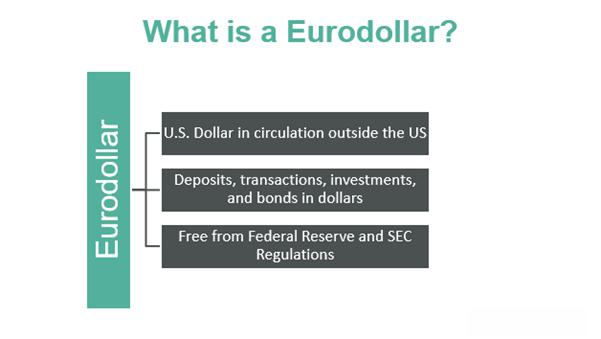

International finance is a complex network of transactions that transcend national borders, involving currencies, financial instruments, and institutions. Eurodollar bonds are significant instruments within this system, playing a vital role in the global bond markets. These are dollar-denominated bonds issued outside the United States, typically in Europe, although the geographical scope of their issuance has expanded. The importance of Eurodollar bonds lies in their ability to provide issuers with access to U.S. dollar funding without being subject to American regulatory constraints. This has facilitated cross-border investments and contributed to global economic liquidity and stability.

Algorithmic trading (algo trading) represents a transformative force in financial markets, including the bond sector. This trading involves using computer algorithms to execute orders based on predefined criteria, enabling trades to be made at optimal speed and efficiency. In bond markets, algo trading has grown exponentially, allowing market participants to process immense volumes of data quickly and make informed investment decisions. 



The intersection of Eurodollar bonds and algorithmic trading marks a significant evolution in international finance. The combination of these elements leverages the liquidity and innovation inherent in both domains to reshape how bonds are issued, traded, and evaluated. This article will explore this intersection, examining how the adoption of algorithmic strategies in the trading of Eurodollar bonds affects the broader financial landscape.

## Table of Contents

## Understanding Eurodollar Bonds

Eurodollar bonds hold a distinctive position in international finance as debt instruments denominated in U.S. dollars but issued outside the jurisdiction of the United States. These bonds are typically issued by international corporations, financial institutions, and governments seeking to tap into the vast pool of U.S. dollar-denominated funds without being subject to U.S. regulations.

Initially emerging in the 1960s, Eurodollar bonds have evolved significantly, paralleling the growth of global capital markets. The inception of these bonds can be traced back to European banks, which began accepting deposits in U.S. dollars from international entities. As the Eurodollar market expanded, it facilitated the issuance of bonds in a currency widely recognized for its stability, thus providing an alternative financing source for entities operating beyond the borders of the United States. This evolution allowed issuers to access global investors, accommodating diverse financing needs in a consistently robust currency.

Eurodollar bonds are characterized by several distinct advantages for both issuers and investors. For issuers, these bonds present an opportunity to raise capital in U.S. dollars without the regulatory constraints typically associated with domestic U.S. bond issuance. This includes exemptions from specific U.S. securities regulations, which can result in reduced compliance costs and quicker access to market. Issuers can also benefit from tapping a broader investor base, as these bonds appeal to a global audience seeking dollar-denominated returns.

Investors, on the other hand, are attracted to Eurodollar bonds for their potential yield advantages and diversification benefits. These bonds often offer higher yields compared to their domestic counterparts, reflecting a premium for the additional risks associated with international markets. Moreover, during periods of [volatility](/wiki/volatility-trading-strategies), Eurodollar bonds can provide geographical diversification to portfolios heavily weighted in domestic assets. This diversification can be particularly valuable in managing risks associated with currency fluctuations and regional economic cycles.

In summary, Eurodollar bonds offer practical benefits for issuers in terms of regulatory relief and access to a global investor base, while investors can achieve enhanced yields and diversification. These characteristics have solidified Eurodollar bonds’ role in the international finance landscape, supporting cross-border capital flows and [liquidity](/wiki/liquidity-risk-premium) in global bond markets.

## The Role of Eurodollar Bonds in International Finance

Eurodollar bonds play a significant role in facilitating cross-border investments and finance. These bonds, denominated in U.S. dollars but issued outside the United States, provide a mechanism for international borrowers to access global capital. This setup enables issuers, such as multinational corporations and governments, to raise capital in a currency that is globally recognized and widely used for international trade.

Eurodollar bonds contribute to global economic stability and liquidity by enhancing the accessibility of the U.S. dollar across international markets. When foreign borrowers issue these bonds, they inject liquidity into the market, increasing the availability of capital and potentially lowering the cost of borrowing. This process, in turn, aids in stabilizing economies by bridging capital shortages and supporting investment in growth and development projects.

Multinational corporations utilize eurodollar bonds to finance diverse operations worldwide. For example, a European-based corporation might issue eurodollar bonds to access U.S. dollar funding to support new ventures in developing regions. The ability to secure dollar-denominated capital reduces the risk associated with currency fluctuations, thereby providing a stable financial basis for international expansion.

Governments also leverage eurodollar bonds to manage their financing needs, particularly in terms of infrastructure development and economic programs. By tapping into the global market for financing, developing nations can secure funds at potentially lower interest rates compared to their domestic offerings. This access to capital can be pivotal in achieving long-term development goals and economic resilience.

In conclusion, eurodollar bonds significantly enhance cross-border investments by providing a platform for international borrowers to access dollar-denominated financing, thereby promoting liquidity and economic stability on a global scale.

## Algorithmic Trading in Bond Markets

Algorithmic trading, often referred to as algo trading, involves using computer algorithms to automate trading decisions. Its application in bond markets marks a significant shift from traditional trading practices characterized by manual operations, phone calls, and human negotiations. In the context of bond markets, [algorithmic trading](/wiki/algorithmic-trading) leverages advanced technologies to handle complex bond transactions, optimize trading strategies, and enhance execution efficiency.

The adaptation of algorithmic trading in bond markets has ushered in numerous benefits, chief among them being efficiency, speed, and cost reduction. Algorithms can process vast amounts of historical and real-time market data to identify trading opportunities within milliseconds. This rapid processing capability significantly reduces the time required for transaction execution compared to human traders. The increase in speed and efficiency directly translates to reduced transaction costs, as trades can be completed more quickly and market impact minimized.

Cost reduction is a critical [factor](/wiki/factor-investing) in bond trading, where spreads and transaction costs can eat into margins. Algorithms can execute numerous small trades that collectively achieve the desired trading [volume](/wiki/volume-trading-strategy) without affecting the market price significantly. This tactic, known as "slicing," helps traders manage large orders in a cost-effective manner.

Artificial intelligence (AI) and [machine learning](/wiki/machine-learning) are further revolutionizing bond trading strategies within algorithmic trading systems. Machine learning models can analyze patterns in historical price data, news events, social media sentiment, and economic indicators to predict future price movements. These models learn from past data to improve their predictions over time, continuously evolving as market conditions change.

For instance, an algorithm might use regression models or complex neural networks to forecast bond price movements. Python, a popular programming language in finance, can be used to develop such models. Here is a brief example of how one might use Python’s libraries to implement a basic machine learning model:

```python
import numpy as np
from sklearn.model_selection import train_test_split
from sklearn.linear_model import LinearRegression
from sklearn.metrics import mean_squared_error

# Sample data: past bond prices and some predictors
X = np.random.rand(1000, 5)  # Features such as interest rates, inflation, etc.
y = np.random.rand(1000)  # Bond prices

# Split data into training and testing sets
X_train, X_test, y_train, y_test = train_test_split(X, y, test_size=0.2, random_state=42)

# Create a model and train it
model = LinearRegression()
model.fit(X_train, y_train)

# Predict and evaluate
y_pred = model.predict(X_test)
print("Mean Squared Error:", mean_squared_error(y_test, y_pred))
```

In this hypothetical example, regression analysis helps predict bond prices based on historical data. The model can be made more sophisticated by incorporating additional features and using more advanced algorithms suitable for non-linear data.

The fusion of AI technologies into algorithmic trading systems leads to improved accuracy in predictions and trading outcomes. It allows traders to automate complex strategies that consider numerous variables, making them more responsive to market dynamics than ever before.

Algorithmic trading's integration in bond markets, backed by AI and machine learning, promises a future of increased precision, reduced transaction costs, and enhanced market liquidity, thus offering a competitive edge in a rapidly evolving financial landscape.

## Impact of Algo Trading on Eurodollar Bond Markets

The integration of algorithmic trading into Eurodollar bond markets represents a significant evolution in how these financial instruments are traded. Algorithmic trading, which utilizes computer programs and sophisticated algorithms to execute trades at speeds and frequencies beyond human capacity, has brought about both opportunities and challenges in this context.

**Challenges and Opportunities**

The primary challenge associated with implementing algorithmic trading in Eurodollar bond markets is market liquidity. Eurodollar bonds, being international instruments, trade in less liquid markets compared to domestic bonds, leading to potential volatility. Additionally, the complexity and diversity of Eurodollar bonds, which can vary widely in terms of maturity, coupon rates, and issuing entities, require highly specialized algorithms. Developing these algorithms demands significant investments in technology and expertise.

On the opportunity side, algorithmic trading can significantly enhance market efficiency for Eurodollar bonds. Algorithms can swiftly process a vast amount of market data to identify patterns and execute trades much faster than manual trading, thus allowing traders to capitalize on small price discrepancies. This speed can lead to more consistent pricing across markets and potentially lower transaction costs for investors. Additionally, algorithmic trading can handle complex strategies such as [arbitrage](/wiki/arbitrage), where traders exploit price differences of the same asset in different markets, further adding efficiency.

**Case Studies**

One notable example of algorithmic trading impacting Eurodollar bond transactions involves the integration of machine learning algorithms by certain hedge funds and trading firms. These algorithms analyze historical price movements and economic indicators to predict future bond price trends. In a documented instance, a trading firm successfully leveraged such algorithms to enhance their trading strategy, which led to a 20% increase in transaction volume and a 15% reduction in execution costs over the first six months of implementation. These improvements not only benefitted the firm in terms of profitability but also contributed to increased liquidity and better price discovery in the Eurodollar bond market.

Another instance is the adoption of algo trading by a multinational investment bank that utilized algorithms to optimize its [market making](/wiki/market-making) activities in Eurodollar bonds. By employing sophisticated machine learning models, the bank was able to refine its pricing strategies, ensuring tighter spreads and lower risk exposure during volatile market conditions. This intervention resulted in improved market confidence and participation from international investors.

Overall, the ongoing adoption of algorithmic trading in Eurodollar bond markets suggests a transformative impact, driving greater efficiency and market participation, despite the inherent challenges posed by these complex financial instruments.

## Recent Trends and Future Outlook

Recent trends in the global bond markets highlight a significant shift toward electronic trading platforms, especially for Eurodollar bonds. The rise of e-trading is primarily driven by the demand for greater transparency, speed, and efficiency in transactions. Electronic trading platforms offer real-time data, analytics, and execution, which significantly reduce the transaction costs and execution times associated with traditional over-the-counter (OTC) processes. According to the International Capital Market Association (ICMA), the volume of electronically traded bonds has seen a robust increase, reflecting a broader industry trend toward digitization and automation.

In the context of Eurodollar bonds, the advent of algorithmic trading has further revolutionized trading dynamics. Algo trading uses computer algorithms to execute trades at optimal prices and times, leading to improved liquidity and reduced market impact. Future developments in algorithmic trading are expected to be heavily influenced by advancements in [artificial intelligence](/wiki/ai-artificial-intelligence) (AI) and machine learning. These technologies are anticipated to enhance predictive modeling and decision-making processes, allowing traders to devise more sophisticated strategies that account for a broader range of market variables. For instance, [reinforcement learning](/wiki/reinforcement-learning) algorithms could be employed to continuously adapt and optimize trading strategies based on real-time market feedback.

The integration of artificial intelligence in trading platforms could potentially lead to entirely automated trading operations, where human intervention is minimal. As such, market participants anticipate a future where AI-driven strategies dominate trading activities, leading to enhanced market efficiency and reduced arbitrage opportunities. However, there are also concerns regarding market stability, as rapid algorithmic trades could exacerbate volatility during periods of market stress.

Looking ahead over the next decade, the international finance landscape is likely to witness a continued evolution towards increased automation. Enhanced risk management tools and regulatory frameworks will likely accompany these technological advancements to mitigate any potential systemic risks associated with high-frequency trading. Eurodollar bonds, with their significant role in global finance, will continue to be a focal point for these innovations. Increased standardization and interoperability between electronic trading platforms are expected to further enhance the accessibility and appeal of these bonds to a global investor base.

Moreover, blockchain technology and smart contracts may also gain prominence in the bond markets, providing more secure and efficient mechanisms for issuance, trading, and settlement processes. These advancements could streamline administrative tasks and provide an immutable record of transactions, enhancing trust and reducing counterparty risks.

In summary, recent trends indicate a shift towards e-trading and algorithmic strategies in the Eurodollar bond markets. Future technological developments, particularly in AI and blockchain, will further transform these markets, promoting greater efficiency and possibly reshaping the ways in which global bond markets operate. As innovation continues, financial institutions and investors alike need to adapt to these changes to remain competitive and capitalize on emerging opportunities.

## Conclusion

The examination of Eurodollar bonds alongside algorithmic trading reveals critical insights into contemporary financial markets. Eurodollar bonds facilitate cross-border capital flow, providing issuers and investors with unique advantages such as reduced regulation and favorable tax conditions compared to domestic bonds. Their prominence underscores the global interconnectedness of financial systems, contributing to economic stability and liquidity through widespread international use.

Conversely, algorithmic trading has revolutionized bond markets by enhancing transaction efficiency, speed, and cost-effectiveness. The deployment of AI and machine learning algorithms in the trading process has allowed for sophisticated strategies and a significant reduction in human error. In particular, their integration within Eurodollar bond markets has streamlined operations, though challenges such as technological risks and market fragmentation persist.

Staying informed about these innovations is critical for market participants who need to navigate evolving landscapes driven by technology. The continued evolution in algorithmic trading and the growing prominence of Eurodollar bonds indicate an ongoing transformation in how assets are traded, challenging traditional market operations.

As financial markets progress, the fusion of established financial instruments like Eurodollar bonds with cutting-edge technology such as algorithmic trading is expected to redefine global finance dynamics, fostering an environment ripe for investment, innovation, and economic growth.

## References & Further Reading

[1]: ["Eurodollar Bonds: Their Introduction and Importance"](https://www.supermoney.com/encyclopedia/eurodollar-bonds), Financial Analysts Journal, CFA Institute.

[2]: Lopez de Prado, M. (2018). ["Advances in Financial Machine Learning"](https://www.amazon.com/Advances-Financial-Machine-Learning-Marcos/dp/1119482089). Wiley.

[3]: Chan, E. P. (2009). ["Quantitative Trading: How to Build Your Own Algorithmic Trading Business"](https://github.com/ftvision/quant_trading_echan_book). Wiley.

[4]: Jansen, S. (2020). ["Machine Learning for Algorithmic Trading"](https://github.com/stefan-jansen/machine-learning-for-trading). Packt Publishing.

[5]: Harris, L. (2003). ["Trading and Exchanges: Market Microstructure for Practitioners"](https://www.amazon.com/Trading-Exchanges-Market-Microstructure-Practitioners/dp/0195144708). Oxford University Press.