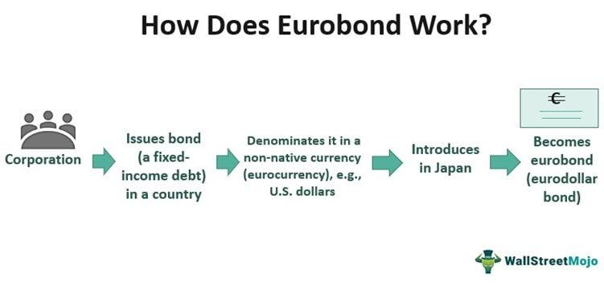

## Table of Contents

## What is a Eurodollar bond?

A Eurodollar bond is a type of bond that is issued in U.S. dollars but sold outside of the United States. This means that even though the bond is in dollars, it is bought and sold in places like Europe or Asia. Companies or governments from any country can issue these bonds. They are popular because they allow issuers to tap into the large pool of dollar investors around the world without being subject to U.S. regulations.

These bonds are attractive to investors because they offer a way to invest in U.S. dollars without dealing with the U.S. market directly. They can be a good choice for investors who want to diversify their portfolios or take advantage of different interest rates. Eurodollar bonds are typically traded on major international exchanges, making them accessible to a global audience.

## How does a Eurodollar bond differ from a traditional bond?

A Eurodollar bond is different from a traditional bond mainly because of where it is sold and the currency it uses. A traditional bond is usually issued and sold in the country where the issuer is based, and it's often in the local currency. For example, a U.S. company might issue a bond in the U.S. in U.S. dollars. On the other hand, a Eurodollar bond is issued in U.S. dollars but sold outside the U.S., like in Europe or Asia. This means a company from any country can issue a Eurodollar bond as long as it's sold in U.S. dollars outside the U.S.

Another key difference is that Eurodollar bonds are not subject to U.S. regulations. This can be appealing to issuers because it might be easier to issue these bonds without having to follow strict U.S. rules. For investors, Eurodollar bonds offer a way to invest in U.S. dollars without directly dealing with the U.S. market. This can be useful for diversifying their investments or taking advantage of different interest rates around the world. So, while traditional bonds are more tied to their home country's market and regulations, Eurodollar bonds provide more flexibility and access to global investors.

## Why are Eurodollar bonds denominated in U.S. dollars?

Eurodollar bonds are denominated in U.S. dollars because it allows issuers to reach a large pool of investors who want to invest in U.S. dollars. Many investors around the world like to hold U.S. dollars because it's seen as a strong and stable currency. By issuing bonds in U.S. dollars, companies and governments can attract these investors even if they are located outside the U.S.

Also, using U.S. dollars for Eurodollar bonds can help issuers avoid some of the risks that come with using other currencies. For example, if a company issues a bond in a different currency, they might have to worry about changes in exchange rates. By sticking with U.S. dollars, they can make things simpler and more predictable for both themselves and the investors.

## Who typically issues Eurodollar bonds?

Eurodollar bonds are usually issued by companies and governments from different countries. These issuers can be from anywhere in the world, not just the U.S. They choose to issue Eurodollar bonds because they want to reach investors who are interested in U.S. dollars but live outside the U.S.

For example, a big company in Europe might issue a Eurodollar bond to raise money from investors in Asia who want to invest in U.S. dollars. Governments also use Eurodollar bonds to borrow money from international investors. This helps them get funds without having to follow strict U.S. rules, making it easier and sometimes cheaper to borrow money.

## What are the advantages of issuing Eurodollar bonds?

Issuing Eurodollar bonds has several advantages for companies and governments. One big advantage is that they can reach a lot of investors around the world who want to invest in U.S. dollars. This means they can get money from people in Europe, Asia, and other places without having to follow strict U.S. rules. This can make it easier and sometimes cheaper to borrow money because they don't have to deal with as many regulations.

Another advantage is that Eurodollar bonds can help issuers avoid some risks that come with using different currencies. When a company issues a bond in a different currency, they might worry about changes in exchange rates. But with Eurodollar bonds, they use U.S. dollars, which is seen as a stable currency. This makes things simpler and more predictable for both the issuers and the investors. So, Eurodollar bonds can be a smart way for companies and governments to raise money and manage their finances.

## What are the risks associated with Eurodollar bonds?

There are some risks that come with Eurodollar bonds. One big risk is currency risk. Even though Eurodollar bonds are in U.S. dollars, the value of those dollars can change compared to other currencies. If the U.S. dollar gets weaker, it might be harder for the issuer to pay back the bond if they earn money in another currency. This can make it more expensive for them to borrow.

Another risk is [interest rate](/wiki/interest-rate-trading-strategies) risk. The value of Eurodollar bonds can go up and down if interest rates change. If interest rates go up, the value of the bond might go down because new bonds will offer higher rates. This can be bad news for investors if they need to sell their bonds before they mature. Also, issuers might face more costs if they have to pay higher interest rates than they expected.

Lastly, there's the risk of regulatory changes. Even though Eurodollar bonds are not subject to U.S. regulations, the rules in other countries can still change. If a country where the bonds are sold decides to change its rules, it could affect how easy it is to issue or trade these bonds. This uncertainty can make Eurodollar bonds riskier for both issuers and investors.

## How are Eurodollar bonds priced and what factors influence their pricing?

Eurodollar bonds are priced based on a few important things. The main one is the interest rate they offer. This rate has to be good enough to attract investors but not so high that it's too expensive for the issuer. The bond's price also depends on how much investors trust the issuer to pay back the money. If the issuer is a big, stable company or government, the bond might be priced higher because it's seen as safer. Another thing that affects pricing is how long the bond lasts. Bonds that take longer to pay back usually need to offer a higher interest rate to make up for the extra risk.

Other things that can change the price of Eurodollar bonds are what's happening in the economy and with interest rates around the world. If interest rates go up in other places, the price of existing Eurodollar bonds might go down because new bonds will offer better rates. Also, if the U.S. dollar gets stronger or weaker compared to other currencies, that can change the bond's price too. Investors always look at these things to decide if a Eurodollar bond is a good deal or not.

## What role do Eurodollar bonds play in international finance?

Eurodollar bonds are important in international finance because they help companies and governments from all over the world get money from investors who want to invest in U.S. dollars. These bonds let issuers reach a big group of investors outside the U.S. without having to follow strict U.S. rules. This makes it easier and sometimes cheaper for them to borrow money. For example, a company in Europe can issue a Eurodollar bond to raise money from investors in Asia who like U.S. dollars.

Eurodollar bonds also play a big role in helping investors spread out their money. Investors can use these bonds to invest in U.S. dollars without dealing directly with the U.S. market. This can be good for them because it helps them avoid some risks and take advantage of different interest rates around the world. So, Eurodollar bonds are a key part of international finance, helping both issuers and investors manage their money better.

## How do regulatory environments affect the issuance and trading of Eurodollar bonds?

The rules in different countries can really change how easy it is to issue and trade Eurodollar bonds. These bonds are not under U.S. rules, which can make things easier for issuers. But, they still have to follow the rules of the countries where they are sold. If a country changes its rules, it might make it harder or more expensive to issue or trade these bonds. For example, if a new rule says that more information has to be shared with investors, it could slow down the process of issuing bonds.

Also, the way different countries watch over their financial markets can affect Eurodollar bonds. Some places have strict rules to make sure everything is done right, while others might be more relaxed. If a country starts to watch more closely, it might make issuers and investors more careful about using Eurodollar bonds. But if the rules are too strict, it could make issuers look for other ways to borrow money. So, the rules in different places play a big part in how Eurodollar bonds work in the world of finance.

## What are the tax implications for issuers and investors of Eurodollar bonds?

For issuers of Eurodollar bonds, the tax implications can vary depending on where they are located and where the bonds are issued. Usually, issuers do not have to pay U.S. taxes on the interest they pay because these bonds are sold outside the U.S. But, they might have to pay taxes in their own country or in the country where the bonds are sold. This can make things a bit complicated, so issuers need to look at the tax rules in different places to figure out what they owe.

For investors, the tax situation is also different based on where they live. If an investor lives outside the U.S., they usually don't have to pay U.S. taxes on the interest they earn from Eurodollar bonds. But, they might have to pay taxes in their own country. Some countries have special rules or tax treaties that can change how much tax investors have to pay. So, investors need to check the tax laws in their home country to understand what they need to do with their earnings from these bonds.

## How have Eurodollar bonds evolved historically and what is their current market status?

Eurodollar bonds started in the 1960s when banks in Europe began lending U.S. dollars to people outside the U.S. This was a big deal because it let companies and governments from all over the world borrow money in U.S. dollars without having to follow strict U.S. rules. Over time, Eurodollar bonds became more popular and grew a lot. By the 1980s and 1990s, they were a big part of international finance, helping issuers reach investors all around the world.

Today, Eurodollar bonds are still very important in the world of finance. They are used by companies and governments to borrow money from investors who want to invest in U.S. dollars but live outside the U.S. The market for these bonds is big and active, with lots of trading happening on international exchanges. Even though there are some risks, like changes in currency values and interest rates, Eurodollar bonds continue to be a key way for issuers and investors to manage their money and investments on a global scale.

## What are some case studies or examples of significant Eurodollar bond issuances?

One big example of a Eurodollar bond issuance happened in 2014 when Apple issued a $12 billion Eurodollar bond. Apple did this because they wanted to raise money from investors around the world who liked U.S. dollars. The bond was sold in Europe and Asia, and it was a huge success. It showed how big companies could use Eurodollar bonds to get a lot of money from different places without having to follow strict U.S. rules.

Another example is from 2016 when the government of Saudi Arabia issued a $17.5 billion Eurodollar bond. This was one of the biggest bond issuances ever. Saudi Arabia wanted to borrow money to help with their budget and they chose to issue the bond in U.S. dollars to reach a lot of investors. The bond was sold in places like London and Singapore, and it helped Saudi Arabia raise a lot of money from people who wanted to invest in U.S. dollars but lived outside the U.S.

## References & Further Reading

[1]: ["Eurodollar Bonds: Their Introduction and Importance"](https://www.supermoney.com/encyclopedia/eurodollar-bonds), Financial Analysts Journal, CFA Institute.

[2]: Lopez de Prado, M. (2018). ["Advances in Financial Machine Learning"](https://www.amazon.com/Advances-Financial-Machine-Learning-Marcos/dp/1119482089). Wiley.

[3]: Chan, E. P. (2009). ["Quantitative Trading: How to Build Your Own Algorithmic Trading Business"](https://github.com/ftvision/quant_trading_echan_book). Wiley.

[4]: Jansen, S. (2020). ["Machine Learning for Algorithmic Trading"](https://github.com/stefan-jansen/machine-learning-for-trading). Packt Publishing.

[5]: Harris, L. (2003). ["Trading and Exchanges: Market Microstructure for Practitioners"](https://www.amazon.com/Trading-Exchanges-Market-Microstructure-Practitioners/dp/0195144708). Oxford University Press.