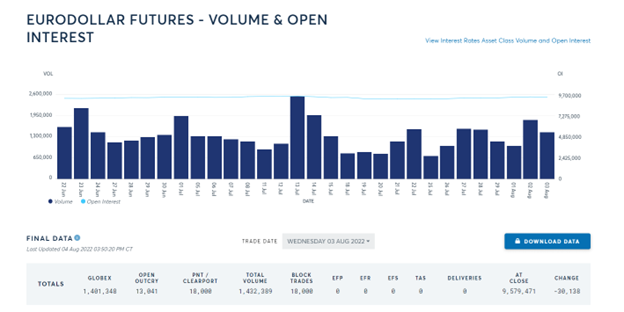

## Table of Contents

## What are Eurodollar futures and why are they important in the financial markets?

Eurodollar futures are financial contracts that allow investors to bet on future interest rates of U.S. dollars deposited in banks outside of the United States. These contracts are based on the interest rates of Eurodollars, which are U.S. dollars held in foreign banks, mainly in Europe. Each contract represents a $1 million deposit and is traded on the Chicago Mercantile Exchange (CME). The price of a Eurodollar futures contract moves inversely with interest rates, meaning if interest rates go up, the price of the futures contract goes down, and vice versa.

Eurodollar futures are important in the financial markets because they provide a way for banks, corporations, and investors to manage interest rate risk. For example, if a company expects interest rates to rise and wants to protect itself from higher borrowing costs, it can sell Eurodollar futures. This way, if rates do go up, the company can offset the increased borrowing costs with gains from the futures contract. Additionally, Eurodollar futures are widely used as a tool for speculating on future interest rate movements and for hedging against fluctuations in interest rates, making them a key component of the global financial system.

## How do Eurodollar futures contracts work, and what are their specifications?

Eurodollar futures contracts are agreements to buy or sell a $1 million deposit of U.S. dollars held in banks outside the U.S. at a set interest rate on a future date. These contracts are traded on the Chicago Mercantile Exchange (CME) and are used by banks, companies, and investors to bet on or protect against changes in interest rates. The price of a Eurodollar futures contract moves in the opposite direction of interest rates. If interest rates go up, the price of the futures contract goes down, and if interest rates go down, the price of the futures contract goes up.

The specifications of Eurodollar futures include a contract size of $1 million, and each contract lasts for three months. The contracts are quoted in terms of the interest rate, specifically the three-month London Interbank Offered Rate (LIBOR) minus 100. For example, if the LIBOR is 2%, the futures contract would be quoted at 98.00. The minimum price change, or tick size, is 0.0025, which equals $25 per contract. Eurodollar futures are cash-settled, meaning that at the end of the contract, the difference between the contract price and the final settlement price is paid in cash, rather than through the exchange of the underlying asset.

## What are the key factors that influence Eurodollar futures prices?

Eurodollar futures prices are mainly influenced by expectations about future interest rates. Since these contracts are based on the three-month LIBOR, any news or events that affect this rate will impact the price of Eurodollar futures. For example, if people think the Federal Reserve might raise interest rates in the future, the price of Eurodollar futures will likely go down because higher interest rates mean lower futures prices.

Another important factor is the overall health of the economy. If the economy is doing well, interest rates might go up to control inflation, which would lower Eurodollar futures prices. On the other hand, if the economy is struggling, interest rates might be lowered to encourage borrowing and spending, which would raise Eurodollar futures prices. Additionally, global events like geopolitical tensions or economic crises can also cause changes in interest rate expectations, thus affecting Eurodollar futures prices.

## How can beginners start trading Eurodollar futures?

To start trading Eurodollar futures, beginners should first open a futures trading account with a brokerage that offers access to the Chicago Mercantile Exchange (CME). This usually involves filling out an application, providing some personal information, and depositing funds into the account. It's important to choose a reputable broker and to understand the fees and commissions involved. Once the account is set up, beginners can access the trading platform provided by the broker, where they can place orders for Eurodollar futures contracts.

After setting up the account, beginners should learn how to analyze market trends and understand the factors that influence Eurodollar futures prices, such as interest rate expectations and economic indicators. Many brokers offer educational resources and demo accounts where beginners can practice trading without risking real money. It's also wise to start with small trades to gain experience and gradually increase the size of trades as confidence and understanding grow. Remember, trading futures involves risk, so it's important to only invest money that you can afford to lose.

## What are the common strategies used in Eurodollar futures trading?

One common strategy in Eurodollar futures trading is called hedging. This is when a trader uses Eurodollar futures to protect against the risk of interest rate changes. For example, if a company knows it will need to borrow money in the future and is worried about interest rates going up, it can sell Eurodollar futures. If rates do go up, the company will lose money on the futures but save money on the loan, balancing out the risk. Hedging is about reducing uncertainty and protecting against potential losses.

Another strategy is speculation. This is when traders try to make money by betting on where they think interest rates will go. If a trader believes rates will go down, they might buy Eurodollar futures, hoping to sell them later at a higher price. Speculation can be risky because if the trader guesses wrong, they can lose money. But if they guess right, they can make a profit. Many traders use technical analysis, looking at charts and past price movements, to help them make their predictions.

A third strategy is called spread trading. This involves buying one Eurodollar futures contract and selling another at the same time. The idea is to profit from the difference in price changes between the two contracts. For example, a trader might buy a near-term contract and sell a longer-term contract if they think short-term rates will stay the same but long-term rates will go up. Spread trading can be less risky than outright speculation because it's based on the relationship between two contracts rather than the direction of the overall market.

## How do interest rates affect Eurodollar futures trading?

Interest rates have a big impact on Eurodollar futures trading. Eurodollar futures are based on the three-month LIBOR rate, which is a key interest rate for borrowing and lending money. When people expect interest rates to go up, the price of Eurodollar futures goes down. This is because the futures contract's price is calculated as 100 minus the expected LIBOR rate. So if people think the LIBOR rate will be higher in the future, the futures price will be lower. On the other hand, if people expect interest rates to go down, the price of Eurodollar futures will go up.

Traders use Eurodollar futures to bet on or protect against changes in interest rates. For example, if a trader thinks interest rates will rise, they might sell Eurodollar futures. If they're right and rates do go up, they can buy back the futures at a lower price and make a profit. If a company knows it will need to borrow money in the future and is worried about higher rates, it can use Eurodollar futures to lock in today's lower rates. This way, even if rates go up, the company can offset the higher borrowing costs with gains from the futures contract. Understanding how interest rates move is key to trading Eurodollar futures successfully.

## What is the role of the yield curve in Eurodollar futures trading?

The yield curve shows the relationship between interest rates and the time until money is paid back. In Eurodollar futures trading, the yield curve is important because it helps traders see what people think interest rates will do in the future. If the yield curve is going up, it means people expect interest rates to be higher later. This can make the price of Eurodollar futures that are due in the future go down. If the yield curve is flat or going down, it means people expect interest rates to stay the same or go down, which can make the price of Eurodollar futures go up.

Traders use the yield curve to make decisions about which Eurodollar futures to buy or sell. For example, if a trader sees that the yield curve is steep, meaning long-term rates are much higher than short-term rates, they might buy short-term Eurodollar futures and sell long-term ones. This is called a spread trade, and it can help them make money from the difference in how the prices of these futures change. Understanding the yield curve helps traders predict what might happen to interest rates and plan their trades accordingly.

## How can traders use Eurodollar futures for hedging purposes?

Traders can use Eurodollar futures to protect themselves from changes in interest rates. For example, if a company knows it will need to borrow money in the future and is worried about interest rates going up, it can sell Eurodollar futures. If rates do go up, the company will lose money on the futures, but this loss will be offset by the savings on the loan because the company locked in a lower rate with the futures contract. This way, the company doesn't have to worry as much about what interest rates will do.

Another way to use Eurodollar futures for hedging is if a bank has a lot of money that it expects to lend out at a certain interest rate in the future. If the bank is worried that interest rates might go down, it can buy Eurodollar futures. If rates do go down, the bank will lose money on the loans, but it will make money on the futures because the price of the futures will go up. This helps the bank balance out the risk of changing interest rates.

## What are the differences between Eurodollar futures and other interest rate futures?

Eurodollar futures are different from other interest rate futures in a few ways. First, Eurodollar futures are based on the three-month LIBOR rate, which is the rate at which banks lend to each other in the Eurodollar market. Other interest rate futures, like Treasury futures, are based on the yields of government securities like T-bills, T-notes, or T-bonds. This means that Eurodollar futures are more closely tied to the global banking system, while Treasury futures are more tied to the U.S. government's borrowing needs.

Another difference is how they are used. Eurodollar futures are often used by banks and big companies to manage the risk of interest rate changes on their loans and deposits. They are very popular because they let these big players lock in interest rates for future borrowing or lending. On the other hand, Treasury futures are often used by investors who want to bet on or protect against changes in the overall economy or government policy. These futures can also be used to manage interest rate risk, but they are more focused on the bond market and government securities.

## How do global economic events impact Eurodollar futures trading?

Global economic events can have a big impact on Eurodollar futures trading. When something big happens in the world, like a financial crisis or a change in a country's economic policy, it can change what people think will happen to interest rates. For example, if there's a crisis and people think the economy will get worse, they might expect the central bank to lower interest rates to help. This would make the price of Eurodollar futures go up because the futures price goes up when interest rates are expected to go down.

These events can also cause a lot of uncertainty, which makes traders more careful. If there's a lot of uncertainty, traders might use Eurodollar futures to protect themselves from big changes in interest rates. For example, if there's a big election coming up and people aren't sure what will happen, they might use Eurodollar futures to hedge their bets. This way, no matter what happens to interest rates after the election, they can be ready. So, global economic events can change both what people expect to happen to interest rates and how traders use Eurodollar futures to manage their risks.

## What advanced strategies can expert traders employ in Eurodollar futures markets?

Expert traders in the Eurodollar futures market often use a strategy called calendar spread trading. This involves buying and selling Eurodollar futures contracts with different expiration dates at the same time. For example, an expert trader might buy a contract that expires soon and sell one that expires later. They do this because they think the difference between the prices of these contracts will change in a way that makes them money. This strategy can be less risky than just betting on whether interest rates will go up or down because it's about the relationship between the prices of two contracts.

Another advanced strategy is called options on Eurodollar futures. This means traders buy options that give them the right, but not the obligation, to buy or sell Eurodollar futures at a certain price. Options can be used to make more complex trades that can protect against big losses or make bigger profits. For example, a trader might use options to set up a trade that makes money if interest rates move a lot in either direction, but doesn't lose much if rates stay the same. These strategies need a good understanding of how options work and how interest rates might change, so they are usually used by traders with a lot of experience.

## How can one assess and manage the risks associated with Eurodollar futures trading?

To assess and manage the risks of trading Eurodollar futures, it's important to understand how interest rates work and what can make them change. One way to do this is by keeping an eye on economic reports and news that might affect interest rates, like jobs numbers or central bank announcements. Traders should also use tools like stop-loss orders, which automatically close a trade if the price moves against them too much. This can help limit losses if the market moves in a way they didn't expect.

Another way to manage risk is by not putting all your money into one trade. Expert traders often spread their money across different trades, so if one trade goes bad, they don't lose everything. They might also use hedging strategies, like buying and selling different Eurodollar futures contracts at the same time, to protect themselves from big changes in interest rates. By doing these things, traders can better handle the ups and downs of the market and keep their risks under control.

## What are Hedging and Speculation with Eurodollar Futures?

Eurodollar futures serve as a powerful tool for managing interest rate exposure, providing both institutional and individual traders with mechanisms for hedging and speculation. These futures contracts enable entities such as companies and banks to secure advantageous interest rates for future financial activities, mitigating the risk of adverse rate movements in financial projections. 

The primary value of Eurodollar futures in hedging is their ability to lock in interest rates. Consider a corporation planning a substantial capital expenditure, requiring a loan in the future. By entering into Eurodollar futures contracts, the corporation can effectively fix the borrowing cost, shielding itself from any unfavorable rate hikes. The principle is based on the inverse relationship between interest rates and the price of the futures contracts. The price of a Eurodollar futures contract is calculated as follows:

$$
\text{Price} = 100 - \text{Expected Interest Rate}
$$

For instance, if the expected interest rate is 2%, the price of the futures contract would be $100 - 2 = 98$. If rates rise, driving the expected rate to 3%, the futures price would drop to 97. Such dynamics allow for strategic rate locking.

Additionally, Eurodollar futures are popular instruments among traders engaging in speculation regarding interest rate movements. Traders often apply trend-following strategies, attempting to profit from anticipated directional moves in interest rates. These strategies rely on identifying key patterns or trends, utilizing technical indicators such as moving averages or the Relative Strength Index (RSI) to inform trading decisions.

Algorithmic trading further enhances the speculative utility of Eurodollar futures. Automated systems can exploit [arbitrage](/wiki/arbitrage) opportunities or [momentum](/wiki/momentum) trades, executing orders with speed and precision beyond human capability. Consider the implementation of a simple moving average crossover strategy in Python, a common [algorithmic trading](/wiki/algorithmic-trading) technique:

```python
import pandas as pd

# Assume df is a DataFrame with 'Date' and 'Price' columns

# Calculate short-term and long-term moving averages
df['Short_MA'] = df['Price'].rolling(window=20).mean()
df['Long_MA'] = df['Price'].rolling(window=50).mean()

# Define conditions for buy and sell signals
df['Signal'] = 0
df.loc[df['Short_MA'] > df['Long_MA'], 'Signal'] = 1
df.loc[df['Short_MA'] < df['Long_MA'], 'Signal'] = -1

# Implementing trading strategy based on signals
df['Strategy_Return'] = df['Signal'].shift(1) * df['Price'].pct_change()
```

In this code snippet, when the short-term moving average crosses above the long-term moving average, it generates a buy signal, indicating an expected rise in futures prices. Conversely, a sell signal is generated when the short-term moving average crosses below the long-term one, suggesting a price decline. 

The dual utility of Eurodollar futures in both hedging and speculative trading underscores their importance in the financial landscape. Whether safeguarding against rate [volatility](/wiki/volatility-trading-strategies) or capitalizing on interest rate trends, these futures provide robust strategies for diverse trading objectives.

## References & Further Reading

[1]: CME Group. ["Eurodollar Futures."](https://www.cmegroup.com/markets/fx/g10/euro-fx.html) 

[2]: Hull, J. C. (2015). ["Options, Futures, and Other Derivatives."](https://www.amazon.com/Options-Futures-Other-Derivatives-10th/dp/013447208X) Pearson Education.

[3]: Geman, H. (2005). ["Commodities and Commodity Derivatives: Modeling and Pricing for Agriculturals, Metals and Energy."](https://download.e-bookshelf.de/download/0000/5675/90/L-G-0000567590-0015270354.pdf) Wiley Finance.

[4]: Duffie, D., & Singleton, K. J. (2003). ["Credit Risk: Pricing, Measurement, and Management."](https://press.princeton.edu/books/hardcover/9780691090467/credit-risk) Princeton University Press.

[5]: Murphy, J. J. (1999). ["Technical Analysis of the Financial Markets: A Comprehensive Guide to Trading Methods and Applications."](https://archive.org/details/technicalanalysi0000murp) New York Institute of Finance.