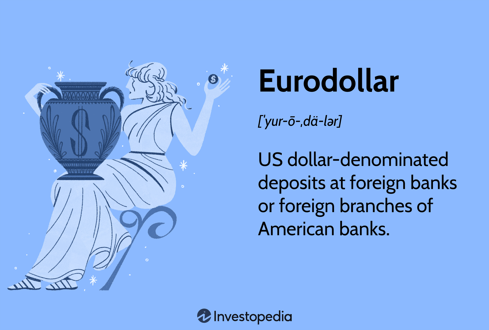

## Table of Contents

## What is a Eurodollar?

A Eurodollar is a U.S. dollar that is held in banks outside of the United States. Even though it's called a "Eurodollar," it has nothing to do with the Euro, which is the currency used in many European countries. The term "Eurodollar" comes from the fact that these dollars were first held in European banks, but now they can be found in banks all over the world.

Eurodollars are important because they allow international businesses and people to use U.S. dollars without having to go through U.S. banks. This makes it easier and sometimes cheaper to do business across borders. Eurodollars are often used for loans, investments, and other financial activities, and they play a big role in the global economy.

## How did the term 'Eurodollar' originate?

The term 'Eurodollar' started in the 1950s. Back then, the Soviet Union wanted to keep its money safe from the United States government. They decided to put their U.S. dollars in European banks, especially in places like London. This was a way to keep their money away from the U.S. and still use it for trade.

Because these dollars were in Europe, people started calling them 'Eurodollars'. Even though the name has 'Euro' in it, it doesn't mean the Euro currency that came much later. Over time, the term 'Eurodollar' grew to include any U.S. dollar held in banks outside of the U.S., not just in Europe.

## Why are Eurodollars significant in global finance?

Eurodollars are very important in global finance because they help businesses and people around the world use U.S. dollars without having to go through banks in the United States. This makes it easier and often cheaper for them to do business across borders. For example, a company in Japan can borrow Eurodollars from a bank in London to buy things from the United States, without needing to deal with U.S. banks directly.

Eurodollars also play a big role in international trade and investment. They are used for loans, investments, and other financial activities that help the global economy grow. Because Eurodollars are outside the control of the U.S. government, they give more freedom to countries and businesses that want to use U.S. dollars but don't want to follow U.S. rules. This makes the global financial system more flexible and connected.

## How are Eurodollars different from regular U.S. dollars?

Eurodollars and regular U.S. dollars are the same in one big way: they are both U.S. dollars. But, Eurodollars are special because they are held in banks outside of the United States. This means that even though they are U.S. dollars, they are not in U.S. banks. Regular U.S. dollars, on the other hand, are usually found in banks inside the United States.

Because Eurodollars are outside the U.S., they are not controlled by the U.S. government in the same way that regular U.S. dollars are. This makes them useful for people and businesses who want to use U.S. dollars but do not want to follow U.S. rules. Eurodollars help make the global economy more flexible because they allow for easier and sometimes cheaper international trade and finance.

## What are the main uses of Eurodollars in international trade?

Eurodollars are very useful in international trade because they let businesses use U.S. dollars without having to deal with U.S. banks. For example, a company in Japan might need U.S. dollars to buy things from the United States. Instead of going through a U.S. bank, the company can borrow Eurodollars from a bank in London. This can be easier and sometimes cheaper, especially if the company wants to avoid U.S. rules and regulations.

Eurodollars also help with international loans and investments. If a business in Germany wants to invest in a project in Brazil, it can use Eurodollars to make the investment. This makes it easier for the business to use U.S. dollars for its global activities without the need for a U.S. bank account. This flexibility helps the global economy grow by making it simpler for money to move around the world.

## Can you explain how Eurodollar deposits work?

Eurodollar deposits are when people or businesses put their U.S. dollars into banks outside of the United States. For example, if someone from Canada wants to save their U.S. dollars, they can put them into a bank in London instead of a bank in the U.S. These deposits are called Eurodollars because they are U.S. dollars kept in banks in Europe or other places outside the U.S.

When someone makes a Eurodollar deposit, the bank can use that money to give loans to other people or businesses. This helps the bank make money, and it also helps people and businesses around the world use U.S. dollars for things like buying goods or making investments. Because these deposits are outside the U.S., they are not controlled by U.S. rules, which can make it easier and sometimes cheaper for people to use U.S. dollars in their global activities.

## What role do Eurodollars play in monetary policy?

Eurodollars can affect monetary policy because they are U.S. dollars held outside of the United States. When there are a lot of Eurodollars, it can change how much money is available around the world. This can make it harder for the U.S. to control its own money supply and interest rates. If the U.S. tries to change its interest rates to control its economy, the amount of Eurodollars can make those changes less effective.

Central banks, like the Federal Reserve in the U.S., have to think about Eurodollars when they make decisions about monetary policy. For example, if there are many Eurodollars, the Federal Reserve might need to do more to change interest rates or money supply. This is because Eurodollars can move money around the world in ways that the U.S. central bank cannot control directly. So, Eurodollars add another layer of complexity to managing the economy.

## How do Eurodollar futures work, and why are they important?

Eurodollar futures are contracts that let people bet on what the [interest rate](/wiki/interest-rate-trading-strategies) for Eurodollars will be in the future. They are traded on exchanges like the Chicago Mercantile Exchange. When someone buys a Eurodollar futures contract, they are making a deal to either pay or receive a certain amount of money based on what the interest rate is at a specific time in the future. This helps businesses and investors manage the risk of interest rates changing.

Eurodollar futures are important because they help people and businesses protect themselves from changes in interest rates. For example, if a company knows it will need to borrow money in the future, it can use Eurodollar futures to lock in an interest rate now. This way, if interest rates go up, the company won't have to pay more than it planned. Eurodollar futures also give investors a way to make money by guessing what interest rates will do, which adds more activity and flexibility to the global financial markets.

## What are some examples of Eurodollar transactions?

A company in Japan wants to buy machinery from the United States. Instead of going through a U.S. bank, the company borrows U.S. dollars from a bank in London. These dollars are Eurodollars because they are U.S. dollars held outside the U.S. The company uses these Eurodollars to pay for the machinery, making it easier and sometimes cheaper for them to do business.

A business in Germany wants to invest in a new factory in Brazil. To do this, they need U.S. dollars. They decide to use Eurodollars, so they deposit their U.S. dollars into a bank in Singapore. The bank in Singapore then lends these Eurodollars to the German business, which uses the money to build the factory in Brazil. This way, the business can use U.S. dollars without dealing with U.S. banks or following U.S. rules.

## How do regulatory environments affect Eurodollar markets?

The rules and laws in different countries can change how Eurodollar markets work. Because Eurodollars are U.S. dollars kept in banks outside the U.S., they are not controlled by U.S. rules. This can make it easier for people and businesses to use U.S. dollars without following U.S. laws. But, the countries where the banks are located can still make their own rules. If a country makes strict rules about banking, it might make it harder for banks to deal with Eurodollars. This can affect how much people want to use Eurodollars and how easy it is to use them.

Different rules in different countries can also make Eurodollar markets more complicated. For example, if one country has very loose rules about banking and another has very strict rules, businesses might choose to use Eurodollars in the country with the loose rules. This can lead to more Eurodollars being used in some places than others. Also, if countries change their rules a lot, it can make it hard for people to know what to expect when using Eurodollars. This can make the Eurodollar market less stable and harder to predict.

## What are the risks associated with holding Eurodollars?

Holding Eurodollars can be risky because they are not controlled by the U.S. government. This means that if the bank where the Eurodollars are kept has problems, like going bankrupt, the money might not be safe. Also, since Eurodollars are held outside the U.S., they can be affected by the rules and laws of the country where the bank is located. If that country changes its rules suddenly, it could make it harder to use or move the Eurodollars.

Another risk is that the value of Eurodollars can change because of interest rates. If interest rates go up, the value of Eurodollars might go down. This can be a problem for people who are holding a lot of Eurodollars. They might lose money if they need to use the Eurodollars when interest rates are high. Also, because Eurodollars are used all over the world, they can be affected by big changes in the global economy, making them less predictable and more risky to hold.

## How has the Eurodollar market evolved over time, and what are the current trends?

The Eurodollar market started in the 1950s when the Soviet Union put its U.S. dollars in European banks to keep them safe from the U.S. government. Over time, more and more countries and businesses began using Eurodollars for international trade and finance. By the 1970s and 1980s, the Eurodollar market had grown a lot, helping the global economy become more connected. Banks in places like London and Singapore became big centers for Eurodollar transactions, making it easier for money to move around the world.

Today, the Eurodollar market is still very important, but it has changed in some ways. More countries and banks are involved now, making the market even bigger and more complex. Technology has also made it easier for people to use Eurodollars, with things like online banking and electronic transactions. One current trend is that more businesses are using Eurodollars to avoid U.S. rules and to take advantage of lower costs in other countries. Another trend is the use of Eurodollar futures, which help businesses manage the risk of changing interest rates. Overall, the Eurodollar market keeps growing and changing to meet the needs of the global economy.

## What are some examples of Eurodollar utilization?

Multinational corporations leverage Eurodollars to enhance their global cash management strategies. By holding deposits in U.S. dollars outside the jurisdiction of the Federal Reserve, these companies can manage [liquidity](/wiki/liquidity-risk-premium) more effectively across different geographic regions, optimizing exchange rates and minimizing costs associated with currency conversion. This practice becomes particularly advantageous for corporations with substantial transactions in U.S. dollars, as it simplifies treasury operations and hedges against potential currency risk.

Eurodollar futures are a pivotal element for investors seeking to speculate on future interest rates and manage interest rate exposure. These futures contracts, primarily traded on platforms like the Chicago Mercantile Exchange (CME), allow participants to lock in interest rates for future transactions. By engaging in these contracts, investors and traders can mitigate the risk of interest rate fluctuations affecting their portfolios. The formula used to derive the price of these futures is typically:

$$
\text{Price} = 100 - \text{Interest Rate}
$$

For example, if the interest rate is forecasted to be 2%, the Eurodollar futures price would be 98.

Investment funds turn to Eurodollars for accessing higher yields or diversifying their cash holdings away from traditional banking systems. Given the typically higher interest rates on Eurodollar deposits, funds can enhance their yield compared to domestic deposits. Additionally, investing in Eurodollars can provide geographic diversification, reducing the risk of exposure to a single country's banking environment.

Financial institutions employ Eurodollars within structured financial products to deliver tailored investment solutions for clients. By integrating Eurodollar instruments, including deposits and futures, these institutions can construct products that meet specific risk-return profiles. Custom solutions might involve creating synthetic positions that mimic desired interest rate scenarios or offering investors structured notes that yield returns based on the movement of Eurodollar rates.

Overall, the utilization of Eurodollars is multifaceted, offering various opportunities for corporations, investors, and financial institutions to optimize their financial strategies and fortify their positions in the competitive landscape of global finance.

## References & Further Reading

[1]: ["Eurodollar Futures: Concepts, Definitions and Applications"](https://www.investopedia.com/articles/active-trading/012214/introduction-trading-eurodollar-futures.asp) by CME Group.

[2]: ["Eurodollars and International Banking"](https://archive.org/details/eurodollarsinter0000unse) by Gary G. Stern and David E. Lindsey.

[3]: ["Interest Rate Futures: Eurodollar Futures and Options"](https://www.investopedia.com/articles/active-trading/012214/introduction-trading-eurodollar-futures.asp) - Commodity Futures Trading Commission Staff Report.

[4]: Jevons, D.D. (2017). ["Algorithmic and High-Frequency Trading."](https://assets.cambridge.org/97811070/91146/frontmatter/9781107091146_frontmatter.pdf) Risk Books.

[5]: ["International Finance: Theory and Policy"](https://open.umn.edu/opentextbooks/textbooks/18) by Paul Krugman and Maurice Obstfeld.