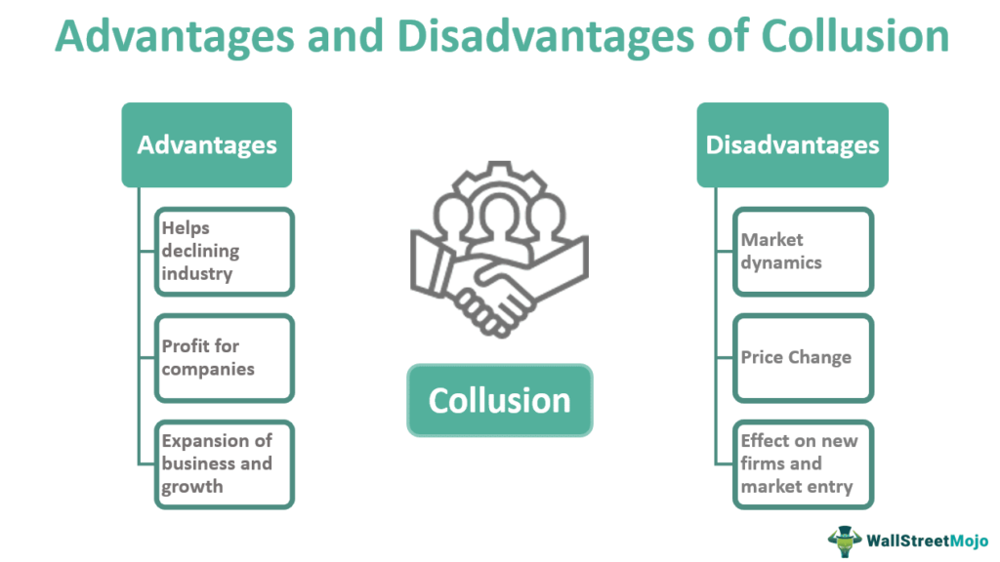

Understanding the global financial landscape, particularly the equity market, is vital for investors and corporations aiming to optimize returns. The concept of Euroequity represents a significant element of international finance, wherein initial public offerings (IPOs) are distributed to investors across various national markets simultaneously. This strategy allows companies to tap into diverse capital markets, enhancing their capital raising capabilities while offering investors broader access to emerging opportunities.

Additionally, the rise of algorithmic trading has fundamentally transformed equity markets worldwide. This method involves using computer programs and algorithms to execute trades at remarkable speed, improving market efficiency and liquidity. Algorithmic trading reduces transaction costs and increases transparency, allowing investors to make more informed decisions.

The integration of algorithmic trading with Euroequity offerings presents novel opportunities by improving liquidity and market efficiency. Algorithms can facilitate rapid order execution and transparent pricing during Euroequity IPOs, making them more appealing and accessible to international investors. Furthermore, the enhanced liquidity brought about by algorithmic trading can stabilize prices during large Euroequity issuances, thus mitigating potential volatility.

This article explores the interaction between Euroequity and algorithmic trading, offering a thorough investigation of current trends and future potential within international finance. By understanding this interplay, investors and corporations can better navigate the evolving global financial landscape, capitalizing on the efficiency and reach provided by these intertwined financial innovations.

## Table of Contents

## Understanding Euroequity

Euroequity refers to the practice where a company issues stocks simultaneously across multiple national markets during an initial public offering (IPO), rather than opting for the traditional method of cross-listing. In cross-listing, shares are initially sold in the company's home market and subsequently listed in other markets. Euroequity, on the other hand, enables firms to access various investor bases from the outset, significantly enhancing their ability to raise capital.

One of the key advantages of Euroequity is the greater access it provides to international capital. By reaching out to investors across different countries simultaneously, companies can substantially increase their capital pool. This broad access also contributes to enhanced brand recognition on a global scale, as companies expose themselves to a wider audience beyond their domestic markets. Moreover, issuing Euroequity allows companies to cultivate a diversified investor portfolio, thereby mitigating risks associated with market volatility in any single country.

However, the process of issuing Euroequity is not without its challenges. The primary obstacle lies in the high cost of complying with the diverse regulatory standards imposed by different countries. Each market has its own set of rules governing securities issuance, and aligning with these regulations can be resource-intensive both financially and administratively.

A notable instance of Euroequity's potential benefits and challenges can be seen in the strategic decisions made by the Gucci Group in the 1990s. During this period, Gucci opted for a Euroequity offering, which allowed it to expand its investor base far beyond its domestic market in Italy. This move not only provided Gucci with the necessary capital to support its growth initiatives but also enhanced its global brand presence. Nonetheless, the undertaking also demanded significant investment in meeting the regulatory and compliance requirements of the various markets involved.

In summary, while Euroequity presents a lucrative opportunity for companies to raise significant external capital and enhance market presence globally, it necessitates careful navigation through the complicated web of international financial regulations. As such, firms considering this approach must weigh the potential financial benefits against the costs and complexities of international regulatory compliance.

## Algorithmic Trading in Equity Markets

Algorithmic trading, the practice of using computer algorithms to conduct trading activities, has transformed modern equity markets. By harnessing computational power, traders execute orders at high speeds, far surpassing human capabilities. Such efficiency has become instrumental in today's automated financial landscape.

The advancements in technology play a critical role in enhancing market [liquidity](/wiki/liquidity-risk-premium) and efficiency. Algorithmic systems can process vast amounts of data quickly, enabling traders to capitalize on market opportunities with greater precision. This efficiency translates into narrower bid-ask spreads and reduced market impact costs, underpinning a healthier trading ecosystem.

Numerous studies highlight the global impact of [algorithmic trading](/wiki/algorithmic-trading). Evidence indicates that it significantly reduces execution costs for buy-side investors—institutions responsible for purchasing large quantities of securities—by optimizing order timing and minimizing price fluctuations. Furthermore, algorithmic trading promotes market transparency by disseminating price and [volume](/wiki/volume-trading-strategy) information rapidly and consistently, fostering an environment of informed trading.

However, the integration of automated trading systems is not without challenges. While providing liquidity, algorithmic trading can also exacerbate market [volatility](/wiki/volatility-trading-strategies). Rapid execution might lead to swift changes in asset prices, necessitating robust risk management strategies to mitigate adverse effects. This volatility can occasionally trigger extreme market events, such as flash crashes, where prices plummet then rebound in a short period, driven by runaway algorithmic activity.

The influence of algorithmic trading is context-dependent, varying across different markets and asset classes. Large-cap stocks—securities of companies with substantial market capitalization—tend to benefit the most from algorithmic strategies. Their liquidity and stability offer an ideal environment for the high-frequency nature of algorithmic trades, where the substantial trading volumes align seamlessly with sophisticated trading algorithms.

In conclusion, while algorithmic trading provides remarkable benefits of speed, efficiency, and cost-effectiveness, it requires careful oversight to manage the potential risks associated with increased volatility. As technology continues to advance, the refinement and adaptation of these systems will remain pivotal to maintaining balanced and resilient equity markets worldwide.

## Interplay Between Euroequity and Algorithmic Trading

The intersection of Euroequity offerings and algorithmic trading creates new investment opportunities by improving market efficiency and accessibility. Algorithmic trading, which employs sophisticated computer algorithms to execute trades at high speeds, plays a pivotal role in enhancing the distribution and pricing transparency of Euroequity IPOs. Its capacity for rapid order execution ensures market participation from a broader spectrum of investors worldwide, thereby democratizing access to Euroequity offerings.

The presence of algorithmic traders contributes significantly to liquidity in the markets, which is crucial during large Euroequity issuances. By increasing liquidity, these traders help stabilize prices, mitigating the price volatility typically associated with the launch of large IPOs. This stabilization is particularly pertinent given the diversified investor base in Euroequity markets, which might otherwise experience disparate valuations across different national exchanges.

However, the integration of algorithmic trading with Euroequity offerings is not without challenges. Firms engaging in cross-border electronic trading must navigate complex regulatory frameworks that vary across jurisdictions. These regulations can impose high compliance costs and require substantial investments in IT infrastructure to manage the increased data and connectivity demands. This consideration is pivotal when aligning Euroequity strategies with high-frequency trading environments.

Analyzing past Euroequity issuances that successfully leveraged algorithmic trading provides valuable lessons. For instance, it is crucial to establish transparent pricing mechanisms and ensure robust technological infrastructure to handle the volume and speed of trades. Moreover, companies can benefit from engaging with regulatory bodies to streamline compliance processes and address potential inefficiencies.

Ultimately, the synergy between Euroequity offerings and algorithmic trading presents a transformative opportunity in international finance, provided that firms adeptly manage the associated operational and regulatory challenges.

## Challenges and Disadvantages

Both Euroequity offerings and algorithmic trading present distinct challenges that can inhibit the expansion of cross-border financial activities. For Euroequity, one of the primary hurdles is the cost and complexity of conforming to a range of regulatory requirements across different jurisdictions. Each country or region may have unique compliance standards, reporting obligations, and disclosure norms. Navigating this patchwork of regulations not only demands significant financial resources but also extensive legal and administrative effort, potentially diminishing the attractiveness of Euroequity for issuers.

Algorithmic trading, characterized by the use of sophisticated algorithms for executing orders at rapid speeds, also brings its own set of challenges. While it enhances market efficiency, it can also contribute to increased short-term volatility. The rapid execution and [high frequency](/wiki/high-frequency-trading) of trades can magnify price movements and market fluctuations, posing risks to market stability. Critics have voiced concerns that algorithmic trading could exacerbate systemic risks, particularly during times of financial stress, amplifying market disruptions rather than mitigating them.

A notable regulatory example impacting these activities is the Sarbanes-Oxley Act in the United States. This legislation, aimed at enhancing corporate governance and financial transparency, imposes considerable compliance costs. The stringent requirements have discouraged some foreign companies from listing on U.S. exchanges, highlighting how regulatory environments can influence international financial strategies and decisions.

Overall, it's essential for businesses and investors to understand these challenges thoroughly. By doing so, they can better position themselves to navigate the complexities of cross-border finance, optimize investment strategies, and mitigate associated risks. This understanding is crucial for capitalizing on the opportunities presented by Euroequity offerings and algorithmic trading while safeguarding against their inherent disadvantages.

## Future Prospects in International Finance

The future of international finance is increasingly shaped by the alignment of Euroequity and algorithmic trading strategies, heralding transformative prospects for global markets. As technological advancements continue to progress, the refinement of algorithmic trading capabilities is expected to deliver significant benefits. High-frequency trading algorithms, equipped with sophisticated data analytics and [machine learning](/wiki/machine-learning) models, are likely to enhance the ability to process vast amounts of market data in real time, enabling quicker decision-making and optimizing trading strategies for maximal return. For example, algorithms could be employed to analyze patterns in Euroequity IPOs across different national markets, identifying opportunities for [arbitrage](/wiki/arbitrage) and better pricing mechanisms.

With regulatory harmonization efforts gaining [momentum](/wiki/momentum), businesses are anticipated to face fewer obstacles in issuing Euroequity in multiple markets. The convergence of regulatory standards is likely to simplify the compliance process, reducing the costs and complexities currently associated with cross-border listings. This regulatory shift can make Euroequity a more appealing option for companies aiming to tap into international capital. Initiatives such as the EU’s Capital Markets Union aim to integrate European capital markets, potentially setting a precedent for similar efforts globally.

For investors, this evolving landscape promises increased diversity in investment products and expanded access to international markets. The integration of technology-driven trading practices with Euroequity offerings can democratize access to financially lucrative opportunities, which were once the domain of well-established financial institutions. By leveraging technology, individual investors can participate in global equity markets with improved information symmetry and reduced transaction costs.

Speculation on potential developments includes the rise of blockchain technology and digital currencies, which could fundamentally alter the methods of executing and recording trades in Euroequity markets. Blockchain could offer a transparent and secure platform for managing shareholder registries across borders, reducing fraud and enhancing trust among international investors.

Emerging trends may also see a greater reliance on [artificial intelligence](/wiki/ai-artificial-intelligence) to predict market trends and investor behavior, further aligning Euroequity and algorithmic trading. As predictive models grow more sophisticated, they could preemptively identify shifts in market dynamics, enabling investors to adjust their portfolios with greater agility and precision.

In summary, the integration of Euroequity offerings with innovative algorithmic trading and technological advancements holds significant promise for the future of international finance. As these developments unfold, they are poised to redefine global market structures, enhance efficiency, and expand accessibility for a diverse range of investors.

## Conclusion

International finance currently occupies a unique position where traditional equity market practices intersect with advanced algorithmic trading techniques. Euroequity serves as an effective mechanism for raising capital across international borders. When this financial instrument is integrated with algorithmic trading, the outcome is enhanced market efficiency and a broader reach for investors. The combination provides streamlined access to global investor bases, improves pricing transparency, and can potentially lessen market volatility for large-scale Euroequity issuances.

Opportunities and challenges exist within this intersection. A successful integration of Euroequity and algorithmic trading largely depends on a combination of regulatory environments, technological investments, and strategic management. Regulatory frameworks can either facilitate or impede cross-border financial activities; therefore, ongoing efforts in regulatory harmonization could simplify the process for Euroequity offerings. Similarly, technological investments are crucial for enhancing algorithmic trading capabilities, making them more robust and adaptive to international financial markets.

As these fields continue to evolve, the potential to redefine the landscape of global finance becomes apparent. Improved computational methods and data analytics are likely to drive further enhancements in trade execution, liquidity provision, and risk management. These developments will present expansive possibilities for investors and corporations, including the emergence of diverse investment products and access to a wider array of international markets.

The integration of Euroequity and algorithmic trading technology promises a more interconnected and efficient financial ecosystem. This integration is not only poised to alter current market dynamics but also to present new paradigms in capital formation, trading strategies, and global investment approaches. Consequently, as international finance traverses this transformative period, the prospects for innovation, growth, and interconnectedness in the financial markets appear promising.

## References & Further Reading

[1]: ["Euroequity Offerings in International Financial Markets"](https://efinancemanagement.com/sources-of-finance/euroequity) by Peter H. J. Davies - Journal of Applied Finance.

[2]: Aldridge, I. (2013). ["High-Frequency Trading: A Practical Guide to Algorithmic Strategies and Trading Systems"](https://www.amazon.com/High-Frequency-Trading-Practical-Algorithmic-Strategies/dp/1118343506). Wiley Finance.

[3]: Barclay, M. J., & Hendershott, T. (2004). ["Liquidity Externalities and Adverse Selection: Evidence from Trading After Hours"](https://www.jstor.org/stable/pdf/3694911.pdf). Journal of Finance, 59(2), 681–710.

[4]: Chlistalla, M. (2011). [“High-Frequency Trading. Better than its Reputation?”](https://c.mql5.com/forextsd/forum/168/high-frequency_trading_-_better_than_its_reputation.pdf) Deutsche Bank Research.

[5]: Hasbrouck, J., & Saar, G. (2013). ["Low-latency trading"](https://www.sciencedirect.com/science/article/abs/pii/S1386418113000165). Journal of Financial Markets, 16(4), 646-679.

[6]: MacGregor, T. (2012). ["Algorithmic Trading and Information"](https://faculty.haas.berkeley.edu/hender/ATInformation.pdf) IEEE Conference on Computational Intelligence for Financial Engineering & Economics.