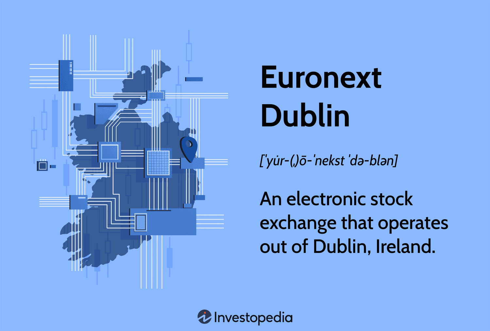

The financial markets have experienced a profound transformation with the integration of advanced technologies, reshaping trading dynamics and introducing both new opportunities and challenges. At the forefront of this evolution is Euronext Dublin, a leading player in the European stock exchange landscape. Euronext Dublin demonstrates significant changes in its operations and influence, particularly evident in the rise of algorithmic trading, commonly referred to as algo trading, which fundamentally alters trading practices on exchanges like Euronext Dublin.

Euronext Dublin, formerly known as the Irish Stock Exchange, has strategically positioned itself through adeptly navigating technological advancements and adapting to new trading paradigms. The merger of the Irish Stock Exchange with Euronext in 2018 marked a pivotal turning point, propelling the exchange into a new era of innovation characterized by increased accessibility to European capital markets and a robust trading infrastructure.



Algorithmic trading has emerged as a transformative force within financial exchanges, including Euronext Dublin, leveraging computer algorithms to execute trades based on pre-defined criteria without human intervention. This approach enhances market efficiency by improving liquidity, reducing transaction costs, and enabling rapid trade execution. As technological advancements continue to accelerate, understanding how exchanges like Euronext Dublin integrate algo trading mechanisms becomes essential for comprehending future financial landscapes.

This article investigates the structure, historical development, and influence of Euronext Dublin, along with the expanding presence of algorithmic trading. By examining how Euronext Dublin embraces innovative trading methodologies, we gain a comprehensive perspective on what the future holds for financial markets amidst the ongoing technological revolution.

## Table of Contents

## Euronext Dublin: A Brief Overview

Euronext Dublin, previously recognized as the Irish Stock Exchange, stands as a significant entity within the European stock exchange sphere, headquartered in Dublin, Ireland. This exchange was established in 2018 following the strategic amalgamation of the Irish Stock Exchange with Euronext, thereby enhancing its access to the broader European capital markets. Euronext Dublin serves as a vital conduit for a myriad of securities, encompassing stocks, bonds, exchange-traded funds (ETFs), and mutual funds.

The exchange is particularly noted for its comprehensive bond listings, securing its position as a leading player in the European [ETF](/wiki/etf-trading-strategies) trading sector. This prominence in bond listings helps attract a diverse range of issuers and investors, thus supporting substantial debt market activities across Europe. Moreover, the ISEQ 20 index functions as the benchmark index for Euronext Dublin. This index tracks the performance of the largest companies listed on the exchange, providing investors with a critical reference point for assessing market trends and making informed investment decisions. Through these offerings, Euronext Dublin not only facilitates capital formation but also strengthens its role as a central hub for financial activities in the region.

## The Role of Euronext Dublin in Financial Markets

Euronext Dublin serves as a pivotal platform in the European financial markets, particularly in Ireland, by offering robust mechanisms for capital formation and investment. The exchange enables companies to raise capital efficiently through the issuance of securities, including stocks and bonds. By providing a transparent and regulated environment, Euronext Dublin facilitates the buying and selling of these securities, ensuring that both issuers and investors can engage in trading activities with confidence.

At the heart of its operations is an advanced electronic platform that enhances the transparency, efficiency, and security of trading activities. This platform allows for streamlined processes, reducing the complexities involved in traditional trading and ensuring that transactions are executed swiftly and accurately. Consequently, the exchange plays an essential role in maintaining market integrity and investor trust, which are critical components of a healthy financial ecosystem.

A significant aspect of Euronext Dublin's contribution to the financial markets is its prominent position in bond listings. The exchange acts as a central hub for debt market activities in Europe, providing a platform for governments, financial institutions, and corporations to issue debt securities. This facilitates [capital raising](/wiki/hedge-fund-capital-raising) for these entities while offering investors a diverse range of investment opportunities. The presence of Euronext Dublin in bond listings not only supports [liquidity](/wiki/liquidity-risk-premium) in the debt markets but also fuels economic stability by enabling debt financing on a large scale.

Moreover, Euronext Dublin acts as a crucial link between investors and issuers, fostering economic growth and job creation. By facilitating a seamless exchange of capital, the platform empowers businesses to expand, innovate, and hire more employees. The ripple effect of this facilitation is seen in the broader economy, where increased investment leads to new ventures, enhanced productivity, and a stronger economic framework.

Through its comprehensive services and commitment to modernizing financial transactions, Euronext Dublin continues to be an indispensable component of Ireland and Europe's financial landscape. Its ability to adapt and innovate ensures that it remains a leader in facilitating capital formation and investment in the evolving market environment.

## Understanding Algorithmic Trading

Algorithmic trading, commonly referred to as algo trading, is the use of computer algorithms for executing trades at optimal speeds and prices according to predefined criteria. This method leverages advanced mathematical models and is primarily driven by predefined instructions, enabling traders to automatically execute orders without human intervention.

A central advantage of [algorithmic trading](/wiki/algorithmic-trading) is the enhancement of market efficiency. Algorithms are designed to provide liquidity by participating in numerous transactions, effectively reducing bid-ask spreads, which translates into lower transaction costs for market participants. For instance, algorithms can swiftly identify discrepancies in bid-ask spreads and capitalize on them, thereby narrowing these spreads over time. This contributes to more stable and efficient markets.

Moreover, rapid trade execution is a hallmark of algo trading, allowing trades to be carried out in fractions of a second. High-frequency trading ([HFT](/wiki/high-frequency-trading-strategies)), a subset of algorithmic trading, capitalizes on speed advantages to execute a vast number of trades within very short periods, often seeking to capture small price differentials. Such speed can only be achieved through sophisticated technological infrastructure and optimized algorithms.

Algo trading strategies can be multifaceted, often based on a variety of factors and methodologies. Strategies might include:

- **Market Trends**: Algorithms can track and analyze trends over various time frames, adapting their trading decisions accordingly.
- **Statistical Arbitrage**: This involves exploiting price inefficiencies between correlated securities through advanced statistical techniques. For example, if two securities typically move together and suddenly diverge, an algorithm might execute trades expecting the prices to converge again.
- **Mean Reversion**: This strategy assumes that prices tend to revert to their average over time, thus algorithms can identify opportunities where security prices deviate significantly from historical averages.

The integration of big data and [machine learning](/wiki/machine-learning) models in algorithmic trading is an expanding trend, allowing for the development of more sophisticated algorithms. Machine learning enables the processing of vast amounts of data, uncovering patterns and insights that can inform trading decisions. For example, algorithms can use machine learning to refine strategies based on historical data and tweak their predictive capabilities to improve future performance.

Here is a Python example of a simple algorithm using a moving average crossover strategy, which involves buying or selling based on short-term and long-term moving averages:

```python
import numpy as np
import pandas as pd

# Sample data: assume 'data' is a DataFrame with a 'Close' column for closing prices
data = pd.DataFrame({'Close': [110, 112, 113, 115, 118, 120, 121, 119, 118, 121]})

# Define moving average windows
short_window = 3
long_window = 5

# Calculate moving averages
data['Short_MA'] = data['Close'].rolling(window=short_window, min_periods=1).mean()
data['Long_MA'] = data['Close'].rolling(window=long_window, min_periods=1).mean()

# Signal: Buy when short-term MA crosses above long-term MA
data['Signal'] = np.where(data['Short_MA'] > data['Long_MA'], 1, 0)

print(data)
```

Algo trading platforms, such as Algopath, provide tools essential for developing, testing, and deploying these custom trading strategies. These platforms often offer a simulated trading environment where strategies can be tested against historical data to ascertain their viability before being deployed in live markets. This rigorous back-testing ensures that the strategies align with expected outcomes and helps optimize performance metrics.

The rise of algorithmic trading signifies a shift towards highly automated, data-driven techniques in the financial markets, fundamentally changing how financial assets are traded.

## Euronext Dublin and Algorithmic Trading

Euronext Dublin, as part of the larger Euronext network, has adapted to the rapid growth of algorithmic trading by leveraging its advanced technological infrastructure. This infrastructure is designed to ensure low latency and high-speed trade execution, which are critical factors in the success of algorithmic trading strategies. The exchange’s implementation of the Optiq trading platform exemplifies its commitment to supporting algo trading by offering scalable and efficient trading services. Optiq enables market participants to execute trades with precision and speed, which are essential attributes for institutional investors and proprietary trading firms utilizing algorithmic strategies.

The prevalence of algorithmic trading strategies on Euronext Dublin is growing, largely due to the platform's ability to provide a conducive environment for such operations. These strategies encompass a variety of approaches, ranging from statistical [arbitrage](/wiki/arbitrage) to high-frequency trading, where the key is the ability to process large volumes of data and execute trades rapidly. The combination of Euronext Dublin's infrastructure and algo trading has proven attractive to institutional investors who require reliable market access and execution capabilities.

Moreover, compliance with the Markets in Financial Instruments Directive II (MiFID II) is integral to Euronext Dublin’s operations. MiFID II is a comprehensive set of regulations aimed at increasing transparency and bolstering market integrity within the financial markets. The directive necessitates rigorous reporting and disclosure requirements, ensuring that algorithmic trading on the exchange is conducted with a high degree of transparency and fairness. This regulatory framework assists in maintaining investor confidence and upholding the integrity of trading activities on Euronext Dublin.

The integration of algorithmic trading within Euronext Dublin significantly contributes to market liquidity and competitiveness. By facilitating a dynamic trading environment, the exchange attracts a diverse array of market participants, thereby enhancing order flows and ensuring tighter bid-ask spreads. This increased liquidity benefits all participants by improving price discovery and reducing transaction costs.

In conclusion, Euronext Dublin's robust support for algorithmic trading, through platforms like Optiq, and its adherence to regulatory frameworks such as MiFID II, underscore its pivotal role in advancing trading efficiency and market integrity. The exchange’s infrastructure not only supports current trading needs but also positions it favorably for future developments in technology-driven finance.

## The Future of Financial Markets and Algo Trading

The financial markets are undergoing a rapid transformation, driven by the integration of advanced technologies and the growing role of algorithmic trading. The continuous evolution of these systems is crucial for maintaining competitive positions in the financial industry. Among these developments, Euronext Dublin is at the center of innovation, focusing on both technological enhancements and sustainable finance initiatives.

Algorithmic trading has established itself as a key component of modern trading floors, offering significant benefits such as increased speed, efficiency, and liquidity. Euronext Dublin is committed to further integrating these technologies into its operations. This is evident in their continual upgrades to trading platforms and the implementation of cutting-edge systems designed to handle large volumes of data with low latency. These advancements help meet the demands of high-frequency traders and institutional investors who rely heavily on algo trading systems.

Despite these advancements, the future of financial markets and algo trading faces several challenges. Regulatory changes, including those introduced by directives like MiFID II, demand greater transparency and fairness in trading activities. Adapting to these regulations requires that both algo traders and exchanges, such as Euronext Dublin, develop strategic and technical solutions that adhere to compliance while preserving the benefits of algorithmic trading.

Moreover, market [volatility](/wiki/volatility-trading-strategies) presents another challenge that necessitates flexible and robust algorithmic strategies. The unpredictable nature of global markets means algorithms must be continually adapted to new market conditions to mitigate risks. Machine learning and big data analytics play a significant role in developing these adaptive strategies, allowing for dynamic responses to market shifts.

Looking ahead, Euronext Dublin aims to expand its market offerings and technological capabilities. This involves broadening the array of financial instruments available for trading and leveraging innovations like blockchain technology for enhanced security and efficiency. Sustainable finance initiatives also form a crucial part of this strategy, aligning with global efforts to address environmental, social, and governance ([ESG](/wiki/esg-investing)) factors.

As the financial landscape continues to evolve, the collaboration between Euronext Dublin and algorithmic trading strategies is expected to drive significant market innovation. By embracing new technologies and adapting to regulatory and market changes, Euronext Dublin remains well-positioned to lead in this dynamic environment. The ongoing developments ensure that both the exchange and algorithmic trading maintain their roles as pivotal forces in the future of financial markets.

## Conclusion

Euronext Dublin remains a significant force in Europe's financial markets, offering essential services that facilitate trading and capital formation. Its integration with algorithmic trading marks a transformative shift, bringing remarkable efficiency and innovation to market operations. This synthesis between Euronext Dublin and algorithmic trading opens up promising possibilities for investors and businesses, enhancing access to liquidity and optimizing trading strategies.

Advancements in technology and trading strategies will continue to drive the evolution of financial markets. Algorithmic trading, leveraging advanced analytics and rapid execution, is poised to further increase market efficiency and competitiveness. Euronext Dublin’s commitment to regulatory compliance ensures market integrity and transparency, vital factors that bolster confidence among market participants.

The exchange's ongoing enhancements in its technological infrastructure demonstrate its dedication to staying at the forefront of market innovation. By embracing developments such as machine learning models and big data analytics, Euronext Dublin equips its participants with the tools needed to thrive in an increasingly complex trading environment. This proactive approach ensures that Euronext Dublin retains its pivotal role in shaping the future of financial markets, balancing technological advancements with robust regulatory standards.

## References & Further Reading

[1]: Charles, A., & Darné, O. (2019). ["Volatility as an asset class: Holding volatility for the long term"](https://www.accessecon.com/Pubs/EB/2019/Volume39/EB-19-V39-I2-P92.pdf). International Review of Financial Analysis, 63, 310-324.

[2]: Lopez de Prado, M. (2018). ["Advances in Financial Machine Learning"](https://www.amazon.com/Advances-Financial-Machine-Learning-Marcos/dp/1119482089). John Wiley & Sons.

[3]: Jansen, S. (2020). ["Machine Learning for Algorithmic Trading"](https://github.com/stefan-jansen/machine-learning-for-trading). Packt Publishing Ltd.

[4]: Gomber, P., Arndt, B., Lutat, M., & Uhle, T. (2011). ["High-frequency trading"](https://papers.ssrn.com/sol3/papers.cfm?abstract_id=1858626). Journal of Business Economics, 81(1), 25-57.

[5]: Chan, E. (2009). ["Quantitative Trading: How to Build Your Own Algorithmic Trading Business"](https://github.com/ftvision/quant_trading_echan_book). John Wiley & Sons.