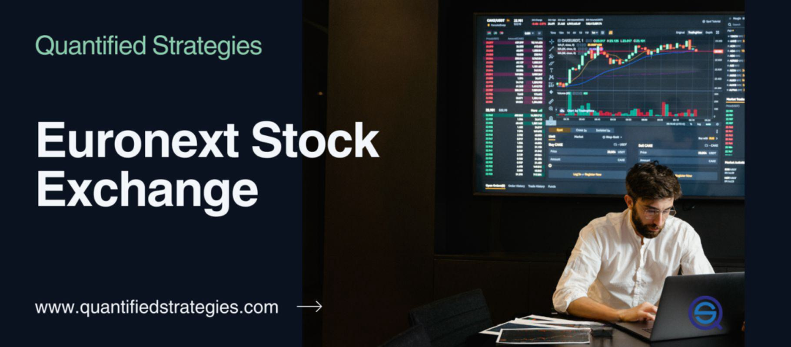

In today's fast-paced financial markets, trading platforms are essential for facilitating stock trading and investment opportunities. The advent of algorithmic trading has revolutionized the trading landscape, enabling traders to execute orders with speed and precision that was previously unimaginable. This technological advancement is particularly evident in the European financial market, where algo trading has become a cornerstone of modern trading practices.

Algorithmic trading utilizes computer programs to automate trading decisions, executing trades based on a set of predefined criteria such as timing, price, and volume. This automation minimizes the need for manual intervention, thereby allowing traders to capitalize on market opportunities in real-time. As a result, both institutional and individual traders increasingly rely on technology-driven platforms to navigate the complexities of highly volatile markets.



This article will explore the best trading platforms for algorithmic trading within the European stock market. It will examine key features, benefits, and considerations that are critical for traders aiming to optimize their strategies and maximize returns. Moreover, the article will address the pivotal role of Euronext, Europe's largest exchange, in shaping the financial landscape. Euronext's Universal Trading Platform not only facilitates the trading of a diverse array of financial instruments but also promotes sustainability through its dedicated ESG offerings.

Our overview will provide insights into current market trends, offering platform reviews that highlight strategic advantages of leveraging algorithmic trading. By emphasizing the tools and functionalities offered by leading platforms, traders can better position themselves to exploit the dynamic opportunities present in the European markets.

## Table of Contents

## Understanding Algorithmic Trading

Algorithmic trading, often referred to as algo trading, is a mode of executing trades in financial markets using computer algorithms that execute pre-programmed logic concerning various parameters like timing, price, and [volume](/wiki/volume-trading-strategy). These systems make trading decisions at a speed and frequency that is impossible for a human trader, effectively managing large trading volumes and complex portfolios without direct human intervention.

The primary advantage of algorithmic trading lies in its ability to perform trades with increased precision and speed. This is particularly advantageous in highly volatile markets where prices can fluctuate rapidly within short time frames. Automated systems can execute trades instantaneously as they detect favorable conditions, thus reducing the chances of slippage and enhancing the accuracy of trade execution.

Institutional investors such as hedge funds, pension funds, and investment banks have traditionally been the major users of [algorithmic trading](/wiki/algorithmic-trading) due to its efficiency in handling large-scale and complex trading strategies. However, the accessibility of technology has led to its increasing adoption among individual traders, who utilize these systems for strategies that range from [arbitrage](/wiki/arbitrage) and [market making](/wiki/market-making) to macro hedge funds and [quantitative trading](/wiki/quantitative-trading).

In the European financial markets, algorithmic trading also enables high-frequency trading ([HFT](/wiki/high-frequency-trading-strategies)), where transactions are carried out in microseconds to capitalize on tiny inefficiencies in market pricing. By leveraging sophisticated algorithms, traders can implement strategies that involve ultra-low latency, capturing profits from fleeting discrepancies between asset prices across different markets or exchanges. HFT requires substantial infrastructure, including co-location services, to ensure that trading signals reach the market as fast as theoretically possible.

The growth of algorithmic trading has been driven, in part, by the availability of vast amounts of market data and advances in computational capabilities. Traders use historical data to backtest and optimize their algorithms, continuously refining their strategies for better performance. This requires a robust understanding of quantitative techniques and a methodical approach to risk management, as algorithmic strategies need to account for potential adverse market conditions.

In conclusion, algorithmic trading represents a significant shift in how trading is conducted, emphasizing speed, precision, and scalability. Its application in the European markets is shaping new patterns of trading behaviors among both institutional and individual participants, making it a cornerstone of modern financial trading.

## Key Features of Premier European Trading Platforms

European trading platforms have evolved to offer a sophisticated range of tools that enhance the trading experience for both institutional and individual traders. These platforms are designed to support algorithmic trading, providing users with the resources necessary for effective decision-making and execution.

One of the essential features of top trading platforms is the availability of comprehensive charting tools. Advanced charting functionalities allow traders to analyze market trends and patterns, which are crucial for developing and refining trading strategies. These charts often come with customizable indicators and drawing tools, enabling traders to tailor their analyses to specific needs. Additionally, platforms often offer market alerts that notify traders of significant market movements or events that could impact trading strategies or outcomes.

Backtesting is another critical functionality offered by premier trading platforms. This feature allows traders to test their algorithms against historical data, providing insights into how strategies would have performed in the past. Backtesting can help optimize strategies by identifying potential weaknesses and allowing for adjustments before deploying them in live markets. This process is key to developing robust, reliable trading strategies that can withstand varying market conditions.

When selecting a trading platform, traders should consider the range of asset classes available. Platforms that offer access to diverse markets, including stocks, commodities, [forex](/wiki/forex-system), and derivatives, enable traders to diversify their portfolios and explore different trading opportunities. This diversity can be advantageous in managing risk and adjusting strategies to capitalize on different market opportunities.

Another crucial [factor](/wiki/factor-investing) is market data access. Top platforms provide real-time data feeds, ensuring traders have the latest information needed to make informed trading decisions. Access to accurate and timely data is pivotal in the fast-paced environment of algorithmic trading, where decisions may need to be made in fractions of a second.

Security and regulatory compliance are paramount for protecting traders’ investments and personal information. Leading platforms implement stringent security measures, such as encryption and two-factor authentication, to safeguard user data and accounts. Compliance with regulatory standards also assures traders that the platform operates within the legal frameworks established by financial authorities, enhancing trust and reliability.

Finally, modern trading platforms support multiple devices and operating systems, allowing for flexible trading arrangements. Whether accessing the platform from a desktop, tablet, or smartphone, traders can manage their trades on-the-go, ensuring they remain connected to the markets at all times. This flexibility caters to the needs of a dynamic trading environment, where market opportunities can arise at any moment.

In summary, Europe's premier trading platforms are equipped with a robust set of features designed to support and enhance the algorithmic trading experience. From advanced analytical tools to comprehensive security measures, these platforms provide the infrastructure required for executing complex trading strategies with efficiency and confidence.

## Euronext: The Pan-European Exchange

Euronext stands as the largest exchange in Europe, establishing a significant presence across multiple countries, including France, Belgium, and the Netherlands. Serving as a critical infrastructure in the European financial market, it offers a Universal Trading Platform that accommodates approximately 1,300 stocks. This platform is a comprehensive marketplace, not only hosting equities but also numerous bonds, exchange-traded funds (ETFs), and derivatives, thus supporting a diverse trading ecosystem essential for both institutional and retail investors.

Through strategic acquisitions, Euronext has notably expanded its geographic reach and market influence. Key among these acquisitions are the Irish Stock Exchange and Oslo Børs, moves that have augmented Euronext's capacity to offer a wider array of financial products and extend its influence across the European continent. These expansions have not only increased market participation and [liquidity](/wiki/liquidity-risk-premium) but also reinforced Euronext's position as a critical player in shaping the European financial landscape.

As a leader in sustainability initiatives, Euronext has taken proactive steps to integrate environmental, social, and governance ([ESG](/wiki/esg-investing)) criteria into its offerings. This is evidenced by its dedicated ESG products and services, which aim to promote sustainable growth within the financial markets. Euronext's commitment to sustainability is aligned with growing investor demand for responsible investing options, providing products that cater to this emerging trend. Strategies include initiatives for reducing carbon footprints and supporting green finance, further establishing Euronext as a forward-thinking exchange in Europe. 

Overall, Euronext's robust infrastructure, strategic growth, and commitment to sustainability enhance its reputation as a pivotal exchange in the European financial ecosystem.

## Top Algorithmic Trading Platforms in the European Market

[Interactive Brokers](/wiki/interactive-brokers-api), eToro, XTB, and Pepperstone are among the premier trading platforms recognized by European traders for their extensive functionalities and exceptional customer service. Each of these platforms offers unique advantages tailored to meet diverse trading needs and strategies in the fast-evolving landscape of algorithmic trading.

Interactive Brokers is renowned for its low commission rates and access to a vast array of global markets. It offers a comprehensive suite of tools, including sophisticated risk management, real-time data analytics, and a robust API suited for algorithmic traders. Traders can utilize Interactive Brokers’ proprietary platform, Trader Workstation (TWS), which supports various programming languages for developing custom trading algorithms.

eToro stands out due to its emphasis on social trading and user-friendly interface, making it an appealing option for those new to algorithmic trading. Although primarily known for its copy trading feature, eToro also offers advanced charting tools and a wide range of asset classes. Its platform supports Python and other scripting languages through the OpenBook API, enabling traders to design and test their trading strategies.

XTB is favored for its educational resources and customer support tailored for traders across different experience levels. It provides access to the xStation and MetaTrader 4 (MT4) platforms, supporting algorithmic trading through custom indicators and automated trading strategies (Expert Advisors). XTB offers competitive spreads, making it attractive for both high-frequency traders and long-term investors.

Pepperstone is notable for its sophisticated trading infrastructure, low latency, and top-notch access to global markets. It supports popular interfaces such as MT4, MT5, and cTrader, providing extensive options for algorithmic trading enthusiasts. Pepperstone's advanced charting tools and technical indicators allow for precise execution of complex trading algorithms, thus appealing to professional traders.

These platforms collectively support a wide range of trading methods, such as high-frequency trading, low-cost investing, and access to diversified financial products. They include features like [backtesting](/wiki/backtesting) and optimization tools, vital for developing, refining, and deploying effective algorithmic strategies. The growing reliance on technology within the trading sector underscores the importance of selecting a platform that aligns with individual trading goals and offers the technical support necessary for success in the European market.

## Strategies for Effective Algorithmic Trading

Successful algorithmic trading requires a comprehensive understanding of market conditions, precise timing, and strategic deployment of algorithms designed for specific asset classes. This precision allows traders to exploit market inefficiencies effectively. Selecting the right timeframes for trading is crucial; shorter timeframes may benefit high-frequency strategies, while longer ones are suitable for capturing broader market trends.

Backtesting and optimization play pivotal roles in refining trading strategies. By simulating trades with historical data, traders can evaluate the performance of algorithms and adjust parameters to optimize results. For instance, consider the following simplified Python code for backtesting a moving average crossover strategy using historical stock data:

```python
import pandas as pd

def moving_average_crossover(data, short_window=40, long_window=100):
    signals = pd.DataFrame(index=data.index)
    signals['price'] = data['close']
    signals['short_mavg'] = data['close'].rolling(window=short_window, min_periods=1).mean()
    signals['long_mavg'] = data['close'].rolling(window=long_window, min_periods=1).mean()
    signals['signal'] = 0.0
    signals['signal'][short_window:] = np.where(
        signals['short_mavg'][short_window:] > signals['long_mavg'][short_window:], 1.0, 0.0)
    signals['positions'] = signals['signal'].diff()
    return signals

historical_data = pd.read_csv('historical_stock_data.csv', parse_dates=True, index_col='date')
signals = moving_average_crossover(historical_data)
```

Risk management is equally imperative, employing techniques such as stop-loss orders to minimize potential losses. Diversifying strategies across different market environments and asset classes further mitigates risk and enhances portfolio stability. A diversified approach ensures that poor performance in one strategy can be offset by gains in another, maintaining overall profitability.

European algorithmic traders are increasingly leveraging [machine learning](/wiki/machine-learning) to dynamically adjust strategies in response to market changes. Machine learning models can process vast amounts of data, identifying patterns and predictive signals that might be overlooked by conventional trading techniques. For example, algorithms using [reinforcement learning](/wiki/reinforcement-learning) can evolve by continually analyzing market responses to trades, thereby optimizing decision-making processes.

These strategic considerations enable traders to harness the full potential of algorithmic trading in Europe's diverse financial markets. As trading technology advances, an adaptive and informed approach will remain essential for achieving consistent success in algorithmic trading.

## Conclusion

The European financial landscape is exceptionally well-suited for algorithmic trading due to its combination of cutting-edge technology, stringent regulatory frameworks, and a diverse array of markets. Trading platforms, such as Euronext, play a pivotal role in this ecosystem by enabling the seamless integration of complex trading strategies. Euronext, with its wide range of stocks, bonds, ETFs, and derivatives, grants traders access to a vast market, meeting the needs of both novices and seasoned investors alike. Its strategic positioning within multiple European countries enhances this reach further, ensuring robust support for diverse financial instruments.

For traders and investors operating within Europe, the choice of trading platform is a critical determinant of success in algorithmic trading. The right platform can leverage low latency, advanced analytics, and extensive market data to empower traders to develop sophisticated and effective trading algorithms. Given the various platforms available—each with unique offerings and strengths—selecting one that aligns best with individual trading strategies and goals enhances the potential for profitable outcomes.

As the financial markets continuously evolve, so too must the strategies employed by algorithmic traders. Staying informed about market conditions, regulatory changes, and technological advancements is paramount. Adaptability in trading approaches can be achieved through continual education, engagement with the latest financial tools, and leveraging emerging technologies like machine learning for dynamic strategy adjustment. By maintaining flexibility and staying abreast of developments, traders are more likely to navigate the challenges of the evolving market landscape successfully.

## References & Further Reading

[1]: Bergstra, J., Bardenet, R., Bengio, Y., & Kégl, B. (2011). ["Algorithms for Hyper-Parameter Optimization."](https://dl.acm.org/doi/10.5555/2986459.2986743) Advances in Neural Information Processing Systems 24.

[2]: ["Advances in Financial Machine Learning"](https://www.amazon.com/Advances-Financial-Machine-Learning-Marcos/dp/1119482089) by Marcos Lopez de Prado

[3]: ["Evidence-Based Technical Analysis: Applying the Scientific Method and Statistical Inference to Trading Signals"](https://www.amazon.com/Evidence-Based-Technical-Analysis-Scientific-Statistical/dp/0470008741) by David Aronson

[4]: ["Machine Learning for Algorithmic Trading"](https://github.com/stefan-jansen/machine-learning-for-trading) by Stefan Jansen

[5]: ["Quantitative Trading: How to Build Your Own Algorithmic Trading Business"](https://www.amazon.com/Quantitative-Trading-Build-Algorithmic-Business/dp/1119800064) by Ernest P. Chan