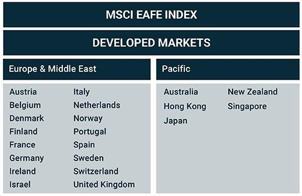

Algorithmic trading has significantly transformed the financial markets by utilizing complex algorithms to perform trades at remarkable speeds. This form of trading leverages technology to analyze market data efficiently and execute transactions with precision, thus surpassing traditional trading methods that typically rely on manual processes. The advent of algorithmic trading has led to increased liquidity, reduced transaction costs, and heightened market efficiency.

The EAFE regions—comprising Europe, Australasia, and the Far East—constitute some of the most economically developed markets outside North America. These regions offer distinct opportunities and challenges due to their diverse economic structures, varied regulatory frameworks, and differing market behaviors. As a result, the interplay between algorithmic trading and the EAFE markets provides fertile ground for innovation and adaptation. 

This article examines the interaction between regional market analysis in these EAFE regions and the rapidly growing field of algorithmic trading. Algorithmic trading is not only reshaping how transactions are conducted in these markets but also influencing investment strategies by providing data-driven insights and solutions. Investors and trading entities are utilizing these insights to optimize portfolios, manage risks, and exploit arbitrage opportunities across international markets.

Furthermore, technological advancements are playing a crucial role in enhancing trading efficiency on a global scale. The continuous development of artificial intelligence, machine learning, and real-time data processing technologies is instrumental in refining algorithmic models and strategies. These innovations are facilitating trades with minimal latency, supporting more sophisticated high-frequency trading operations, and democratizing access to advanced financial tools for both institutional and retail investors. Overall, as technology continues to evolve, so does the potential for algorithmic trading to further integrate and innovate within international markets.

## Table of Contents

## Understanding International Markets: EAFE Overview

The EAFE regions, encompassing Europe, Australasia, and the Far East, are recognized as some of the most economically advanced sectors globally. These regions offer distinct opportunities for investors and traders due to their established financial infrastructures and dynamic market environments. The MSCI EAFE Index serves as a pivotal tool for investors seeking to assess international market performance, specifically targeting large and mid-cap companies outside of North America. This index provides a comprehensive benchmark, widely employed to gauge the health and potential of these regions within the global financial landscape.

Europe, within the EAFE classification, represents a diverse set of economies, each with its own regulatory environments and investor behaviors. From the more stringent regulatory frameworks of countries like Germany to the flexible financial markets of the United Kingdom, understanding these nuances is crucial for deploying effective algorithmic trading strategies. This diversity calls for a deep appreciation of the varying economic conditions and investor expectations, which significantly impact trading outcomes.

Australasia, comprising countries like Australia and New Zealand, presents a different set of market dynamics. The region is known for its relatively stable economies and transparent financial systems. Investors in Australasia benefit from well-regulated markets and robust economic growth prospects. The markets here are characterized by their reliance on both regional and international trade, which often shapes investor behaviors and market trends.

The Far East, particularly nations such as Japan, has long been pivotal in influencing global market trends. Japan's highly developed technology sector and its significant role in global manufacturing make it a vital component of the EAFE regions. The investor behavior in Japan is influenced by both local economic policies and overarching global economic conditions. The unique mixture of government intervention and free-market practices here requires [algorithmic trading](/wiki/algorithmic-trading) strategies to be adaptable and responsive to swiftly changing market conditions.

The MSCI EAFE Index's influence extends beyond traditional stock markets. Its critical role in shaping Exchange-Traded Funds (ETFs) and mutual funds underscores its significance as an international investment benchmark. These vehicles, which follow the index closely, offer investors a diversified exposure to international markets, thus enabling strategic investment opportunities in alignment with global market trends.

For those engaging in algorithmic trading within the EAFE regions, understanding the regional market intricacies is vital. Algorithmic trading strategies must be designed to navigate the multifaceted economic environments, regulatory requirements, and investor behaviors unique to these markets. The ability to harness this knowledge can significantly enhance the effectiveness and precision of trading practices, making it an indispensable component of successful financial strategy development in today's interconnected global economy.

## Algorithmic Trading: An Emergent Force in Global Markets

Algorithmic trading has emerged as a pivotal component of modern financial markets, revolutionizing how trades are conducted by deploying intricate algorithms in combination with electronic trading platforms. This technological advancement has significantly enhanced the efficiency and speed of trade executions, reshaping market dynamics globally.

The rise of algorithmic trading is closely tied to advancements in [artificial intelligence](/wiki/ai-artificial-intelligence) (AI) and [machine learning](/wiki/machine-learning) technologies. These fields have endowed algorithms with the capability to analyze vast amounts of financial data in real-time, thus facilitating more informed decision-making processes. Algorithms can now predict market trends and identify lucrative trading opportunities with increased accuracy, fostering growth in the global algorithmic trading market.

High-frequency trading ([HFT](/wiki/high-frequency-trading-strategies)) represents one of the most prominent applications of algorithmic trading. HFT is characterized by its rapid trade executions, often completed within fractions of a second. In such environments, speed and precision are paramount, allowing traders to capitalize on minuscule price discrepancies. Algorithms in HFT scan multiple markets and execute a multitude of trades simultaneously, optimizing profit margins by responding instantaneously to market fluctuations.

Algorithmic trading is democratizing financial markets. By leveraging sophisticated strategies previously reserved for large institutional investors, retail investors are gaining access to tools and methods that enhance their trading capabilities. Automated platforms facilitate seamless execution, allowing investors of varying scales to participate in complex trading strategies, such as [arbitrage](/wiki/arbitrage), [trend following](/wiki/trend-following), and [market making](/wiki/market-making).

Regulatory frameworks across different regions are progressively accommodating the intricacies of algorithmic trading. Regulatory bodies recognize the potential of algorithmic trading to enhance market efficiency and [liquidity](/wiki/liquidity-risk-premium). Consequently, they are crafting policies that set clear standards for transparency, fairness, and systemic risk management. These regulatory adaptations are essential for sustaining a stable and efficient trading environment while addressing concerns over the impacts of rapid, automated trading.

Overall, algorithmic trading is redefining the structure of global markets, providing investors with innovative strategies and tools to navigate complex financial landscapes effectively. As technology continues to evolve, so too will the capabilities and scope of algorithmic trading.

## Regional Analysis: EAFE Markets and Algorithmic Trading

The EAFE region, encompassing Europe, Australasia, and the Far East, exhibits an economic diversity that can influence algorithmic trading strategies. This diversity presents unique challenges and opportunities as different sub-regions vary significantly in their adoption and innovation in algorithmic trading.

Europe stands out with countries like Germany and the United Kingdom at the forefront of financial technology and algorithmic trading evolution. Germany's robust technological infrastructure and established financial markets provide a conducive environment for the growth of algorithmic strategies. The UK, home to London, one of the world's leading financial centers, offers a favorable regulatory landscape and a rich history of innovation in financial markets, supporting the development of sophisticated algorithmic trading methods.

Australasia, with Australia and New Zealand as the primary players, demonstrates varying levels of algorithmic trading adoption. While not as advanced as Europe, these countries are progressively integrating algorithmic trading into their financial markets, driven by improvements in technological infrastructure and growing interest from institutional investors.

In the Asia Pacific, Japan and China are notable for their rapid growth in algorithmic trading. Japan, with its well-established financial market structure, has been investing significantly in technology to enhance trading efficiency. China's burgeoning technological investments and increasingly mature markets have catalyzed a swift adoption of algorithmic trading. The Chinese government's supportive policies and emphasis on technological advancement create a favorable environment for further growth.

Several factors are instrumental in shaping the EAFE region's trading environments, including regional regulatory landscapes, economic stability, and technological infrastructure. The regulatory frameworks across these regions are evolving to accommodate technological advances in trading, although the pace and nature of these changes differ. For instance, the European Union has established regulations such as MiFID II, aimed at enhancing transparency and overseeing algorithmic trading activities. In comparison, Asian markets are navigating a mix of rigorous regulations and government-led support to foster innovation.

Economic stability is another critical element, as regions with stable economies tend to attract more investment in sophisticated trading strategies. Moreover, advancements in technological infrastructure, particularly network connectivity and data management, play a pivotal role in facilitating algorithmic trading, enabling traders to execute high-speed, high-frequency trades effectively.

In conclusion, the EAFE region's varied approach to algorithmic trading, influenced by regional economic, regulatory, and technological factors, underscores the complexities and potential inherent in these markets. As technology continues to advance and regulatory landscapes adapt, the opportunities for algorithmic trading within the EAFE regions are poised to expand, further integrating these markets into the global financial ecosystem.

## Impact of Technological Advancements on Algorithmic Trading

Technological advancements have significantly enhanced the capabilities of algorithmic trading, making it a powerful tool within global financial markets. The integration of artificial intelligence (AI) and machine learning plays a pivotal role in this evolution by enabling the development of more sophisticated and adaptive trading algorithms. These algorithms can analyze vast amounts of complex data swiftly, allowing traders to identify patterns and execute decisions with increased precision.

One notable aspect of technological innovation lies in the enhancement of real-time data analysis capabilities. Sophisticated data processing and analytical techniques enable traders to analyze market data as it is generated, a critical requirement for successful algorithmic trading. For example, machine learning algorithms can be trained to recognize specific market conditions or anomalies, thereby allowing traders to respond instantly by adjusting their strategies. This ability to adapt quickly translates to a competitive advantage, particularly in volatile markets.

Parallel to real-time data analysis, improvements in network infrastructure and computing power are crucial for supporting high-frequency trading strategies, which depend on minimal latency. The reduction of latency—defined as the delay between sending and receiving trading instructions—is vital for high-frequency traders who rely on executing a large number of transactions in a fraction of a second. Improved internet connections, fiber optic technology, and data center co-location services further enhance these strategies by minimizing the distance between trading infrastructure and exchanges.

Cloud-based trading solutions have emerged as another technological boon, offering scalable and cost-effective advantages. These solutions provide computational resources and data storage, which are indispensable for developing and testing algorithms efficiently. Small and medium enterprises (SMEs), in particular, benefit from cloud-based platforms because they offer access to advanced trading tools and infrastructure without the need for significant upfront investment. This access levels the playing field by democratizing entry into algorithmic trading.

As these technological advancements continue to progress, algorithmic trading is poised to become even more integral within global financial markets. The ongoing development in AI and machine learning, alongside continuous improvements in computational capacities and network infrastructures, will only act to further embed algorithmic trading into the core of financial operations. With these tools, traders are increasingly capable of managing complex strategies with speed and accuracy, fostering greater efficiency and expanded outreach in trading activities across diverse international markets.

## Challenges and Opportunities in EAFE Algorithmic Trading

Algorithmic trading in the EAFE (Europe, Australasia, and the Far East) regions presents a unique set of challenges and opportunities, largely influenced by regulatory frameworks, technological advancements, and market dynamics.

Regulatory hurdles remain a significant challenge in the deployment of algorithmic trading strategies. Each region within the EAFE markets has a distinct regulatory environment that can affect the implementation of algorithmic trading. For instance, Europe's Markets in Financial Instruments Directive II (MiFID II) mandates transparency and imposes strict reporting requirements, affecting how algorithmic strategies are executed. Compliance with such regulations requires significant resource investment in terms of both technology and personnel to ensure adherence, representing a barrier to entry for smaller firms.

Accurate risk assessment tools are crucial to navigating the high-frequency trading environments enabled by algorithmic systems. These tools must address market [volatility](/wiki/volatility-trading-strategies) and system robustness to avoid destabilizing effects on financial markets. Algorithmic trading systems need to incorporate advanced risk management algorithms capable of real-time monitoring and adjustment. Techniques such as Value at Risk (VaR) calculations and stress testing are prominently utilized to gauge potential losses under varied market conditions.

The integration of advanced technologies, such as artificial intelligence and machine learning, presents a substantial opportunity. These technologies facilitate the development of more adaptive and predictive trading models, enhancing decision-making processes. The accessibility of trading tools to emerging economies within the EAFE regions has the potential to democratize market participation. Cloud-based platforms, for example, can offer cost-effective solutions that lower entry barriers for smaller firms and individual investors.

Market participants in the EAFE regions must remain responsive to evolving market conditions and adaptable to changes in regulatory frameworks. This dynamic landscape necessitates a high degree of flexibility, demanding continuous learning and adaptation from both investors and traders. As the financial markets in regions like Asia Pacific rapidly mature, driven by technological investments, the adaptability of market participants becomes even more crucial.

New entrants to the EAFE algorithmic trading landscape have the chance to innovate and capture emerging market segments. Established players also need to evolve by incorporating cutting-edge technologies and continuously reassessing their strategies to maintain their competitive stance. The progression of algorithmic trading holds vast potential for financial market integration, enabling more efficient cross-border transactions and facilitating capital flows across different economic regions.

In summary, while algorithmic trading in the EAFE markets faces several challenges, including regulatory compliance and risk management, it also offers significant opportunities through technological integration and market expansion. The adaptation to a shifting financial environment and regulatory landscape will define the success of market participants in these regions.

## Conclusion

The convergence of algorithmic trading and EAFE market dynamics is reshaping the landscape of global finance. With technological advancements and regulatory frameworks increasingly accommodating this form of trading, the regions encompassing Europe, Australasia, and the Far East are set to experience substantial growth. These advancements facilitate not only faster and more efficient trades but also open new avenues for innovation in trading strategies.

Investors and traders aiming to leverage algorithmic trading must adeptly navigate the complexities inherent in international markets. This requires an acute understanding of regional economic conditions, regulatory environments, and technological infrastructures. The intricacies of each market demand tailored trading strategies that can adapt to varying levels of volatility and liquidity.

The potential for further innovation in algorithmic trading is immense. With ongoing developments in AI and machine learning, traders can design algorithms with enhanced predictive capabilities and adaptability. These technologies enable the processing of vast amounts of market data in real time, providing insights that were previously unattainable.

Looking ahead, the evolution of algorithmic trading in the EAFE regions promises significant opportunities for broadening financial market integration on a global scale. As markets become increasingly interconnected, the ability to execute trades across borders seamlessly will become paramount. Consequently, the role of algorithmic trading will continue to expand, driven by continual technological progress and increasing market sophistication. This evolution not only enhances the efficiency of trading but also strengthens the resilience and depth of global financial markets.

## References & Further Reading

[1]: Fama, E. F., & French, K. R. (1992). ["The Cross-Section of Expected Stock Returns."](https://onlinelibrary.wiley.com/doi/full/10.1111/j.1540-6261.1992.tb04398.x) Journal of Finance, 47(2), 427-465.

[2]: Hasbrouck, J., & Saar, G. (2013). ["Low-latency trading."](https://www.sciencedirect.com/science/article/abs/pii/S1386418113000165) The Review of Financial Studies, 26(9), 2131-2173.

[3]: Loeper, G. (2013). ["Option Pricing and Volatility Trading."](https://www.monash.edu/science/quantitative-finance/media/documents/CQFIS_17_05.pdf) Chapman and Hall/CRC.

[4]: Aldridge, I. (2013). ["High-Frequency Trading: A Practical Guide to Algorithmic Strategies and Trading Systems."](https://onlinelibrary.wiley.com/doi/pdf/10.1002/9781119203803.fmatter) Wiley Finance.

[5]: Narang, R. (2009). ["Inside the Black Box: A Simple Guide to Quantitative and High Frequency Trading."](https://onlinelibrary.wiley.com/doi/book/10.1002/9781118267738) Wiley.

[6]: Chincarini, L. B., & Kim, D. (2006). ["Quantitative Equity Portfolio Management: An Active Approach to Portfolio Construction and Management."](https://archive.org/details/quantitativeequi0000chin_c9d6) McGraw-Hill.

[7]: Securities and Exchange Commission. (2010). ["Concept Release on Equity Market Structure."](https://www.sec.gov/rules-regulations/2010/01/concept-release-equity-market-structure)