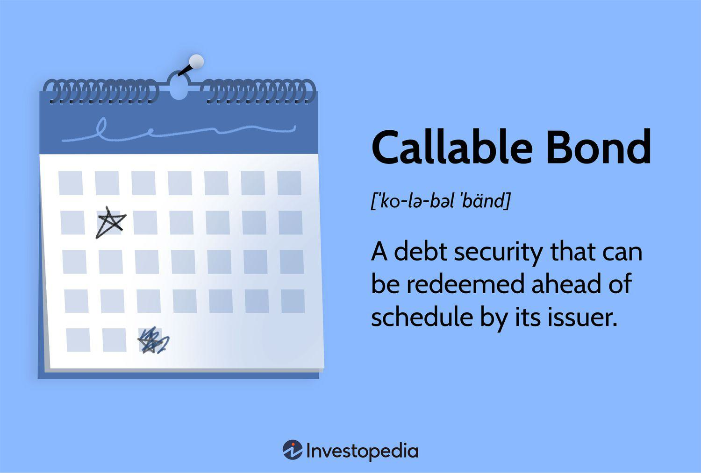

In this article, we explore the complex world of European callable bonds and algorithmic trading. These financial instruments offer unique opportunities and present distinct challenges for investors. By focusing on the functionality, mechanisms, and strategic optimizations associated with these bonds through algorithmic trading, investors can potentially enhance their portfolio performance and manage associated risks more effectively.

European callable bonds are an essential aspect of modern fixed-income markets. They allow issuers to redeem the bonds before maturity, providing them with opportunities to refinance debt under favorable conditions. This prerogative can be advantageous to issuers but introduces reinvestment risks for bondholders. Understanding the specific mechanisms of European-style callable bonds, which have a single call date, is vital for investors seeking to effectively navigate interest rate risks and other associated complexities.



Algorithmic trading introduces a new dimension to handling callable bonds. Emerging as a dominant force in the financial sector, algorithmic trading leverages advanced software to execute trades based on predefined criteria. Its efficacy lies in its ability to enhance trade execution speed, accuracy, and responsiveness, essential in fast-paced trading environments. The integration of these algorithms in trading strategies involving callable bonds provides a sophisticated approach to managing volatility and optimizing returns.

By thoroughly exploring the interaction between European callable bonds and algorithmic trading, investors can better position themselves in the market. These advanced financial tools, when used with a sound understanding of their dynamics, can lead to improved returns and portfolio resilience. Enhanced risk management strategies are crucial to capitalizing on these opportunities effectively, ensuring that investors not only participate in these markets but thrive in them.

## Table of Contents

## Understanding Callable Bonds

Callable bonds are a unique type of debt security that grant the issuing entity the option to redeem the bonds before their stated maturity date. The issuer can call the bonds, typically at a predetermined price, often including a premium over the bond's face value. This callable feature is primarily advantageous for the issuer, as it provides financial flexibility and an opportunity to refinance the debt at lower interest rates when market conditions become favorable.

For investors, callable bonds present reinvestment risk—a scenario where the bondholder must reinvest the proceeds from a called bond possibly at a lower interest rate. This risk [factor](/wiki/factor-investing) makes callable bonds less predictable compared to traditional bonds, as their cash flows are subject to the issuer's redemption decision.

European callable bonds, a particular subset within this category, establish themselves with a distinct set of characteristics. Unlike American callable bonds, which can be redeemed by the issuer at multiple dates before maturity, European callable bonds have a single, specified call date. This single redemption date provides slightly more certainty to bondholders in terms of the timing, but it still requires careful consideration of the call risk associated with this date.

The main advantage for issuers in European callable bonds lies in their ability to manage interest expenses more strategically. By capitalizing on the right to call the bond, issuers can alleviate the burden of higher interest payments when market rates decline. However, the presence of only one call date could limit some flexibility compared to American callable bonds.

From an investor's perspective, the single-call feature mandates precise risk evaluation concerning interest rates. Investors must evaluate the call premium—the additional percentage over face value provided upon call—and weigh it against the call risk. This evaluation necessitates considering factors such as the likelihood of [interest rate](/wiki/interest-rate-trading-strategies) changes and the issuer's creditworthiness. Investors also typically demand a higher yield on callable bonds to compensate for the embedded option favoring the issuer.

Overall, a thorough understanding of callable bond mechanisms, particularly the European style with its single call date, is crucial for investors seeking to optimize their bond portfolio and balance the risk-return trade-off effectively.

## The Mechanism of European Callable Bonds

European callable bonds differ significantly from their American counterparts by offering only one possible call date, as opposed to multiple potential call times. This distinctive feature influences both issuers and bondholders in terms of flexibility and decision-making. 

For issuers, the single call date provides predictability in terms of financial planning and interest obligations. European callable bonds allow issuers to refinance debt if interest rates decrease, offering potential savings on interest payments. This feature can be beneficial when issuers anticipate a drop in interest rates or plan corporate actions such as acquisitions or expansions that require an infusion of capital. By setting a single call date, issuers can optimize their balance sheets and capital management strategies, reducing the uncertainty associated with interest obligations over the bond's lifetime.

For bondholders, the mechanism of European callable bonds introduces specific considerations, particularly regarding interest rate risk. The single call date means that investors face uncertainty about when their bond might be redeemed before maturity, impacting expected yields. If interest rates fall, issuers are more likely to call the bond at the scheduled date to take advantage of lower rates elsewhere, leaving investors with the challenge of reinvesting the returned principal at potentially lower yields. This scenario often results in reinvestment risk, where bondholders might not replicate the income stream or capitalize on the initial investment's favorable terms.

The interest rate risk associated with European callable bonds requires careful scrutiny by investors. Bondholders must assess the implications of the call feature within the context of their broader portfolio and market conditions. Assessing the potential outcomes for interest rates and evaluating the issuer's probable actions involves analyzing historical and projected yield curves. Investors typically employ financial models to simulate scenarios and estimate the probability of a bond being called. This analysis helps determine the yield-to-call (YTC), which reflects the annualized return a bondholder can expect if the bond is called at the earliest date.

The yield-to-call formula is calculated as follows:

$$
\text{YTC} = \left( \frac{C + \frac{F - P}{n}}{\frac{F + P}{2}} \right) \times 100
$$

Where:
- $C$ is the annual coupon payment,
- $F$ is the call price (usually at par or slightly above),
- $P$ is the initial purchase price,
- $n$ is the number of years until the call date.

Investors often compare YTC with the yield-to-maturity (YTM) to assess the bond's attractiveness under different interest rate scenarios. An informed decision involves balancing the potential for higher yields against the risks of early redemption, requiring a nuanced appreciation of both the financial and market landscapes. Effective management of interest rate risks can enhance portfolio performance by allowing investors to capitalize on available opportunities while mitigating potential downsides.

## Investment Strategies with Callable Bonds

Investment strategies involving callable bonds require careful planning and consideration to mitigate the inherent risks and optimize potential returns. One effective strategy is bond laddering, which involves purchasing callable bonds with staggered maturity dates. By staggering the maturities, investors can manage interest rate risks and reinvestment risks more effectively. For instance, as each bond matures, the proceeds can be reinvested into new bonds, possibly offering higher yields if interest rates have risen. This approach allows for a more consistent income stream while providing flexibility in response to changing market conditions.

Another analytical tool in the investor's arsenal is the yield-to-call (YTC) analysis. This metric measures the yield an investor can expect if the bond is called before its maturity. The calculation considers the bond's coupon rate, price, and the period until the call date. The formula for yield-to-call is given by:

$$
\text{YTC} = \left( \frac{\text{Coupon Payment} + \frac{\text{Call Price} - \text{Current Price}}{\text{Years to Call}}}{\text{Call Price} + \text{Current Price}} \right) \times \frac{2}{\text{Years to Call}}
$$

Using YTC, investors can compare the potential returns of callable bonds against other investment opportunities, considering the likelihood that the bond will be called given the current interest rate environment.

Diversifying portfolios by including callable bonds under certain conditions can significantly enhance income streams. Callable bonds typically offer higher yields than non-callable bonds to compensate for the call risk. Thus, during periods of stable or declining interest rates, these bonds can contribute additional income, provided that the potential call risk is managed effectively. Diversification further reduces risk, as the portfolio is not overly reliant on callable bonds, maintaining a balance with other fixed-income securities and asset classes.

Overall, implementing these strategies requires a nuanced understanding of interest rate movements, issuer tendencies, and market conditions to determine the optimal role of callable bonds within an investment portfolio.

## The Role of Algorithmic Trading

Algorithmic trading, commonly known as algo trading, utilizes advanced software systems to execute financial transactions based on pre-established rules and algorithms. This approach to trading is characterized by its high speed, precision, and efficiency, making it indispensable in today’s fast-paced financial markets.

### Speed, Accuracy, and Responsiveness

One of the principal advantages of [algorithmic trading](/wiki/algorithmic-trading) is its speed. Algorithms can process large volumes of data and execute trades within milliseconds, a feat impossible for human traders. This rapid execution allows traders to capitalize on fleeting market opportunities, ensuring optimal entry and [exit](/wiki/exit-strategy) points. By eliminating manual involvement, algo trading minimizes human error, thus enhancing accuracy. Moreover, its responsiveness enables traders to swiftly adapt to changing market conditions, providing an edge in capturing market inefficiencies.

### Benefits and Technological Risks

The benefits of algorithmic trading extend beyond speed and accuracy. It allows for [backtesting](/wiki/backtesting) strategies on historical data, optimizing trade performance by analyzing past trends. Additionally, algorithms can operate consistently without fatigue, thereby facilitating longer trading hours. They also support a wide array of trading strategies, such as statistical [arbitrage](/wiki/arbitrage), [market making](/wiki/market-making), and [trend following](/wiki/trend-following), broadening the scope of opportunities available to traders.

Despite these advantages, algorithmic trading is not devoid of risks. Technological risks are prominent, including system failures, data feed errors, or unforeseen bugs in the software that can lead to significant financial losses. Furthermore, the complexity of algorithms may result in unintended trading behavior, known as "rogue trades," which can destabilize markets. Regulatory scrutiny is another challenge as authorities monitor the impact of high-frequency trading on market stability, implying that traders must ensure compliance with evolving regulations.

In conclusion, while algorithmic trading provides substantial benefits in terms of efficiency and precision, a comprehensive understanding of its technological risks is vital for effective utilization in financial markets.

## Integrating Callable Bonds and Algo Trading

The integration of callable bonds with algorithmic trading presents remarkable opportunities for enhancing trading efficiency and decision-making in the financial markets. Algorithms are designed to handle large datasets and execute trades at speeds beyond human capabilities, making them ideal for trading callable bonds, which often require swift decision-making due to their unique characteristics.

Algorithms can identify callable bonds by analyzing key attributes such as call dates, coupon rates, and current market yields. This information allows the algorithm to assess potential trades by evaluating the likelihood of bonds being called and estimating the impact on the investment's yield. Additionally, by comparing callable bonds' yields with similar non-callable bonds, algorithms can determine the value of the call option and whether the bond is under or overpriced.

Executing trades on callable bonds through algorithmic trading ensures precision and timeliness. Algorithms can continuously monitor market conditions and promptly execute buy or sell orders when predefined criteria are met. This capability is particularly useful in volatile markets, where rapid changes can affect bond pricing and return projections.

### Example: Automating Callable Bond Trades with Python

Here's a simplified example of how a Python-based algorithm could automate trades on callable bonds:

```python
import pandas as pd
import numpy as np

# Sample data for callable bonds
data = {
    'Bond ID': ['Bond A', 'Bond B', 'Bond C'],
    'Coupon Rate': [0.05, 0.045, 0.06],
    'Current Price': [100, 98, 101],
    'Call Price': [102, 100, 103],
    'Call Date': ['2025-12-31', '2024-06-30', '2026-09-30'],
    'Market Yield': [0.04, 0.05, 0.045]
}

df = pd.DataFrame(data)
df['Call Date'] = pd.to_datetime(df['Call Date'])

# Function to calculate yield to call
def calculate_ytc(coupon_rate, current_price, call_price, call_date):
    remaining_years = (call_date - pd.Timestamp.now()).days / 365
    ytc = ((call_price - current_price) / remaining_years + coupon_rate * current_price) / ((current_price + call_price) / 2)
    return ytc

# Apply the yield to call calculation
df['Yield to Call'] = df.apply(lambda row: calculate_ytc(row['Coupon Rate'], row['Current Price'], row['Call Price'], row['Call Date']), axis=1)

# Example trading strategy
# Buy if YTC > Market Yield
buy_signals = df[df['Yield to Call'] > df['Market Yield']]
sell_signals = df[df['Yield to Call'] <= df['Market Yield']]

print("Buy Signals:\n", buy_signals[['Bond ID', 'Yield to Call', 'Market Yield']])
print("Sell Signals:\n", sell_signals[['Bond ID', 'Yield to Call', 'Market Yield']])
```

In this example, the algorithm calculates the yield to call (YTC) for each bond, which helps determine the expected yield if the bond is called at the earliest possible date. The algorithm compares the YTC with the current market yield, generating buy signals if the YTC is higher, indicating a potentially lucrative investment.

This Python script provides a basic framework for analyzing callable bonds, yet can be expanded with more sophisticated logic, additional market data inputs, and integration with trading platforms for end-to-end automation. By leveraging such algorithms, traders can systematically harness the benefits and mitigate the risks associated with callable bonds more effectively.

## Risk Management in Callable Bonds and Algo Trading

Callable bonds and algorithmic trading involve inherent risks that necessitate sophisticated risk management strategies. To optimize their advantages within an investment portfolio, investors need to understand and mitigate these risks effectively. Here, we discuss various risk management strategies such as stress testing, hedging, and scenario analysis tailored to investors’ profiles.

### Stress Testing

Stress testing is a vital tool for evaluating how callable bonds and algorithmic trading strategies perform under extreme conditions. This process involves simulating a variety of market scenarios—both historical and hypothetical—to assess potential vulnerabilities. By understanding how callable bonds behave during periods of significant interest rate fluctuations, investors can make informed decisions regarding call options and coupon payments. Similarly, algorithmic trading systems are tested for robustness against market [volatility](/wiki/volatility-trading-strategies) spikes, latency issues, and price shocks. Implementing rigorous stress testing procedures ensures that the trading algorithms remain stable and profitable under adverse conditions.

### Hedging Strategies

Hedging is another essential technique to manage risk associated with callable bonds and algorithmic trading. Callable bonds face reinvestment risk, which can be mitigated through derivative instruments such as interest rate swaps or futures. These instruments help lock in a future interest rate, thereby reducing uncertainty. On the algorithmic trading side, hedging can involve quantitative methods such as [statistical arbitrage](/wiki/statistical-arbitrage) and volatility trading. By constructing a portfolio of diverse algorithms, investors can offset potential losses from one strategy with gains from another, optimizing overall performance while minimizing risk exposure.

### Scenario Analysis

Scenario analysis is a method used to create multiple potential future states of the world and assess the impact on investments. For callable bonds, scenario analysis can highlight how changes in interest rates or issuer credit quality affect bond callability and investor returns. This analysis helps investors to plan entry and exit strategies for bond positions effectively. For algorithmic trading, scenario analysis enables the examination of potential market movements and [liquidity](/wiki/liquidity-risk-premium) conditions, allowing investors to refine algorithmic models for better precision and profitability. Scenario analysis fosters a comprehensive understanding of market dynamics and assists in tailoring strategies that align with investors’ risk tolerance.

### Conclusion

Effectively managing the risks associated with callable bonds and algorithmic trading is essential for optimizing their potential benefits. By incorporating stress testing, hedging, and scenario analysis into the risk management framework, investors can navigate the complexities of these financial instruments. A thorough understanding and disciplined application of these strategies enhance portfolio resilience and performance in a continuously evolving market environment.

## Conclusion

European callable bonds and algorithmic trading represent significant innovations within the financial landscape, offering both opportunities and challenges for investors. These instruments, when integrated effectively, have the potential to enhance returns and strengthen portfolio resilience due to their unique characteristics.

European callable bonds provide a mechanism for issuers to redeem bonds at a predetermined date, which can be advantageous in fluctuating interest rate environments. This feature, while presenting opportunities for issuers in terms of cost management, demands careful consideration from investors who must navigate the reinvestment risk and interest rate risk inherent in such bonds.

Algorithmic trading introduces automation and precision into the trading process, allowing for rapid execution of trades based on complex strategies that would be difficult to implement manually. This approach can increase the efficiency of trading callable bonds by optimizing trade timing and strategy execution, thereby enhancing potential returns. However, it also adds a layer of technological risk, necessitating robust systems and risk management procedures to prevent and mitigate potential losses from adverse market movements or algorithmic errors.

The integration of callable bonds and algorithmic trading necessitates a sophisticated understanding of both mechanisms. Investors who leverage algorithmic trading to manage callable bonds must implement comprehensive risk management frameworks that include stress testing, scenario analysis, and hedging strategies. These frameworks are not only essential for identifying and quantifying risks but also for positioning investment portfolios to capitalize on market opportunities while maintaining acceptable risk levels.

Ultimately, by combining the tailored financial options provided by European callable bonds with the efficiency and scalability of algorithmic trading, investors can potentially achieve enhanced portfolio outcomes. However, realizing these benefits requires a thorough understanding of each tool's intricacies and the development of a robust strategy that considers all associated risks.

## References & Further Reading

[1]: Duffie, D., & Singleton, K. J. (2003). ["Credit Risk: Pricing, Measurement, and Management"](https://press.princeton.edu/books/hardcover/9780691090467/credit-risk). Princeton University Press.

[2]: Lopez de Prado, M. (2018). ["Advances in Financial Machine Learning"](https://www.amazon.com/Advances-Financial-Machine-Learning-Marcos/dp/1119482089). Wiley.

[3]: Hull, J. C. (2018). ["Options, Futures, and Other Derivatives"](https://www.semanticscholar.org/paper/Options%2C-Futures%2C-and-Other-Derivatives-Hull/89bdee500c8623864fc9eb7a471546aa713acc44). Pearson.

[4]: Fabozzi, F. J., & Mann, S. V. (2012). ["Introduction to Fixed Income Analytics: Relative Value Analysis, Risk Measures and Valuation"](https://onlinelibrary.wiley.com/doi/book/10.1002/9781118266649). Wiley.

[5]: Thakkar, Y. V. (2019). ["Python for Finance: Mastering Data-Driven Finance"](https://www.amazon.com/Python-Finance-Mastering-Data-Driven/dp/1492024333). Packt Publishing.