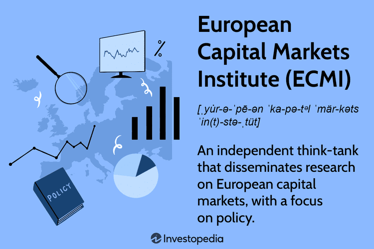

## Table of Contents

## What is the European Capital Markets Institute (ECMI)?

The European Capital Markets Institute (ECMI) is an organization that focuses on understanding and improving the financial markets in Europe. It was set up to study how these markets work, what challenges they face, and how they can be made better. ECMI does this by doing research, organizing events, and working with other groups that are interested in financial markets.

ECMI helps people who make decisions about financial markets, like policymakers and business leaders, by giving them useful information and ideas. It also tries to make sure that the financial markets in Europe work well together and can compete with markets in other parts of the world. By doing all of this, ECMI hopes to help make the European economy stronger and more stable.

## When was the European Capital Markets Institute founded?

The European Capital Markets Institute, or ECMI for short, was founded in 2004. This was a time when people were thinking a lot about how to make the financial markets in Europe work better.

ECMI was created to help with this by doing research and giving advice. They wanted to make sure that the financial markets in different European countries could work well together and help the whole European economy grow.

## What are the main objectives of the ECMI?

The European Capital Markets Institute, or ECMI, has some main goals that guide what they do. One big goal is to learn more about how financial markets in Europe work. They want to find out what problems these markets have and think of ways to fix them. To do this, ECMI does a lot of research and talks to people who know a lot about finance.

Another important goal for ECMI is to help make the financial markets in Europe work better together. They want these markets to be strong and able to compete with markets in other parts of the world. ECMI shares what they learn with people who make decisions about financial markets, like government leaders and business people. This way, they can help make the European economy stronger and more stable.

## Who are the key stakeholders or members of the ECMI?

The European Capital Markets Institute, or ECMI, has many important people and groups that it works with. These are called stakeholders. They include people who make decisions about financial markets, like government leaders and people who work at central banks. ECMI also works with business leaders and people who run big companies. These stakeholders help ECMI understand what is happening in the financial markets and what needs to be done to make them better.

Another group of stakeholders are academics and researchers. These are people who study financial markets and come up with new ideas. They help ECMI do its research and find ways to improve the markets. Finally, ECMI works with other organizations that are interested in financial markets. These can be groups from other countries or international organizations. All these stakeholders help ECMI reach its goals and make the financial markets in Europe stronger.

## What kind of research does the ECMI conduct?

The European Capital Markets Institute, or ECMI, conducts research to learn more about financial markets in Europe. They look at how these markets work, what problems they have, and how they can be made better. ECMI studies things like how money moves around in Europe, how companies get money to grow, and how different financial markets are connected. They also look at rules and laws that affect financial markets and see if these rules help or hurt the markets.

ECMI shares what they learn with people who make decisions about financial markets. This includes government leaders, people who work at central banks, and business leaders. By doing this research, ECMI helps these people understand the financial markets better and make good choices. The research also helps make the financial markets in Europe work better together and be stronger, which is good for the whole European economy.

## How does the ECMI influence European capital market policies?

The European Capital Markets Institute, or ECMI, influences European capital market policies by doing research and sharing what they learn. They study how financial markets work, what problems they have, and how they can be made better. ECMI then gives this information to people who make decisions about financial markets, like government leaders and central bankers. By doing this, ECMI helps these people understand the markets better and make good choices.

ECMI also talks to these decision-makers and gives them advice on what rules and laws should be changed to help the markets. They might suggest new rules that can make the markets work better together or help companies get the money they need to grow. By working with these leaders, ECMI helps make the financial markets in Europe stronger and more stable. This is good for the whole European economy because it helps money move around more easily and helps businesses do well.

## What are some notable publications or reports released by the ECMI?

The European Capital Markets Institute, or ECMI, has released many important reports and publications. One notable report is the "ECMI Annual Report on European Financial Integration," which looks at how well the financial markets in Europe are working together. This report helps people understand if the markets are getting better or if there are still problems that need to be fixed. It's useful for people who make decisions about financial markets because it gives them a clear picture of what is happening.

Another important publication is the "ECMI Commentary" series. These are short papers that talk about new ideas and problems in the financial markets. They are written by experts and help people understand what is going on in the markets right now. The commentaries are useful because they give quick and clear information that can help decision-makers make good choices. By sharing these reports and publications, ECMI helps make the financial markets in Europe stronger and better.

## How does the ECMI collaborate with other European institutions?

The European Capital Markets Institute, or ECMI, works closely with other European institutions to make the financial markets better. They often work with groups like the European Central Bank and the European Commission. These groups help make rules and decisions about financial markets. ECMI shares their research and ideas with these institutions. This helps the groups understand what is happening in the markets and what they can do to make things better. By working together, they can make sure that the financial markets in Europe work well and help the economy grow.

ECMI also works with other research groups and universities in Europe. They do this to learn more about financial markets and to share what they know. For example, they might work with a university to study how companies get money to grow. Or they might work with another research group to look at new rules and see if they help or hurt the markets. This kind of teamwork helps ECMI do better research and come up with good ideas that can help the financial markets in Europe.

## What role does the ECMI play in financial education and awareness?

The European Capital Markets Institute, or ECMI, helps people learn more about financial markets by sharing what they know. They do this by writing reports and papers that explain how financial markets work and what problems they have. These reports are easy to understand and help people who make decisions about financial markets, like government leaders and business people, learn more. By making this information available, ECMI helps everyone understand the financial markets better, which can lead to better decisions and policies.

ECMI also organizes events like conferences and workshops where people can come together to talk about financial markets. These events are great for learning because people can ask questions and share ideas. They bring together experts, policymakers, and business leaders from all over Europe. By doing this, ECMI helps spread knowledge and awareness about financial markets, which is important for making them work well and helping the economy grow.

## Can you explain some of the major projects undertaken by the ECMI?

One big project that the European Capital Markets Institute, or ECMI, has worked on is the "ECMI Annual Report on European Financial Integration." This report looks at how well the financial markets in Europe are working together. It helps people understand if things are getting better or if there are still problems that need to be fixed. The report is useful for people who make decisions about financial markets because it gives them a clear picture of what's happening. By doing this project, ECMI helps make the financial markets in Europe stronger and better.

Another important project is the "ECMI Commentary" series. These are short papers that talk about new ideas and problems in the financial markets. They are written by experts and help people understand what is going on in the markets right now. The commentaries are useful because they give quick and clear information that can help decision-makers make good choices. By sharing these papers, ECMI helps spread knowledge and awareness about financial markets, which is important for making them work well and helping the economy grow.

## What are the future goals and strategic directions of the ECMI?

The European Capital Markets Institute, or ECMI, wants to keep helping the financial markets in Europe work better. They plan to do this by doing more research and sharing what they learn. ECMI will look at new problems and ideas in the financial markets and see how they can make things better. They will also keep talking to people who make decisions about financial markets, like government leaders and business people, to help them understand the markets and make good choices.

Another big goal for ECMI is to help make the financial markets in Europe work well together. They want these markets to be strong and able to compete with markets in other parts of the world. To do this, ECMI will keep working with other groups and organizations that are interested in financial markets. By doing all of this, ECMI hopes to help make the European economy stronger and more stable.

## How can one access resources and data provided by the ECMI?

You can find resources and data from the European Capital Markets Institute, or ECMI, on their website. They have a lot of reports and papers that you can read for free. These reports talk about how financial markets work and what problems they have. If you go to the ECMI website, you can search for the reports you need. They also have a section where you can see all their latest research and publications.

ECMI also shares their resources at events like conferences and workshops. If you go to one of these events, you can learn more about financial markets and ask questions. Sometimes, they share special reports or data at these events that you can't find on their website. To stay updated on their events, you can sign up for their newsletter or follow them on social media. This way, you can keep learning about financial markets and get the latest information from ECMI.

## References & Further Reading

[1]: Crespo Cuaresma, J., & Wörz, J. (2005). ["On Export Composition and Growth."](https://www.jstor.org/stable/40441033) The World Economy.

[2]: de Prado, M. L. (2018). ["Advances in Financial Machine Learning."](https://www.amazon.com/Advances-Financial-Machine-Learning-Marcos/dp/1119482089) John Wiley & Sons.

[3]: Gomber, P., Arndt, B., Lutat, M., & Uhle, T. (2011). ["High-Frequency Trading."](https://papers.ssrn.com/sol3/papers.cfm?abstract_id=1858626) SSRN Electronic Journal.

[4]: O’Neill, M. H., & Herbrich, R. (2008). ["Machine Learning and Applications in Finance."](https://herbrich.me/learning-kernel-classifiers/) In Teh, Y. W., & Titterington, M. (Eds.), Proceedings of the Eleventh International Workshop on Artificial Intelligence and Statistics.

[5]: Rosenblatt, M. (2019). ["The Impact of the Algorithmic Trading on Stock Market Behavior."](https://www.semanticscholar.org/paper/Analyzing-the-impact-of-algorithmic-trading-on-A-Damilare-Oyeniyi/cfaa220cded37f824aa2bf5b97f26c9b2aa6cb95) Joseph Wharton Scholars. 

[6]: Chan, E. P. (2008). ["Quantitative Trading: How to Build Your Own Algorithmic Trading Business."](https://github.com/ftvision/quant_trading_echan_book) John Wiley & Sons.