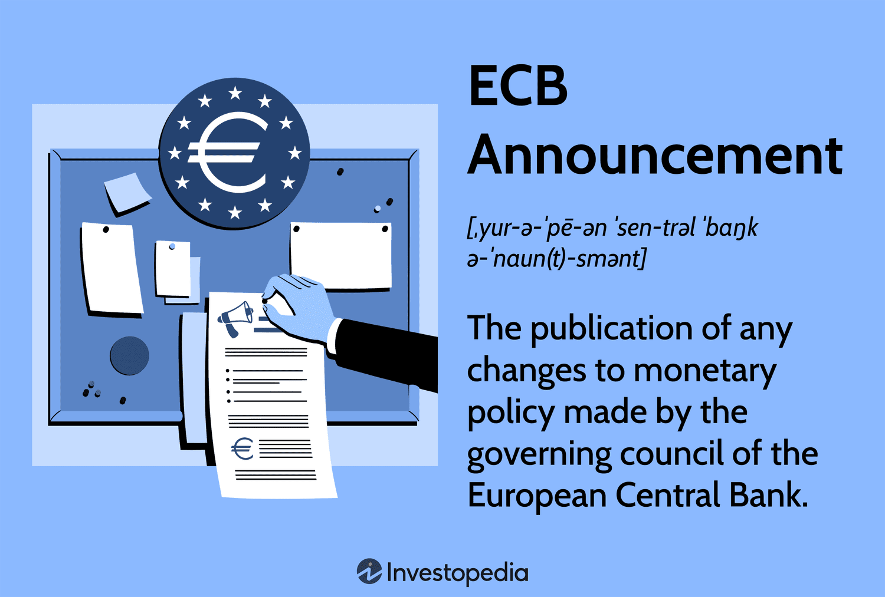

## Table of Contents

## What is the European Central Bank (ECB)?

The European Central Bank (ECB) is a bank that looks after the money in Europe. It is in charge of the euro, which is the money used by 20 countries in Europe. The ECB makes sure that the euro stays strong and that prices in these countries do not go up too fast. It does this by setting interest rates, which are like the cost of borrowing money. If the ECB thinks prices are going up too fast, it might make borrowing more expensive to slow things down.

The ECB also helps keep the banks in Europe safe and working well. It checks on banks to make sure they are strong and can handle problems. If a bank is in trouble, the ECB can help fix it. The ECB works with other banks in Europe to make sure the whole money system stays stable. It's like a big team working together to keep the money in Europe safe and reliable for everyone.

## What types of announcements does the ECB typically make?

The European Central Bank (ECB) often makes announcements about interest rates. These announcements tell people if the cost of borrowing money will go up or down. If the ECB decides to change the interest rate, it might say why they made that choice. They might talk about things like inflation, which is when prices go up, or how the economy is doing. People pay close attention to these announcements because they can affect things like loans, savings, and the prices of things we buy.

The ECB also makes announcements about its policies and programs. Sometimes, they start new programs to help the economy, like buying bonds or giving loans to banks. These announcements explain what the new program is and why the ECB thinks it's needed. The ECB might also share reports about how the economy is doing in Europe. These reports can talk about things like how many people have jobs, how much money people are spending, and how fast prices are going up. These kinds of announcements help everyone understand what's happening with the economy and what the ECB plans to do about it.

## How often does the ECB make announcements?

The ECB makes announcements about interest rates every six weeks. These meetings happen on set dates, and they tell people if the interest rates will change or stay the same. These announcements are important because they can affect how much it costs to borrow money and how much people can earn on their savings.

The ECB also releases reports and other information regularly. They put out a monthly bulletin that talks about the economy and what they are doing. Sometimes, they make special announcements about new policies or programs they are starting. These can happen whenever they need to, but the ECB always tries to keep everyone informed about what's going on with the economy and their plans.

## What are the key interest rates set by the ECB?

The European Central Bank (ECB) sets several key interest rates that affect the economy. The main one is the main refinancing operations rate, which is the [interest rate](/wiki/interest-rate-trading-strategies) banks pay when they borrow money from the ECB for a short time. This rate is important because it influences the rates banks charge each other and, eventually, the rates people pay for loans and get on savings.

Another key rate is the deposit facility rate, which is what banks earn when they leave money with the ECB overnight. If this rate is low or even negative, it encourages banks to lend money instead of keeping it at the ECB. The third important rate is the marginal lending facility rate, which is what banks pay if they need to borrow money from the ECB for a very short time, like overnight. This rate is usually higher than the main refinancing rate and acts as a safety net for banks.

These rates work together to help the ECB control inflation and keep the economy stable. By changing these rates, the ECB can make borrowing money more or less expensive, which affects how much people spend and how fast prices go up.

## How do ECB announcements affect the euro?

When the ECB makes announcements, they can affect the value of the euro. If the ECB says it will raise interest rates, the euro might go up in value. That's because higher interest rates can make the euro more attractive to people who want to save money or invest. They might move their money to Europe to get the higher interest, which makes demand for the euro go up. On the other hand, if the ECB says it will lower interest rates, the euro might go down in value. Lower interest rates can make the euro less attractive, so people might move their money elsewhere, causing the value of the euro to drop.

The ECB's announcements can also change what people think about the euro's future. If the ECB talks about good things happening in the economy, like more jobs or less inflation, people might feel more confident about the euro. This can make the euro go up in value because people want to hold onto it. But if the ECB talks about problems, like a slowing economy or high inflation, people might worry about the euro's future. This can make the euro go down in value because people might want to sell it and buy other currencies instead.

## What is the ECB's role in monetary policy?

The European Central Bank (ECB) is in charge of the money used in 20 countries in Europe, called the euro. Its main job in monetary policy is to control inflation, which is when prices go up. The ECB does this by setting interest rates. When it thinks prices are going up too fast, it might raise interest rates to make borrowing money more expensive. This can slow down spending and help keep prices from rising too quickly. If the economy is slow and prices are not going up enough, the ECB might lower interest rates to make borrowing cheaper, encouraging people to spend more and help the economy grow.

The ECB also uses other tools to manage the economy. It can buy and sell bonds, which are like IOUs from governments or companies. By buying bonds, the ECB can put more money into the economy, which can help when things are slow. Selling bonds can take money out of the economy, which can help when prices are going up too fast. The ECB works with other banks in Europe to make sure these policies work well. By carefully using these tools, the ECB tries to keep the economy stable and the euro strong, so people can trust the money they use every day.

## What are the main tools used by the ECB to implement monetary policy?

The ECB uses interest rates as one of its main tools to manage the economy. It sets the main refinancing operations rate, which is the interest rate banks pay when they borrow money from the ECB for a short time. By changing this rate, the ECB can make borrowing more or less expensive. If the ECB thinks prices are going up too fast, it might raise this rate to slow down spending. If the economy is slow and prices are not going up enough, the ECB might lower the rate to encourage people to borrow and spend more.

Another important tool the ECB uses is buying and selling bonds. When the ECB buys bonds, it puts more money into the economy, which can help when things are slow. This is called quantitative easing. When the ECB sells bonds, it takes money out of the economy, which can help when prices are going up too fast. The ECB also sets the deposit facility rate, which is what banks earn when they leave money with the ECB overnight, and the marginal lending facility rate, which is what banks pay if they need to borrow money from the ECB for a very short time. These rates help the ECB control how much money is moving around in the economy and keep things stable.

## How does the ECB communicate its policy decisions?

The ECB communicates its policy decisions mainly through press conferences and official statements. After the ECB's Governing Council meets every six weeks, they hold a press conference to explain what they decided about interest rates and other policies. The President of the ECB talks about why they made those choices and what they think will happen next. They also release an official statement that summarizes the decisions and gives more details about what the ECB is doing.

The ECB also uses reports and publications to share information about the economy and its policies. They publish a monthly bulletin that talks about what's happening in the economy and what the ECB is doing to manage it. Sometimes, the ECB releases special reports or studies that give more in-depth information about certain topics. By using these different ways to communicate, the ECB makes sure that everyone, from other banks to regular people, can understand what's going on with the economy and the euro.

## What economic indicators does the ECB consider before making an announcement?

The ECB looks at many things before making announcements about the economy. One big thing they check is inflation, which is when prices go up. They want to keep inflation close to 2% because that's good for the economy. If prices are going up too fast, the ECB might decide to raise interest rates to slow things down. They also look at how fast the economy is growing. If it's growing too slowly, they might lower interest rates to help it grow faster.

Another thing the ECB watches is unemployment, which is how many people are out of work. If too many people are out of work, the ECB might try to help the economy grow so more people can get jobs. They also pay attention to what's happening in other countries because what happens there can affect Europe too. For example, if other countries are doing well, it might help Europe's economy. The ECB uses all this information to decide what to do with interest rates and other policies to keep the economy stable.

## How do financial markets react to ECB announcements?

When the ECB makes an announcement, financial markets often react quickly. If the ECB says it will raise interest rates, the euro might go up in value. This is because higher interest rates can make the euro more attractive to people who want to save or invest. They might move their money to Europe to get the higher interest, which makes demand for the euro go up. On the other hand, if the ECB says it will lower interest rates, the euro might go down in value. Lower interest rates can make the euro less attractive, so people might move their money to other places, causing the euro to drop.

The stock market can also be affected by ECB announcements. If the ECB raises interest rates, borrowing money becomes more expensive, which can slow down the economy. This might make stock prices go down because companies might not make as much money. But if the ECB lowers interest rates, borrowing becomes cheaper, which can help the economy grow. This might make stock prices go up because companies could do better. Overall, financial markets pay close attention to what the ECB says because these announcements can change how people think about the euro and the economy.

## What is the significance of forward guidance in ECB announcements?

Forward guidance is when the ECB tells people what it might do in the future. This is important because it helps everyone understand what the ECB is thinking and planning. When the ECB gives forward guidance, it can make things more predictable. People and businesses can plan better because they know what to expect. For example, if the ECB says it might keep interest rates low for a long time, people might decide to borrow money now because it will be cheaper.

The ECB uses forward guidance to help guide the economy. If the ECB says it might raise interest rates soon, it can slow down spending because people might want to wait before borrowing. But if the ECB says it will keep rates low, it can encourage spending because borrowing will stay cheap. By giving forward guidance, the ECB can influence what people do with their money and help keep the economy stable.

## How do ECB announcements influence inflation and economic growth in the Eurozone?

When the ECB makes announcements, it can affect how fast prices go up, which is called inflation. If the ECB says it will raise interest rates, borrowing money becomes more expensive. This can make people and businesses spend less, which slows down the economy and helps keep prices from going up too fast. On the other hand, if the ECB says it will lower interest rates, borrowing money becomes cheaper. This can encourage people and businesses to spend more, which can make the economy grow faster but might also make prices go up more quickly.

The ECB also uses its announcements to guide the economy's growth. If the ECB thinks the economy is growing too slowly, it might say it will keep interest rates low for a long time. This can make people feel more confident about borrowing and spending, which helps the economy grow. But if the economy is growing too fast and prices are going up too much, the ECB might say it will raise interest rates soon. This can slow down the economy and help keep prices stable. By carefully choosing what to say in its announcements, the ECB tries to keep the economy balanced and growing at a healthy pace.

## References & Further Reading

[1]: Bernanke, B. S., & Blinder, A. S. (1992). ["The Federal Funds Rate and the Channels of Monetary Transmission."](https://www.nber.org/papers/w3487) The American Economic Review, 82(4), 901-921.

[2]: ["The European Central Bank: Credibility, Transparency, and Independence"](https://books.google.com/books/about/The_European_Central_Bank.html?id=ltd0w5grA-cC) by Otmar Issing

[3]: Aldridge, I. (2013). ["High-Frequency Trading: A Practical Guide to Algorithmic Strategies and Trading Systems."](https://www.amazon.com/High-Frequency-Trading-Practical-Algorithmic-Strategies/dp/1118343506) Wiley Finance.

[4]: Treleaven, P., Galas, M., & Vidhi, G. (2013). ["Algorithmic Trading Review."](https://dl.acm.org/doi/10.1145/2500117) Philosophical Transactions of the Royal Society A: Mathematical, Physical and Engineering Sciences, 371(1982).

[5]: Chaboud, A. P., Chiquoine, B., Hjalmarsson, E., & Vega, C. (2014). ["Rise of the Machines: Algorithmic Trading in the Foreign Exchange Market."](https://www.jstor.org/stable/43612951) The Journal of Finance, 69(5), 2045-2084.