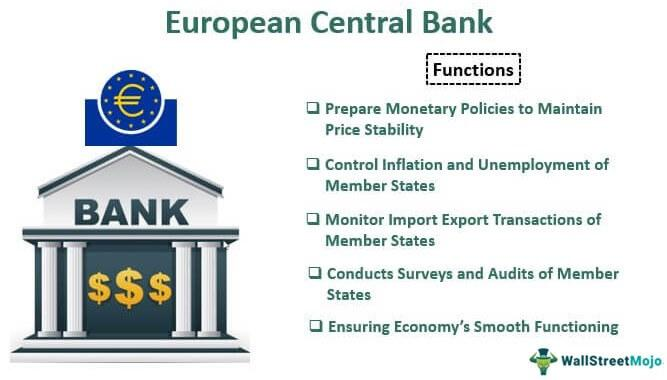

## Table of Contents

## What is the European Central Bank (ECB)?

The European Central Bank (ECB) is a bank that looks after the money used by countries in the European Union that use the euro. It started in 1998 and its main job is to make sure the euro stays strong and prices don't go up too fast. The ECB is in Frankfurt, Germany, and it works with other banks in the euro area to make sure everything runs smoothly.

The ECB does things like setting interest rates, which is how much it costs to borrow money. If the ECB thinks prices are going up too fast, it might make borrowing more expensive to slow things down. It also keeps an eye on banks to make sure they are safe and can handle their money well. By doing these things, the ECB helps keep the economy of the euro area stable.

## When was the ECB established?

The European Central Bank (ECB) was established on June 1, 1998. This was an important step for countries in the European Union that use the euro as their money.

The ECB's main job is to make sure the euro stays strong and prices don't go up too fast. It does this by setting interest rates and working with other banks in the euro area. The ECB is based in Frankfurt, Germany.

## Where is the ECB headquartered?

The European Central Bank (ECB) is headquartered in Frankfurt, Germany. Frankfurt was chosen as the location because it is a major financial center in Europe.

The ECB started working on June 1, 1998. Its main job is to take care of the euro, which is the money used by many countries in the European Union. The ECB makes sure the euro stays strong and that prices don't go up too fast.

## What are the main objectives of the ECB?

The main goal of the European Central Bank (ECB) is to keep prices stable in the countries that use the euro. This means the ECB works hard to make sure that the prices of things like food, clothes, and other goods don't go up too fast. They do this by controlling something called the inflation rate, which is how fast prices are rising. If inflation gets too high, the ECB might make it more expensive to borrow money by raising interest rates. This can help slow down spending and keep prices from going up too quickly.

Another important job of the ECB is to help keep the economy of the euro area stable. The ECB does this by working with other banks in the euro area to make sure they are safe and can handle their money well. They also keep an eye on the overall health of the economy and can take actions to help if things start to go wrong. By doing these things, the ECB helps make sure that businesses can grow, people can find jobs, and the euro stays a strong and reliable currency.

## Who are the members of the ECB's Governing Council?

The Governing Council of the European Central Bank (ECB) is made up of two groups of people. The first group is the six members of the ECB's Executive Board. These members are chosen to run the day-to-day operations of the ECB and make important decisions about the euro area's money policies. The second group includes the governors of the national central banks from the countries that use the euro. Each of these countries has one governor on the Governing Council.

The members of the Executive Board are appointed for a term of eight years and cannot be reappointed. They work together to set the direction for the ECB and make sure its goals are met. The governors of the national central banks, on the other hand, are usually appointed by their own countries and serve as long as they are in their positions as governors. Together, these members meet regularly to discuss and decide on things like interest rates and other policies that affect the euro area's economy.

## How does the ECB's decision-making process work?

The European Central Bank's (ECB) decision-making process involves the Governing Council, which is made up of the six members of the Executive Board and the governors of the national central banks from the countries that use the euro. They meet regularly, usually once a month, to discuss and decide on important things like interest rates and other policies that affect the euro area's economy. Each member of the Governing Council has one vote, and decisions are made by a simple majority. This means that if more than half of the members agree on something, it becomes the ECB's decision.

The meetings of the Governing Council are very important because they help keep the euro area's economy stable. Before the meetings, the members get a lot of information about how the economy is doing. They look at things like inflation rates, unemployment, and how much people are spending. During the meetings, they talk about this information and decide what actions the ECB should take. After the meetings, the ECB tells the public about its decisions and explains why they were made. This helps everyone understand what the ECB is doing and why it's important for the economy.

## What is the role of the ECB in the European System of Central Banks (ESCB)?

The European Central Bank (ECB) is a key part of the European System of Central Banks (ESCB). The ESCB includes the ECB and the national central banks of all the countries in the European Union, even those that don't use the euro. The ECB's main job in the ESCB is to make sure that the money in the euro area stays stable. It does this by setting interest rates and making other decisions about money policies that affect all the countries using the euro.

The ECB also works with the national central banks to make sure the whole system runs smoothly. This means keeping an eye on how banks are doing and making sure they are safe and can handle their money well. By working together, the ECB and the national central banks help keep the economy of the euro area stable and make sure the euro remains a strong and reliable currency.

## How does the ECB manage monetary policy within the Eurozone?

The European Central Bank (ECB) manages monetary policy in the Eurozone by setting interest rates and using other tools to keep the economy stable. The main goal is to control inflation, which means making sure prices don't go up too fast. The ECB does this by deciding how much it costs for banks to borrow money from them. If the ECB thinks prices are rising too quickly, it might raise interest rates to make borrowing more expensive. This can slow down spending and help keep inflation in check. On the other hand, if the economy is slowing down too much, the ECB might lower interest rates to make borrowing cheaper and encourage more spending.

The ECB also uses other methods to manage the money supply in the Eurozone. One way is through open market operations, where the ECB buys or sells bonds to control how much money is in the economy. If the ECB wants to increase the money supply, it might buy bonds, which puts more money into circulation. If it wants to decrease the money supply, it might sell bonds, which takes money out of circulation. The ECB works closely with the national central banks in the Eurozone to make sure these policies are effective. By doing all these things, the ECB helps keep the economy stable and the euro strong.

## What tools does the ECB use to control inflation?

The European Central Bank (ECB) uses different tools to control inflation, which is when prices go up too fast. One of the main tools is setting interest rates. If the ECB thinks prices are rising too quickly, it might raise interest rates. This makes it more expensive for banks to borrow money from the ECB, which can slow down spending and help keep prices from going up too fast. On the other hand, if the economy is slowing down and prices aren't going up enough, the ECB might lower interest rates to make borrowing cheaper and encourage more spending.

Another tool the ECB uses is called open market operations. This is when the ECB buys or sells bonds to control how much money is in the economy. If the ECB wants to put more money into the economy, it might buy bonds. This gives banks more money to lend, which can help the economy grow and keep prices stable. If the ECB wants to take money out of the economy, it might sell bonds. This takes money away from banks, which can slow down the economy and help control inflation. By using these tools, the ECB tries to keep inflation at a level that's good for the economy.

## How does the ECB contribute to financial stability in the Euro area?

The European Central Bank (ECB) helps keep the money system stable in the Euro area by watching over banks and making sure they are safe. It does this by checking that banks have enough money to handle their business and by setting rules that banks must follow. If a bank is not doing well, the ECB can step in to help fix the problem before it gets worse. This way, the ECB makes sure that people's money in banks stays safe and that the whole banking system works smoothly.

The ECB also uses its power over interest rates to help keep the economy stable. If the economy is growing too fast and prices are going up too quickly, the ECB might raise interest rates to slow things down. On the other hand, if the economy is not doing well, the ECB might lower interest rates to help it grow. By doing this, the ECB tries to keep the economy balanced so that people can find jobs and businesses can grow. This helps make sure that the Euro stays a strong and reliable currency.

## What is the relationship between the ECB and the European Union's economic policies?

The European Central Bank (ECB) works closely with the European Union (EU) to help make sure the economy in the countries that use the euro stays strong and stable. The ECB's main job is to control inflation, which means keeping prices from going up too fast. It does this by setting interest rates and using other tools to manage the money supply. These actions are important because they help keep the euro strong and make sure that the economy doesn't grow too fast or too slow. The ECB's policies are part of the bigger picture of the EU's economic goals, which include creating jobs, helping businesses grow, and making sure all the countries in the EU can work together well.

The ECB also plays a big role in making sure the banks in the Euro area are safe and sound. It does this by watching over the banks and making sure they follow certain rules. If a bank is having trouble, the ECB can step in to help fix the problem. This is important because it helps keep people's money safe and makes sure the whole banking system works well. The ECB's work in this area supports the EU's aim to have a stable and reliable financial system across all its member countries. By working together, the ECB and the EU help make sure the economy stays on track and that everyone in the Euro area can benefit from a strong and stable economy.

## How does the ECB coordinate with other global central banks?

The European Central Bank (ECB) works with other big central banks around the world to make sure the global economy stays stable. They talk to each other a lot, sharing information about what's happening in their own countries and what they plan to do about it. This helps them understand how their actions might affect other countries. For example, if the ECB decides to change interest rates, it might talk to the U.S. Federal Reserve or the Bank of Japan to see how this might affect their economies.

Sometimes, the ECB and other central banks work together on special projects. They might agree to do things like swap currencies to help keep the global money system running smoothly. This can be really important during times when the world economy is having problems. By working together, the ECB and other central banks can help make sure that money can move easily between countries and that the global economy stays strong and stable.

## References & Further Reading

[1]: European Central Bank Official Website: Access comprehensive information on ECB's policies, structure, and publications [here](https://www.ecb.europa.eu/home/html/index.cb.html).

[2]: ECB Publications: Detailed reports and documentation from the ECB, including the Annual Report and Economic Bulletin, are available on their [publications webpage](https://www.ecb.europa.eu/press/annual-reports-financial-statements/annual/html/index.en.html).

[3]: Investopedia - European Central Bank (ECB): An overview of the European Central Bank, detailing its role and functions in the eurozone, can be found on Investopedia [here](https://www.investopedia.com/terms/e/europeancentralbank.asp).

[4]: ECB's Monetary Policy & Inflation Target: Explore ECB's approach to maintaining price stability through its [monetary policy webpage](https://www.ecb.europa.eu/press/economic-bulletin/articles/2021/html/ecb.ebart202105_01~d813529721.en.html).

[5]: Single Supervisory Mechanism (SSM): Information about the ECB's banking supervision responsibilities can be accessed through the ECB's [Banking Supervision webpage](https://www.bankingsupervision.europa.eu/about/thessm/html/index.en.html).

[6]: MiFID II Regulations: For insights into regulatory frameworks impacting algorithmic trading, see the European Securities and Markets Authority's page on [MiFID II](https://www.investopedia.com/terms/m/mifid-ii.asp).

[7]: Algorithmic Trading Overview: For a foundational understanding of algorithmic trading and its implications, refer to Investopedia's detailed article [here](https://www.semanticscholar.org/paper/ALGORITHMIC-TRADING%3A-A-COMPREHENSIVE-REVIEW-OF-AND-Garg/94ead853e1835e7caae78d080e8b0e2f5f504607).