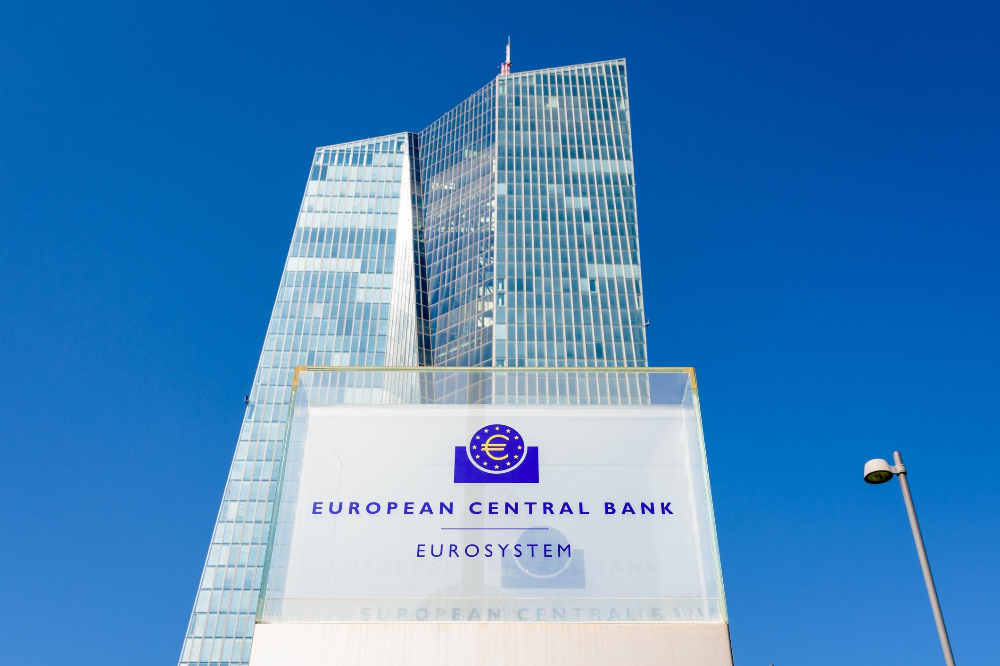

## Table of Contents

## What is the European Central Bank (ECB)?

The European Central Bank (ECB) is a bank that works for the countries in the European Union that use the euro as their money. It started in 1998 and its main job is to keep prices stable, which means making sure that things don't get too expensive too quickly. The ECB does this by controlling how much money is in the economy and setting interest rates, which is the cost of borrowing money.

The ECB is located in Frankfurt, Germany, and it works with the central banks of the countries that use the euro. Together, they are called the Eurosystem. The ECB makes decisions that affect all these countries, like how much interest banks have to pay when they borrow money from the ECB. This helps keep the economy of the whole area stable and makes sure that the euro stays a strong currency.

## When was the European Central Bank established?

The European Central Bank (ECB) was established on June 1, 1998. This was an important step for the countries in the European Union that use the euro as their money. The ECB's main goal is to keep prices stable, which means making sure that things don't get too expensive too quickly.

The ECB is located in Frankfurt, Germany. It works with the central banks of the countries that use the euro, and together they are called the Eurosystem. The ECB makes decisions that affect all these countries, like setting interest rates, which is the cost of borrowing money. This helps keep the economy of the whole area stable and makes sure that the euro stays a strong currency.

## Where is the headquarters of the ECB located?

The headquarters of the European Central Bank (ECB) is located in Frankfurt, Germany. Frankfurt was chosen because it is a big city for finance and banking in Europe.

The ECB's building in Frankfurt is very modern and was designed to be energy-efficient. It's an important place because the ECB makes decisions that affect the money and economy of the countries that use the euro.

## What are the main objectives of the ECB?

The main goal of the European Central Bank (ECB) is to keep prices stable. This means they want to make sure that things don't get too expensive too quickly. They do this by controlling how much money is in the economy and by setting interest rates, which is the cost of borrowing money. When the ECB keeps prices stable, it helps people and businesses plan for the future because they know that the value of money will stay about the same.

Another important objective of the ECB is to support the overall economic policies of the European Union. This means working together with the governments of the countries that use the euro to make sure the economy stays healthy. The ECB does not directly control things like taxes or spending, but it can influence the economy by making decisions about interest rates and other financial tools. By doing this, the ECB helps to create jobs and keep the economy growing in a steady way.

## How does the ECB manage inflation?

The European Central Bank (ECB) manages inflation by controlling the amount of money in the economy and setting interest rates. When there is too much money, prices can go up too fast, which is called inflation. To stop this, the ECB can raise interest rates. This makes borrowing money more expensive, so people and businesses borrow less and spend less. When people spend less, prices don't go up as quickly, which helps keep inflation under control.

The ECB also uses other tools to manage inflation. For example, they can buy or sell government bonds, which are like loans to the government. When the ECB buys bonds, it puts more money into the economy, which can help if inflation is too low. If inflation is too high, the ECB can sell bonds to take money out of the economy. By using these tools, the ECB tries to keep inflation at a level that is good for the economy, which they aim to be close to, but below, 2% per year.

## What role does the ECB play in the Eurozone?

The European Central Bank (ECB) is very important for the countries in the Eurozone, which are the countries that use the euro as their money. The main job of the ECB is to make sure that prices don't go up too fast, which is called keeping inflation under control. They do this by deciding how much money should be in the economy and by setting interest rates, which is the cost of borrowing money. When the ECB keeps prices stable, it helps people and businesses know what to expect with money, making it easier for them to plan for the future.

The ECB also helps the economy of the Eurozone by working with the governments of the countries that use the euro. While the ECB doesn't control things like taxes or spending, it can affect the economy by changing interest rates and using other financial tools. For example, the ECB can buy or sell government bonds to add or take away money from the economy. This helps create jobs and keep the economy growing in a steady way. By doing these things, the ECB plays a big role in making sure the Eurozone's economy stays strong and stable.

## How is the ECB governed and who are its key decision-makers?

The European Central Bank (ECB) is governed by several important groups. The main group is called the Governing Council, which makes the big decisions about things like interest rates and how to keep prices stable. The Governing Council is made up of the members of the Executive Board and the governors of the national central banks from the countries that use the euro. The Executive Board is a smaller group that runs the day-to-day work of the ECB. It has six members, including the President and the Vice-President, who are chosen for eight-year terms and cannot be reappointed.

The President of the ECB is the most visible leader and often speaks to the public about the ECB's decisions. The President also represents the ECB at international meetings. The Vice-President helps the President and takes over if the President cannot do the job. The other four members of the Executive Board each have specific jobs within the ECB, like overseeing different parts of the bank's operations. All these people work together to make sure the ECB does its job well and keeps the Eurozone's economy stable.

## What are the main tools used by the ECB to implement monetary policy?

The European Central Bank (ECB) uses different tools to control the amount of money in the economy and to set interest rates. One of the main tools is setting the interest rates that banks have to pay when they borrow money from the ECB. By raising or lowering these rates, the ECB can make it more or less expensive for banks to borrow money. When banks borrow less, they lend less to people and businesses, which can slow down the economy and help keep prices from going up too fast. On the other hand, if the ECB lowers interest rates, it makes borrowing cheaper, which can help the economy grow.

Another important tool the ECB uses is buying and selling government bonds. When the ECB buys bonds, it puts more money into the economy, which can help if prices are not going up enough. If prices are going up too fast, the ECB can sell bonds to take money out of the economy. This helps keep inflation under control. The ECB also uses something called reserve requirements, which means telling banks how much money they need to keep in reserve and not lend out. By changing these requirements, the ECB can control how much money banks can lend, which affects the overall amount of money in the economy.

## How does the ECB interact with national central banks within the Eurosystem?

The European Central Bank (ECB) works closely with the national central banks of the countries that use the euro. Together, they form the Eurosystem. The ECB makes the big decisions about things like interest rates and how much money should be in the economy. The national central banks then [carry](/wiki/carry-trading) out these decisions in their own countries. They help make sure that the ECB's policies work well everywhere in the Eurozone. This teamwork is important because it helps keep the economy stable and makes sure that the euro stays a strong currency.

The ECB also shares information and resources with the national central banks. For example, the ECB might give them money to lend to banks in their countries or help them if they have financial problems. The national central banks also send information back to the ECB about what is happening in their economies. This helps the ECB make better decisions. By working together, the ECB and the national central banks make sure that the whole Eurozone benefits from stable prices and a healthy economy.

## What is the significance of the ECB's bank supervision role?

The European Central Bank (ECB) plays an important role in supervising banks in the Eurozone. This means the ECB makes sure that banks are safe and follow the rules. They check that banks have enough money to cover their loans and are not taking too many risks. This is important because if banks fail, it can hurt the whole economy. By supervising banks, the ECB helps keep the financial system stable and protects people's savings.

The ECB's bank supervision started in 2014 as part of the Single Supervisory Mechanism (SSM). The SSM works with national supervisors to oversee the biggest and most important banks in the Eurozone. This helps make sure that all banks are treated fairly and follow the same rules, no matter which country they are in. By doing this, the ECB helps build trust in the banking system and makes the Eurozone's economy stronger and more stable.

## How has the ECB responded to economic crises such as the 2008 financial crisis and the COVID-19 pandemic?

During the 2008 financial crisis, the European Central Bank (ECB) took quick action to help the economy. They lowered interest rates to make it cheaper for banks to borrow money. This helped banks lend more to people and businesses, which kept the economy from getting worse. The ECB also started buying bonds to put more money into the economy and keep it going. These steps were important to stop the crisis from hurting the Eurozone too much.

When the COVID-19 pandemic hit in 2020, the ECB again stepped in to help. They launched a big program called the Pandemic Emergency Purchase Programme (PEPP) to buy even more bonds. This put a lot of money into the economy to help it stay strong during the crisis. The ECB also kept interest rates very low to make borrowing easier. By doing these things, the ECB helped keep businesses running and people working, even when the world was facing a very hard time.

## What are the current challenges and future outlook for the ECB in maintaining economic stability in the Eurozone?

The European Central Bank (ECB) faces many challenges in keeping the Eurozone's economy stable. One big challenge is dealing with different economic situations in different countries. Some countries might be doing well while others are struggling, and it's hard for the ECB to make decisions that help everyone. Another challenge is keeping inflation under control. If prices go up too fast, it can hurt people's savings and make it hard for businesses to plan. The ECB also has to watch out for global events, like trade wars or pandemics, that can affect the economy in big ways.

Looking ahead, the ECB will need to keep using its tools to manage the economy carefully. They will need to adjust interest rates and buy or sell bonds to keep prices stable and help the economy grow. The ECB will also need to work closely with the governments of the countries in the Eurozone to make sure their policies work well together. If they can do these things well, the ECB can help make the Eurozone's economy stronger and more stable in the future.

## References & Further Reading

[1]: Bergstra, J., Bardenet, R., Bengio, Y., & Kégl, B. (2011). ["Algorithms for Hyper-Parameter Optimization."](https://papers.nips.cc/paper/4443-algorithms-for-hyper-parameter-optimization) Advances in Neural Information Processing Systems 24.

[2]: ["Advances in Financial Machine Learning"](https://www.amazon.com/Advances-Financial-Machine-Learning-Marcos/dp/1119482089) by Marcos Lopez de Prado

[3]: ["Evidence-Based Technical Analysis: Applying the Scientific Method and Statistical Inference to Trading Signals"](https://www.amazon.com/Evidence-Based-Technical-Analysis-Scientific-Statistical/dp/0470008741) by David Aronson

[4]: ["Machine Learning for Algorithmic Trading"](https://github.com/PacktPublishing/Machine-Learning-for-Algorithmic-Trading-Second-Edition) by Stefan Jansen

[5]: ["Quantitative Trading: How to Build Your Own Algorithmic Trading Business"](https://books.google.com/books/about/Quantitative_Trading.html?id=j70yEAAAQBAJ) by Ernest P. Chan

[6]: Dobrzańska, B., & Zawadzki, B. (2016). ["Algorithmic Trading Costs Around Central Bank's Interest Rate Announcements."](https://www.cfainstitute.org/-/media/documents/article/pb/How_Algorithmic_Traders_Impact_Institutional_Trading_Costs.ashx) Journal of Risk Finance, 17(3), 353-375.

[7]: Altavilla, C., Carboni, G., & Motto, R. (2015). ["Asset Purchase Programmes and Financial Markets: Lessons from the Euro Area"](https://www.ijcb.org/journal/ijcb21q4a1.pdf) (Working Paper No. 1864). European Central Bank.

[8]: Smets, F., & Wouters, R. (2003). ["An Estimated Stochastic Dynamic General Equilibrium Model of the Euro Area."](https://www.ecb.europa.eu/pub/pdf/scpwps/ecbwp171.pdf) Journal of Economic Perspectives, 21(1), 112-164.