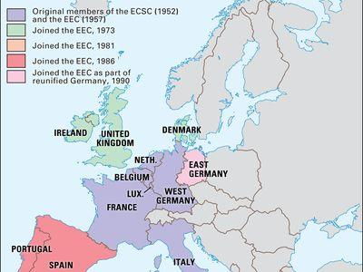

The European Community (EC) represented a major step in regional integration aimed at ensuring economic collaboration among its member states. Established under the Treaty of Rome in 1957, the EC laid the foundation for what eventually evolved into the European Union (EU). Initially comprising six countries—Belgium, France, Italy, Luxembourg, the Netherlands, and West Germany—the EC aimed to eliminate trade barriers, foster economic stability, and promote peace in post-World War II Europe.

Throughout its existence, the EC worked towards harmonizing various economic and social policies among its member states. This harmonization paved the way for standardized practices in sectors such as agriculture and trade, contributing to more stable and predictable markets. As the EC progressed, it focused on deepening economic ties, which would later be vital for the introduction of its most far-reaching policy: the creation of a common currency.



The transition from the European Community to the European Union, formalized by the Maastricht Treaty in 1993, marked a significant shift in European integration efforts, allowing for greater political and economic cohesion. The EU's expansion beyond the original EC member states transformed European political and economic landscapes, setting the stage for modern global trading practices.

One of the critical developments influenced by European integration is the advent of algorithmic trading. Enabled by unified markets and streamlined regulations within the EU, algorithmic trading represents a sophisticated method of executing financial trades, leveraging computer algorithms for operating at high speeds and frequencies. This trading evolution highlights the long-term impacts of EC policies and underscores the continued importance of its legacy in shaping contemporary economic practices.

## Table of Contents

## Origins and Establishment of the European Community

The European Community (EC) was formally established by the Treaty of Rome, signed on March 25, 1957. This pivotal treaty laid the groundwork for one of the most ambitious efforts at economic and political integration in Europe, following the devastation of World War II. The EC originated with six founding member states: Belgium, France, Italy, Luxembourg, the Netherlands, and West Germany. These nations aimed to foster economic cooperation and ensure lasting peace by tightly linking their economies and removing barriers to trade.

The primary objectives of the EC were multifaceted, focusing on eliminating trade barriers, promoting peaceful cooperation, and preventing the recurrence of large-scale conflict within Europe. The founders of the EC recognized the importance of economic integration as a means to secure political stability and enhance prosperity, thus addressing the root causes that historically led to conflict in the region.

The EC was structured around three distinct but interconnected organizations: 

1. **European Economic Community (EEC)**: The EEC was the cornerstone of the European Community, striving for the creation of a common market and a customs union among its member states. Its purpose was to ensure the free movement of goods, services, capital, and people, ultimately leading toward economic unification. The EEC played a crucial role in reducing tariffs and other barriers to intra-European trade, laying the foundation for a larger and more integrated economic area.

2. **European Coal and Steel Community (ECSC)**: Established in 1951, prior to the Treaty of Rome, the ECSC was aimed at regulating the coal and steel industries, which were vital for economic growth and military strength. By governing the production and distribution of coal and steel, the ECSC sought to ensure that these resources were no longer used as tools for waging war, thus contributing towards broader goals of peace and reconstruction in post-war Europe.

3. **European Atomic Energy Community (Euratom)**: Founded simultaneously with the EEC under the Treaty of Rome, Euratom focused on the peaceful use of nuclear energy. Its goals included promoting research, ensuring safety standards, and facilitating investment in the nuclear sector. By coordinating nuclear energy efforts, Euratom aimed to enhance energy security and support economic growth across member countries.

The establishment of the European Community marked a significant stride towards European integration, reflecting an innovative approach to diplomacy and cooperation among sovereign nations. This pioneering initiative set the stage for deeper economic and political unity that would eventually lead to the formation of the European Union, further reinforcing the idea of a united Europe.

## Key Institutions and Policies

The European Commission served as the executive branch of the European Community (EC), tasked with enforcing EU treaties and implementing decisions with autonomy from the individual member states. The Commission played a pivotal role in drafting legislation, ensuring compliance, and representing the interests of the Community on the international stage.

One of the most significant policies implemented by the EC was the Common Agricultural Policy (CAP). Established to stabilize markets, CAP aimed to ensure a reasonable income for farmers while providing consumers with food at fair prices. It employed mechanisms such as price supports, quotas, and subsidies to achieve these aims, fundamentally transforming the agricultural practices across Europe.

Economic integration within the EC was further propelled by the establishment of a customs union, which eliminated tariffs and quotas between member states. This initiative facilitated the free movement of goods, enhancing trade efficiency across national borders. The customs union laid the groundwork for the eventual introduction of a single currency, the Euro, which was introduced to streamline transactions and promote financial stability.

In addition to economic initiatives, the European Community focused on standardizing various sectors to create uniform policies across the member states. This involved developing common standards in areas such as agriculture, where uniform practices were promoted to improve productivity and sustainability, and trade, where standardization aimed to remove technical barriers.

These implementations underscored the EC's commitment to fostering economic cooperation and stable market conditions. The legacy of these institutions and policies continues to influence the modern economic landscape of the European Union, reflecting the foundational role of the EC in building a unified European market.

## Transition to the European Union

The Maastricht Treaty, officially known as the Treaty on European Union, was signed on February 7, 1992, and came into effect on November 1, 1993. This landmark treaty signified a pivotal transformation in the scope and nature of European political and economic integration. The treaty established the European Union (EU), effectively subsuming the European Community (EC) and integrating it as one of its three foundational pillars, alongside the Common Foreign and Security Policy (CFSP) and Justice and Home Affairs (JHA).

The transition into the EU marked a significant shift toward deeper economic and political cohesion among European nations. The Maastricht Treaty introduced the concept of European citizenship, which afforded citizens the right to live and work across EU member states without feeling constrained by national boundaries. It also laid the groundwork for the introduction of a single European currency—the Euro—which would facilitate smoother and more efficient trade and transactions across borders.

One of the most profound changes brought about by the formation of the EU was the expansion in the number of member states. The EU rapidly grew from its initial twelve members to encompass 27 countries as of 2023. This expansion influenced the political and economic landscape of Europe, compelling a re-evaluation of policies and strategies to accommodate a more diverse set of economies and cultures. New governance structures and decision-making processes had to be established or reformed to address the complexities of a larger union, ensuring that the policies remained effective and inclusive.

The political dynamics of Europe underwent significant changes as a consequence of the EU's growing membership. While historically powerful countries continued to exert substantial influence, smaller states found an amplified voice through the collective governance mechanisms of the EU. Additionally, the EU's enlargement facilitated greater economic collaboration and increased market potential, encouraging foreign investment and trade within the newly unified framework.

The Maastricht Treaty thus marked a new chapter in European history, as it shifted focus from merely economic cooperation under the European Community to a broader union intent on fostering extensive political, economic, and social integration. By enhancing the interconnectedness of its member states, the EU set the foundation for a more resilient and innovative European marketplace capable of withstanding global economic pressures and technological advancements.

## The Impact of European Integration on Trading Practices

Economic integration within the European Community (EC), and eventually the European Union (EU), significantly shaped trading practices among member states. The establishment of a harmonized regulatory framework and the elimination of intra-European trade barriers fostered a conducive environment for innovation in financial markets. This integrated structure laid the groundwork for the emergence and proliferation of advanced trading methodologies, such as [algorithmic trading](/wiki/algorithmic-trading).

The unification of European markets facilitated a streamlined approach to financial regulation, which was crucial in promoting transparency and reducing transaction costs across borders. With the implementation of directives like the Markets in Financial Instruments Directive (MiFID), the EU aimed to harmonize rules for investment services, thereby enhancing competition and consumer protection within the securities market. This regulatory consistency was instrumental in creating a fertile ground for technological innovations in trading practices.

Algorithmic trading, which involves using automated pre-programmed trading instructions to execute orders at high speeds, capitalized on the efficiencies presented by a unified market. The cohesive regulatory landscape allowed financial institutions to develop and deploy complex algorithms capable of analyzing market data and executing trades more efficiently than traditional methods. Such algorithms often rely on mathematical models and [machine learning](/wiki/machine-learning) techniques to optimize trade execution and enhance profitability.

Moreover, the large, integrated market provided by the EU expanded the opportunities for [liquidity](/wiki/liquidity-risk-premium) and price discovery, essential components for effective algorithmic trading. The increased market depth and breadth enabled traders to execute large volumes of transactions more smoothly and at reduced costs. The resulting enhancement in market efficiency further incentivized the adoption and innovation of algorithmic trading strategies.

The convergence of regulatory frameworks and the removal of market barriers under the EC and the EU not only facilitated traditional trade but also acted as a catalyst for the evolution of modern trading practices. Through these efforts, the region transformed into a global financial hub, where sophisticated technologies and trading strategies continue to evolve and thrive.

## Algorithmic Trading and the European Market

Algorithmic trading, a highly sophisticated method of executing trades through automated and pre-programmed instructions, leverages computational algorithms to transact orders at speeds and frequencies beyond human capability. This form of trading capitalizes on the efficiencies fostered by the integrated European markets, which the European Union's single market has significantly bolstered. The EU's single market provides a seamless and unified platform for trading financial instruments across member states, thus facilitating the widespread adoption and growth of algorithmic trading.

The very structure of the EU's single market—characterized by harmonized regulations, abolished trade barriers, and synchronized financial systems—creates an ideal ecosystem for algorithmic trading to thrive. Traders and financial institutions benefit from efficient price discovery and liquidity, enhanced by the vast network of interoperable financial exchanges within the bloc. This environment enables the swift execution of trades across various asset classes, including equities, derivatives, and commodities, in a fraction of a second.

A key advantage of algorithmic trading in such a market is its ability to exploit [arbitrage](/wiki/arbitrage) opportunities that arise from slight price discrepancies between different exchanges or financial instruments. These discrepancies are typically fleeting, often existing for mere milliseconds before market correction occurs—an ideal scenario for algorithmic systems designed to perform high-frequency trading ([HFT](/wiki/high-frequency-trading-strategies)). Moreover, the standardized trading practices and regulations throughout the EU help minimize operational risks associated with cross-border trading, further encouraging the deployment of automated trading systems.

The growth of algorithmic trading in Europe is also supported by technological advancements in computational power and data processing, as well as the development of sophisticated quantitative models. These models use historical data to predict market movements, enabling algorithms to execute trades based on predefined criteria. Python, a popular programming language in finance due to its simplicity and extensive libraries, is frequently used for developing such algorithms. A basic example of a Python code snippet for a moving average crossover strategy, often used in algorithmic trading, could be:

```python
import numpy as np
import pandas as pd

def moving_average_strategy(prices, short_window=40, long_window=100):
    signals = pd.DataFrame(index=prices.index)
    signals['signal'] = 0.0

    signals['short_mavg'] = prices.rolling(window=short_window, min_periods=1, center=False).mean()
    signals['long_mavg'] = prices.rolling(window=long_window, min_periods=1, center=False).mean()

    signals['signal'][short_window:] = np.where(signals['short_mavg'][short_window:] 
                                                 > signals['long_mavg'][short_window:], 1.0, 0.0)
    signals['positions'] = signals['signal'].diff()

    return signals

# Example use
prices = pd.Series([21, 22, 23, 24, 23, 22, 23, 24, 25, 26, 25, 24])
signals = moving_average_strategy(prices)
print(signals)
```

This strategy would generate a buy signal when a short-term moving average crosses above a long-term moving average and a sell signal when the opposite occurs. Such strategies illustrate the blend of computational accuracy and market strategies that algorithmic trading embodies, perfectly aligned with the efficiencies of Europe's integrated financial markets. As algorithmic trading continues to evolve, the European market remains an attractive landscape due to its cohesive infrastructure, fostering innovation and growth in financial technology.

## Conclusion

The European Community (EC) served as a pivotal force in the development of modern European economic integration, providing the structural groundwork for the evolution of complex financial markets. Established through foundational agreements such as the Treaty of Rome in 1957, the EC's vision extended beyond mere economic collaboration; it sought to establish a unified and peaceful Europe, free from the ravages of past conflicts. By eliminating trade barriers and fostering a cooperative environment, it facilitated unprecedented economic interdependencies among member states. 

The transition of the EC into the European Union (EU) marked a significant shift, as the Maastricht Treaty of 1993 transformed these beginnings into a more cohesive political and economic entity. The EU expanded its membership, encouraging integration at deeper levels and allowing for a greater diversity of economies under a single market framework. This integration laid fertile ground for advancements in mechanized trading practices. 

Among these advancements is algorithmic trading, characterized by the use of sophisticated mathematical models and high-frequency data processing to perform financial transactions. The EU's single market provides a vast arena for algorithmic trading, where uniform regulations and harmonized standards support the liquidity and efficiency sought by traders and financial institutions alike. These standards not only ensure market stability but also create opportunities for technological advancements in trading strategies. 

The legacy of the EC manifests in today's EU, where a stable regulatory environment continues to nurture innovation in trading methodologies. Thus, the journey from the EC to the EU underscores a transformation that goes beyond regional cooperation to embrace cutting-edge financial strategies like algorithmic trading, illustrating the EC's enduring influence on both economic policies and trading technologies.

## References & Further Reading

[1]: ["Building a Common Market: The European Union and International Trade"](https://european-union.europa.eu/priorities-and-actions/actions-topic/trade_en) - World Trade Organization

[2]: Dinan, Desmond. ["Ever Closer Union: An Introduction to European Integration"](https://www.amazon.com/Ever-Closer-Union-Introduction-Integration/dp/1588266079) - Oxford University Press

[3]: ["The Treaty of Rome (1957)"](https://www.europarl.europa.eu/about-parliament/en/in-the-past/the-parliament-and-the-treaties/treaty-of-rome) - Official Journal of the European Union

[4]: Maes, Ivo. ["The Creation of the European Monetary System: A Case Study of the Committee of Central Bank Governors"](https://quizlet.com/475396064/chapter-two-hw-flash-cards/) - ResearchGate

[5]: Arestis, Philip, & Sawyer, Malcolm (Eds.). ["The Political Economy of Economic Policies"](https://link.springer.com/book/9780333716762) - Palgrave Macmillan

[6]: Lopez de Prado, Marcos. ["Advances in Financial Machine Learning"](https://www.amazon.com/Advances-Financial-Machine-Learning-Marcos/dp/1119482089) - Wiley

[7]: Chan, Ernest P. ["Quantitative Trading: How to Build Your Own Algorithmic Trading Business"](https://github.com/ftvision/quant_trading_echan_book) - Wiley