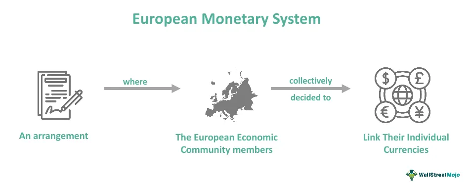

The European Currency Unit (ECU) holds a pivotal place in the chronicles of global finance. As an important precursor to the euro, it served as a key instrument within the European Monetary System (EMS), facilitating economic coordination and cooperation among the European Economic Community (EEC) member states from 1979 to 1998. 

The ECU was uniquely positioned as an accounting currency. It was derived from a weighted basket of European community member currencies, distinct from traditional currencies because it wasn't designed for daily transactions but was instead employed in banking, commercial contracts, and governmental fiscal policies. This role was instrumental in stabilizing exchange rates across Europe and fostering greater economic stability within the region.

Comprehending the transition from the ECU to the euro uncovers the multifaceted challenges and innovative solutions within the European monetary landscape. This transition, culminating on January 1, 1999, when the euro emerged as the single currency for participating EU nations, involved intricate financial, legal, and political adaptations. It ultimately enhanced the coherence of regional monetary policy by consolidating multiple currencies into one.

Understanding the ECU's influence sets a foundation for exploring current trends in algorithmic trading within European markets. The structure and stability of the ECU provided early insights into risk reduction linked to currency fluctuations, a concept crucial to the development of automated trading systems. The legacy of the ECU continues to echo in contemporary algorithmic trading strategies, with its principles informing modern practices that aim to optimize cross-border trading efficiency in an increasingly interconnected global economy.

By analyzing the role and impact of the ECU, financial professionals and academics gain a better perspective on the fundamental dynamics of currency systems, allowing them to navigate the rapidly evolving landscape of modern forex markets and algorithmic trading strategies effectively.

## Table of Contents

## What Was the European Currency Unit (ECU)?

The European Currency Unit (ECU) operated as an accounting currency within the framework of the European Economic Community (EEC) from 1979 until it was succeeded by the euro in 1999. As a monetary tool, the ECU was pivotal in advancing economic integration and stability within Europe, setting the stage for the euro's establishment. 

The ECU was constructed as a basket of currencies from member states of the European Economic Community, designed to reduce exchange rate variability and maintain monetary stability. The composition of this basket was determined by weighted averages of the member currencies, reflecting the economic size and significance of each participating country. This multi-currency setup played a crucial role in stabilizing exchange rates among European nations, offering a step towards deeper economic cooperation.

Unlike conventional currencies, the ECU was never intended for everyday consumer transactions. Instead, it functioned primarily in financial and governmental contexts. Banks utilized the ECU for cross-border loans and transactions, while corporations adopted it in international contracts to mitigate currency risk. Moreover, governments employed the ECU as a reference point for coordinating fiscal policies and aligning macroeconomic strategies across the Community.

The creation and implementation of the ECU marked a significant movement towards monetary unification, balancing national and collective economic policies. Despite its limited role as a currency in the traditional sense, the ECU's presence facilitated a more integrated European market, laying the groundwork for the eventual transition to a single, unified currency—the euro.

## The Transition from ECU to Euro

The shift from the European Currency Unit (ECU) to the euro represented a pivotal moment in the annals of European economic integration. The euro officially replaced the ECU on January 1, 1999, marking the beginning of a new era where it served as the single currency for participating European Union (EU) nations. This transition was not merely a currency switch; it was the fruition of a long-standing vision to unify European economies through a stable and cohesive monetary framework.

The process of transitioning from the ECU to the euro involved a series of complex financial, legal, and political challenges that required meticulous planning and execution. One of the primary financial tasks was the determination of irrevocable conversion rates between existing national currencies and the euro. These rates needed to be established such that they respected the value of the ECU and ensured that no nation was disproportionately advantaged or disadvantaged during the transition. This process involved significant negotiations among EU member states to reach a consensus.

Legally, the transition demanded widespread amendments to existing national and EU financial legislation. The introduction of the euro required amendments to countless financial contracts and statutory instruments to accommodate the new currency. This included redefining the legal tender status of the euro, ensuring all obligations formerly denominated in ECU were seamlessly converted to euros, and setting a legal framework for its use within national borders and cross-border transactions.

Politically, the evolution from the ECU to the euro entailed concerted efforts to align the economic policies of participating countries, fostering an unprecedented degree of economic coordination. The Maastricht Treaty, ratified in 1992, was a significant precursor to the launch of the euro, setting out the convergence criteria that member states needed to meet to adopt the single currency. These criteria encompassed aspects such as price stability, sound public finances, exchange rate stability, and convergence of interest rates.

The successful transition resulted in enhanced regional monetary policy coherence, simplifying trade, reducing transaction costs, and increasing price transparency among member states. The euro's introduction also strengthened the EU's economic position globally, providing a solid counterbalance to other major world currencies such as the US dollar.

Ultimately, the replacement of the ECU with the euro illustrated the EU's robust commitment to economic and monetary integration. It set the stage for further advances in regional cooperation and continues to influence the economic strategies and policies that shape Europe's place in the global economic landscape today.

## Algorithmic Trading in the ECU Framework

Algorithmic trading has become an essential component of modern financial markets, employing sophisticated algorithms and computing power to execute trades at speeds and efficiencies unattainable by human traders. The European Currency Unit (ECU), though not a functional currency for everyday transactions, significantly influenced the development of algorithms that underpin current trading strategies. 

The ECU, established as part of the European Monetary System, consisted of a basket of European Community member state currencies. This multi-currency configuration helped to stabilize exchange rates and fostered economic cohesion. The ECU's structure provided a model for mitigating currency fluctuation risks, a critical concern for traders who engage in cross-border transactions. By analyzing historical ECU data, traders developed early automated systems to predict and react to market changes, reducing exchange rate risks through swift and calculated trading maneuvers.

In modern [algorithmic trading](/wiki/algorithmic-trading) platforms within European markets, lessons from the ECU’s composition are instrumental. The multi-currency basket underpinning the ECU informed algorithms designed to handle the complexities of trading across multiple national currencies. This historical influence is noticeable in strategies that aim to optimize currency allocations dynamically, thus enhancing cross-border trading efficiency. For instance, when a trading algorithm processed ECU data, it had to consider the weightings and the fluctuations of multiple currencies simultaneously, creating a precursor environment for handling real-time, multi-variable data processes.

The ECU's stability and predictability allowed for the testing and refinement of automated trading strategies. One can model the [volatility](/wiki/volatility-trading-strategies) of currency pairs using a simplified mathematical approach:

$$
V(t) = \sum_{i=1}^{n} w_i \cdot \sigma_i(t)
$$

where $V(t)$ is the overall volatility at time $t$, $w_i$ is the weight of the $i^{th}$ currency in the basket, and $\sigma_i(t)$ is the standard deviation (volatility measure) of the $i^{th}$ currency. This formula provided a foundation for early efforts in algorithmic risk assessment, enabling traders to anticipate the impact of currency fluctuations on their portfolios.

Furthermore, the ECU model's impact extended beyond currency trading to the broader financial algorithm landscape, embedding multi-variable analysis and optimization at its core. As algorithmic trading systems evolve, they continue to draw from the ECU era's design principles, enriching the algorithms that conduct billions of transactions daily across global foreign exchange markets. 

In conclusion, while the ECU itself is no longer in use, its legacy persists in the sophisticated, stable, and efficient algorithmic trading systems that are vital to today's [forex](/wiki/forex-system) markets. By learning from the ECU’s algorithmic implications, modern trading entities have developed robust systems that accommodate the complex needs of contemporary finance.

## The Impact of ECU on Modern Forex Markets

The European Currency Unit (ECU), although obsolete, continues to exert influence on modern foreign exchange (forex) markets. Its foundational principles are integrated into current market strategies and technological advancements. The ECU provided a framework that emphasized stability among fluctuating currencies, which remains vital for contemporary forex trading.

Traders utilize ECU-era data to interpret historical trends and economic responses. This data serves as a reference point for predictive analytics and the development of sophisticated trading algorithms. By analyzing past currency behaviors, traders can identify patterns that enhance decision-making processes in real-time trading environments. The insights gleaned from ECU data help in predicting market movements and formulating strategies to capitalize on these insights.

The transition from the ECU to the euro represents a significant case study in monetary union impacts, which remains relevant to today's market expectations. The success of the ECU in stabilizing multiple European currencies paved the way for the euro's introduction. Traders and market analysts study this evolution to understand the complexities and benefits of large-scale monetary unions. By examining these historical shifts, current economic actors can better anticipate and navigate potential challenges associated with currency integration and the economic policies that accompany such transitions.

The impact of the ECU still resonates within modern forex markets, providing crucial lessons in currency management and integration strategies. Its historical significance continues to offer valuable insights that guide today’s algorithmic trading methodologies and economic assessments.

## Conclusion

The European Currency Unit (ECU) was instrumental in both paving the way for the euro and influencing the evolution of modern economic policies and trading systems. As primarily an accounting currency, the ECU's structural design and operational mechanisms have had a lasting impact, particularly in algorithmic trading. Even though it was not used for day-to-day transactions, the stability provided by its multi-currency composition has informed automated trading strategies that seek to minimize risks associated with currency fluctuations.

The lessons from the ECU's implementation continue to hold value for traders and financial analysts as they develop and refine trading algorithms. For instance, the concept of a currency basket, as embodied by the ECU, has been applied in designing strategies aimed at mitigating exposure to single currency volatility. These strategies have evolved into sophisticated trading algorithms that capitalize on historical data to predict market movements with higher accuracy.

Furthermore, the transition from the ECU to the euro showcased the feasibility of large-scale monetary integration, offering insights into regional monetary policy harmonization. This process has influenced current foreign exchange markets, encouraging the adoption of innovative financial technologies. Current trading systems that optimize cross-border transactions rely on principles similar to those established during the ECU era, enhancing efficiency in an interconnected global market.

In summary, the ECU's legacy extends beyond its historical role as an accounting unit, echoing in today's trading innovations. As financial markets continue to advance, the understanding and application of lessons learned from the ECU era remain essential for navigating modern and future trading landscapes.

## References & Further Reading

[1]: McNamara, K., & Massoc, E. (2014). ["The ECB and the politics of monetary integration."](https://link.springer.com/article/10.1007/s11127-005-3057-8) Problems of Post-Communism. 

[2]: European Central Bank. (2004). ["The European Currency Unit (ECU) and the euro."](https://www.ecb.europa.eu/pub/pdf/other/monetarypolicy2004en.pdf)

[3]: Gros, D. (1996). ["The European Monetary System and the ECU: The Experience of the Run-Up to the EMU,"](https://link.springer.com/article/10.1023/A:1003067029371) International & Comparative Law Quarterly. 

[4]: Krugman, P., & Obstfeld, M. (2014). ["International Economics: Theory and Policy,"](https://www.pearson.com/se/Nordics-Higher-Education/subject-catalogue/economics/International-Economics-Theory-and-Policy-Krugman.html) Pearson. 

[5]: De Grauwe, P. (2018). ["Economics of Monetary Union,"](https://archive.org/details/economicsofmonet0000grau) Oxford University Press.