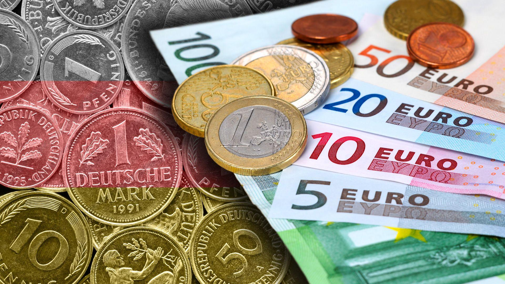

## Table of Contents

## What is the European Currency Unit (ECU)?

The European Currency Unit (ECU) was a type of money used in Europe before the Euro. It was not a real coin or note that people could use to buy things. Instead, it was more like a way to keep track of money between different countries in Europe. The ECU was used from 1979 until 1999. It was made up of different amounts of the currencies from the countries in the European Union at that time.

The ECU helped make trading and business easier between European countries. It was a way to have a common value for money, even though each country still used its own currency. Banks and businesses used the ECU to help them know how much their money was worth in other countries. In 1999, the ECU was replaced by the Euro, which became the real money used in many European countries.

## When was the ECU introduced and by whom?

The ECU was introduced on March 13, 1979. It was created by the European Economic Community (EEC), which is what the European Union was called back then. The EEC wanted a way to make trading between its member countries easier and more stable.

The ECU was a basket of different currencies from the countries in the EEC. This means it was made up of a mix of these currencies, like a recipe. The idea was to have a common unit of money that could be used to measure the value of different currencies against each other. This helped businesses and banks know how much their money was worth in other countries.

## What was the purpose of the ECU?

The ECU was created to help make trading and business easier between European countries. Before the ECU, each country had its own money, and it was hard to know how much one country's money was worth compared to another's. The ECU was a way to have a common value for money, even though each country still used its own currency. This made it easier for businesses and banks to do deals with each other.

The ECU was not a real coin or note that people could use to buy things. Instead, it was more like a way to keep track of money between different countries. Banks and businesses used the ECU to help them know how much their money was worth in other countries. The ECU was used from 1979 until 1999, when it was replaced by the Euro, which became the real money used in many European countries.

## How was the value of the ECU determined?

The value of the ECU was determined by a mix of different European currencies. It was like a recipe where each currency had its own part in making up the ECU. For example, the German mark, French franc, and British pound were all part of this mix. The amount of each currency in the ECU changed over time, depending on how strong or weak each country's money was.

This mix of currencies was decided by the European Economic Community, which is what the European Union was called back then. They looked at how much each country's money was worth and then decided how much of each currency should be in the ECU. This helped keep the value of the ECU stable, even when the value of one country's money went up or down.

## Which currencies were included in the ECU basket?

The ECU was made up of a mix of different European currencies. At first, it included the German mark, French franc, British pound, Italian lira, Dutch guilder, Belgian franc, Luxembourg franc, Danish krone, and Irish punt. Each of these currencies had a certain amount in the ECU, like ingredients in a recipe.

Over time, the mix of currencies in the ECU changed a bit. For example, the Greek drachma was added in 1985 when Greece joined the European Economic Community. The amounts of each currency in the ECU also changed to keep the value of the ECU stable, even when the value of one country's money went up or down.

## How did the ECU function within the European Monetary System?

The ECU was an important part of the European Monetary System (EMS), which started in 1979. The EMS was a way to keep the value of different European currencies stable compared to each other. The ECU helped with this by being a common unit of money that all countries in the EMS could use to measure their own currencies. This made it easier for countries to trade with each other because they could see how much their money was worth in ECUs.

Within the EMS, the ECU was used to set up something called the Exchange Rate Mechanism (ERM). The ERM was a way to keep the value of each country's currency from changing too much. Countries agreed to keep their currency's value within a certain range compared to the ECU. If a country's money started to go outside this range, they would do things like change interest rates to bring it back. This helped keep the money stable and made it easier for businesses to plan and trade across Europe.

## What were the key differences between the ECU and the Euro?

The ECU and the Euro are both related to European money, but they are different in some important ways. The ECU was not a real coin or note that people could use to buy things. It was more like a way to keep track of money between different countries in Europe. The ECU was used from 1979 until 1999, and it was made up of a mix of different European currencies. This mix helped keep the value of the ECU stable, even when the value of one country's money went up or down.

On the other hand, the Euro is a real currency that people can use to buy things. It was introduced in 1999 and replaced the ECU. The Euro is used in many European countries, and it is not made up of a mix of other currencies. Instead, it is one single currency that everyone in the Eurozone uses. This makes it easier for people to trade and travel between countries that use the Euro because they don't have to worry about changing money.

## How did the ECU facilitate trade among European countries?

The ECU helped make trade easier among European countries by giving them a common way to measure the value of their money. Before the ECU, each country had its own currency, and it was hard to know how much one country's money was worth compared to another's. The ECU was like a special unit that all countries could use to see how much their money was worth. This made it easier for businesses and banks to do deals with each other because they could use the ECU to figure out the value of their money.

The ECU was part of the European Monetary System, which helped keep the value of different European currencies stable. This stability was important for trade because it meant that the value of money didn't change too much from one day to the next. When countries used the ECU to keep their money stable, it made it easier for them to plan and do business with each other. This helped make trade smoother and more predictable, which was good for the economy of all the countries involved.

## What role did the ECU play in the transition to the Euro?

The ECU played a big part in helping Europe move to using the Euro. It was like a practice run for the Euro. The ECU was a way for European countries to get used to having a common way to measure their money. It helped them see how their own money compared to other countries' money. This was important because it made trade easier and helped keep the value of money stable. By using the ECU, countries learned how to work together on money matters, which was a big step towards using the Euro.

When it was time to switch to the Euro in 1999, the ECU made the change smoother. The Euro was set to be worth the same as the ECU, so it was an easy switch. Countries already knew how to use the ECU in their business and trade, so moving to the Euro was not a big shock. The ECU helped build trust and cooperation among European countries, which made them more ready to use the Euro as their real money. This helped make the transition to the Euro successful.

## How was the ECU used in international financial markets?

The ECU was used in international financial markets as a way to keep track of money between different European countries. It was not a real coin or note that people could use to buy things, but it was important for banks and businesses. They used the ECU to help them know how much their money was worth in other countries. This made it easier for them to do deals and trade with each other because they had a common way to measure the value of their money.

The ECU was part of the European Monetary System, which helped keep the value of different European currencies stable. This stability was important for international financial markets because it meant that the value of money didn't change too much from one day to the next. When countries used the ECU to keep their money stable, it made it easier for them to plan and do business with each other. This helped make trade smoother and more predictable, which was good for the economy of all the countries involved.

## What were the economic impacts of the ECU on member countries?

The ECU had a big impact on the economies of the countries that used it. It helped make trade easier between these countries because it gave them a common way to measure the value of their money. This made it simpler for businesses and banks to do deals with each other. When countries could see how much their money was worth compared to other countries' money, it made trade smoother and more predictable. This was good for the economy because it helped businesses grow and create more jobs.

The ECU also helped keep the value of different European currencies stable. This was important because it meant that the value of money didn't change too much from one day to the next. When the value of money is stable, it's easier for businesses to plan and invest. This stability helped the economies of the member countries grow stronger. The ECU was like a practice run for the Euro, helping countries get used to working together on money matters, which made the transition to the Euro smoother and more successful.

## What were the challenges and criticisms faced by the ECU during its existence?

The ECU faced several challenges and criticisms during its time. One big challenge was keeping the value of the ECU stable. It was made up of a mix of different European currencies, and the amounts of each currency in the mix changed over time. This made it hard to keep the ECU's value steady, especially when one country's money became stronger or weaker. Another challenge was that the ECU was not a real currency that people could use to buy things. This made it less useful for everyday people and more of a tool for banks and businesses.

There were also criticisms about the ECU. Some people thought it was too complicated because it was made up of so many different currencies. They worried that it was hard to understand and use. Others criticized the ECU for not doing enough to help the economies of all the member countries. Some countries felt that their money was not valued fairly in the ECU mix, which could hurt their economy. Despite these challenges and criticisms, the ECU played an important role in helping Europe move towards using the Euro.

## What is Algorithmic Trading in the ECU Framework?

Algorithmic trading has become an essential component of modern financial markets, employing sophisticated algorithms and computing power to execute trades at speeds and efficiencies unattainable by human traders. The European Currency Unit (ECU), though not a functional currency for everyday transactions, significantly influenced the development of algorithms that underpin current trading strategies. 

The ECU, established as part of the European Monetary System, consisted of a basket of European Community member state currencies. This multi-currency configuration helped to stabilize exchange rates and fostered economic cohesion. The ECU's structure provided a model for mitigating currency fluctuation risks, a critical concern for traders who engage in cross-border transactions. By analyzing historical ECU data, traders developed early automated systems to predict and react to market changes, reducing exchange rate risks through swift and calculated trading maneuvers.

In modern [algorithmic trading](/wiki/algorithmic-trading) platforms within European markets, lessons from the ECU’s composition are instrumental. The multi-currency basket underpinning the ECU informed algorithms designed to handle the complexities of trading across multiple national currencies. This historical influence is noticeable in strategies that aim to optimize currency allocations dynamically, thus enhancing cross-border trading efficiency. For instance, when a trading algorithm processed ECU data, it had to consider the weightings and the fluctuations of multiple currencies simultaneously, creating a precursor environment for handling real-time, multi-variable data processes.

The ECU's stability and predictability allowed for the testing and refinement of automated trading strategies. One can model the [volatility](/wiki/volatility-trading-strategies) of currency pairs using a simplified mathematical approach:

$$
V(t) = \sum_{i=1}^{n} w_i \cdot \sigma_i(t)
$$

where $V(t)$ is the overall volatility at time $t$, $w_i$ is the weight of the $i^{th}$ currency in the basket, and $\sigma_i(t)$ is the standard deviation (volatility measure) of the $i^{th}$ currency. This formula provided a foundation for early efforts in algorithmic risk assessment, enabling traders to anticipate the impact of currency fluctuations on their portfolios.

Furthermore, the ECU model's impact extended beyond currency trading to the broader financial algorithm landscape, embedding multi-variable analysis and optimization at its core. As algorithmic trading systems evolve, they continue to draw from the ECU era's design principles, enriching the algorithms that conduct billions of transactions daily across global foreign exchange markets. 

In conclusion, while the ECU itself is no longer in use, its legacy persists in the sophisticated, stable, and efficient algorithmic trading systems that are vital to today's [forex](/wiki/forex-system) markets. By learning from the ECU’s algorithmic implications, modern trading entities have developed robust systems that accommodate the complex needs of contemporary finance.

## References & Further Reading

[1]: McNamara, K., & Massoc, E. (2014). ["The ECB and the politics of monetary integration."](https://link.springer.com/article/10.1007/s11127-005-3057-8) Problems of Post-Communism. 

[2]: European Central Bank. (2004). ["The European Currency Unit (ECU) and the euro."](https://www.ecb.europa.eu/pub/pdf/other/monetarypolicy2004en.pdf)

[3]: Gros, D. (1996). ["The European Monetary System and the ECU: The Experience of the Run-Up to the EMU,"](https://link.springer.com/article/10.1023/A:1003067029371) International & Comparative Law Quarterly. 

[4]: Krugman, P., & Obstfeld, M. (2014). ["International Economics: Theory and Policy,"](https://www.pearson.com/se/Nordics-Higher-Education/subject-catalogue/economics/International-Economics-Theory-and-Policy-Krugman.html) Pearson. 

[5]: De Grauwe, P. (2018). ["Economics of Monetary Union,"](https://archive.org/details/economicsofmonet0000grau) Oxford University Press.