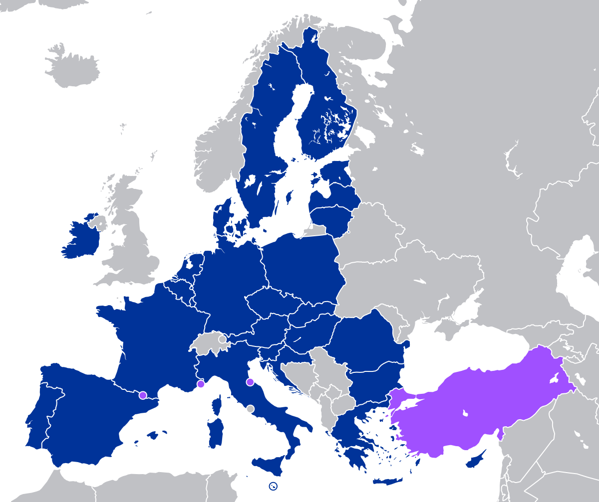

## Table of Contents

## What is the European Customs Union?

The European Customs Union is a group of countries that have agreed to not charge taxes on goods moving between them. This makes it easier for businesses to trade with each other within these countries. The countries in the European Customs Union include all members of the European Union, plus some other countries like Turkey.

The main goal of the European Customs Union is to help trade flow smoothly. By having the same rules and no taxes on goods moving between the countries, it helps businesses save money and time. This can make products cheaper and more available for people living in these countries.

## When was the European Customs Union established?

The European Customs Union was established on July 1, 1968. This was a big step for the countries in the European Economic Community, which later became the European Union. The idea was to make trade easier between these countries by removing taxes on goods moving between them.

Before the Customs Union, each country had its own taxes on goods coming from other countries. This made trading more complicated and expensive. By setting up the Customs Union, the countries agreed to have the same rules and no taxes on goods moving between them. This helped businesses save money and made products cheaper for people to buy.

## Which countries are part of the European Customs Union?

The European Customs Union includes all the countries that are part of the European Union. This means countries like France, Germany, Italy, Spain, and many others. There are 27 countries in the European Union, and they all follow the same rules for trading goods with each other.

In addition to the European Union countries, some other countries are also part of the European Customs Union. The most important one is Turkey. Turkey has a special agreement with the European Union that lets them trade without taxes on goods moving between them. So, in total, the European Customs Union includes all 27 European Union countries plus Turkey.

## What are the main objectives of the European Customs Union?

The main goal of the European Customs Union is to make trade easier and cheaper between the countries that are part of it. By removing taxes on goods moving between these countries, businesses can save money. This means they can sell their products for less, which is good for people who buy things. It also makes it simpler for businesses to trade because they don't have to deal with different taxes in each country.

Another important objective is to help the economy grow. When businesses can trade more easily, they can grow bigger and create more jobs. This is good for the countries in the European Customs Union because it helps their economies get stronger. The Customs Union also makes it easier for these countries to work together on other things, like making rules about trade with countries outside the Union.

## How does the European Customs Union facilitate trade?

The European Customs Union makes trade easier by getting rid of taxes on goods moving between the countries in the Union. This means businesses don't have to pay extra money when they sell things to other countries in the group. It helps them save money and time because they don't have to deal with different taxes in each country. When businesses save money, they can sell their products for less, which is good for people who buy things.

Another way the European Customs Union helps trade is by making the rules the same for all the countries in the Union. This means businesses know what to expect when they trade with other countries in the group. It makes trading simpler and less confusing. When businesses can trade more easily, they can grow bigger and create more jobs, which is good for the economy of the countries in the Union.

## What are the common external tariffs of the European Customs Union?

The common external tariffs of the European Customs Union are the taxes that the Union puts on goods coming from countries outside the Union. All the countries in the Union agree to charge the same amount of tax on these goods. This makes it fair for everyone and helps protect businesses inside the Union from cheaper products coming from outside.

These tariffs are important because they help control what comes into the Union. By setting the same tax rates, the Union can make sure that goods from outside don't have an unfair advantage over goods made inside the Union. This helps keep the economy strong and supports local businesses and jobs.

## How does the European Customs Union handle non-tariff barriers?

The European Customs Union works to reduce non-tariff barriers, which are rules and regulations that can make trading harder even if there are no taxes. These barriers can include things like different safety standards, technical requirements, or complicated customs procedures. By having the same rules for all the countries in the Union, the Customs Union makes it easier for businesses to trade without these extra problems.

One way the European Customs Union deals with non-tariff barriers is by making sure all the countries follow the same standards and rules. This means that a product that meets the standards in one country can be sold in any other country in the Union without needing to change anything. This helps businesses save time and money because they don't have to deal with different rules in each country.

## What is the role of the European Commission in the European Customs Union?

The European Commission plays a big role in making sure the European Customs Union works well. They are like the managers who make sure all the countries follow the same rules. They help set up the common external tariffs, which are the taxes on goods coming from outside the Union. They also work to make sure these tariffs are fair and help protect businesses inside the Union.

Another important job of the European Commission is to help reduce non-tariff barriers. These are rules and regulations that can make trading harder even if there are no taxes. The Commission works to make sure all the countries in the Union have the same standards and rules. This makes it easier for businesses to trade without having to deal with different rules in each country. By doing this, the Commission helps make trade smoother and helps the economy grow.

## How does the European Customs Union affect member countries' economies?

The European Customs Union helps the economies of the member countries by making it easier for them to trade with each other. When businesses don't have to pay taxes on goods moving between countries, they can save money. This means they can sell their products for less, which is good for people who buy things. It also makes it simpler for businesses to trade because they don't have to deal with different taxes in each country. When businesses can trade more easily, they can grow bigger and create more jobs, which helps the economy of the countries in the Union.

The Customs Union also helps protect businesses inside the Union from cheaper products coming from outside. By setting common external tariffs, which are taxes on goods coming from outside the Union, the Union can control what comes in. This helps make sure that goods from outside don't have an unfair advantage over goods made inside the Union. This protection helps keep the economy strong and supports local businesses and jobs. By working together, the countries in the Union can have a stronger economy than if they were on their own.

## What are the challenges faced by the European Customs Union?

One big challenge for the European Customs Union is making sure all the countries follow the same rules. Even though they agree to have the same standards and tariffs, it can be hard to make sure everyone does it the same way. Sometimes, countries might want to protect their own businesses more than others, which can lead to disagreements and make it harder to work together. Also, the Union has to keep updating its rules to make sure they work well with new technologies and ways of doing business.

Another challenge is dealing with countries outside the Union. The Union has to set tariffs that are fair but also protect its own businesses. This can be tricky because the world of trade is always changing. Countries outside the Union might try to find ways around the tariffs, which can make it hard to control what comes in. The Union also has to think about how its tariffs might affect other countries and the global economy. This means they need to work with other countries and international groups to make sure their rules are fair and work well for everyone.

## How has the European Customs Union evolved since its inception?

Since it started in 1968, the European Customs Union has changed a lot. At first, it was just about getting rid of taxes on goods moving between countries in the European Economic Community. Over time, more countries joined the Union, and it grew bigger. The Union also started working on more than just taxes. They began to focus on making sure all the countries had the same rules and standards, which made trading even easier.

One big change was when Turkey joined the Customs Union in 1995. This was the first time a country that wasn't in the European Union became part of the Customs Union. It showed that the Union was willing to work with other countries to make trade better. The Union also had to deal with new challenges, like new technology and changing ways of doing business. They had to keep updating their rules to make sure they still worked well. This helped the Union stay strong and keep helping the economies of the countries in it.

## What future developments are anticipated for the European Customs Union?

In the future, the European Customs Union might work on making its rules even easier to follow. They could use new technology to make trading faster and simpler. This could mean using computers and the internet to help businesses trade without waiting at borders. The Union might also try to include more countries in the Customs Union. This could help more businesses trade without taxes and make the whole area's economy stronger. They might also focus on making sure the rules are fair for everyone, both inside and outside the Union.

Another thing the European Customs Union might do is help the environment. They could set rules that make businesses trade in ways that are good for the planet. This could mean using less plastic or making sure goods are transported in ways that don't harm the environment. The Union might also work on making sure all countries in the Union follow the same rules about the environment. This would help make trading good for both the economy and the planet.

## References & Further Reading

[1]: Baldwin, Richard E., and Charles Wyplosz. ["The Economics of European Integration."](https://archive.org/details/economicsofeurop0000bald) McGraw Hill, latest edition.

[2]: European Commission. ["The European Customs Union: Completing the Single Market and Expanding the EU Trade Agenda."](https://taxation-customs.ec.europa.eu/customs-4/eu-customs-strategy_en) Accessed 2023.

[3]: European Commission. ["Markets in Financial Instruments Directive II (MiFID II) Overview."](https://finance.ec.europa.eu/regulation-and-supervision/financial-services-legislation/implementing-and-delegated-acts/markets-financial-instruments-directive-ii_en) Accessed 2023.

[4]: Allen, David, et al. ["Algorithmic Trading: Pros, Cons and Regulatory Issues."](https://www.aeaweb.org/articles?id=10.1257/aer.20190623) The Financial Review, Vol. 51, 2016, pp. 171-202.

[5]: Winters, L. Alan. ["Brexit and the Northern Ireland Protocol: Impacts on Trade and Economy."](https://www.uktpo.org/2023/02/17/is-it-really-true-that-brexit-has-had-no-harmful-effects/) Review of European Economic Literature, 2021.

[6]: Grauwe, Paul De. ["Economics of Monetary Union."](https://archive.org/details/isbn_9780199277001_6) Oxford University Press, latest edition.

[7]: Lopez de Prado, Marcos. ["Advances in Financial Machine Learning."](https://www.amazon.com/Advances-Financial-Machine-Learning-Marcos/dp/1119482089) Wiley, 2018.