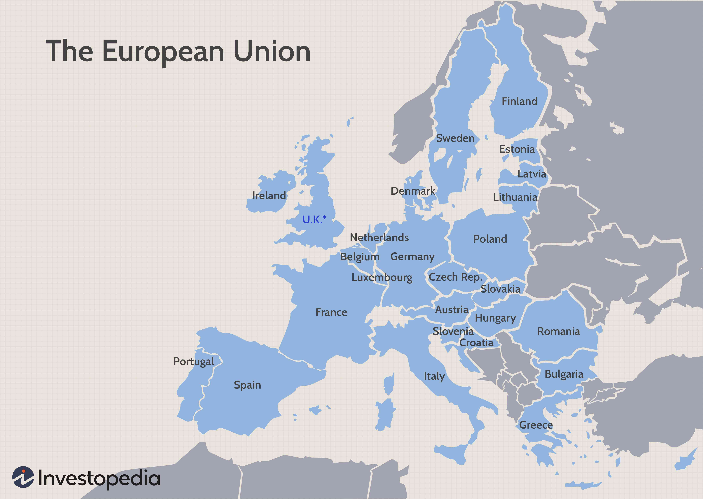

The European Customs Union represents a critical component of the European Union's economic architecture, established to enhance trade efficiency by removing internal customs barriers among member states and imposing a common external tariff. Since its inception in 1968, the Customs Union has played a significant role in promoting economic integration across Europe, simplifying trade flows, and reducing trade costs. This framework not only facilitates the seamless movement of goods among EU member states but also enhances the EU's bargaining power on the global stage through collective trade negotiations.

Historically, the European Customs Union has undergone various transformations to adapt to the shifting landscape of international trade. Its development is underscored by pivotal milestones, such as the unification of the customs code in 1992 and its expansion in tandem with the EU's enlargement. These adjustments reflect an ongoing effort to optimize trade processes and accommodate new member states, thereby reinforcing the Union's foundational goal of fostering a stable, integrated European market.

In parallel to these structural adaptations, the emergence of algorithmic trading has introduced a new layer of complexity to the modern economic landscape. Algorithmic trading, characterized by the use of computer algorithms to automate and optimize trading strategies, has the potential to transform trading practices within the customs union. By enabling rapid, data-driven decision-making, algorithmic trading can enhance market liquidity and efficiency. However, it also poses regulatory challenges, prompting EU policymakers to consider its implications on market stability and the efficacy of existing trade agreements.

As global trade dynamics continue to evolve, understanding the interplay between historical trade agreements and modern trading technologies is crucial. This exploration reveals the multifaceted nature of the European Customs Union, highlighting its ability to adapt to new challenges and remain a cornerstone of the EU's economic strategy. Through strategic negotiations and technological integration, the Customs Union aims to maintain its relevance and competitively position the EU within the global marketplace.

## Table of Contents

## The Genesis and Evolution of the European Customs Union

The European Customs Union, inaugurated in 1968, marked a significant transformation in the economic landscape of Europe. Its primary objective was to dismantle internal customs barriers among member states of the European Economic Community (EEC), facilitating seamless trade across borders. Additionally, the union introduced a common external tariff on imports from non-member countries, establishing a uniform trade policy that strengthened the EEC's collective bargaining power in international negotiations.

The evolution of the European Customs Union has been characterized by several strategic adjustments to meet the changing demands of global trade. A pivotal moment in its development was the unification of the customs code in 1992, which represented a comprehensive overhaul of customs laws and procedures. This unification aimed to simplify customs formalities and improve efficiency by reducing bureaucratic hurdles. The harmonization of regulations underscored the EU's commitment to enhancing the competitiveness of European businesses in the global market, ensuring consistency in customs practices across all member states.

Expansion has also been a notable feature of the customs union's history, with its reach extending as new nations joined the European Union. The accession of new member states necessitated the incorporation of these countries into the existing customs framework, ensuring compliance with established protocols while addressing the unique economic profiles and needs of the newcomers. This expansion underscored the adaptability and integration capabilities of the customs union, reinforcing its role as a cornerstone of the European single market.

The foundation and progression of the European Customs Union underscore its enduring significance in facilitating economic integration and cohesion within Europe. Its milestones, such as the customs code unification and geographical expansion, reflect continuous efforts to optimize trade efficiency and institutional cooperation among EU member states.

## EU Trade Agreements: A Framework for Global Commerce

The European Union's (EU) trade agreements are foundational to its stature as a formidable player in global commerce. These agreements are crafted to enhance market accessibility, foster economic growth, and strengthen international partnerships. Central to the EU's strategy is its network of institutional agreements with various non-EU nations, such as Turkey and Norway. These agreements serve to widen the scope for economic collaboration, allowing for the exchange of goods and services with reduced barriers.

Turkey, linked to the EU through a customs union agreement since 1995, benefits from tariff-free access to the vast EU market for industrial goods. However, agricultural products, services, and public procurement are not covered under this agreement, delineating specific areas for potential future negotiations and adjustments. The Turkey-EU Customs Union showcases the EU's approach to strategic economic alliances, balancing free trade with protection of sensitive sectors.

Similarly, Norway, while not an EU member, is part of the European Economic Area (EEA), which allows it access to the single market. This agreement highlights the EU's commitment to economic integration beyond its borders while ensuring members contribute to and comply with single market regulations. As a result, Norway gains the benefits of participating in the market without undergoing the complete integration required of EU members, reflecting the adaptability of the EU's trade frameworks.

The European Commission plays a pivotal role in these negotiations, acting as the main representative for all EU member states. This centralization of negotiation power endows the EU with a significant advantage, allowing for cohesive and unified bargaining. The Commission's efforts emphasize the EU's collective strength, facilitating agreements that might otherwise be unachievable by individual states. The Commission's robust negotiation framework is designed to uphold EU standards across various domains, including social, environmental, and labor practices, which often become conditions within trade agreements.

In summation, the EU's trade agreements are instrumental in its strategy to shape global market interactions. Through strategic partnerships with countries like Turkey and Norway, the EU not only expands its economic influence but also sets a precedent for regional economic cooperation. The European Commission's role further solidifies the EU's position as a unified and powerful entity in international trade. As global markets evolve, the adaptability and strategic focus evident in the EU's trade agreements will likely continue to play a critical role in its economic endeavors.

## Comparing the Customs Union and the Single Market

The European Union (EU) is characterized by both its Customs Union and its Single Market, two integral components that work together yet serve different purposes. The Customs Union was established to eliminate customs duties between member states and implement a unified external tariff on imports from non-EU countries. This approach simplifies trade processes by ensuring goods imported into the EU face the same tariff and meet similar standards, thereby reducing administrative burdens and fostering a larger, more efficient market for both EU businesses and their external trading partners [European Union, 2023].

Conversely, the Single Market aims to ensure the free movement of goods, services, labor, and capital within the EU. This framework not only eliminates barriers to trade and economic activities but also creates an environment encouraging competition and innovation. A distinctive feature of the Single Market is the removal of non-tariff barriers, which includes regulatory standards and practices that might otherwise inhibit the free flow of goods and services across borders within the EU [European Commission, 2023].

Understanding these two systems’ distinct roles is crucial for appreciating their contributions to EU economic stability. The Customs Union, by facilitating imports and exports through a common external tariff, supports external trade relations, while the Single Market strengthens internal economic integration by allowing seamless movement for resources and labor. This strategic differentiation allows the EU to maintain robust and adaptable trade and economic policies.

Norway’s participation in the European Economic Area (EEA) provides an illustrative example of how these frameworks operate differently. Norway is not an EU member and thus is not part of the EU Customs Union. However, as part of the EEA, Norway is integrated into the Single Market. This arrangement permits Norway to trade freely in goods and services with EU countries, aligning with EU rules pertaining to the Single Market, while also maintaining its own external trade policies not synchronized with the EU's Customs Union.

The distinct yet complementary nature of the EU’s Customs Union and Single Market is fundamental to the EU’s economic strategy, allowing it to navigate complex global trade dynamics effectively while reinforcing internal market cohesion.

## Algorithmic Trading: Revolutionizing EU Market Dynamics

Algorithmic trading has become an integral component of financial markets within the European Union, significantly enhancing the efficiency of stock and commodity trading. Automating trading processes allows for the rapid execution of trade orders, reducing human error and reaction times. This automation leverages complex algorithms that process vast quantities of data to identify and exploit market opportunities swiftly. The increased adoption of [algorithmic trading](/wiki/algorithmic-trading) brings unique advantages, such as greater market [liquidity](/wiki/liquidity-risk-premium) and reduced transaction costs.

However, the integration of algorithmic trading within the EU's regulatory framework presents both opportunities and challenges. On the one hand, this technological advancement can improve market efficiency and foster more competitive pricing models. On the other hand, it introduces significant risks, including market [volatility](/wiki/volatility-trading-strategies) and the potential for systemic disruptions. Events such as the "Flash Crash" of 2010 illustrate how algorithmic trading can destabilize markets if not properly regulated.

To mitigate these risks, the EU has implemented several regulatory measures. The Markets in Financial Instruments Directive II (MiFID II), enacted in 2018, includes provisions specifically addressing algorithmic trading. These provisions require firms engaged in algorithmic trading to ensure robust risk controls, maintain transparent operations, and undergo regular algorithm testing to prevent market abuses.

A key challenge for regulatory bodies is balancing innovation with market protection. While regulatory frameworks aim to safeguard market integrity and protect investor interests, they must also accommodate technological advancements that drive market evolution. This requires continuous updates to regulatory measures, ensuring they remain relevant in a dynamic economic landscape.

As algorithmic trading becomes more sophisticated, EU policies may need to consider the implications of [artificial intelligence](/wiki/ai-artificial-intelligence) and [machine learning](/wiki/machine-learning) within trading algorithms. Such technologies can enhance the predictive accuracy of trading models, albeit with complexities that require careful oversight to prevent adverse outcomes.

In conclusion, the incorporation of algorithmic trading within EU markets necessitates adaptive regulatory frameworks to capitalize on its efficiencies while safeguarding against its inherent risks. This dual approach ensures that the European Union remains at the forefront of global financial markets, leveraging technological advancements for sustainable growth and stability.

## Brexit: Implications for the European Customs Union

Brexit marked a significant shift in the trade landscape, compelling a reconsideration of the customs agreements between the United Kingdom (UK) and the European Union (EU). The withdrawal of the UK from the EU Customs Union introduced several complexities and ushered in a new era of regulatory adjustments. One of the immediate impacts was the reestablishment of customs declarations, which had previously been unnecessary for trade between the UK and the EU member states. British businesses now face increased administrative burdens as they navigate these new requirements, impacting supply chain operations and trade efficiency.

The introduction of customs declarations means that UK businesses must now engage with complex procedures to comply with EU regulations. This involves detailed paperwork, classification of goods, and adherence to both import and export protocols. The time and costs associated with these procedures have led to disruptions, affecting both large and small businesses that previously benefited from seamless trade under EU membership.

A focal point of Brexit's impact on the Customs Union is the Northern Ireland Protocol, designed to prevent a hard border between Northern Ireland, which is part of the UK, and the Republic of Ireland, which remains in the EU. The protocol allows Northern Ireland to remain aligned with certain EU regulatory standards, enabling goods to flow freely across the Irish border without checks. However, this has created a de facto customs border in the Irish Sea between Northern Ireland and the rest of the UK. This arrangement has raised legal and logistical challenges, testing the balance between maintaining open borders and ensuring regulatory compliance.

Economically, Brexit challenges the EU's efforts to maintain a cohesive internal market, as the new customs arrangements introduce friction that previously did not exist. The necessity for continuous negotiations and updates to customs procedures currently defines the relationship between the UK and the EU. Moreover, these changes highlight the ongoing need for flexible policy adaptation to uphold trade efficiency while navigating complex geopolitical realities.

## Future Perspectives and Challenges

As global trade evolves, the European Customs Union (ECU) is encountering several significant challenges. The rapid advancement of technology necessitates the integration of new systems within the customs framework, enhancing operational efficiency and ensuring compliance with contemporary trade practices. Technologies such as blockchain and artificial intelligence promise enhanced transparency, reduced fraud, and improved tracking of goods. However, their integration demands substantial investment and a shift in traditional customs protocols.

Geopolitical shifts also pose challenges to the ECU. The ongoing trade tensions between major economies require the European Union to continuously reassess its trade relations and agreements to safeguard its economic interests. In particular, the changing dynamics in US-China trade relations could indirectly impact EU trade flows, requiring proactive policy adjustments.

A continuous update of trade policy and customs regulations is imperative to maintain the ECU's global standing. This involves periodic assessments to align with international trade standards and address emerging trade barriers. The agility in adapting to new trade norms will be crucial for the ECU's sustained relevance in the global market.

The potential inclusion of new EU members presents both opportunities and hurdles for the Customs Union. Enlargement could provide access to new markets and resources, enhancing the Union's economic clout. However, it also mandates substantial effort in harmonizing new members' policies with existing EU regulations. This includes aligning customs procedures, tariff settings, and trade practices to ensure seamless integration.

In summary, the ECU must balance technological integration with geopolitical adaptability while managing the complexities of expansion. These strategies will be vital for sustaining its economic influence and fostering robust trade relations globally.

## Conclusion

The European Customs Union has played an integral role in shaping the economic landscape of the European Union, facilitating streamlined trade among member states and establishing a collective front in global commerce. Its historical development from its founding in 1968 to its current configuration underscores its adaptability and influence in enhancing trade efficiency and economic cohesion.

Technological advancements, especially in algorithmic trading, present a frontier for enhancing the competitiveness of the European Customs Union. Algorithmic trading, characterized by the use of complex algorithms to execute trades at speeds and volumes beyond human capability, has transformed financial markets. By harnessing this technology, the Customs Union can optimize market operations, increase trade [volume](/wiki/volume-trading-strategy), and maintain its competitive edge within the global market.

Brexit introduced a series of challenges that necessitate a strategic reevaluation of customs agreements and trade policies. The withdrawal of the United Kingdom from the EU required the formulation of new regulatory and customs frameworks, impacting trade flows and economic relations. The Northern Ireland Protocol exemplifies the intricate balance required to maintain open borders while navigating new trade regulations. Successfully addressing these challenges demands a nuanced understanding of geopolitical dynamics and an agile approach to policy adjustments.

Looking forward, the European Customs Union's capacity to anticipate and respond to evolving trade dynamics will be crucial. Continuous adaptation of trade policies and customs regulations, informed by technological trends and geopolitical shifts, will ensure its sustained relevance and efficacy. Furthermore, the potential inclusion of new member states offers opportunities for expansion but also necessitates careful integration and standardization processes.

In summary, the European Customs Union's robust foundation and strategic foresight position it as a pivotal entity in the global economy. By embracing technological innovations like algorithmic trading and managing the complexities of Brexit, it can continue to thrive and uphold its role as a cornerstone of economic stability and growth in Europe.

## References & Further Reading

[1]: Baldwin, Richard E., and Charles Wyplosz. ["The Economics of European Integration."](https://archive.org/details/economicsofeurop0000bald) McGraw Hill, latest edition.

[2]: European Commission. ["The European Customs Union: Completing the Single Market and Expanding the EU Trade Agenda."](https://taxation-customs.ec.europa.eu/customs-4/eu-customs-strategy_en) Accessed 2023.

[3]: European Commission. ["Markets in Financial Instruments Directive II (MiFID II) Overview."](https://finance.ec.europa.eu/regulation-and-supervision/financial-services-legislation/implementing-and-delegated-acts/markets-financial-instruments-directive-ii_en) Accessed 2023.

[4]: Allen, David, et al. ["Algorithmic Trading: Pros, Cons and Regulatory Issues."](https://www.aeaweb.org/articles?id=10.1257/aer.20190623) The Financial Review, Vol. 51, 2016, pp. 171-202.

[5]: Winters, L. Alan. ["Brexit and the Northern Ireland Protocol: Impacts on Trade and Economy."](https://www.uktpo.org/2023/02/17/is-it-really-true-that-brexit-has-had-no-harmful-effects/) Review of European Economic Literature, 2021.

[6]: Grauwe, Paul De. ["Economics of Monetary Union."](https://archive.org/details/isbn_9780199277001_6) Oxford University Press, latest edition.

[7]: Lopez de Prado, Marcos. ["Advances in Financial Machine Learning."](https://www.amazon.com/Advances-Financial-Machine-Learning-Marcos/dp/1119482089) Wiley, 2018.