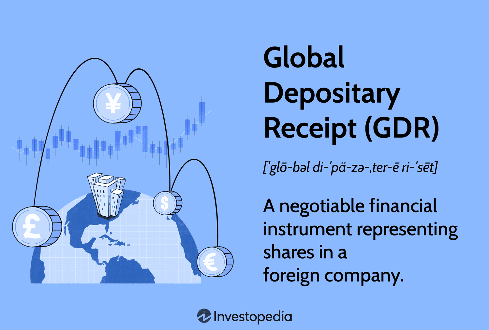

## Table of Contents

## What is a European Depositary Receipt (EDR)?

A European Depositary Receipt (EDR) is a type of financial instrument that allows investors to own shares in a foreign company without actually buying the shares directly on a foreign stock exchange. Instead, a bank in Europe buys the shares and issues EDRs, which represent those shares. This makes it easier for European investors to invest in companies from other countries, like those in the United States or Asia, without dealing with different currencies or regulations.

EDRs work a lot like American Depositary Receipts (ADRs), but they are specifically for the European market. They are traded on European stock exchanges, just like regular stocks. This means that if you live in Europe and want to invest in a company from another country, you can buy EDRs and trade them easily on your local stock exchange. This can help diversify your investment portfolio and potentially reduce risk by spreading investments across different countries and industries.

## How does an EDR differ from other types of depositary receipts?

An EDR, or European Depositary Receipt, is similar to other depositary receipts like ADRs (American Depositary Receipts) and GDRs (Global Depositary Receipts), but it's specifically designed for the European market. The main difference is where they are traded. EDRs are listed on European stock exchanges, making it easier for European investors to buy and sell them. On the other hand, ADRs are traded on U.S. stock exchanges and are more convenient for American investors, while GDRs can be traded in multiple markets around the world.

Another difference is the currency used. EDRs are usually denominated in Euros, which is convenient for European investors who don't have to worry about currency conversion. ADRs are typically denominated in U.S. dollars, and GDRs can be in various currencies depending on where they are traded. This makes EDRs a more straightforward option for someone living in Europe who wants to invest in foreign companies without the hassle of dealing with multiple currencies.

## What are the primary functions of EDRs?

EDRs help make it easier for people in Europe to invest in companies from other countries. They work by letting a bank buy shares of a foreign company and then issue EDRs that represent those shares. This means that instead of buying the actual shares on a foreign stock exchange, European investors can buy EDRs on their local stock exchange. This is simpler because they don't have to worry about different rules or currencies in other countries.

Another main function of EDRs is to help companies from other countries raise money in Europe. When a company issues EDRs, it can attract more investors from Europe, which can bring in more money for the company. This can be really helpful for a company that wants to grow or expand into new markets. So, EDRs serve as a bridge, connecting European investors with opportunities in foreign companies and helping those companies gain access to European capital.

## Who can issue an EDR?

EDRs are issued by banks in Europe. These banks buy shares of a foreign company and then create EDRs to represent those shares. This makes it easier for European investors to own a part of a company from another country without having to buy the shares directly on a foreign stock exchange.

The foreign company whose shares are being represented by EDRs does not issue the EDRs itself. Instead, it works with a European bank to make this happen. The bank handles all the paperwork and legal stuff needed to issue EDRs, so the company can focus on its business while still attracting investors from Europe.

## How are EDRs created and traded?

EDRs are created when a bank in Europe buys shares of a foreign company. The bank then issues EDRs that represent these shares. This means that instead of buying the actual shares on a foreign stock exchange, European investors can buy EDRs on their local stock exchange. The bank takes care of all the paperwork and legal stuff, so the foreign company can focus on its business while still attracting investors from Europe.

Once EDRs are created, they are traded on European stock exchanges just like regular stocks. This makes it easy for European investors to buy and sell them without worrying about different rules or currencies in other countries. The price of an EDR goes up and down based on the value of the foreign company's shares that it represents. So, if the foreign company does well, the value of the EDR will likely go up, and if the company does poorly, the value of the EDR will likely go down.

## What are the benefits of investing in EDRs for individual investors?

Investing in EDRs can be a great way for individual investors in Europe to own a piece of a foreign company without having to deal with the hassle of buying shares directly on a foreign stock exchange. EDRs are listed on European stock exchanges and are traded in Euros, so it's easy for European investors to buy and sell them without worrying about different currencies or regulations in other countries. This makes it simpler and more convenient to invest in companies from places like the United States or Asia.

Another benefit of EDRs is that they can help investors spread their money across different countries and industries, which can lower the risk of losing money. If one market or industry does poorly, the investor's other investments in different areas might do well and balance things out. By investing in EDRs, European investors can diversify their portfolios and take advantage of growth opportunities in foreign companies, all while staying within the familiar environment of their local stock exchange.

## What are the risks associated with EDRs?

Investing in EDRs comes with some risks that investors should know about. One big risk is the currency risk. Even though EDRs are traded in Euros, the value of the foreign company's shares can go up or down because of changes in the exchange rate between the Euro and the currency of the country where the company is based. This can make the value of the EDR go up or down, even if the company itself is doing well.

Another risk is the political and economic risk in the foreign country where the company is located. If there are problems like political unrest or a bad economy in that country, it can hurt the company's business and make the value of the EDR go down. Also, EDRs can be less liquid than regular stocks, which means it might be harder to sell them quickly if you need to. This can be a problem if the price of the EDR drops suddenly and you want to get out of the investment fast.

## How do EDRs impact the issuing company?

EDRs can help a foreign company raise money in Europe. When a company issues EDRs, it works with a European bank to sell these receipts to European investors. This means the company can get more money from European investors without having to list its shares directly on a European stock exchange. This can be really helpful for the company if it wants to grow or expand into new markets in Europe. The money raised through EDRs can be used for things like building new factories, hiring more workers, or investing in research and development.

On the other hand, issuing EDRs can also come with some challenges for the company. The company has to make sure it follows all the rules and regulations in both its home country and Europe. This can be a lot of work and might need extra people or money to handle. Also, the company's performance can be affected by changes in the exchange rate between the Euro and its home currency. If the company's home currency gets weaker compared to the Euro, it might have to deal with more costs or lower profits when it converts the money it raises from EDRs back into its home currency.

## What regulatory frameworks govern EDRs in Europe?

EDRs in Europe are governed by rules from the European Union and the local stock exchanges where they are traded. The main rulebook for EDRs comes from the EU's Prospectus Regulation, which says that companies need to give investors a document called a prospectus. This document has important information about the company and the EDRs, so investors can make smart choices. The prospectus has to be approved by a regulator in one of the EU countries before the EDRs can be sold to the public.

Besides the EU rules, EDRs also have to follow the rules of the stock exchange where they are traded. Each European country has its own stock exchange with its own set of rules. These rules can be about things like how the EDRs are traded, how much information the company has to share with investors, and how the EDRs are listed on the exchange. So, companies that want to issue EDRs have to make sure they follow both the EU's rules and the rules of the specific stock exchange where they want to list their EDRs.

## How do EDRs facilitate cross-border investment?

EDRs help people in Europe invest in companies from other countries without having to buy shares directly on a foreign stock exchange. A bank in Europe buys the shares of a foreign company and then issues EDRs that represent those shares. This makes it easier for European investors because they can buy and sell EDRs on their local stock exchange, in Euros, without worrying about different rules or currencies in other countries. It's like having a simple way to own a piece of a company from the United States or Asia, all while staying in the familiar environment of the European market.

For the foreign company, issuing EDRs means they can raise money from European investors without having to list their shares directly on a European stock exchange. This can help the company grow or expand into new markets in Europe. The money raised through EDRs can be used for things like building new factories, hiring more workers, or investing in new projects. So, EDRs act as a bridge, connecting European investors with opportunities in foreign companies and helping those companies gain access to European capital.

## What are the tax implications of investing in EDRs?

When you invest in EDRs, you need to think about taxes. The tax rules can be different depending on where you live in Europe and where the company that issued the EDRs is located. Usually, you'll have to pay taxes on any money you make from selling the EDRs, like capital gains tax. This is the tax you pay on the profit you make when you sell something for more than you paid for it. Also, if the company pays dividends, you might have to pay taxes on those too. The exact amount of tax you pay can change based on tax treaties between countries, so it's a good idea to talk to a tax expert to understand how much you'll owe.

Another thing to keep in mind is that the taxes you pay on EDRs might be different from the taxes you pay on regular stocks. This is because EDRs are a way to invest in a foreign company, and different countries have different tax rules. Sometimes, you might be able to get a tax credit in your home country for taxes you paid in the foreign country. This means you could pay less tax overall. But figuring out all these tax rules can be tricky, so it's smart to get help from someone who knows a lot about taxes to make sure you're doing everything right.

## How have EDRs evolved over time and what might their future look like?

EDRs have been around for a while and have changed a lot over time. They started as a way for European investors to buy shares in foreign companies without having to deal with different stock exchanges and currencies. Over the years, more and more companies from different countries have started issuing EDRs, making them a popular choice for investors in Europe. The rules and regulations around EDRs have also gotten better, making it easier for companies to issue them and for investors to buy and sell them. This has helped EDRs become a common way for European investors to diversify their investments and for foreign companies to raise money in Europe.

Looking ahead, the future of EDRs looks bright. As more people around the world invest in stocks, EDRs could become even more popular. Technology might make it even easier to buy and sell EDRs, and new rules could make it simpler for companies to issue them. EDRs could also start to include more types of investments, like bonds or other financial products. This would give European investors even more ways to invest in foreign companies and help those companies raise money in new ways. Overall, EDRs are likely to keep growing and changing, making it easier for investors and companies to connect across borders.

## What are the risks and challenges of EDRs?

European Depositary Receipts (EDRs) are valuable instruments for providing European investors access to non-European equities, but they also present certain risks and challenges that must be considered. 

Foremost among these risks is currency risk. EDRs are priced in euros, while the underlying assets are typically held in their original currency. This introduces the risk that fluctuations in exchange rates can significantly affect the value of the investment. For example, if an investor holds an EDR for an American company and the euro strengthens against the dollar, the value of the EDR may decrease even if the stock price of the underlying asset remains stable. Currency risk can be calculated using the following formula:

$$
\text{Risk} = \left( \frac{\Delta C}{C} \right) \times \text{Value of Asset in Local Currency}
$$

where:
- $\Delta C$ is the change in the exchange rate, and
- $C$ is the original exchange rate.

Liquidity risk is another significant concern associated with EDRs. Liquidity refers to the ease with which an asset can be bought or sold without affecting its price. EDR markets may not be as liquid as their domestic counterparts, leading to potential challenges in executing trades at desirable prices or volumes. Insufficient [liquidity](/wiki/liquidity-risk-premium) can result in wider bid-ask spreads and greater price [volatility](/wiki/volatility-trading-strategies), making it difficult for investors to enter or [exit](/wiki/exit-strategy) positions efficiently.

Given these risks, it is crucial for investors to incorporate robust risk management practices into their strategies. Hedging strategies like using currency futures or options can mitigate the currency risk associated with EDRs. For instance, investors might use currency options to lock in exchange rates to protect against unfavorable currency movements. On the other hand, understanding and monitoring market conditions can aid in managing liquidity risk. By assessing market depth and [volume](/wiki/volume-trading-strategy) trends, investors can better plan their trade executions to minimize adverse impacts from low liquidity.

In summary, while EDRs offer European investors efficient access to global equity markets, careful consideration of currency and liquidity risks, combined with strategic risk management, is essential to optimize the benefits of these financial instruments.

## References & Further Reading

[1]: ["European Depositary Receipts: A Gateway to Global Investments"](https://fastercapital.com/content/European-Depositary-Receipt--EDR---Expanding-Horizons--Understanding-European-Depositary-Receipts.html) - The Economist

[2]: ["American and Global Depositary Receipts: Globalizing Access to International Equity Markets"](https://www.investopedia.com/ask/answers/072315/what-are-differences-between-global-depositary-receipts-gdrs-and-american-depositary-receipts-adrs.asp) - ResearchGate

[3]: ["Algorithmic Trading: Winning Strategies and Their Rationale"](https://books.google.com/books/about/Algorithmic_Trading.html?id=WAlFDwAAQBAJ) by Ernie Chan

[4]: Goumatianos, S., & Papakiriakopoulos, D. (2017). ["Algorithmic Trading and Strategies,"](https://www.researchgate.net/publication/315799323_An_Algorithmic_Framework_for_Frequent_Intraday_Pattern_Recognition_and_Exploitation_in_Forex_Market_Knowledge_and_Information_Systems) Munich Personal RePEc Archive.

[5]: ["Incorporating Global Securities into European Investment Strategies: The Role of EDRs"](https://odi.org/en/publications/trillions-or-billions-reassessing-the-potential-for-european-institutional-investment-in-emerging-markets-and-developing-economies/) - Investopedia