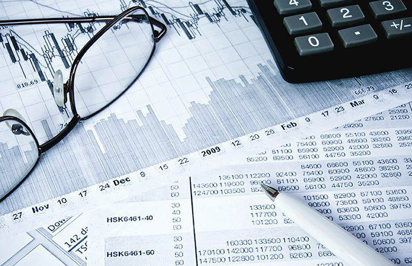

The global financial market offers a wide array of investment instruments, allowing investors to strategically diversify their portfolios across different regions and asset classes. Among these instruments, European Depositary Receipts (EDRs) serve as a key avenue for European investors seeking to invest in non-European companies. EDRs represent shares of companies outside Europe and enable investors to participate in the economic performance of these global enterprises without the need for cross-border currency transactions or direct dealings in foreign exchanges. This capability not only simplifies the investment process but also enhances the accessibility of international equities, aligning with the broader trend of globalization in capital markets.

Simultaneously, the proliferation of algorithmic trading, often referred to as algo trading, has significantly reshaped how securities are traded worldwide. This method employs advanced computational algorithms to execute trades based on pre-established criteria, doing so at speeds and efficiencies unattainable by human traders. Algorithmic trading systems analyze vast datasets in real-time, identifying patterns and opportunities that may be undetectable through traditional trading methods. This technological advancement has greatly affected trading dynamics, contributing to increased liquidity and reduced transaction costs in various markets, including those for securities like EDRs.

In this article, we explore how EDRs and algorithmic trading together enhance the modern financial ecosystem. For investors, a thorough understanding of these instruments and strategies is essential for making informed decisions that could optimize investment results. By leveraging the accessibility of EDRs and the analytical power of algo trading, investors can potentially improve their portfolio performance, seizing opportunities that were previously inaccessible.

## Table of Contents

## What are European Depositary Receipts (EDRs)?

European Depositary Receipts (EDRs) are negotiable financial instruments that enable European investors to invest in shares of non-European companies. These receipts are issued by European banks and represent ownership of shares in a foreign company that is not domestic to Europe. EDRs are akin to American Depositary Receipts (ADRs) in terms of structure and purpose but are tailored for the European market, being priced in euros.

The primary advantage of EDRs is that they simplify international investments for European investors. Without needing to manage cross-border or cross-currency transactions, investors can access a broader range of non-European securities. This is particularly useful for investors seeking diversification without the complexities of international trade regulations and foreign exchange considerations.

For non-European companies, EDRs act as a strategic tool to access the European capital markets and broaden their investor base. By issuing EDRs, these companies can attract European investors who might otherwise face barriers in directly purchasing foreign shares. By facilitating this form of investment, EDRs enhance the global reach of non-European companies and provide European investors with more options for portfolio diversification.

Overall, EDRs represent a significant intersection of global finance, easing the process of international investing for both companies and investors in an increasingly interconnected world.

## The Mechanics of EDRs

European Depositary Receipts (EDRs) are created through a structured process that begins when a European bank purchases shares of a non-European company. These shares are then held in custody by the bank, which becomes the intermediary between the foreign company and the investors in Europe. The bank issues EDRs to represent the ownership of these shares, enabling them to be traded on European stock exchanges. 

Trading EDRs allows investors to receive dividends as if they held the actual shares, with the dividends typically converted to the local currency, such as euros. This conversion process involves complex financial operations, including currency exchange management, which adds another layer of sophistication. 

Additionally, the bank responsible for issuing EDRs handles administrative tasks such as distributing dividends to investors, managing foreign exchange risks, and ensuring that shareholder information is communicated effectively. These functions require the coordination of technological systems and financial expertise to maintain the integrity and efficiency of the process.

Through this mechanism, EDRs serve as a conduit for European investors to gain exposure to international markets without the need to engage in cross-border or multi-currency transactions directly. By facilitating easier access to global equities, EDRs expand investment opportunities and contribute to greater capital movement between continents.

## Risks and Challenges of EDRs

European Depositary Receipts (EDRs) are valuable instruments for providing European investors access to non-European equities, but they also present certain risks and challenges that must be considered. 

Foremost among these risks is currency risk. EDRs are priced in euros, while the underlying assets are typically held in their original currency. This introduces the risk that fluctuations in exchange rates can significantly affect the value of the investment. For example, if an investor holds an EDR for an American company and the euro strengthens against the dollar, the value of the EDR may decrease even if the stock price of the underlying asset remains stable. Currency risk can be calculated using the following formula:

$$
\text{Risk} = \left( \frac{\Delta C}{C} \right) \times \text{Value of Asset in Local Currency}
$$

where:
- $\Delta C$ is the change in the exchange rate, and
- $C$ is the original exchange rate.

Liquidity risk is another significant concern associated with EDRs. Liquidity refers to the ease with which an asset can be bought or sold without affecting its price. EDR markets may not be as liquid as their domestic counterparts, leading to potential challenges in executing trades at desirable prices or volumes. Insufficient [liquidity](/wiki/liquidity-risk-premium) can result in wider bid-ask spreads and greater price [volatility](/wiki/volatility-trading-strategies), making it difficult for investors to enter or [exit](/wiki/exit-strategy) positions efficiently.

Given these risks, it is crucial for investors to incorporate robust risk management practices into their strategies. Hedging strategies like using currency futures or options can mitigate the currency risk associated with EDRs. For instance, investors might use currency options to lock in exchange rates to protect against unfavorable currency movements. On the other hand, understanding and monitoring market conditions can aid in managing liquidity risk. By assessing market depth and [volume](/wiki/volume-trading-strategy) trends, investors can better plan their trade executions to minimize adverse impacts from low liquidity.

In summary, while EDRs offer European investors efficient access to global equity markets, careful consideration of currency and liquidity risks, combined with strategic risk management, is essential to optimize the benefits of these financial instruments.

## The Role of Algorithmic Trading in EDR Markets

Algorithmic trading, often referred to as algo trading, leverages sophisticated algorithms to make trading decisions at lightning-fast speeds based on predetermined criteria. This method of trading has become integral to the operations of financial markets, including those involving European Depositary Receipts (EDRs).

In the context of EDRs, algo trading offers several significant advantages. Primarily, it enhances trading efficiency by automating the process of trade execution, which reduces the likelihood of human error and increases the speed at which trades can be completed. This efficiency is particularly important in EDR markets, which involve cross-border investments and currency exchanges, adding layers of complexity that can benefit from automation.

Moreover, [algorithmic trading](/wiki/algorithmic-trading) contributes to increased liquidity in EDR markets. By facilitating a higher volume of trades and enabling quicker buy and sell transactions, algo trading ensures that EDRs can be traded more easily and at competitive prices. Increased liquidity is beneficial for investors as it allows for smoother entry and exit from positions without causing significant market disruptions.

Algo traders are also adept at exploiting market inefficiencies or [arbitrage](/wiki/arbitrage) opportunities that may exist in EDR markets. These opportunities arise when price discrepancies occur between EDRs and the underlying shares they represent. By using real-time data processing capabilities, algorithms can identify and capitalize on these discrepancies faster than human traders. Sophisticated models that incorporate statistical analysis and [machine learning](/wiki/machine-learning) can predict price movements and execute trades that align with those predictions.

The relationship between technological advancements in trading and financial instruments like EDRs highlights the evolution of the modern financial landscape. As technology continues to advance, the role of algorithmic trading in markets like those for EDRs is likely to grow, making it a critical tool for investors seeking to navigate complex financial environments and enhance their investment strategies.

The integration of algorithmic trading with financial instruments such as EDRs exemplifies the significant strides made in financial technology. By understanding the capabilities and advantages that algo trading brings to EDR markets, investors can better optimize their portfolios and achieve more favorable outcomes in today’s fast-paced market conditions.

## Conclusion

European Depositary Receipts (EDRs) serve as a bridge for European investors seeking to tap into global markets, providing a streamlined process for investing in non-European companies. This financial instrument allows for diversification without the complexity associated with cross-border transactions, thereby facilitating increased capital flow into the European investment landscape. EDRs not only benefit investors but also enable non-European companies to extend their capital reach by accessing a broader investor base within Europe.

Simultaneously, the adoption of algorithmic trading is revolutionizing the trading of EDRs and other securities by increasing market efficiency and depth. Algorithmic trading automates the execution of trades based on pre-defined models and data inputs, significantly reducing the latency involved in traditional trading methods. This automation allows investors to operate at speeds and volumes previously unattainable, capturing fleeting opportunities in the highly dynamic market environment.

Understanding and leveraging EDRs, in conjunction with advanced trading strategies such as algorithmic trading, equips investors with the tools needed to secure a competitive advantage. By integrating these components, investors can optimize their portfolios, benefit from improved liquidity, and gain deeper insights into market trends. However, it is crucial to acknowledge the inherent risks associated with EDRs, such as currency and liquidity risks, and the complexities of algorithmic trading, which requires expertise in quantitative analysis and technological infrastructure.

Despite these risks, the strategic utilization of EDRs and algorithmic trading can yield significant opportunities for both portfolio growth and diversification. The synergy between innovative financial instruments and cutting-edge trading technologies exemplifies how modern strategies can enhance investment outcomes in the fast-paced financial markets of today. Through a well-informed and thoughtful approach, investors can capitalize on the potential of these tools to achieve their financial objectives.

## References & Further Reading

[1]: ["European Depositary Receipts: A Gateway to Global Investments"](https://fastercapital.com/content/European-Depositary-Receipt--EDR---Expanding-Horizons--Understanding-European-Depositary-Receipts.html) - The Economist

[2]: ["American and Global Depositary Receipts: Globalizing Access to International Equity Markets"](https://www.investopedia.com/ask/answers/072315/what-are-differences-between-global-depositary-receipts-gdrs-and-american-depositary-receipts-adrs.asp) - ResearchGate

[3]: ["Algorithmic Trading: Winning Strategies and Their Rationale"](https://books.google.com/books/about/Algorithmic_Trading.html?id=WAlFDwAAQBAJ) by Ernie Chan

[4]: Goumatianos, S., & Papakiriakopoulos, D. (2017). ["Algorithmic Trading and Strategies,"](https://www.researchgate.net/publication/315799323_An_Algorithmic_Framework_for_Frequent_Intraday_Pattern_Recognition_and_Exploitation_in_Forex_Market_Knowledge_and_Information_Systems) Munich Personal RePEc Archive.

[5]: ["Incorporating Global Securities into European Investment Strategies: The Role of EDRs"](https://odi.org/en/publications/trillions-or-billions-reassessing-the-potential-for-european-institutional-investment-in-emerging-markets-and-developing-economies/) - Investopedia