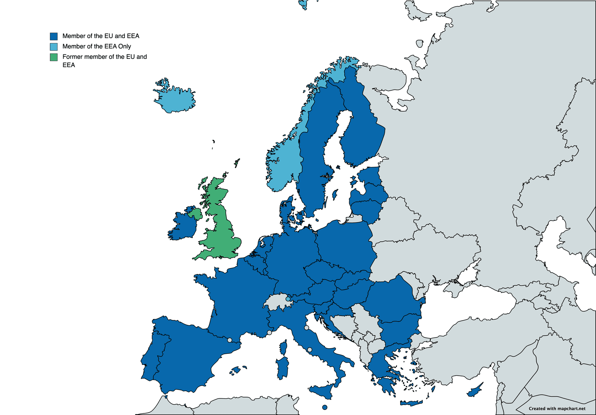

## Table of Contents

## What is the European Economic Area (EEA) Agreement?

The European Economic Area (EEA) Agreement is a deal between the European Union (EU) and three countries: Norway, Iceland, and Liechtenstein. This agreement lets these three countries join the EU's single market. This means that people and businesses in these countries can trade and move freely within the EU, just like EU countries do with each other. The EEA Agreement makes sure that these countries follow many of the EU's rules, especially about trade and the environment.

The main goal of the EEA Agreement is to make trade easier and help the economy grow in all the countries involved. It allows goods, services, people, and money to move freely across borders. This helps businesses sell their products in more places and gives people more job opportunities. The agreement also includes rules to protect the environment and make sure that competition is fair among businesses.

## Which countries are part of the EEA?

The European Economic Area (EEA) includes all the countries in the European Union (EU) plus Norway, Iceland, and Liechtenstein. The EU has 27 countries, so when you add Norway, Iceland, and Liechtenstein, the total number of countries in the EEA is 30.

These countries work together to make trade easier and help their economies grow. They follow many of the same rules, especially about trade and the environment. This helps businesses and people move freely between these countries.

## What are the main objectives of the EEA Agreement?

The main goal of the EEA Agreement is to make it easier for countries to trade with each other and help their economies grow. This agreement includes all the countries in the European Union, plus Norway, Iceland, and Liechtenstein. By working together, these countries can sell their products in more places and people can find more job opportunities in different countries.

The EEA Agreement also helps businesses and people move freely between these countries. It sets rules to make sure that competition is fair among businesses and to protect the environment. This means that companies from different countries can compete on equal terms, and everyone works together to keep the environment clean and healthy.

## How does the EEA Agreement differ from the European Union (EU)?

The EEA Agreement and the European Union (EU) are similar because they both help countries work together and trade more easily. The EU is a group of 27 countries that have their own rules and government. The EEA Agreement includes all the EU countries, plus Norway, Iceland, and Liechtenstein. This means that the EEA is a bigger group that includes the EU and three more countries.

The main difference is that the EU has its own government and makes its own laws, while the EEA Agreement follows many of the EU's rules but doesn't have its own government. Countries in the EEA can trade freely with each other, just like in the EU, but they don't have to follow all the same rules. For example, Norway, Iceland, and Liechtenstein don't use the Euro as their currency and don't have to follow all the EU's political decisions.

## What are the four freedoms ensured by the EEA Agreement?

The EEA Agreement ensures four main freedoms that help countries work together and trade more easily. These freedoms are the free movement of goods, services, people, and money. This means that businesses can sell their products in any EEA country without extra taxes or rules making it hard. It also means that people can move to another EEA country to work or study without many restrictions.

These freedoms help the economy grow because businesses can reach more customers and people can find more job opportunities. For example, a company in Norway can easily sell its products in Germany, and a person from Iceland can move to France to work. By making it easier to trade and move, the EEA Agreement helps everyone in these countries have a better life and a stronger economy.

## How is the EEA Agreement governed and administered?

The EEA Agreement is governed by a set of institutions that work together to make sure everything runs smoothly. The main body is the EEA Joint Committee, made up of representatives from the EU and the three EFTA countries (Norway, Iceland, and Liechtenstein). This committee meets regularly to update the agreement and make sure all countries follow the same rules. They also handle any disagreements that come up between the countries.

The EFTA Surveillance Authority and the EFTA Court play important roles too. The EFTA Surveillance Authority makes sure that Norway, Iceland, and Liechtenstein follow the rules of the EEA Agreement. If there's a problem, the EFTA Court can step in to make decisions and settle disputes. These institutions work together to keep the EEA Agreement fair and effective for all the countries involved.

## What role does the EFTA Surveillance Authority play in the EEA?

The EFTA Surveillance Authority makes sure that Norway, Iceland, and Liechtenstein follow the rules of the EEA Agreement. It's like a watchdog that checks if these countries are doing what they promised. This helps keep everything fair and makes sure that all countries can trade and work together easily.

The EFTA Surveillance Authority can investigate if someone thinks a rule is being broken. If they find a problem, they can tell the country to fix it. This helps keep the EEA Agreement strong and makes sure that everyone follows the same rules.

## How does the EEA Agreement affect trade between member countries?

The EEA Agreement makes trade between member countries easier and helps their economies grow. It lets goods, services, people, and money move freely between the countries. This means that businesses can sell their products in any EEA country without extra taxes or rules making it hard. For example, a company in Norway can easily sell its products in Germany, which helps the company grow and create more jobs.

The agreement also makes sure that competition is fair among businesses. This means that companies from different countries can compete on equal terms. It also helps protect the environment, which is important for everyone. By making it easier to trade and move, the EEA Agreement helps everyone in these countries have a better life and a stronger economy.

## What are the implications of the EEA Agreement for non-EU EEA countries?

For non-EU countries like Norway, Iceland, and Liechtenstein, being part of the EEA Agreement means they can trade freely with all the EU countries. This helps their businesses sell products in more places without extra taxes or rules making it hard. It also means that people from these countries can move to any EEA country to work or study without many restrictions. This helps the economy grow because businesses can reach more customers and people can find more job opportunities.

However, these countries also have to follow many of the EU's rules, even though they don't get to vote on them. This can be hard because they have to change their own laws to match the EU's, but they don't have a say in making those laws. On the other hand, being part of the EEA lets them benefit from the EU's big market without being full members of the EU. This gives them the best of both worlds: access to the market and the freedom to make some of their own decisions.

## How does the EEA Agreement handle disputes and legal issues?

The EEA Agreement handles disputes and legal issues through a few key institutions. The EEA Joint Committee is made up of representatives from the EU and the three EFTA countries (Norway, Iceland, and Liechtenstein). They meet regularly to talk about any problems and make sure all countries follow the same rules. If there's a disagreement, the Joint Committee tries to solve it by talking and working together.

If the EEA Joint Committee can't solve a problem, the EFTA Surveillance Authority and the EFTA Court step in. The EFTA Surveillance Authority checks if Norway, Iceland, and Liechtenstein are following the rules. If they find a problem, they can tell the country to fix it. The EFTA Court can make decisions and settle disputes if needed. This helps keep the EEA Agreement fair and makes sure everyone follows the same rules.

## What are the economic benefits of the EEA Agreement for its members?

The EEA Agreement brings many economic benefits to its members. It lets goods, services, people, and money move freely between countries. This means businesses can sell their products in more places without extra taxes or rules making it hard. For example, a company in Norway can easily sell its products in Germany. This helps businesses grow and create more jobs. It also helps the economy grow because companies can reach more customers and people can find more job opportunities in different countries.

The agreement also makes sure that competition is fair among businesses. This means companies from different countries can compete on equal terms. It also helps protect the environment, which is good for everyone. By making it easier to trade and move, the EEA Agreement helps everyone in these countries have a better life and a stronger economy. It's like a big team where everyone works together to make things better for all.

## What challenges and criticisms have been raised regarding the EEA Agreement?

One big challenge with the EEA Agreement is that Norway, Iceland, and Liechtenstein have to follow many EU rules without having a say in making them. This can be hard because they have to change their own laws to match the EU's, but they don't get to vote on those laws. Some people in these countries feel like they don't have enough control over their own rules. This can cause frustration because they want to make their own decisions but still want to benefit from trading with the EU.

Another criticism is that the EEA Agreement can be complicated and hard to understand. There are many rules and institutions involved, like the EEA Joint Committee, the EFTA Surveillance Authority, and the EFTA Court. This can make it hard for people to know what's going on and how decisions are made. Some people think that the agreement could be simpler and easier to follow. Despite these challenges, many people still see the benefits of the EEA Agreement because it helps businesses grow and creates more job opportunities.

## References & Further Reading

[1]: EFTA Secretariat. ["The European Economic Area (EEA) Agreement."](https://eur-lex.europa.eu/EN/legal-content/summary/agreement-on-the-european-economic-area.html) 

[2]: Huizinga, H., & Jonung, L. (2005). ["The Internationalisation of Asset Ownership in Europe."](https://portal.research.lu.se/files/70982706/198_The_Internationalisation_of_Asset_Ownership_in_Europe_2005.pdf) Cambridge University Press.

[3]: Mugarura, N. (2018). ["The Regulation of Algorithmic Trading: Rationale, Architecture and PRAXIS."](https://www.academia.edu/97125133/Intricacies_of_anti_money_laundering_and_cyber_crimes_regulation_in_a_fluid_global_system) Journal of Banking Regulation, 19(2), 101-117.

[4]: Moloney, N. (2010). ["European Securities Markets: The Investment Services Directive and Beyond."](https://eprints.lse.ac.uk/37168/1/Moloney_European_securities_markets_2_2011.pdf) Oxford University Press.

[5]: Teigland, R., Siri, S., Larsson, A., Puertas, A. M., & Bogusz, C. I. (Eds.). (2018). ["The Impact of Digital Transformation and FinTech on the Finance Professional."](https://www.routledge.com/The-Rise-and-Development-of-FinTech-Accounts-of-Disruption-from-Sweden-and-Beyond/Teigland-Siri-Larsson-Puertas-Bogusz/p/book/9780367735180) Palgrave Macmillan. 

[6]: Molnár, T., & Jovanovic, A. (2020). ["MiFID II: A New Framework for Algorithmic Trading."](https://www.esma.europa.eu/publications-and-data/interactive-single-rulebook/mifid-ii/article-17-algorithmic-trading) In Modeling, Dynamics, Optimization and Bioeconomics III. Springer, Cham.