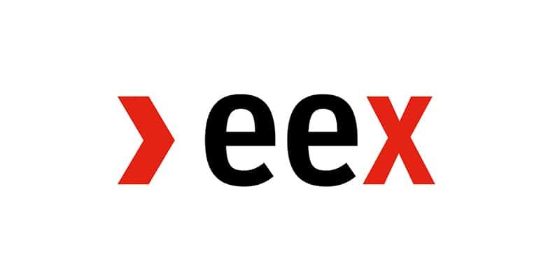

## Table of Contents

## What is the European Energy Exchange (EEX) and what is its primary function?

The European Energy Exchange (EEX) is a company that helps people and businesses buy and sell energy. It is like a big marketplace where people can trade different types of energy, such as electricity and natural gas. The EEX is based in Germany but works with people from all over Europe and even other parts of the world.

The main job of the EEX is to make sure that buying and selling energy is fair and easy. They set up rules and systems so that everyone knows the prices and can trade safely. This helps to keep the energy market stable and makes sure that there is enough energy for everyone who needs it.

## How does the EEX facilitate energy trading across Europe?

The EEX helps people trade energy across Europe by providing a big online platform where they can buy and sell electricity, natural gas, and other types of energy. This platform connects people from different countries, making it easier for them to do business with each other. The EEX makes sure that everyone follows the same rules and that the prices are clear and fair. This way, people can trust that they are getting a good deal when they trade energy.

The EEX also works with other energy exchanges and organizations in Europe to make trading even smoother. They share information and work together to create a connected network of energy markets. This helps to make sure that energy can flow freely across borders, which is important for keeping the supply stable and meeting the needs of everyone in Europe. By doing all of this, the EEX plays a big role in keeping the energy market working well across the continent.

## What types of energy products are traded on the EEX?

The EEX is a place where people trade different kinds of energy. The main types of energy products you can find there are electricity and natural gas. These are the most common and important energy sources that people and businesses need every day. The EEX helps people buy and sell these products so they can meet their energy needs.

Besides electricity and natural gas, the EEX also trades other energy products like emission allowances and guarantees of origin. Emission allowances are like special permits that companies need to release certain amounts of pollution. Guarantees of origin are certificates that show where the energy comes from, often used to prove that it's from renewable sources like wind or solar power. By trading these products, the EEX helps make the energy market more fair and helps protect the environment.

## Can you explain the process of trading on the EEX?

Trading on the EEX is like going to a big online market where you can buy and sell energy. If you want to trade, you first need to register with the EEX and set up an account. Once you're set up, you can go to the EEX's trading platform. Here, you can see all the different types of energy products available, like electricity, natural gas, and others. You can choose what you want to buy or sell and then place your order. The EEX uses a system to match buyers and sellers, so when someone wants to buy what you're selling, or vice versa, the trade happens.

After the trade is made, the EEX makes sure everything goes smoothly. They keep track of all the trades and make sure everyone follows the rules. Once the trade is done, the EEX helps with the delivery of the energy product. For example, if you bought electricity, the EEX works with the energy companies to make sure you get the electricity you need. They also handle the payments, making sure the seller gets paid and the buyer doesn't have to worry about the money part. This way, trading on the EEX is safe and easy for everyone involved.

## What are the benefits of using the EEX for energy trading?

Using the EEX for energy trading has many benefits. One big advantage is that it makes trading easy and fair. The EEX has clear rules and a good system that helps everyone see the prices and know what they are buying or selling. This means that people can trust the EEX to give them a fair deal. Also, because the EEX is a big marketplace, it connects people from all over Europe and even other parts of the world. This makes it easier to find buyers or sellers and get the energy you need.

Another benefit is that the EEX helps keep the energy market stable. By having a big platform where lots of people trade, the EEX makes sure there is enough energy for everyone. This is important because it helps prevent shortages and keeps prices from going up and down too much. The EEX also helps the environment by trading things like emission allowances and guarantees of origin. This encourages companies to use cleaner energy and helps protect our planet.

## How does the EEX contribute to the transparency and efficiency of energy markets?

The EEX helps make energy markets more transparent by showing clear prices and information about trades. When people trade on the EEX, everyone can see what's happening. This means that buyers and sellers know the real price of energy, and they can make better decisions. The EEX also follows strict rules to make sure that all trades are fair and honest. This helps build trust in the market because people know they can rely on the EEX to give them true information.

The EEX also makes energy markets more efficient. It does this by connecting lots of people from different places in one big online marketplace. This makes it easier and quicker for people to find someone to trade with. The EEX's systems match buyers and sellers fast, so trades happen smoothly. This helps keep the energy flowing without problems and makes sure there's enough energy for everyone. By making trading easier and faster, the EEX helps keep the energy market running well.

## What role does the EEX play in the European Union's energy policy and climate goals?

The EEX helps with the European Union's energy policy by making it easier for people to trade energy across different countries. This is important because the EU wants to have a connected energy market where energy can move freely from one place to another. The EEX's big online platform helps this happen by letting people from all over Europe buy and sell energy. This makes the energy market work better and helps keep energy prices stable, which is a big part of the EU's energy policy.

The EEX also helps the EU reach its climate goals. One way it does this is by trading things like emission allowances. These are special permits that companies need to release pollution. By trading these, the EEX helps control how much pollution companies can make, which is important for fighting climate change. The EEX also trades guarantees of origin, which are certificates that show where energy comes from. This helps encourage more use of clean, renewable energy like wind and solar power, which is another key part of the EU's plan to protect the environment.

## How has the EEX evolved since its establishment?

The EEX started in 2002 and has grown a lot since then. At first, it was just for trading electricity in Germany. But over the years, it has expanded to include trading natural gas and other energy products like emission allowances and guarantees of origin. The EEX also started working with other energy exchanges and organizations in Europe to make trading easier across borders. This has helped make the EEX a big and important part of the European energy market.

The EEX has also changed its technology to make trading easier and safer. They use new systems to match buyers and sellers quickly and keep track of all the trades. This helps make the energy market more stable and efficient. The EEX has also become more focused on helping with the EU's climate goals. They do this by trading products that help control pollution and encourage the use of clean energy. So, the EEX has grown from a small electricity market to a big platform that helps with energy trading and protecting the environment across Europe.

## What are the major challenges faced by the EEX in the energy market?

One big challenge for the EEX is keeping up with new technology. As the energy market changes, the EEX needs to use new tools and systems to make trading easier and safer. This can be hard because technology is always changing, and the EEX has to keep learning and updating its platform. If they don't keep up, people might not want to use the EEX anymore because other places might be better or easier to use.

Another challenge is dealing with different rules in different countries. The EEX works with people from all over Europe, but each country has its own laws about energy. This can make trading more complicated because the EEX has to make sure everyone follows the right rules. It's important for the EEX to work with governments and other organizations to make sure trading stays fair and easy, even with all these different rules.

The EEX also faces challenges from climate change and the push for cleaner energy. More and more, people want to use energy that's good for the environment. The EEX needs to help with this by trading products like emission allowances and guarantees of origin. But it can be hard to balance the need for energy with the need to protect the environment. The EEX has to find ways to help people use clean energy while still making sure there's enough energy for everyone.

## How does the EEX handle risk management and ensure market stability?

The EEX helps manage risk and keep the market stable by using special rules and systems. They have something called "margin requirements," which means that people who want to trade need to put down some money first. This money acts like a safety net. If the price of energy changes a lot and someone loses money, the EEX can use this money to help cover the loss. This makes trading safer for everyone because it reduces the chance of big problems if prices go up or down suddenly.

The EEX also keeps an eye on the market all the time to make sure everything is working well. They watch for any strange trading patterns or big changes in prices. If they see something that could cause trouble, they can step in and do things like set limits on how much people can trade or change the rules a bit to keep things stable. By doing all of this, the EEX helps make sure that the energy market stays fair and reliable, so people can trust it to meet their energy needs.

## What technological innovations has the EEX implemented to improve trading?

The EEX has made trading better by using new technology. They have a special system called the T7 trading platform. This system makes it easier and faster for people to buy and sell energy. It matches buyers and sellers quickly and keeps everything running smoothly. The EEX also uses something called [algorithmic trading](/wiki/algorithmic-trading). This means that computers can make trades automatically based on rules people set. It makes trading even faster and helps people make better decisions.

Another way the EEX uses technology is by having a good way to keep track of all the trades. They use a system called the EEX Transparency Platform. This platform shows all the important information about trades, like prices and how much energy is being traded. This helps everyone see what's happening in the market and makes trading more fair and open. By using these new technologies, the EEX makes trading easier, faster, and safer for everyone.

## How does the EEX compare to other global energy exchanges in terms of volume and influence?

The EEX is one of the biggest energy exchanges in Europe, but it's not the only one. It's known for being a leader in trading electricity and natural gas. When you look at how much energy is traded on the EEX, it's pretty high compared to other exchanges in Europe. But if you look around the world, places like the Intercontinental Exchange (ICE) in the United States and the Japan Electric Power Exchange (JEPX) in Japan also handle a lot of energy trading. The EEX might not be the biggest in the world, but it's very important in Europe.

The EEX also has a big influence on the energy market because it helps set prices and keeps the market stable. In Europe, many people and businesses look at the EEX to see what energy costs. This makes the EEX very important for deciding how much energy costs across the continent. While other global exchanges like ICE or JEPX have their own influence in their regions, the EEX's role in Europe's energy policy and climate goals gives it a unique kind of power. So, even if it's not the largest by [volume](/wiki/volume-trading-strategy) worldwide, the EEX's impact in Europe is strong and important.

## References & Further Reading

[1]: Burger, C., Kuhlmann, A., Richard, P. B., & Weinmann, J. (2014). ["The Decentralized Energy Revolution: Business Strategies for a New Paradigm"](https://link.springer.com/book/10.1057/9781137270702). Palgrave Macmillan.

[2]: Harris, L. (2003). ["Trading and Exchanges: Market Microstructure for Practitioners"](https://www.amazon.com/Trading-Exchanges-Market-Microstructure-Practitioners/dp/0195144708). Oxford University Press.

[3]: Makarov, I., & Schoar, A. (2020). ["Trading and Arbitrage in Cryptocurrency Markets"](https://www.sciencedirect.com/science/article/pii/S0304405X19301746). Review of Financial Studies, 33(9), 3945–3995.

[4]: Geman, H. (2005). ["Commodities and Commodity Derivatives: Modeling and Pricing for Agriculturals, Metals and Energy"](https://download.e-bookshelf.de/download/0000/5675/90/L-G-0000567590-0015270354.pdf). Wiley Finance.

[5]: Hull, J. C. (2018). ["Options, Futures, and Other Derivatives"](https://www.semanticscholar.org/paper/Options%2C-Futures%2C-and-Other-Derivatives-Hull/89bdee500c8623864fc9eb7a471546aa713acc44). Pearson.

[6]: "European Energy Exchange [EEX] Annual Report 2020". Available at: [EEX Official Website](https://www.parts-express.com/).

[7]: "Algorithmic Trading: Pros and Cons". International Energy Agency (IEA). Available at: [IEA Website](https://www.euromoney.com/article/b1321xtg71wg7b/debate-the-pros-and-cons-of-algorithmic-trading) 

[8]: CFTC (Commodity Futures Trading Commission) (2017). ["Algorithmic Trading: Findings and Recommendations"](https://www.cftc.gov/sites/default/files/idc/groups/public/@lrlettergeneral/documents/letter/17-37.pdf). 

[9]: Dixon, M. (2019). ["Machine Learning in Finance: From Theory to Practice"](https://books.google.com/books/about/Machine_Learning_in_Finance.html?id=0pruDwAAQBAJ). Synthesis Lectures on Finance.