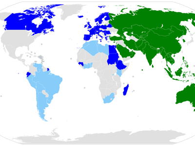

The European Investment Bank (EIB) is a cornerstone institution within the European Union, established to support its policy objectives through the financing of large-scale projects. Founded in 1958 under the Treaty of Rome, the EIB has since become one of the world's largest multilateral financial institutions, playing a critical role in fostering economic growth, promoting social cohesion, and addressing environmental challenges across the EU and beyond. 

This article provides an overview of the EIB's transformation over the decades, highlighting its historical milestones and strategic shifts. It investigates into the services offered by the bank, such as loans, guarantees, and equity investments, which are designed to support projects that align with the EU's policy priorities. In particular, the EIB has become a leader in climate finance, committing substantial resources to combat climate change and support sustainable development.

Additionally, the article examines the EIB's innovative approaches to enhancing its operational efficiency, including the adoption of algorithmic trading. This approach enables the bank to manage financial risks and optimize its investment strategies in increasingly complex financial markets. By leveraging advanced technologies, the EIB can efficiently allocate resources, ensuring that its operations remain transparent and effective.

As the EIB continues to adapt to evolving global circumstances, it remains committed to its mission of promoting investment in vital sectors such as infrastructure and climate action. Through its strategic initiatives, the bank continues to make significant contributions towards achieving the EU’s economic, social, and environmental goals, further establishing its reputation as a leading global actor in development finance.

## Table of Contents

## History of the European Investment Bank

The European Investment Bank (EIB) was established in 1958 under the Treaty of Rome, marking a significant milestone in the economic collaboration of the European Economic Community, known today as the European Union (EU). Its inception was driven by the need to finance projects that would help realize the objectives laid out in the treaty, primarily focusing on promoting balanced development and reducing economic disparities among regions within the member states.

Initially, the EIB was headquartered in Brussels, Belgium. However, in 1968, a strategic decision was made to relocate the headquarters to Luxembourg. This move underscored the growing importance and expanding role of the EIB within the EU's financial landscape. Luxembourg provided a more centralized location within Europe, which was conducive to the bank's operations and facilitated better coordination with other European institutions.

The turn of the millennium saw the EIB undergo a significant transformation with the formation of the EIB Group in 2000. This development included the establishment of the European Investment Fund (EIF), a move that greatly enhanced the bank's financial capabilities. The EIF was designed to support small and medium-sized enterprises (SMEs) by providing venture capital and guaranteeing mechanisms which complemented the EIB's existing lending activities. The creation of the EIB Group marked a pivotal expansion in its capacity to provide a diverse array of financial services, thus enabling it to respond more effectively to the evolving economic needs of the EU and its various regions.

Through these historical evolutions, the EIB has solidified its position as a cornerstone institution in the EU, continually adapting to the changing economic environment while steadfastly supporting the EU's objectives. This adaptability has been essential in ensuring the EIB's ongoing relevance and impact within the EU and in international markets.

## Structure of the EIB

The European Investment Bank (EIB) operates within the framework of the European Union, contributing significantly to the EU's financial landscape through its structured governance. At the core of its organizational structure are the Board of Governors, the Board of Directors, and the Management Committee. These entities are crucial in ensuring the EIB adheres to both public and corporate governance principles, thereby maintaining standards of transparency and efficiency.

The Board of Governors comprises ministers, typically finance ministers, from the bank's shareholder states. Each EU member state appoints a representative, providing a direct link between the EIB's activities and the EU's governmental framework. The Board of Governors primarily serves strategic and administrative functions, determining the general direction of the bank's activities and approving significant financial operations and policy decisions.

Complementing the Board of Governors is the Board of Directors, which is responsible for the day-to-day operational oversight of the bank. It has a more hands-on role, guiding and approving financing and lending operations. Members of this board are appointed based on their expertise and experience in finance and economics, tasked with ensuring that the bank's operations align with its policy objectives and strategic goals.

The Management Committee is the executive body managing the bank's activities under the supervision of the Board of Directors. It oversees the implementation of the decisions made by the Board of Governors and Board of Directors. The committee's responsibilities include the preparation and execution of investment strategies, risk management, and administrative functions.

As a financial institution, the EIB's capital relies heavily on contributions from its member states, with Germany, France, and Italy being the largest shareholders. This shareholder structure is essential for maintaining the EIB's creditworthiness and financial stability, enabling the bank to access international capital markets and secure funding for its projects. The capital provided by these countries allows the EIB to offer loans and guarantees with favorable conditions, promoting investment in crucial sectors across the EU.

## Services and Impact of the EIB

The European Investment Bank (EIB) is a pivotal financial institution that offers a variety of services designed to advance the European Union's policy goals. These services include but are not limited to loans, guarantees, and venture capital. Through these financial instruments, the EIB facilitates funding for projects that align with broader EU policy objectives, emphasizing sustainable and inclusive growth.

A substantial part of the EIB's funding is dedicated to climate action, energy security, and the economic upliftment of less-developed regions within the EU. For instance, by financing renewable energy projects, the EIB contributes significantly to the EU's target of achieving carbon neutrality by 2050. This commitment to climate action is reflected in the bank's Climate Bank Roadmap, which prioritizes investments that help mitigate the impacts of climate change.

Furthermore, the EIB supports projects that strengthen energy security, a crucial aspect considering the EU's energy needs and geopolitical dynamics. By investing in cross-border energy infrastructure and efficient energy technologies, the EIB helps ensure a stable and sustainable energy supply for the EU.

In addition to its focus on climate and energy, the EIB plays a vital role in promoting regional development, particularly in areas that face economic challenges. By funding infrastructure and social projects in these regions, the EIB enhances connectivity, accessibility, and quality of life, thereby reducing regional disparities and fostering EU cohesion.

The EIB's contributions, however, are not confined to Europe. Its investments span multiple continents, including Africa, Asia, and the Americas. In these regions, the EIB collaborates with various stakeholders to promote sustainable development and innovation, thus amplifying its impact on a global scale. This international engagement underscores the EIB's role as a global leader in development finance, working towards long-term economic and environmental sustainability across the world.

## EIB Projects and Climate Change Initiatives

The European Investment Bank (EIB) has positioned itself as a leader in financing climate action projects, with the ambitious goal of investing €1 trillion in climate-related initiatives by 2030. This commitment highlights the bank's strategic focus on sustainability and its response to the pressing challenges posed by climate change. The EIB's Climate Bank Roadmap underscores this dedication by aligning its financial activities with the objectives set forth in the Paris Climate Agreement, a global accord aimed at limiting global warming to below 2 degrees Celsius compared to pre-industrial levels.

In 2021, the EIB demonstrated its robust engagement in climate and environmental projects, approving over €65 billion in loans. These financial commitments span a diverse array of sectors, including transportation, energy, and health, each playing a vital role in advancing the EU's climate and sustainability objectives.

Transportation projects funded by the EIB often focus on enhancing sustainable mobility solutions. This includes investments in rail infrastructure and electric vehicle (EV) ecosystems, which are vital in reducing carbon emissions and promoting cleaner transport options. For example, financing for expansive rail networks not only decreases the dependency on road transport but also promotes interconnectivity and economic growth across regions.

In the energy sector, the EIB emphasizes renewable energy projects, targeting wind, solar, and hydroelectric power. These investments support the transition from fossil fuels to greener energy alternatives, directly contributing to the reduction of greenhouse gas emissions. Moreover, the EIB supports innovations in energy efficiency, such as smart grid technologies, which optimize consumption and enhance the resilience of energy infrastructure.

Health projects under the EIB's funding umbrella often focus on infrastructure that can withstand climate impacts. Investments in sustainable hospital buildings and health facilities contribute to creating resilient public health systems capable of addressing the challenges posed by climate change, such as increased instances of heatwaves and climate-related diseases.

Through these targeted investments, the EIB not only addresses its immediate environmental objectives but also bolsters long-term resilience and sustainability of the EU and beyond. This strategic approach ensures that the EIB remains at the forefront of global efforts to combat climate change, fostering a more sustainable future for all.

## Algorithmic Trading in EIB Operations

The European Investment Bank (EIB) integrates [algorithmic trading](/wiki/algorithmic-trading) into its operations to enhance financial efficiency and manage risk effectively. Algorithmic trading, which utilizes computer algorithms to execute trades based on pre-defined criteria, enables the EIB to navigate complex financial markets with precision. This approach not only optimizes transactions but also ensures cost-effectiveness, aligning with the bank's mission to allocate resources efficiently.

Algorithmic trading offers several advantages to the EIB's financial strategies. By automating trading processes, the bank can execute large volumes of transactions rapidly, reducing the risk of human error and decreasing transaction costs. This automation is particularly beneficial in volatile market conditions, where the speed and accuracy of trades are crucial. Additionally, it allows the bank to implement sophisticated financial models that can analyze market data in real-time, adjusting trading strategies dynamically to maximize returns or minimize risks.

The transparency of algorithmic trading aligns with the EIB's commitments to public accountability and efficiency. The technology provides clear audit trails for all transactions, ensuring that each trade can be scrutinized and justified according to the bank's governance standards. This level of transparency is vital for maintaining stakeholder trust and adhering to regulatory requirements.

Incorporating algorithms into its trading operations also supports the EIB's broader objectives, such as sustainable development and green finance. By optimizing its financial resources, the EIB can more strategically direct funds towards projects that advance EU policy goals, including climate action and infrastructure development. 

In summary, algorithmic trading plays a pivotal role in the EIB's financial management, offering tools that reinforce the bank's ability to navigate complex markets, maintain efficiency, and uphold its commitment to resource transparency and public accountability.

## Conclusion

The European Investment Bank (EIB) remains integral to supporting the European Union's economic, social, and environmental objectives. As a vital financial institution, the EIB's innovative financing mechanisms have facilitated significant progress in infrastructure development, climate action, and regional support, thereby reinforcing both local and global development initiatives. 

Central to EIB's success is its commitment to sustainability. By aligning its projects with the environmental goals of the Paris Climate Agreement, the bank has effectively redirected substantial resources towards climate change mitigation and adaptation projects. Its ongoing pledge to invest €1 trillion in climate-related projects by 2030 is a testament to this dedication, positioning the EIB as a leader in environmental finance.

Technological advancements further enhance the EIB's operations. The integration of algorithmic trading into its financial strategies exemplifies how technology can optimize investment processes. Despite the complexities of modern financial markets, algorithmic trading facilitates enhanced efficiency, risk management, and resource allocation, thus supporting the bank's mission to provide transparent and effective financial solutions.

As the global landscape evolves, the EIB's adaptability and forward-thinking approach will continue to foster positive impacts on sustainable development. Its strategic use of technology and unwavering focus on environmental and social goals ensure that the EIB remains a pivotal force in global economic advancement.

## References & Further Reading

[1]: European Investment Bank. (n.d.). [History](https://www.eib.org/en/about/key-figures/timeline/index). Retrieved from the official EIB website.

[2]: Treaty of Rome. (1957). [Treaty establishing the European Economic Community](https://eur-lex.europa.eu/EN/legal-content/summary/treaty-of-rome-eec.html). Official Journal of the European Communities.

[3]: European Investment Bank. (2020). [Climate Bank Roadmap 2021-2025](https://www.eib.org/en/publications/the-eib-group-climate-bank-roadmap). Luxembourg: European Investment Bank.

[4]: Aldrich, E. M. (2019). ["European Union and Environmental Policy: Brussels and Multi-Level Climate Governance"](https://onlinelibrary.wiley.com/doi/10.1002/eet.1877). Routledge, 1st Edition.

[5]: Merton, R. C., & Bodie, Z. (1995). "A Conceptual Framework for Analyzing the Financial Environment." In D. B. Crane et al. (Eds.), *The Global Financial System: A Functional Perspective* (pp. 3-31). Harvard Business School Press. 

[6]: Hull, J. (2018). [Options, Futures, and Other Derivatives](https://www.pearson.com/nl/en_NL/higher-education/subject-catalogue/finance/Options-Futures-and-Other-Derivatives-Hull.html). Pearson Education, 10th Edition. 

[7]: Lopez de Prado, M. (2018). [Advances in Financial Machine Learning](https://www.amazon.com/Advances-Financial-Machine-Learning-Marcos/dp/1119482089). Wiley.