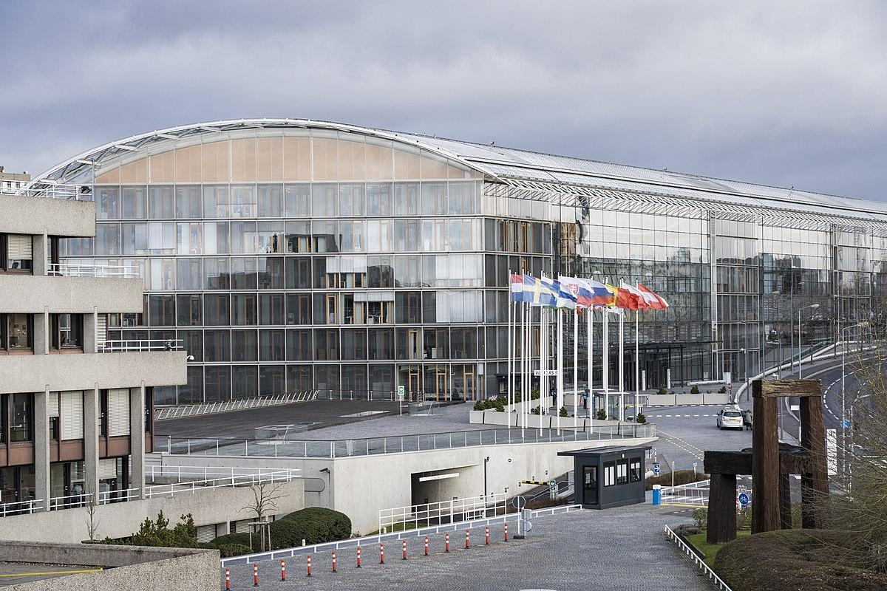

## Table of Contents

## What is the European Investment Bank?

The European Investment Bank (EIB) is a bank owned by the countries in the European Union. It helps to fund projects that can help the economy and improve people's lives. The EIB gives loans to businesses, cities, and countries to help them build things like roads, hospitals, and schools. It also helps to fund projects that are good for the environment, like renewable energy.

The EIB is different from other banks because it doesn't try to make a profit. Instead, it focuses on helping the European Union achieve its goals. These goals include fighting climate change, supporting small businesses, and helping less wealthy regions grow. The bank gets its money from investors who want to support these goals, and it uses this money to make loans at low interest rates.

## When was the European Investment Bank founded?

The European Investment Bank was founded in 1958. This was the same year that the Treaty of Rome was signed, which created the European Economic Community. The EIB was set up to help this new community grow and develop.

The bank started with six member countries: Belgium, France, Germany, Italy, Luxembourg, and the Netherlands. Over time, as more countries joined the European Union, they also became part of the EIB. Today, the bank helps fund projects all over Europe and even in other parts of the world.

## What are the primary objectives of the European Investment Bank?

The European Investment Bank has a few main goals. One big goal is to help the European Union grow and become stronger. It does this by giving money to projects that can help the economy. These projects can be things like building roads, hospitals, or schools. The EIB wants to make sure that all parts of Europe, especially the poorer areas, can grow and develop.

Another important goal of the EIB is to help protect the environment. The bank gives money to projects that use renewable energy, like wind or solar power. It also supports projects that help fight climate change. The EIB wants to make sure that Europe is a leader in taking care of the planet.

The EIB also works to support small businesses and help them grow. It gives loans to these businesses so they can start up or expand. This helps create jobs and makes the economy stronger. Overall, the EIB's main objectives are to help the economy grow, protect the environment, and support small businesses.

## How is the European Investment Bank structured?

The European Investment Bank has a simple structure. At the top is the Board of Governors, which includes finance ministers from all the countries in the European Union. They meet once a year to set the bank's overall direction and approve its financial statements. Below the Board of Governors is the Board of Directors, made up of people chosen by the member countries. This board meets often to make decisions about loans and other important issues.

The day-to-day work of the EIB is done by the Management Committee. This group of people is led by the President of the EIB, who is chosen by the Board of Governors. The Management Committee is in charge of running the bank and making sure it follows the goals set by the Board of Governors and the Board of Directors. There are also many staff members who work in different departments to help with the bank's operations, like giving out loans and checking on projects.

## Who are the members of the European Investment Bank?

The members of the European Investment Bank are the same as the countries in the European Union. Right now, there are 27 countries that are part of the EIB. These countries include big ones like Germany and France, and smaller ones like Malta and Luxembourg. Each country has a say in how the bank is run and what projects it supports.

Every country in the EIB gets to have a representative on the Board of Governors. This group meets once a year to make big decisions about the bank. They also choose people to be on the Board of Directors, which meets more often to decide on things like loans. This way, all the countries work together to make sure the bank is doing a good job and helping the whole European Union.

## What role does the European Investment Bank play in the European Union?

The European Investment Bank plays a big role in the European Union. It helps the EU grow and become stronger by giving money to important projects. These projects can be things like building roads, hospitals, or schools. The EIB wants to make sure that all parts of Europe, especially the poorer areas, can develop and get better. This helps the whole EU economy.

Another important thing the EIB does is help protect the environment. It gives money to projects that use renewable energy, like wind or solar power. It also supports projects that fight climate change. The EIB wants Europe to be a leader in taking care of the planet. It also helps small businesses by giving them loans to start up or grow, which creates jobs and makes the economy stronger.

## How does the European Investment Bank finance its projects?

The European Investment Bank gets money to finance its projects mainly by borrowing from investors around the world. These investors want to support the EIB's goals of helping the European Union grow and protect the environment. The EIB borrows this money at good rates because it has a strong reputation and is backed by the countries in the EU. Once it has this money, the EIB uses it to give out loans to businesses, cities, and countries for projects that can help the economy and the environment.

The loans the EIB gives out are at low interest rates. This makes it easier for businesses and governments to borrow money for important projects. The EIB makes sure to lend money in a way that helps achieve the goals of the European Union, like fighting climate change and supporting less wealthy regions. By doing this, the EIB helps make the whole EU stronger and more sustainable.

## What types of projects does the European Investment Bank typically fund?

The European Investment Bank usually funds projects that help the European Union grow and become stronger. These projects can include building things like roads, bridges, and railways, which make it easier for people and goods to move around. The EIB also gives money to projects that build hospitals, schools, and other important buildings that help people in their everyday lives. It focuses on helping poorer areas of Europe so that everyone can benefit and the whole region can develop together.

Another big type of project the EIB funds is those that help protect the environment. This includes projects that use renewable energy, like wind farms and solar power plants, to reduce the use of harmful fossil fuels. The EIB also supports projects that help fight climate change, like building better public transportation systems or making buildings more energy-efficient. By funding these projects, the EIB helps Europe become a leader in taking care of the planet and making it a better place to live.

## How does the European Investment Bank contribute to sustainable development?

The European Investment Bank helps with sustainable development by giving money to projects that are good for the environment. It supports things like wind farms and solar power plants, which use renewable energy instead of harmful fossil fuels. This helps reduce pollution and fight climate change. The EIB also gives money to make buildings more energy-efficient and to improve public transportation, which helps lower the amount of greenhouse gases in the air.

Another way the EIB helps with sustainable development is by supporting projects that make life better for people in a way that can last for a long time. It gives loans to build roads, hospitals, and schools, especially in poorer areas of Europe. This helps these areas grow and develop without hurting the environment. By doing this, the EIB makes sure that the European Union can keep getting better while also taking care of the planet.

## What is the impact of the European Investment Bank on global economic development?

The European Investment Bank helps the world's economy grow by giving money to projects in different countries. It doesn't just work in Europe but also in other parts of the world, like Africa, Asia, and Latin America. The EIB gives loans to businesses and governments to help them build important things like roads, hospitals, and schools. This helps these countries develop and become stronger. By doing this, the EIB makes the global economy better because when these countries grow, they can trade more with other countries and create more jobs.

The EIB also helps the world by focusing on projects that are good for the environment. It gives money to projects that use clean energy, like wind and solar power, in many countries. This helps fight climate change, which is a big problem for the whole world. By supporting these projects, the EIB makes sure that economic development happens in a way that doesn't hurt the planet. This is important because it means that the world can keep growing and getting better while also taking care of the environment.

## How does the European Investment Bank collaborate with other international financial institutions?

The European Investment Bank works with other big banks and organizations around the world to help countries grow and develop. It often teams up with groups like the World Bank and the International Monetary Fund to give money to projects in places like Africa, Asia, and Latin America. By working together, they can give more money and help more people. They also share ideas and knowledge to make sure the projects they fund are the best they can be.

The EIB also works with other regional development banks, like the African Development Bank and the Asian Development Bank. Together, they focus on projects that can help the environment, like using renewable energy. They also support things like building better roads and hospitals. By working with these other banks, the EIB can help more countries and make a bigger difference in the world. This teamwork helps make sure that economic growth happens in a way that is good for everyone and the planet.

## What are the future challenges and strategies of the European Investment Bank?

One big challenge for the European Investment Bank in the future is dealing with climate change. The EIB wants to keep helping the environment by giving money to projects that use clean energy, like wind and solar power. But as the world gets warmer, there will be more problems like floods and droughts. The EIB needs to find new ways to help countries deal with these problems. It also needs to make sure that the projects it funds are strong enough to handle these changes. This will be hard, but the EIB is working on new plans to make sure it can keep helping.

Another challenge is making sure that all parts of the world can grow and develop in a fair way. The EIB wants to help poorer countries and regions, but it can be tough to do this while also taking care of the environment. The EIB's strategy is to work with other banks and organizations around the world to give more money and share ideas. By working together, they can help more people and make sure that economic growth is good for everyone. The EIB will keep focusing on projects that build important things like roads and hospitals, but it will also make sure these projects are good for the environment.

## References & Further Reading

[1]: European Investment Bank. (n.d.). [History](https://www.eib.org/en/about/key-figures/timeline/index). Retrieved from the official EIB website.

[2]: Treaty of Rome. (1957). [Treaty establishing the European Economic Community](https://eur-lex.europa.eu/EN/legal-content/summary/treaty-of-rome-eec.html). Official Journal of the European Communities.

[3]: European Investment Bank. (2020). [Climate Bank Roadmap 2021-2025](https://www.eib.org/en/publications/the-eib-group-climate-bank-roadmap). Luxembourg: European Investment Bank.

[4]: Aldrich, E. M. (2019). ["European Union and Environmental Policy: Brussels and Multi-Level Climate Governance"](https://onlinelibrary.wiley.com/doi/10.1002/eet.1877). Routledge, 1st Edition.

[5]: Merton, R. C., & Bodie, Z. (1995). "A Conceptual Framework for Analyzing the Financial Environment." In D. B. Crane et al. (Eds.), *The Global Financial System: A Functional Perspective* (pp. 3-31). Harvard Business School Press. 

[6]: Hull, J. (2018). [Options, Futures, and Other Derivatives](https://www.pearson.com/nl/en_NL/higher-education/subject-catalogue/finance/Options-Futures-and-Other-Derivatives-Hull.html). Pearson Education, 10th Edition. 

[7]: Lopez de Prado, M. (2018). [Advances in Financial Machine Learning](https://www.amazon.com/Advances-Financial-Machine-Learning-Marcos/dp/1119482089). Wiley.