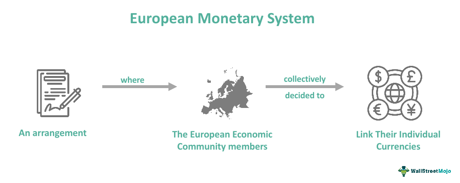

The European Monetary System (EMS) was initiated in 1979 as a crucial mechanism aimed at promoting economic integration and achieving monetary stability across Europe. Designed to reduce exchange rate variability and facilitate closer cooperation between member states, the EMS was part of broader efforts to unify European economies. This article examines how the EMS has contributed to European integration, tracing its evolution over time and assessing its impact on financial systems.

One of the significant developments within the EMS has been the rise of algorithmic trading. Algorithmic trading, which uses computer programs to execute trades based on predefined strategies, has increasingly gained a foothold within the EMS framework. Its integration has revolutionized financial markets by enhancing efficiency, liquidity, and the speed of transactions, thus reshaping the landscape of European finance.

The historical context of the EMS reveals a series of benefits and challenges that have influenced its function. The EMS played a vital role in stabilizing European currencies and laying the groundwork for the eventual introduction of the Euro. Throughout its operational years, the system encountered obstacles such as currency realignments and economic disparities among member nations, which highlighted the complexities of harmonizing national monetary policies.

Moreover, the blending of technological advancements, exemplified by algorithmic trading, presents both opportunities and challenges. While it optimizes trading processes and expands market access, it also introduces risks like market volatility and regulatory vulnerabilities. Addressing these challenges is crucial for maintaining a balanced and resilient financial infrastructure within Europe.

This article will explore the historical trajectory, benefits, and challenges of the EMS and its implications for modern financial systems. It will also examine the transformative effects of algorithmic trading on European markets, thus providing a comprehensive understanding of how the EMS has shaped and continues to influence economic integration and stability in Europe.

## Table of Contents

## History of the European Monetary System

The European Monetary System (EMS) was inaugurated in March 1979 as a strategy to achieve closer economic and monetary integration among European nations. It was primarily designed to establish a zone of monetary stability in Europe, reduce currency fluctuations, and foster economic convergence. The central focus of the EMS was to create an environment that could support long-term economic growth and stability across participating countries.

A significant component of the EMS was the introduction of the European Currency Unit (ECU). The ECU functioned as a unit of account rather than physical currency. It was a basket of member countries' currencies, weighted according to each country's economic size. The ECU served several purposes: it was a reference for the execution of interventions in the foreign exchange markets and for the computation of the exchange rate mechanism (ERM), which limited the permissible exchange rate fluctuations of member currencies. The ECU can be considered a precursor to the Euro, as it played a key role in familiarizing member states with a collective monetary unit and laid the groundwork for future monetary union.

The EMS tackled numerous challenges and reached several milestones during its operation. Among the most notable elements was the ERM, which aimed to stabilize exchange rates by allowing currencies to fluctuate only within agreed margins relative to each other. These margins were periodically adjusted according to economic conditions—a process known as currency realignment. Realignments were frequent during the early years of the EMS, reflecting differences in economic trends among member states and the divergent impact of external economic shocks.

Despite these challenges, the EMS made significant contributions to economic stability and convergence across Europe. By reducing the [volatility](/wiki/volatility-trading-strategies) of exchange rates, the system facilitated deeper integration and cooperation among member countries. It provided a framework that encouraged countries to align their economic policies, which in turn mitigated competitive devaluations and supported the goal of a more unified European economy.

The eventual transition from the EMS to the Economic and Monetary Union (EMU) marked a significant evolution in European monetary policy. With the introduction of the Maastricht Treaty in 1992, European nations committed to creating a single currency and establishing a shared monetary policy governed by the European Central Bank. The EMU came into effect in 1999 with the establishment of the Euro, further diminishing the economic fragmentation within Europe. The Euro became the sole currency in participating nations by 2002, effectively replacing national currencies and cementing the financial unification that the EMS had initially strived to achieve. 

The transformation from the EMS to the EMU was not only a continuation of European economic integration but also represented a significant milestone in the global financial system, highlighting the complex balance between national sovereignty and the benefits of a unified monetary policy.

## The Role of the EMS in European Integration

The European Monetary System (EMS) played a pivotal role in advancing economic cooperation among European nations, serving as a foundation for deeper integration and cohesion across the continent. Established in 1979, the EMS emerged in response to the monetary instability of the 1970s, primarily driven by fluctuating exchange rates and inflation disparities. It sought to foster stability through a structured exchange rate mechanism (ERM), enabling member states to coordinate monetary policies and maintain currency values within defined limits. This system facilitated smoother trade relations and a stable investment climate within Europe, contributing to significant economic integration.

The EMS had a profound impact on trade and investment flows among member states. By pegging national currencies within a specific range, the EMS reduced the uncertainties associated with exchange rate volatility, encouraging cross-border trade and investment. This stability was instrumental in attracting investment and fostering economic growth across participating countries. The intent was to enhance the economic interdependence of member states, leading to a more integrated internal market.

Crucially, the EMS laid the groundwork for establishing a single currency, the Euro. The European Currency Unit (ECU), introduced as a composite currency under the EMS, represented a critical stepping stone for the future adoption of the Euro. The ECU was used in European financial transactions and served as a reference point for exchange rate calculations. This development marked an important shift towards the notion of a unified monetary policy, culminating in the Maastricht Treaty of 1992, which formalized plans for the Economic and Monetary Union (EMU) and the eventual introduction of the Euro.

Despite its successes, the EMS faced significant political and economic challenges in promoting European integration. Diverse economic conditions and fiscal policies among member states often resulted in tensions, necessitating frequent currency realignments to maintain the ERM's stability. For instance, differing inflation rates and economic growth trajectories posed obstacles to achieving uniform monetary policies. Political disagreements over economic alignments and national interests further complicated efforts toward deeper integration.

The long-term effects of the EMS on the European Union's enlargement and cohesion were notable. By fostering a climate of cooperation and interdependence, the EMS set the stage for subsequent EU enlargements, facilitating the entry of new member states into a more stable and integrated economic environment. The EMS experience also informed policy frameworks that emphasized convergence criteria and fiscal discipline, essential components of the EU's economic governance.

In conclusion, the EMS's role in European integration was characterized by promoting monetary stability, encouraging trade and investment, and paving the way for the Euro. Despite facing challenges, its legacy in shaping a cooperative and cohesive European economic landscape is undeniable, underscoring its significance in the historical evolution of the EU.

## Algorithmic Trading and the European Monetary System

Algorithmic trading, often referred to as algo trading, has become a significant component of financial markets globally, including within the European Monetary System (EMS). Characterized by the use of computer algorithms to manage trading decisions at speeds and complexities beyond human capabilities, [algorithmic trading](/wiki/algorithmic-trading) leverages mathematical models and statistical analyses to execute orders efficiently. Its adoption has transformed the landscape of financial transactions, contributing to enhanced market efficiency, [liquidity](/wiki/liquidity-risk-premium), and accuracy.

### Integration of Algorithmic Trading within the EMS Framework

The integration of algorithmic trading into the EMS has been a gradual process, driven by technological advancements and the demand for higher trading volumes at lower costs. Within the EMS framework, algorithmic trading plays a key role in maintaining the stability and fluidity of financial markets by optimizing the execution of transactions, minimizing costs, and managing risks associated with currency fluctuations.

Algorithmic strategies often employed include market-making, [arbitrage](/wiki/arbitrage), and trend-following. These strategies have significant implications for the EMS, as they contribute to the stabilization of exchange rates by providing liquidity and facilitating price discovery. For instance, market-making algorithms continuously quote both buy and sell prices, allowing for tighter spreads and reducing market impact for large orders.

### Advantages of Algorithmic Trading

1. **Improved Efficiency**: Algorithms can process vast amounts of data much faster than human traders. This allows for rapid order execution and the ability to capitalize on short-lived market opportunities.

2. **Increased Liquidity**: By automating numerous trading processes, algorithmic trading enhances market liquidity, which helps in maintaining tighter bid-ask spreads and reducing transaction costs.

3. **Enhanced Accuracy**: Precision in order execution is significantly improved as algorithms eliminate the likelihood of human errors, thus ensuring that transition processes are completed as intended.

### Challenges and Risks

Despite its numerous advantages, algorithmic trading is not without challenges. One primary concern is market volatility, where algorithms, if not properly regulated, can amplify price swings and contribute to flash crashes. Events such as the 2010 Flash Crash in the United States underscore the potential risks associated with erroneous algorithmic strategies.

Regulatory bodies within the Eurozone have taken steps to mitigate these risks through stringent supervision and the establishment of guidelines that govern the usage of algorithmic trading. This includes regulations by the European Securities and Markets Authority (ESMA), which aim to ensure that high-frequency trading practices do not destabilize financial markets.

### Future Prospects

Looking ahead, the role of algorithmic trading in the EMS is expected to expand as financial markets continue to evolve and embrace new technological advancements. The potential integration of cutting-edge technologies such as [artificial intelligence](/wiki/ai-artificial-intelligence) and [machine learning](/wiki/machine-learning) holds promise for further enhancing the capabilities and applications of algorithmic trading.

These developments are anticipated to bolster market robustness and the operational effectiveness of the EMS and Eurozone. However, they also underscore the importance of maintaining a balance between innovation and regulation to prevent unintended negative consequences in European financial systems.

Overall, algorithmic trading represents a critical advancement in the EMS, shaping its present functionalities and future growth within the broader context of European financial integration.

## Benefits and Challenges of the EMS in Modern Financial Systems

The European Monetary System (EMS) played a pivotal role in fostering economic stability and monetary cooperation among European nations. Its long-term benefits are manifold, providing a framework for reduced currency volatility and increased predictability in exchange rates. By implementing mechanisms such as the Exchange Rate Mechanism (ERM), the EMS succeeded in aligning national currencies, which facilitated smoother trade and financial interactions within Europe. This, in turn, contributed to increased economic stability by minimizing the disruptive effects of currency fluctuations and fostering confidence in cross-border economic activities.

However, the EMS faced significant challenges, especially during periods of economic crises and currency fluctuations. The rigid exchange rate mechanisms often struggled to adapt to dynamic economic conditions, forcing periodic realignments. For instance, the early 1990s witnessed several devaluations and withdrawals from the ERM, notably the [exit](/wiki/exit-strategy) of the British pound and the Italian lira in 1992, which underscored the limitations of maintaining fixed exchange rates in volatile economic environments.

The influence of the EMS on current fiscal policies and financial regulations in Europe is substantial. It paved the way for the Economic and Monetary Union (EMU) and the introduction of the Euro, which required stricter fiscal discipline among member states. The EMS's legacy persists in the fiscal frameworks that dictate budgetary constraints and compliance with convergence criteria crucial for maintaining economic stability within the Eurozone.

Technological advancements and digital innovations have been instrumental in addressing the challenges originally faced by the EMS. The rise of real-time data processing, advanced predictive analytics, and algorithmic trading has enhanced the capability of financial systems to respond swiftly to market changes, thereby reducing the risks associated with currency fluctuations. These technologies enable more precise monitoring of economic indicators, allowing for proactive policy adjustments and improved economic forecasting.

Nonetheless, the balancing act between ensuring deep monetary integration and preserving national sovereignty remains a complex issue. While the EMS and its successors aim to unify economic policies, individual member states often grapple with the need to tailor policies to local economic conditions. This tension is evident in debates surrounding fiscal austerity measures and national budgetary autonomy.

The EMS's experience underscores the importance of creating adaptive and resilient monetary systems that can accommodate both integration and the unique economic circumstances of individual nations. As Europe continues its path toward further financial integration, lessons from the EMS era remain pertinent in crafting policies that harmonize national interests with collective economic stability.

## Conclusion

The European Monetary System (EMS) played a critical role in fostering economic integration and stability across Europe. Established in 1979, it created a framework for closer economic cooperation among European nations, facilitating convergence towards monetary stability. The introduction of mechanisms like the European Currency Unit (ECU) set the stage for the eventual adoption of the Euro, marking a significant milestone in European financial integration.

Algorithmic trading, with its data-driven approaches and high-speed execution capabilities, has become a vital component of modern financial markets. Within the EMS framework, algorithmic trading contributed to enhanced market efficiency, liquidity, and accuracy. The rapid processing power and sophisticated algorithms allowed for more precise pricing and adjustments, although these advancements also introduced complexities such as potential market volatility and regulatory challenges that needed to be managed.

From the EMS experience, crucial lessons have been learned for future monetary cooperation in Europe. The EMS demonstrated the benefits of coordinated monetary policies and convergence criteria, but also highlighted the challenges in maintaining such a system during economic upheavals. The shift from fixed to more flexible mechanisms suggests that any future systems must be adaptable to withstand financial crises while retaining stability.

Looking forward, the European financial systems are anticipated to continue evolving toward deeper integration, with the digital economy and fintech solutions providing new avenues for growth. However, it will be vital to ensure a balance between innovation and regulation, safeguarding financial stability while fostering economic growth. As technology advances, the power of algorithms must be harnessed carefully to avoid systemic risks, requiring comprehensive regulatory frameworks aligning with innovative practices.

In conclusion, the EMS's legacy underscores the importance of a harmonious blend of cooperation, innovation, and regulation. It serves as a testament to the potential of coordinated monetary systems while highlighting the necessity of continuous adaptation to meet the challenges of an ever-evolving global economic landscape.

## References & Further Reading

[1]: De Grauwe, P. (2007). ["The Economics of Monetary Integration."](https://archive.org/details/economicsofmonet00grau) Oxford University Press.

[2]: Eichengreen, B. (2008). ["The European Economy Since 1945: Coordinated Capitalism and Beyond."](https://www.jstor.org/stable/j.ctt7rpfs) Princeton University Press.

[3]: Lopez de Prado, M. (2018). ["Advances in Financial Machine Learning."](https://www.amazon.com/Advances-Financial-Machine-Learning-Marcos/dp/1119482089) Wiley.

[4]: Caporale, G. M., & Girardi, A. (2013). ["Price Discovery and Trade Fragmentation in a Multimarket Environment: Evidence from European Blue Chips."](https://pmc.ncbi.nlm.nih.gov/articles/PMC6203629/) Journal of International Financial Markets, Institutions and Money.

[5]: Chadwick, S. (2020). ["Algorithmic Trading and Regulation in European Financial Markets."](https://onlinelibrary.wiley.com/doi/10.1111/rego.12437) Routledge.

[6]: Cobham, D. (2013). ["The European Monetary System: Past, Present and Future."](https://link.springer.com/book/10.1007/978-94-009-4488-6) Springer.

[7]: Getmansky Sherman, M., Lo, A. W., & Zhang, R. (2017). ["Scale and Scope Economies in the Hedge Fund Industry."](https://www.sciencedirect.com/science/article/abs/pii/S0304405X11002868) National Bureau of Economic Research.