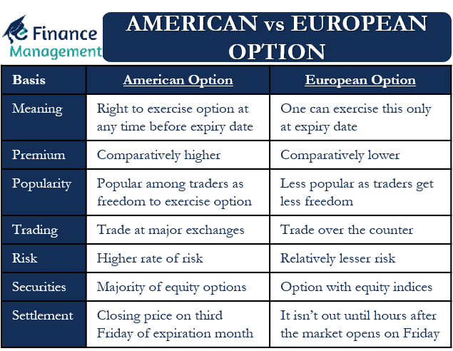

## Table of Contents

## What is a European option?

A European option is a type of financial contract that gives the buyer the right, but not the obligation, to buy or sell an asset at a specific price on a specific date. This is different from an American option, which allows the buyer to exercise the option at any time before the expiration date. The asset in question is usually a stock, but it can also be a commodity, currency, or index.

The key feature of a European option is that it can only be exercised at the expiration date. This means that if you have a European call option (the right to buy), you can only buy the asset at the agreed price on the expiration date, not before. Similarly, if you have a European put option (the right to sell), you can only sell the asset at the agreed price on the expiration date. This makes European options simpler to value than American options because there are fewer variables to consider.

## How does a European option differ from an American option?

A European option and an American option are both types of financial contracts that give the buyer the right to buy or sell an asset at a set price. The main difference between them is when the buyer can use this right. With a European option, the buyer can only use this right on the expiration date of the option. This means if you have a European option to buy a stock, you can only buy it on the last day the option is valid.

On the other hand, an American option lets the buyer use their right at any time before the expiration date. So, if you have an American option to sell a stock, you can choose to sell it any day before the option expires, not just on the last day. This flexibility makes American options more complex to value than European options because there are more choices for when to use them.

## What are the key characteristics of a European option?

A European option is a type of financial agreement where you can buy or sell something like a stock at a set price, but you can only do it on one specific day. That day is called the expiration date. This means if you have a European option, you have to wait until that day to decide if you want to use it or not. It's different from other options because you don't get to choose when to use it before that date.

Because you can only use a European option on the expiration date, it's easier to figure out how much it's worth compared to other types of options. The value depends on things like how much the stock is worth now, how much it might be worth in the future, and what the set price is. Since you can't use it early, there are fewer things to think about when deciding its value.

## Can you explain the concept of exercise date in European options?

The exercise date for a European option is the only day you can use the option. If you have a European option, you can't decide to use it early. You have to wait until the exercise date, which is also called the expiration date. On this day, you can choose to buy or sell the asset at the price set in the option contract.

This rule makes European options simpler than other types of options. Because you can only use the option on one specific day, it's easier to figure out how much the option is worth. You just need to think about the price of the asset on that day and compare it to the price set in the option. If the asset's price is better than the option's price, you might want to use the option. If not, you'll probably let it expire without using it.

## What are the advantages of European options for investors?

European options can be easier for investors to understand and use. Because you can only use them on one specific day, it's simpler to figure out what they might be worth. This makes them less risky for some investors who don't want to worry about when to use the option. It's like having a clear deadline, so you can plan better.

Another advantage is that European options are often cheaper than American options. Since you can't use them early, they usually cost less to buy. This can be good for investors who want to save money on the options they buy. It's like getting a good deal because you're agreeing to wait until the end to use your option.

## How do European options impact option pricing models?

European options make option pricing models simpler because you can only use them on one specific day. This means that when figuring out how much a European option is worth, you only have to think about the price of the asset on that one day. This is different from American options, where you have to consider the price of the asset every day until the option expires. Because there are fewer things to think about, the math for pricing European options is easier.

One common model used for pricing European options is the Black-Scholes model. This model looks at things like the current price of the asset, how much the price might change in the future, the time until the option expires, and the interest rate. Since you can only use a European option on the expiration date, the Black-Scholes model can give a clear answer about what the option is worth. This makes it easier for investors to understand and use European options in their investment plans.

## What are some common strategies involving European options?

One common strategy with European options is called a "buy and hold" strategy. This means you buy a European call option, which gives you the right to buy a stock at a set price on the expiration date. If you think the stock's price will go up a lot before that date, you might buy the option and then wait until the expiration date to see if you can buy the stock cheaper than its market price. This can be a good way to make money if the stock goes up a lot, but you have to be right about the stock's price on that one specific day.

Another strategy is called "hedging." This is when you use European options to protect other investments you have. For example, if you own a stock and you're worried its price might go down, you can buy a European put option. This gives you the right to sell the stock at a set price on the expiration date. If the stock's price does go down, you can use the put option to sell it at the higher price you set, which helps you lose less money. This way, you're using the European option to make your other investments safer.

## How do European options affect the risk management of a portfolio?

European options can help manage the risk of a portfolio by giving investors a way to protect their investments. If an investor owns stocks and is worried that their prices might go down, they can buy European put options. These options give the investor the right to sell their stocks at a set price on the expiration date. If the stock price does drop, the investor can use the put option to sell the stock at the higher price they set, which helps them lose less money. This way, European options act like insurance for the portfolio, making it safer.

Another way European options can affect risk management is by allowing investors to take advantage of potential price increases without buying the stock outright. An investor can buy a European call option, which gives them the right to buy a stock at a set price on the expiration date. If the stock's price goes up a lot, the investor can use the call option to buy the stock at the lower price they set and then sell it at the higher market price. This can help the investor make money if they're right about the stock's price on that specific day. By using European options, investors can manage their risk and potentially increase their returns.

## Can you discuss the impact of dividends on European options?

Dividends can affect the value of European options, especially if the option is for a stock that pays dividends. If a stock is going to pay a dividend before the expiration date of a European call option, it might make the option less valuable. This is because when a stock pays a dividend, its price usually goes down by the amount of the dividend. Since you can only use a European call option on the expiration date, you won't get the dividend if you buy the stock then. So, the option becomes less attractive because you miss out on the dividend payment.

On the other hand, if you have a European put option on a stock that's about to pay a dividend, the option might become more valuable. This is because the stock price is expected to drop after the dividend payment. If the stock price goes down, it's more likely that you'll want to use your put option to sell the stock at the higher price you set. So, the put option becomes more useful because it helps you sell the stock for more than its new, lower price after the dividend.

## What are the tax implications of trading European options?

Trading European options can have tax consequences that depend on where you live and how you use the options. In many countries, if you make money from trading options, you might have to pay capital gains tax. This tax is on the profit you make when you sell an option for more than you paid for it or when you use an option to buy or sell a stock at a profit. The rules can be different depending on whether you're trading as an individual or as part of a business, so it's a good idea to check with a tax expert to understand what applies to you.

Sometimes, how you use European options can also affect your taxes. If you use options as part of your job or business, the profits might be treated as regular income instead of capital gains. This could mean you pay a different tax rate. Also, if you lose money trading options, you might be able to use those losses to reduce your taxes. But again, tax laws can be complicated, so it's important to talk to a tax professional to make sure you're following the rules and getting the best tax treatment for your situation.

## How do market conditions influence the choice between European and American options?

Market conditions can play a big role in deciding whether to use European or American options. If the market is very volatile, meaning prices are going up and down a lot, an American option might be better. This is because you can use an American option at any time before it expires. If the price of the stock suddenly goes in your favor, you can use the option right away to make a profit. With a European option, you have to wait until the expiration date, which might not be as good if the price changes a lot before then.

On the other hand, if the market is more stable and you're looking for a simpler, cheaper option, a European option might be a better choice. Since you can only use a European option on the expiration date, it's easier to predict its value and it usually costs less than an American option. This can be good if you have a clear idea of where you think the stock price will be on that specific day. So, the choice between European and American options often depends on how much you think the market will change and how much risk you're willing to take.

## What are the advanced hedging techniques using European options?

One advanced hedging technique using European options is called a "collar." This is when you own a stock and you want to protect it from losing value, but you also don't want to spend too much money. To do a collar, you buy a European put option, which gives you the right to sell your stock at a set price on the expiration date. At the same time, you sell a European call option on the same stock, which means someone else can buy your stock from you at a set price on the expiration date. This way, you limit how much you can lose if the stock price goes down, but you also limit how much you can gain if the stock price goes up a lot.

Another technique is called a "straddle." This is used when you think a stock's price might move a lot, but you're not sure if it will go up or down. To do a straddle, you buy both a European call option and a European put option on the same stock with the same expiration date and the same set price. If the stock price goes up a lot, you can use the call option to buy the stock at a lower price and make a profit. If the stock price goes down a lot, you can use the put option to sell the stock at a higher price and make a profit. This way, you can make money no matter which way the stock price moves, as long as it moves a lot.

## What are European Options?

European options are a fundamental type of financial derivative that players in the financial markets use to gain exposure to various asset classes. An option is a contract that grants the holder the right, but not the obligation, to buy or sell an underlying asset at a pre-specified price, known as the strike price, within a defined period. European options are characterized by the fact that they can only be exercised at the point of expiration rather than at any time before expiration.

In contrast, their American counterparts can be exercised at any point up to the expiration date, adding a layer of flexibility not available in European contracts. This characteristic distinction is the primary basis for their geographical naming, rather than any association with specific continents or markets.

European options feature a straightforward exercise and expiration framework, meaning that the holder can only exercise the option on its expiration date. This restriction can simplify the pricing models and risk management associated with these options. The Black-Scholes model is commonly used for pricing European options due to their definitive exercise date, enabling traders to estimate the option's value more accurately. The formula for the Black-Scholes model is as follows:

$$
C = S_0 N(d_1) - Xe^{-rt} N(d_2)
$$

where:
$$
d_1 = \frac{\ln(S_0 / X) + (r + \sigma^2 / 2)t}{\sigma \sqrt{t}}
$$
$$
d_2 = d_1 - \sigma \sqrt{t}
$$

In these equations, $C$ represents the call option price, $S_0$ is the current price of the stock, $X$ is the strike price, $r$ is the risk-free [interest rate](/wiki/interest-rate-trading-strategies), $t$ is the time to expiration, $\sigma$ is the [volatility](/wiki/volatility-trading-strategies), and $N(d)$ is the cumulative distribution function of the standard normal distribution.

The simplicity of the exercise structure makes European options particularly popular in [algorithmic trading](/wiki/algorithmic-trading) strategies where clear rules can facilitate streamlined investment approaches and risk assessments. While this streamlined structure may appear limiting as compared to American options, it enhances predictability and often results in lower premiums due to the inherent constraints on execution.

## What are the differences between European and American Options?

European and American options are two primary types of options that differ primarily in terms of their exercise periods and flexibility. While both serve as crucial instruments in financial markets, the distinctions between their exercise rights, pricing, and scenarios where each may be more beneficial greatly influence trading strategies. 

### Exercise Periods and Flexibility

European options can only be exercised at their expiration date. This fixed exercise period requires traders to wait until the contract reaches its maturity to realize any profits. As a result, European options typically offer less flexibility compared to American options. On the other hand, American options allow holders the flexibility to exercise the option at any time before the expiration date. This capability provides traders with opportunities to capitalize on favorable market conditions as they arise.

### Pricing and Premium Differences

The differences in exercise flexibility are reflected in the pricing and premiums of these options. Generally, because American options offer greater flexibility, they tend to [carry](/wiki/carry-trading) higher premiums than European options. This additional cost is frequently justified as it compensates for the potential advantage of early exercise. The pricing of options can be understood and calculated by models such as the Black-Scholes model, which is commonly used for European options. The model can be expressed by:

$$
C = S_0N(d_1) - Xe^{-rT}N(d_2)
$$

$$
d_1 = \frac{\ln(S_0/X) + (r + \sigma^2/2)T}{\sigma \sqrt{T}}
$$

$$
d_2 = d_1 - \sigma \sqrt{T}
$$

Where $C$ is the call price, $S_0$ is the current stock price, $X$ is the strike price, $r$ is the risk-free interest rate, $\sigma$ is the volatility, $T$ is the time to maturity, and $N$ is the cumulative distribution function of the standard normal distribution.

American options require more complex models, like the Binomial Tree or Monte Carlo simulation, to account for the possibility of early exercise.

### Pros and Cons in Trading Scenarios

In trading scenarios, the choice between European and American options can have significant implications. European options, with their lower premiums, might be more appealing in situations where the investor plans to hold the option through to maturity or when dealing with options on indices, as these often utilize European-style options. Conversely, American options provide the advantage of flexibility, making them more suitable for markets with significant volatility or for assets where price movements might prompt early exercise.

Each option type has its strategic benefits: European options afford traders predictable costs and outcomes at maturity, while American options grant opportunities for strategic decision-making across the options' lifespan. Traders need to align their option selection with their financial goals, risk tolerance, and market conditions to optimize their potential returns.

## References & Further Reading

[1]: Black, F., & Scholes, M. (1973). ["The Pricing of Options and Corporate Liabilities."](https://www.cs.princeton.edu/courses/archive/fall09/cos323/papers/black_scholes73.pdf) The Journal of Political Economy, 81(3), 637-654.

[2]: Cox, J. C., Ross, S. A., & Rubinstein, M. (1979). ["Option Pricing: A Simplified Approach."](https://www.sciencedirect.com/science/article/pii/0304405X79900151) Journal of Financial Economics, 7(3), 229-263.

[3]: Hull, J. C. (2021). ["Options, Futures, and Other Derivatives."](https://elibrary.pearson.de/book/99.150005/9781292410623) 11th Edition. Pearson.

[4]: Shreve, S. E. (2004). ["Stochastic Calculus for Finance I: The Binomial Asset Pricing Model."](https://www.amazon.com/Stochastic-Calculus-Finance-Binomial-Springer/dp/0387249680) Springer.

[5]: Wilmott, P. (2006). ["Paul Wilmott Introduces Quantitative Finance."](https://www.amazon.com/Paul-Wilmott-Quantitative-Finance-Set/dp/0470018704) 2nd Edition. Wiley.