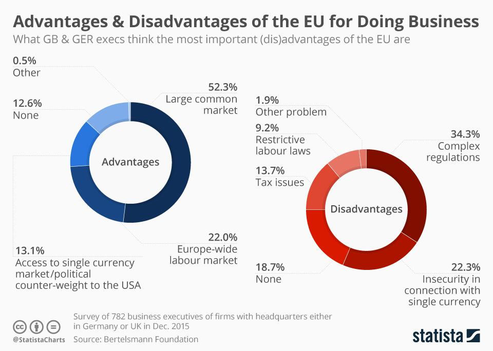

## Table of Contents

## What is the European Single Market?

The European Single Market is a big area where people from different countries in Europe can buy and sell things easily. It includes countries in the European Union (EU) and some others that are close by. The idea is to make it easier for businesses to sell their products and services across borders, without lots of rules and taxes getting in the way.

This market helps people find more choices when they shop, and it can make things cheaper too. It's not just about buying and selling things; it also lets people work in different countries more easily. For example, a doctor from France can work in Germany without too much trouble. The goal is to help the whole area grow and work together better.

## When was the European Single Market established?

The European Single Market was officially established on January 1, 1993. This was a big step for the countries in Europe because it meant they could work together more easily. Before this, each country had its own rules and taxes, which made it hard for businesses to sell things in other countries.

The idea for the Single Market started a long time before 1993. Leaders in Europe began talking about it in the 1950s and 1960s. They wanted to make Europe stronger by helping countries trade with each other more easily. It took many years of planning and agreements to make the Single Market happen, but it finally came together in 1993.

## How does the European Single Market benefit consumers?

The European Single Market helps consumers by giving them more choices when they shop. Because businesses can sell their products across different countries more easily, people can buy things from all over Europe. This means you can find more types of products, like food, clothes, and electronics. For example, if you live in Italy, you can easily buy a special kind of cheese from France or a new phone made in Germany.

Another way the Single Market benefits consumers is by making things cheaper. When businesses can sell in more countries without lots of extra taxes and rules, they can save money. These savings can then be passed on to customers, making products and services less expensive. Also, because there's more competition between businesses, they often try to offer better prices to attract customers. So, the Single Market helps people save money and get better deals.

## What are the main advantages of the European Single Market for businesses?

The European Single Market gives businesses a bigger place to sell their products and services. Before, each country had its own rules and taxes, which made it hard for businesses to sell in other countries. Now, with the Single Market, businesses can sell across all the countries in the EU without these extra hassles. This means a company in Spain can easily sell its products in Sweden or Poland. It's like having one big market instead of many small ones, which helps businesses grow and reach more customers.

Another big advantage is that businesses can save money. When they don't have to pay lots of different taxes and follow lots of different rules, they can keep more of their money. This can help them make their products cheaper or spend more on making them better. Also, being able to sell in more countries means businesses can sell more products, which can lead to bigger profits. So, the Single Market helps businesses save money and make more money at the same time.

## How does the European Single Market affect job creation?

The European Single Market helps create more jobs by making it easier for businesses to grow and sell their products across different countries. When businesses can sell to more people in different countries, they often need more workers to help them. For example, a company in Belgium might need to hire more people to make and deliver their products to customers in Italy or Greece. This means more job opportunities for people all over Europe.

Another way the Single Market affects job creation is by making it easier for people to work in different countries. Before, it was hard for someone from one country to get a job in another country because of different rules and paperwork. Now, it's easier for a person from Portugal to work in the Netherlands or for someone from Finland to work in Spain. This helps people find jobs that match their skills and interests, no matter where they live. So, the Single Market not only helps businesses create jobs but also helps people find those jobs more easily.

## What are the key disadvantages of the European Single Market for member countries?

One key disadvantage of the European Single Market for member countries is that it can be hard for some businesses to compete with bigger companies from other countries. When businesses from different countries can sell their products everywhere in the EU, smaller local businesses might struggle. They might not have the money or resources to compete with bigger companies that can sell cheaper products. This can lead to some local businesses closing down, which can be bad for the local economy and jobs.

Another disadvantage is that countries have less control over their own rules and laws. To make the Single Market work, countries have to agree on many things, like taxes and safety rules. This means a country might have to change its own rules to match what the EU decides. Some people think this takes away a country's ability to make its own decisions and do what's best for its own people. It can also make things more complicated because there are so many rules to follow, which can be hard for businesses and governments to manage.

## How does the European Single Market impact small and medium-sized enterprises (SMEs)?

The European Single Market can be both good and tough for small and medium-sized enterprises (SMEs). On the good side, it gives SMEs a bigger market to sell their products. Instead of just selling in their own country, they can now sell to customers all over Europe. This can help them grow their business and make more money. Also, because there are fewer taxes and rules to deal with, it can be cheaper and easier for SMEs to sell in other countries.

On the tough side, SMEs might find it hard to compete with bigger companies from other countries. These bigger companies often have more money and resources, so they can sell their products at lower prices. This can make it hard for SMEs to keep up. Also, even though there are fewer rules overall, there are still a lot of rules to follow, and it can be hard for SMEs to understand and manage all of them. This can make it difficult for them to take full advantage of the Single Market.

## What role does the European Single Market play in the free movement of goods, services, capital, and people?

The European Single Market makes it easier for goods, services, capital, and people to move freely across different countries in Europe. For goods, it means that a company in one country can sell its products in any other country without facing lots of taxes or different rules. This helps businesses sell more and gives people more choices when they shop. For services, it means that a service provider, like a plumber or a lawyer, can offer their services in other countries more easily. This helps service businesses grow and gives people more options for services.

For capital, the Single Market allows money to move freely between countries. This means that people and businesses can invest in other countries more easily, which can help the economy grow. For people, the Single Market makes it easier to live and work in different countries. Someone from Spain can move to Denmark to work without lots of paperwork and restrictions. This helps people find jobs that match their skills and interests, and it helps businesses find the workers they need. Overall, the free movement in the Single Market helps the whole area work together better and grow stronger.

## How does the European Single Market address issues of competition and state aid?

The European Single Market tries to make sure that businesses compete fairly by having rules about competition. These rules stop big companies from doing things that are not fair, like making secret deals with other companies to keep prices high. The European Commission, which is like the government for the EU, watches over this and can punish companies that break the rules. This helps small businesses have a better chance to compete and keeps prices fair for everyone.

The Single Market also has rules about state aid, which is when a country gives money or help to its own businesses. These rules stop countries from giving too much help to their businesses, because that can make it hard for businesses from other countries to compete. The European Commission checks these state aid plans to make sure they are fair and don't hurt competition. This helps keep the market balanced and gives all businesses a fair chance to succeed.

## What are the challenges of harmonizing regulations across different member states?

Harmonizing regulations across different member states in the European Single Market is tough because each country has its own way of doing things. Some countries might have strict rules about safety or the environment, while others might have different ideas about what is important. When these countries come together, they need to agree on one set of rules that everyone can follow. This can take a lot of time and talking because everyone wants to make sure the rules work well for their own people and businesses.

Another challenge is that even when countries agree on new rules, it can be hard to make sure everyone follows them. Each country has its own way of enforcing laws, and some might be better at it than others. If one country doesn't follow the rules, it can cause problems for the whole Single Market. For example, if one country lets businesses pollute more than the rules say, it can hurt the environment in other countries too. So, making sure everyone sticks to the same rules is a big job that needs a lot of cooperation and checking.

## How has the European Single Market evolved in response to global economic changes?

The European Single Market has changed a lot over the years to keep up with what's happening in the world's economy. When things like the internet and new technology came along, the Single Market had to make new rules to help businesses use them. For example, they made it easier for people to buy things online from other countries in Europe. They also made rules to protect people's information when they shop online. This helps businesses grow and keeps customers safe at the same time.

Another big change came after the 2008 financial crisis. The Single Market had to find ways to help the economy get better. They made rules to make banks safer and to help businesses get money to grow. They also worked on making it easier for young people to find jobs, because many were out of work after the crisis. These changes help the Single Market stay strong and keep working well, even when the world's economy is going through tough times.

## What future developments are anticipated for the European Single Market?

In the future, the European Single Market is expected to keep growing and changing to make things even easier for businesses and people. One big thing they might work on is making it easier for businesses to sell things online across different countries. Right now, it can still be hard because of different rules and taxes. If they can fix this, it will help small businesses sell more and give people more choices when they shop online. They might also work on making it easier for people to move and work in different countries, which can help more people find good jobs.

Another thing they might do is focus on new areas like green energy and digital services. As the world tries to use less energy from dirty sources like coal and oil, the Single Market could help countries work together to make and use more green energy. This can help the environment and create new jobs. For digital services, like apps and online classes, they might make new rules to help these businesses grow and make it easier for people to use them. These changes can help the Single Market stay strong and keep helping Europe's economy grow.

## References & Further Reading

[1]: Bergstra, J., Bardenet, R., Bengio, Y., & Kégl, B. (2011). ["Algorithms for Hyper-Parameter Optimization."](https://papers.nips.cc/paper/4443-algorithms-for-hyper-parameter-optimization) Advances in Neural Information Processing Systems 24.

[2]: ["Advances in Financial Machine Learning"](https://www.amazon.com/Advances-Financial-Machine-Learning-Marcos/dp/1119482089) by Marcos Lopez de Prado

[3]: ["Evidence-Based Technical Analysis: Applying the Scientific Method and Statistical Inference to Trading Signals"](https://www.amazon.com/Evidence-Based-Technical-Analysis-Scientific-Statistical/dp/0470008741) by David Aronson

[4]: ["Machine Learning for Algorithmic Trading"](https://github.com/stefan-jansen/machine-learning-for-trading) by Stefan Jansen

[5]: ["Quantitative Trading: How to Build Your Own Algorithmic Trading Business"](https://www.amazon.com/Quantitative-Trading-Build-Algorithmic-Business/dp/1119800064) by Ernest P. Chan