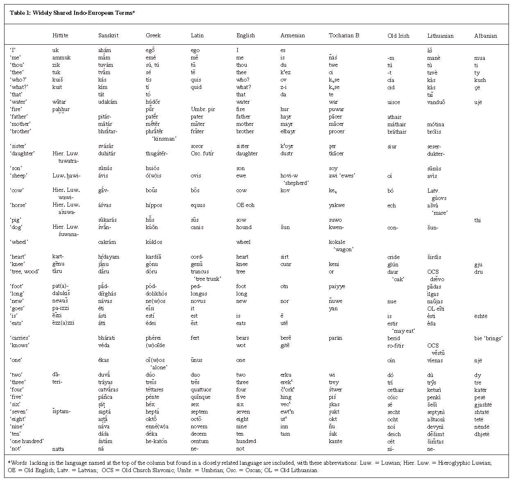

## Table of Contents

## What are European terms?

European terms are words and phrases used in Europe that might be different from those used in other parts of the world. These terms can be about food, like "aubergine" instead of "eggplant," or about everyday things, like "lift" instead of "elevator." They show how language can change from one place to another, even when people speak the same language, like English.

In different European countries, people might use different words for the same thing. For example, in the UK, people say "biscuit" for what Americans call a "cookie." In France, they use "pain au chocolat" for a chocolate-filled pastry, while in some parts of Belgium, they call it "chocolatine." These differences can make traveling in Europe fun and interesting, as you learn new words and ways to say things.

Understanding European terms can help you communicate better when you visit or live in Europe. It's like learning a little bit of a new language within the same language. It can also help you appreciate the rich variety of cultures and traditions across the continent.

## How do European terms differ from country to country?

European terms can be very different from one country to another because each country has its own way of speaking and its own culture. For example, in England, people might say "aubergine" for what Americans call "eggplant," but in France, they use the word "aubergine" too, but it sounds different because they speak French. In Spain, they say "berenjena" for the same vegetable. So, even though the thing is the same, the words change as you move from one country to another.

These differences are not just about food. They can be about everyday things too. In Germany, people say "Handy" for a mobile phone, which might sound funny to English speakers because in English, "handy" means something that is useful and easy to use. In Italy, they call a mobile phone "cellulare." So, if you travel around Europe, you might hear different words for the same things, and it can be fun to learn them.

These variations show how rich and diverse Europe is. Each country has its own history and traditions, and that shows up in the words they use every day. When you visit different places in Europe, paying attention to these terms can help you understand the culture better and make your trip more interesting.

## Can you provide examples of common European terms used in daily life?

In daily life, Europeans use many different words for common things. In the UK, people might ask for a "biscuit" when they want what Americans call a "cookie." If they're hungry, they might say they fancy a "crisp" instead of a "chip." When they need to go shopping, they might head to the "chemist" instead of the "pharmacy." These little differences show how language can change from one place to another, even when people are speaking English.

In other European countries, the differences can be even more noticeable because they speak different languages. In France, if you're looking for a "bakery," you'd ask for a "boulangerie." In Spain, instead of saying "thank you," you'd say "gracias." And if you're in Italy and need to use the "restroom," you'd ask for the "bagno." These terms are part of everyday life in these countries, and knowing them can make traveling and communicating much easier.

These examples show how rich and varied European languages and cultures are. Even simple things like food, shopping, and saying thanks can have many different words across the continent. Learning these terms can help you feel more at home when you visit different European countries.

## What is the significance of European terms in international communication?

European terms are important in international communication because they help people understand each other better. When people from different countries talk, they might use different words for the same things. For example, someone from the UK might say "aubergine" while someone from the US says "eggplant." Knowing these different words can help avoid confusion and make conversations smoother. It's like having a little dictionary in your head that helps you translate words from one country to another.

Learning European terms also shows respect for other cultures. When you use the right words for things in another country, it shows that you care about their language and traditions. This can make people feel more comfortable and appreciated. For example, saying "gracias" in Spain instead of "thank you" can make a big difference in how people see you. It's a small thing, but it can help build better relationships and understanding between people from different places.

## How have European terms evolved historically?

European terms have changed a lot over time because of history and how people moved around. Long ago, different groups of people lived in Europe, and each group had its own language. When these groups met and mixed, their languages started to mix too. For example, when the Romans ruled over much of Europe, they brought Latin words with them. These Latin words mixed with the local languages and created new words. Over hundreds of years, as people kept moving and trading, more words came into the languages. This is why we have so many different words for the same things in Europe today.

In the last few hundred years, big events like wars and new inventions also changed European terms. During World War II, many people had to move from one country to another, and they brought their words with them. New inventions like cars and computers needed new words too. Sometimes, countries would borrow words from each other. For example, the English word "biscuit" came from the French word "biscuit," which means "twice-cooked." As Europe became more connected, people started using more similar words, but there are still many differences because of the long history of each country.

## What are some key European terms related to the European Union?

The European Union, or EU, uses some special words that are important for its work. One key term is "Euro," which is the money used by many countries in the EU. Another important word is "Schengen Area," which means that people can travel between certain countries without showing their passports. The EU also talks about the "Single Market," where goods, services, people, and money can move freely between member countries.

Other important EU terms include "European Parliament," which is where people from all over the EU vote on laws, and "European Commission," which makes sure these laws are followed. The "Council of the European Union" is where leaders from each country meet to make big decisions. These terms help explain how the EU works and what it does to bring countries together.

## How do European terms influence global business practices?

European terms can have a big effect on how businesses work around the world. When companies do business in Europe, they need to know the right words to use. For example, if a company from the United States wants to sell "cookies" in the United Kingdom, they need to call them "biscuits" instead. This helps them talk to customers and other businesses in a way that makes sense to everyone. It's important because using the wrong words can make things confusing and hard to understand.

Also, knowing European terms can help businesses follow the rules in different countries. For example, if a company wants to sell things in the European Union, they need to understand terms like "Euro" for money and "Single Market" for how goods can move freely. This helps them know how to sell their products the right way and avoid problems with the law. Understanding these terms makes it easier for businesses to work well in Europe and around the world.

## What are the challenges in standardizing European terms across different languages?

Standardizing European terms across different languages is hard because each country has its own language and culture. People in different countries use different words for the same things. For example, "biscuit" in the UK is "cookie" in the US. If you try to make everyone use the same word, some people might not like it because they are used to their own words. Also, languages change over time, so a word that works today might not work in the future.

Another challenge is that some words don't have the same meaning in all languages. For example, "Handy" in German means "mobile phone," but in English, it means something useful. This can make it hard to find one word that everyone understands. Plus, people feel proud of their language and don't want to lose their special words. So, even if you try to standardize terms, it's tough to get everyone to agree and use them the same way.

## Can you explain the impact of European terms on legal frameworks within Europe?

European terms have a big impact on the legal frameworks within Europe because they help make sure everyone understands the laws the same way. When countries in the European Union (EU) work together, they need to use the same words for things like "Euro" for money or "Single Market" for how goods can move freely. This helps them write laws that everyone can follow. If they used different words, it would be hard for people in different countries to understand and follow the laws.

Sometimes, these terms can be tricky because each country has its own language. For example, the word "biscuit" might mean something different in the UK than in France. So, when making laws, the EU has to be careful to use words that everyone understands. This can make writing laws a bit harder, but it's important so that all countries can work together smoothly and fairly.

## How do European terms affect cultural identity and integration within Europe?

European terms play a big role in shaping cultural identity and integration within Europe. Each country has its own special words that are part of their culture. For example, in France, people say "boulangerie" for a bakery, which is different from "bakery" in English-speaking countries. These unique words help people feel proud of their language and traditions. When someone uses these words, it shows they belong to that culture, which strengthens their sense of identity.

At the same time, knowing and using European terms from other countries can help people feel more connected to the rest of Europe. For example, if someone from Spain learns to say "thank you" in German as "danke," it can make it easier to talk to people in Germany. This kind of understanding can help people from different countries feel closer to each other. It's like building bridges between cultures, making Europe more united while still celebrating the differences that make each country special.

## What role do European terms play in academic and scientific research?

European terms are important in academic and scientific research because they help people from different countries understand each other's work. When scientists and researchers use the same words for things like "Euro" for money or "Single Market" for how goods can move freely, it makes it easier to share ideas and work together. If everyone used different words, it would be hard to understand each other's research. This is especially important in fields like medicine, where knowing the right words can help save lives.

In some fields, like biology or physics, scientists often use Latin or Greek words because these languages are used all over the world. But even in these fields, European terms can still be important. For example, when talking about how to do research in different countries, scientists might need to know local words for things like "laboratory" or "experiment." Using the right words helps them work together better and makes sure their research is clear and easy to understand for everyone in Europe.

## How can one effectively learn and use European terms in a professional setting?

Learning and using European terms in a professional setting can be done by starting with the basics. First, find out which terms are important for your job. For example, if you work in business, you might need to know words like "Euro" for money or "Single Market" for how goods can move freely. You can learn these terms by reading [books](/wiki/algo-trading-books), using online resources, or taking classes. It's also helpful to practice using these words in your daily work. Try to use them when you talk to coworkers or write emails. This will help you remember them better and use them more naturally.

Another good way to learn European terms is by working with people from different countries. If you have coworkers or clients from other European countries, ask them about the words they use. They can teach you the right terms and how to use them. You can also try to read news or watch videos from different European countries. This will help you see how people use these terms in real life. Over time, as you keep learning and using these terms, you'll get better at communicating with people from all over Europe in your professional setting.

## References & Further Reading

[1]: Evans, M. (2018). ["Algorithmic Trading and DMA: An introduction to direct access trading strategies"](https://www.amazon.com/Algorithmic-Trading-DMA-introduction-strategies/dp/0956399207). 4Myeloma Press.

[2]: Lopez de Prado, M. (2018). ["Advances in Financial Machine Learning"](https://www.amazon.com/Advances-Financial-Machine-Learning-Marcos/dp/1119482089). John Wiley & Sons.

[3]: Hudson, R.S., & Gregoriou, A. (Eds.). (2015). ["Handbook of High-frequency Trading and Modeling in Finance"](https://onlinelibrary.wiley.com/doi/pdf/10.1002/9781118593486.fmatter). Academic Press.

[4]: Chan, E. P. (2009). ["Quantitative Trading: How to Build Your Own Algorithmic Trading Business"](https://github.com/ftvision/quant_trading_echan_book). John Wiley & Sons.

[5]: Taylor, M., & Allen, H. (1992). ["The Use of Technical Analysis in the Foreign Exchange Market"](https://www.sciencedirect.com/science/article/pii/0261560692900483). Journal of International Money and Finance, 11(3), 304-314.