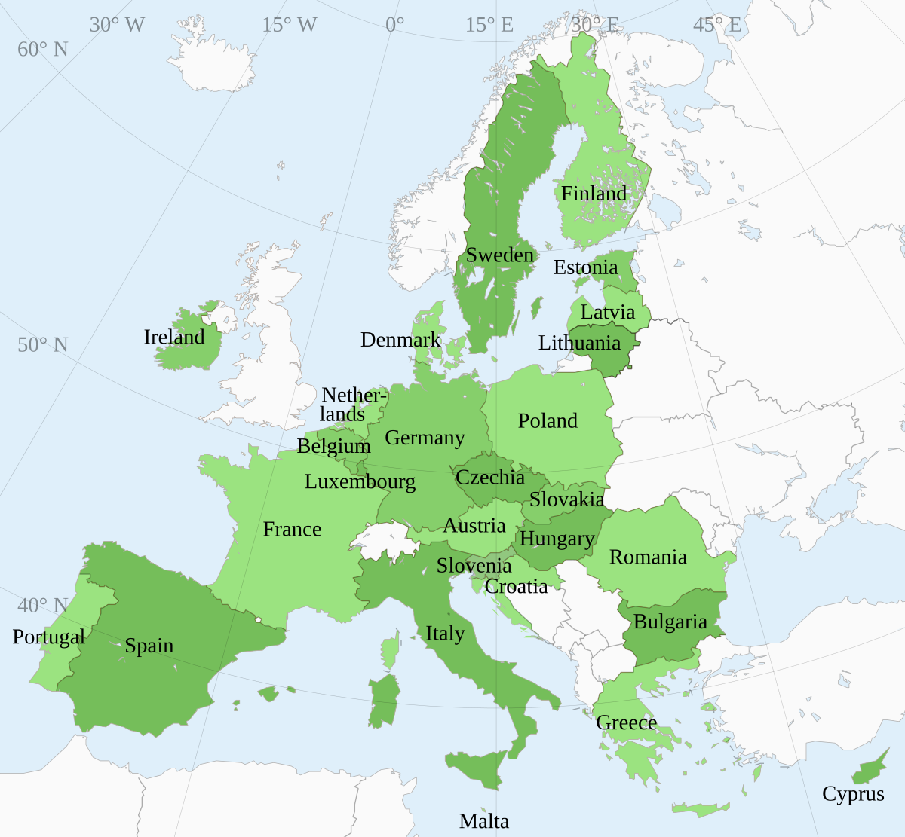

The European Union (EU) is a political and economic union consisting of 27 member countries predominantly located in Europe. Established with the aim of fostering economic cooperation, the EU has become a significant entity, promoting peace, stability, and prosperity across the region. With over 450 million inhabitants, the EU's single market allows for the free movement of goods, services, capital, and people, thereby establishing itself as a major player on the global economic stage. Its influence extends beyond the continent, impacting global trade, environmental policies, and regulatory standards.

Algorithmic trading, commonly known as algo trading, involves the use of computer algorithms to execute trades at high speed and volume. This form of trading has gained prominence in recent years due to advancements in computing power and financial technologies. By leveraging mathematical models and complex calculations, algorithmic trading enhances efficiency and precision compared to traditional trading methods. Its growing significance is marked by the increasing share of trades executed algorithmically, considerably impacting market dynamics and liquidity.

The development of algorithmic trading within EU countries is inextricably linked to the historical and economic fabric of the Union. As the EU evolved politically and economically, financial markets across member states experienced a transformative shift leading to the adoption of advanced trading technologies. The regulatory frameworks established by the EU played a critical role in shaping a transparent, competitive, and innovative financial environment conducive to algorithmic trading. This evolution reflects the EU's capacity to adapt to technological advancements while ensuring economic stability and growth.

The purpose of this article is to explore the history of the European Union, its member countries, and the evolution of algorithmic trading within the region. This examination will provide insights into how historical developments and policy frameworks within the EU have influenced the adoption and growth of algorithmic trading, and what this means for the future of financial markets in Europe.

## Table of Contents

## A Brief History of the European Union

The European Union (EU) traces its origins to the post-World War II landscape, a period marked by a desire for peace and economic cooperation in Europe. In the aftermath of the war, European nations recognized that economic collaboration could act as a bulwark against future conflicts, laying a foundation for enduring peace.

The first significant step toward what would eventually become the EU was the formation of the European Coal and Steel Community (ECSC) in 1951. Proposed by French Foreign Minister Robert Schuman, the ECSC aimed to integrate the coal and steel industries across Europe, specifically the industries of France and Germany, to prevent further hostilities. By pooling these critical resources, the ECSC sought to make war between the member countries, particularly France and Germany, not just unthinkable but materially impossible. The ECSC included six founding countries: Belgium, France, Italy, Luxembourg, the Netherlands, and West Germany.

Building on the ECSC's success, the Treaty of Rome was signed in 1957, establishing the European Economic Community (EEC) and the European Atomic Energy Community (Euratom). The Treaty of Rome marked a significant expansion of cooperation among member states, aiming to create a common market that facilitated the free movement of goods, services, capital, and people. This economic integration heightened the interconnectedness of member states' economies, fostering a robust economic union geared towards prosperity and development.

The Maastricht Treaty, signed in 1992, represented another pivotal moment in EU history. Officially known as the Treaty on European Union, it laid the groundwork for the introduction of a shared currency, the euro, and further integration through the establishment of the European Union itself. The Maastricht Treaty expanded the scope of cooperation to include areas like foreign policy and justice, marking a shift towards a more politically unified entity.

From its original six members, the EU has expanded significantly to include a total of 27 member states. This enlargement reflects the attractiveness of EU membership and the promised benefits of economic growth and political unity. Each enlargement has brought diverse cultures and economies under one umbrella, highlighting the EU's capacity to accommodate new members in pursuit of common goals.

The EU has played a crucial role in promoting economic growth, stability, and political unity across Europe. Through policies that target regional disparities and support infrastructure development, the EU has been instrumental in elevating living standards within its borders. Programs such as the Common Agricultural Policy and Structural Funds illustrate the EU's commitment to balanced growth and solidarity among member states.

In summary, the European Union emerged from a post-war vision of peaceful collaboration, evolving through key treaties like the Treaty of Rome and Maastricht Treaty, and expanding from six to 27 members. Its history embodies a commitment to economic growth, stability, and political unity, showcasing its pivotal role in shaping a cooperative European landscape.

## Understanding EU Member Countries

The European Union (EU) comprises 27 member countries, each joining the union with unique accession dates. The foundational members, joining in 1958, were Belgium, France, Germany, Italy, Luxembourg, and the Netherlands, marking the initial phase of European collaboration. Subsequent expansions saw countries like Denmark, Ireland, and the United Kingdom joining in 1973, with Greece following in 1981. The 1980s and 1990s brought in Spain, Portugal, Austria, Finland, and Sweden. The largest enlargement occurred in 2004 with the accession of ten Eastern European nations, including Poland, Hungary, and the Czech Republic. More recent additions include Bulgaria and Romania in 2007, and Croatia in 2013.

EU membership criteria are defined in the Copenhagen criteria, which require a stable democracy, a functioning market economy, and the adoption of EU laws and regulations. Membership impacts countries by offering access to a large single market, providing economic support through EU funds, and enabling free movement of goods, services, capital, and people, significantly enhancing economic cooperation and political stability.

The EU is characterized by its cultural and economic diversity. Economies range from the highly industrialized, such as Germany's, to those transitioning from central planning systems, like Romania. Cultural diversity is celebrated and protected through policies promoting multiple languages and regional customs.

The governance of the EU is heavily influenced by its institutions. The European Parliament, elected by EU citizens, plays a pivotal role in legislation, budget approval, and supervising other institutions. The European Commission, composed of commissioners from each member state, proposes legislation, enforces EU laws, and manages the EU's day-to-day operations.

Member countries of the EU have faced numerous challenges and milestones. The integration of diverse economies and political systems has required significant adjustments and harmonization of policies. Economic crises, like the 2008 financial crisis, challenged the union's financial stability, prompting the adoption of stringent fiscal measures and regulations. The Brexit vote in 2016 marked a significant milestone, highlighting challenges in political unity and leading to the United Kingdom's departure in 2020.

Through its expansions and governance framework, the EU has continually adapted to address both internal and external challenges, maintaining its commitment to fostering economic growth, stability, and cultural diversity across the continent.

 to Algorithmic Trading

Algorithmic trading, often referred to as automated or black-box trading, is the use of computer systems to execute orders in financial markets based on pre-defined rules and algorithms. These systems are designed to make decisions about trading activities at a speed and frequency that would be impossible for human traders. Algorithms can process vast amounts of market data, identify trading opportunities, and execute trades across various markets, often within milliseconds.

The rise of [algorithmic trading](/wiki/algorithmic-trading) has been facilitated by significant technological advancements. The increase in computational power, coupled with improved data analytics, allows for processing high volumes of market data in real-time. Machine learning and [artificial intelligence](/wiki/ai-artificial-intelligence) have further enhanced the capabilities of trading algorithms, enabling them to adapt and optimize strategies based on market conditions.

Traditional trading methods rely heavily on human judgment and manual order execution, which can be slower and more prone to emotion-driven decisions. In contrast, algorithmic trading systems can operate at greater speeds and efficiency, minimizing human errors and increasing decision-making precision. For example, algorithms can place trades when a stock’s 50-day moving average goes above its 200-day moving average, a strategy known as a "moving average crossover".

One of the key benefits of algorithmic trading is efficiency. It can handle multiple transactions simultaneously with high accuracy, reducing the costs associated with trading. Speed is another significant advantage, as algorithms can react to market movements faster than humans. Additionally, algorithmic trading can help improve market [liquidity](/wiki/liquidity-risk-premium) and ensure more consistent pricing by executing trades based on transparent and open criteria.

However, algorithmic trading is not without risks and challenges. The reliance on automated systems can introduce vulnerabilities, such as technical failures or errors in algorithm design, which can lead to substantial financial losses. Market [volatility](/wiki/volatility-trading-strategies) can be exacerbated by high-frequency trading algorithms, causing sudden and unpredictable price swings. Furthermore, the competition for speed has led to significant investments in infrastructure, like co-location services and advanced networking, which can create disparities between market participants.

In conclusion, while algorithmic trading offers significant advantages in terms of speed, efficiency, and decision-making capabilities, it also poses potential risks and challenges that require careful management and regulation. Balancing innovation with prudent risk management is essential to harness the full potential of algorithmic trading while ensuring market stability.

## The Rise of Algorithmic Trading in the EU

Algorithmic trading, defined as the use of computer algorithms to automate trading decisions based on pre-set criteria, has become a significant component of financial markets globally, including in the European Union (EU). The adaptation of EU financial markets to algorithmic trading has been shaped by unique regional characteristics and regulatory frameworks, making it a dynamic and evolving landscape.

EU financial markets are characterized by their diversity and complexity, encompassing multiple national exchanges and trading venues. Algorithmic trading in the EU has benefited from technological advancements and the ability to quickly analyze and capitalize on market data across these multiple platforms. This capability has contributed to increased market efficiency and liquidity, though it also poses challenges regarding market stability and fairness.

The Markets in Financial Instruments Directive II (MiFID II), implemented in 2018, is a critical regulatory framework influencing algorithmic trading in the EU. MiFID II aims to enhance transparency and investor protection while addressing the risks associated with automated trading. The directive imposes stringent requirements on algorithmic trading practices, including mandatory testing and approval of algorithms, as well as obligations to monitor and manage trading activities.

Several EU financial markets have successfully integrated algorithmic trading, serving as case studies for its broader adoption. For instance, Euronext, a pan-European exchange, has leveraged algorithmic trading to enhance its trading infrastructure and offer advanced order types. Similarly, Deutsche Börse has invested heavily in technology to support algorithmic traders, providing tools for high-frequency and [quantitative trading](/wiki/quantitative-trading) strategies.

These exchanges have recognized the benefits of algorithmic trading, such as increased trading volumes and tighter bid-ask spreads, which enhance overall market quality. However, they also remain vigilant about the potential for market abuse and the need for effective oversight mechanisms.

Looking to the future, the evolution of algorithmic trading in the EU is likely to be shaped by several factors. Advances in artificial intelligence and [machine learning](/wiki/machine-learning) could drive further sophistication in trading algorithms. Additionally, ongoing collaboration between EU member states to harmonize regulatory standards and practices will be crucial in fostering a sustainable environment for algorithmic trading.

The EU's commitment to balancing innovation with rigorous risk management underscores its proactive approach to integrating algorithmic trading into its financial markets. With continued regulatory scrutiny and technological innovation, algorithmic trading in the EU is poised for sustained growth and development.

## The Intersection of EU Policies and Algorithmic Trading

The European Union (EU) has been at the forefront of regulating financial markets to ensure transparency, fairness, and stability, particularly in the wake of the increased adoption of algorithmic trading. Central to this regulatory landscape is the Markets in Financial Instruments Directive II (MiFID II), a legislative framework enacted in 2018 to enhance investor protection and restore confidence in the financial markets. MiFID II imposes stringent requirements on algorithmic trading, mandating controls, testing, and real-time monitoring to mitigate risks associated with high-frequency trading and ensure a level playing field for all market participants[1].

The directive also emphasizes the disclosure of trading algorithms to the relevant authorities, enabling oversight bodies to scrutinize algorithmic strategies for potential market abuse. This regulatory mechanism aims to prevent market disruptions caused by the rapid execution of algorithms, thereby safeguarding market integrity.

Balancing innovation with risk management in the EU markets involves establishing a nuanced regulatory approach that fosters technological progress while mitigating the systemic risks posed by algorithmic trading. The EU supports innovation in financial technology through initiatives like the Digital Finance Package, which outlines strategies for the digital transformation of the financial sector while preserving financial stability and consumer protection[2].

Brexit introduced complexities to the regulatory landscape, impacting algorithmic trading strategies and policies within the EU. With the United Kingdom's departure from the EU, financial firms operating between the UK and EU face the challenge of navigating divergent regulatory frameworks. This separation has prompted firms to adapt their trading algorithms to comply with distinct sets of rules, potentially leading to increased operational costs and fragmented market access[3].

Collaborative efforts within EU countries are pivotal to harmonizing financial technologies and practices. The European Supervisory Authorities, comprising the European Banking Authority, the European Securities and Markets Authority, and the European Insurance and Occupational Pensions Authority, work collectively to ensure consistent application of financial regulations across member states[4]. These collaborative measures aim to create a cohesive regulatory environment that supports the seamless functioning of algorithmic trading across the EU, fostering an integrated and efficient financial market.

By maintaining a robust regulatory framework and promoting cross-border collaboration, the EU continues to play a significant role in shaping the evolution of algorithmic trading, balancing the dual imperatives of innovation and risk management.

References:

1. European Securities and Markets Authority (ESMA). "MiFID II: Key Provisions and Implementation Challenges."
2. European Commission. "Digital Finance Package."
3. Financial Conduct Authority (FCA). "Brexit: Impact and Regulatory Changes."
4. European Supervisory Authorities. "Regulatory Convergence in the EU Financial Sector."

## Conclusion

The European Union (EU) has a rich history characterized by its commitment to peace, economic cooperation, and political unity. Emerging from post-World War II efforts, the EU today stands as a testament to successful supranational collaboration, exerting a significant influence over global trade dynamics. Through strategic treaties and expansions, the EU has facilitated economic growth and stability among its member states while promoting an integrated market.

Algorithmic trading within the EU presents unique challenges and opportunities. The technological revolution in trading systems enhances efficiency and decision-making speed, yet also introduces risks concerning market volatility and flash crashes. The EU’s regulatory framework, such as MiFID II, emphasizes ensuring transparency and fairness, aiming to strike a balance between fostering innovation and mitigating risks.

Moving forward, the EU's role in the evolution of algorithmic trading seems poised for growth, supported by its robust infrastructure and comprehensive regulatory strategies. The intertwining of EU policies with financial markets and technological advancements creates an environment ripe for continued development in algorithmic trading practices. A focus on innovation coupled with effective risk management will likely drive the future trajectory of the EU's financial sector.

To achieve a sustainable and innovative financial future within the EU, collaboration among policymakers, traders, and investors is crucial. Encouraging investment in technology, enhancing regulatory frameworks, and promoting educational initiatives will support the performance of algorithmic trading while maintaining stability. The overarching goal should be to harness the benefits of technological advancements and translate them into tangible economic growth, thereby maintaining the EU's standing as a leader in global financial markets.

## References & Further Reading

[1]: European Commission. ["The European Union: What it is and what it does."](https://european-union.europa.eu/institutions-law-budget/institutions-and-bodies/search-all-eu-institutions-and-bodies/european-commission_en) 

[2]: European Securities and Markets Authority (ESMA). ["MiFID II/MiFIR."](https://www.esma.europa.eu/trading/mifid-ii-and-mifir-review) 

[3]: Lopez de Prado, M. (2018). ["Advances in Financial Machine Learning."](https://www.amazon.com/Advances-Financial-Machine-Learning-Marcos/dp/1119482089) Wiley.

[4]: Chan, E. P. (2008). ["Quantitative Trading: How to Build Your Own Algorithmic Trading Business."](https://github.com/ftvision/quant_trading_echan_book) Wiley.

[5]: Aronson, D. R. (2006). ["Evidence-Based Technical Analysis: Applying the Scientific Method and Statistical Inference to Trading Signals."](https://www.amazon.com/Evidence-Based-Technical-Analysis-Scientific-Statistical/dp/0470008741) Wiley.