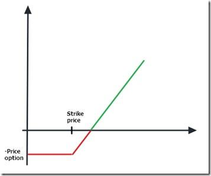

Algorithmic trading has established itself as a major force in financial markets, leveraging the power of computers to execute pre-programmed trading strategies. This automation allows for rapid decision-making based on sophisticated computational models, substantially enhancing efficiency and minimizing human error. As these algorithms become more complex, options pricing emerges as a cornerstone for constructing effective trading strategies. Options, which are financial derivatives that provide the right but not the obligation to buy or sell an asset at a predetermined price, are integral to various hedging and speculative approaches.

Precisely determining the value of options is therefore a critical factor for any trading algorithm. The complexity of options pricing stems from various factors, including the asset's price, volatility, time to expiration, and interest rates, leading to the need for robust mathematical models to ascertain fair values. Traditional models like Black-Scholes, Binomial, and Monte Carlo Simulations have been widely used to address this complexity.



Python has gained significant popularity among traders for its utility in options pricing and broader financial applications. Its appeal arises from several factors: a user-friendly syntax, extensive libraries like NumPy, Pandas, and QuantLib, and a strong community that supports continuous improvement and learning. These resources make it easier for traders to develop and test pricing models efficiently while allowing for extensive data manipulation and analysis. Moreover, Python's versatility and adaptability make it a powerful tool for integrating options pricing models within algorithmic trading strategies.

This article aims to guide traders in using Python for accurate options pricing, which is vital for creating and optimizing algorithmic trading systems. The structure of this article will encompass understanding the core principles of options pricing, leveraging Python's capabilities to implement and integrate these models, and exploring the best practices and considerations for maintaining efficient trading strategies. By offering a detailed explanation and practical implementations, this article aims to assist traders looking for precise and effective pricing solutions.

Optimizing search engine visibility is crucial in today's digital landscape. This article not only serves as a comprehensive guide for traders but is also crafted to enhance search visibility, ensuring that it reaches those who seek efficient pricing methodologies. By presenting detailed, SEO-optimized content, the article addresses the niche of algorithmic trading strategies that utilize Python for options pricing, providing critical insights and practical solutions to traders globally.

## Table of Contents

## Understanding Options Pricing

Options are financial derivatives that provide buyers the right, but not the obligation, to buy or sell an underlying asset at a specified price before a certain date. Understanding options and their pricing mechanisms is essential for traders who aim to develop effective trading strategies. Options play a pivotal role in financial markets by offering flexibility and opportunities for hedging, speculation, and enhancing investment returns.

Options pricing is a critical element in trading strategies as it determines the fair value of an option. The price of an option is typically influenced by factors such as the underlying asset's price, strike price, time to expiration, [volatility](/wiki/volatility-trading-strategies), [interest rate](/wiki/interest-rate-trading-strategies), and dividends. Accurate options pricing allows traders to make informed decisions by evaluating the potential risks and rewards associated with options trades.

Several key models exist for options pricing, with the Black-Scholes model being one of the most widely used. Introduced by Fischer Black, Myron Scholes, and Robert Merton in 1973, the Black-Scholes model provides a mathematical framework for pricing European-style options. The Black-Scholes formula for a call option is expressed as:

$$
C = S_0 N(d_1) - X e^{-rT} N(d_2)
$$

where:
- $C$ is the call option price.
- $S_0$ is the current stock price.
- $X$ is the strike price.
- $T$ is the time to expiration.
- $r$ is the risk-free interest rate.
- $N(d)$ is the cumulative distribution function of the standard normal distribution.
- $d_1 = \frac{\ln(S_0/X) + (r + \sigma^2/2)T}{\sigma\sqrt{T}}$
- $d_2 = d_1 - \sigma\sqrt{T}$
- $\sigma$ is the volatility of the stock.

Another popular model, the Binomial options pricing model, uses a discrete-time framework to model the underlying asset price over time. It considers multiple possible future paths that the stock price might follow and calculates the option price by working backward from the expiration date to the present. The model's flexibility allows it to handle a variety of conditions and types of options which the Black-Scholes model cannot, such as American options.

Monte Carlo simulations are also used for pricing options, particularly when dealing with complex derivative structures. This method involves simulating a large number of possible paths for the underlying asset price and averaging the payoffs to estimate the option's price. This stochastic technique is very powerful, although it can be computationally intensive.

Accurate pricing of options is crucial for traders to develop strategies that effectively balance risk and return. Mispricing can lead to inefficient trades and potential losses. Moreover, options pricing models must continually adapt to incorporate market changes and updated assumptions, such as shifts in volatility or interest rates.

Challenges in traditional options pricing approaches include assumptions of constant volatility and interest rates, which may not hold in real-world market conditions. Models like Black-Scholes also assume efficient markets and no dividends or transaction costs, which can oversimplify market realities. To address these challenges, traders and analysts often modify existing models or implement more sophisticated techniques to achieve more accurate and reliable pricing.

## The Role of Python in Algo Trading

Python has emerged as the preferred language for [quantitative trading](/wiki/quantitative-trading), attributed to its simplicity, readability, and the powerful ecosystem of libraries available for scientific and financial computing. It enables traders and analysts to implement complex financial models rapidly, testing and refining them with ease.

### Core Python Libraries Used in Algo Trading

Several Python libraries are instrumental for [algorithmic trading](/wiki/algorithmic-trading), providing essential tools for data analysis, scientific computations, and financial modeling:

- **NumPy**: Provides support for arrays, matrices, and high-performance mathematical functions. It is fundamental for numerical computing.
- **Pandas**: Facilitates data manipulation and analysis with its robust data structures, particularly useful for handling time series data, which is essential in trading.
- **SciPy**: Extends NumPy with additional functionalities for optimization, integration, and statistical operations.
- **QuantLib**: A library offering a comprehensive framework for quantitative finance, particularly useful for pricing derivatives and risk management.
- **TA-Lib and Backtrader**: These libraries provide a variety of technical analysis indicators and backtesting capabilities, aiding traders in developing and assessing trading strategies.

### Advantages of Using Python for Financial Modeling and Data Analysis

Python offers numerous advantages for financial modeling and data analysis:

1. **Ease of Use**: The language's simplicity allows traders to focus on solving financial problems rather than dealing with complex syntax.
2. **Versatility**: Python serves a dual purpose in algorithmic trading—it is both the computation engine and the scripting language that can connect to trading platforms for strategy execution.
3. **Integration**: Python can interface with other languages like C++ and Java, allowing for integration with existing systems.
4. **Visualization**: Libraries such as Matplotlib and Seaborn enable traders to visualize complex datasets and results effectively, providing insights necessary for decision-making.

### Community and Ecosystem Aspects

Python's role in finance is fortified by its vibrant community and extensive ecosystem:

- **Open Source**: Python and its libraries are open-source, allowing for widespread access and contributions from developers and quants globally.
- **Community Support**: The active Python community provides a rich resource for troubleshooting and collaboration, with numerous forums, user groups, and conferences dedicated to quantitative finance.
- **Continuous Development**: The constant updates and developments in Python libraries ensure that traders have access to the latest tools and technologies.

### Case Studies or Examples of Successful Algo Trading Implementations

Numerous successful algo trading implementations highlight Python's effectiveness:

- **QuantConnect and Zipline**: These platforms leverage Python for backtesting trading strategies, demonstrating the language's utility in simulating market conditions and assessing strategy performance.
- **Institutional Use**: Firms such as AQR Capital and Citadel use Python for rapid prototyping and strategy development, underscoring its capacity to handle large-scale quantitative analyses.
- **Retail Trading**: Individual traders often use Python for custom trading bots and automated execution strategies, capitalizing on the flexibility and power of Python’s libraries.

Python's integration into algorithmic trading has transformed financial markets by enabling rapid analytics, [backtesting](/wiki/backtesting), and real-time execution of strategies. Its extensive libraries and active community support make it an indispensable tool for both institutional and retail traders.

## Implementing Options Pricing Models in Python

Implementing options pricing models using Python involves a combination of mathematical concepts and programming skills. Python's rich libraries and user-friendly syntax make it an ideal choice for this purpose. Here, we outline the implementation of several key options pricing models using Python, showcasing both the critical mathematical elements and the practical code snippets needed for execution.

### Black-Scholes Model

The Black-Scholes model is a cornerstone in options pricing. It's primarily used for pricing European options and involves the following formula for a call option:

$$
C = S_0 \Phi(d_1) - Xe^{-rt} \Phi(d_2)
$$

Where:
- $S_0$ is the current stock price
- $X$ is the strike price
- $r$ is the risk-free interest rate
- $t$ is the time to expiration
- $\Phi$ is the cumulative distribution function of the standard normal distribution
- $d_1 = \frac{\ln(S_0/X) + (r + \sigma^2/2)t}{\sigma\sqrt{t}}$
- $d_2 = d_1 - \sigma\sqrt{t}$

Here's how you can implement this in Python:

```python
import numpy as np
from scipy.stats import norm

def black_scholes_call(S, X, t, r, sigma):
    d1 = (np.log(S / X) + (r + 0.5 * sigma**2) * t) / (sigma * np.sqrt(t))
    d2 = d1 - sigma * np.sqrt(t)
    call = S * norm.cdf(d1) - X * np.exp(-r * t) * norm.cdf(d2)
    return call

# Example usage
S = 100  # Current stock price
X = 105  # Strike price
t = 1    # Time to expiration (in years)
r = 0.05 # Risk-free interest rate
sigma = 0.2  # Volatility

call_price = black_scholes_call(S, X, t, r, sigma)
print(f"Call option price: {call_price:.2f}")
```

### Binomial Options Pricing Model

The Binomial model offers a more flexible approach, especially for American options. It involves simulating possible paths the stock price might take and calculating option values at expiration back to the present. Here’s a simplified Python function for a binomial tree:

```python
def binomial_option_pricing(S, X, t, r, sigma, n, option_type='call'):
    dt = t / n
    u = np.exp(sigma * np.sqrt(dt))
    d = 1 / u
    p = (np.exp(r * dt) - d) / (u - d)

    option_price = np.zeros((n+1, n+1))

    for i in range(n+1):
        option_price[i, n] = max(0, (S * (u**i) * (d**(n-i)) - X) if option_type == 'call' else (X - S * (u**i) * (d**(n-i))))

    for j in range(n-1, -1, -1):
        for i in range(j+1):
            option_price[i, j] = np.exp(-r*dt) * (p * option_price[i+1, j+1] + (1-p) * option_price[i, j+1])

    return option_price[0, 0]

# Example usage
binomial_price = binomial_option_pricing(S, X, t, r, sigma, 100)
print(f"Binomial option price: {binomial_price:.2f}")
```

### QuantLib for Advanced Pricing

QuantLib is a comprehensive library for quantitative finance, providing advanced tools for options pricing and analysis. To use QuantLib in Python, you need to first install it:

```bash
pip install QuantLib-Python
```

QuantLib can be used to model complex derivatives and adjust the Black-Scholes model for dividend-paying stocks, interest rate models, etc.:

```python
import QuantLib as ql

def quantlib_black_scholes(S, X, t, r, sigma, option_type='Call'):
    maturity_date = ql.Date().todaysDate() + int(t * 360)
    spot_handle = ql.QuoteHandle(ql.SimpleQuote(S))
    flat_ts = ql.YieldTermStructureHandle(ql.FlatForward(0, ql.NullCalendar(), ql.QuoteHandle(ql.SimpleQuote(r)), ql.Actual360()))
    flat_vol_ts = ql.BlackVolTermStructureHandle(ql.BlackConstantVol(0, ql.NullCalendar(), ql.QuoteHandle(ql.SimpleQuote(sigma)), ql.Actual360()))

    payoff = ql.PlainVanillaPayoff(ql.Option.Call if option_type == 'call' else ql.Option.Put, X)
    exercise = ql.EuropeanExercise(maturity_date)

    process = ql.BlackScholesProcess(spot_handle, flat_ts, flat_vol_ts)
    option = ql.EuropeanOption(payoff, exercise)
    option.setPricingEngine(ql.AnalyticEuropeanEngine(process))

    price = option.NPV()
    return price

quantlib_price = quantlib_black_scholes(S, X, t, r, sigma)
print(f"QuantLib Black-Scholes price: {quantlib_price:.2f}")
```

### Monte Carlo Simulations

Monte Carlo simulations allow for modeling the stochastic nature of stock prices over time. These simulations involve generating numerous random price paths and averaging the payoff of the option over these paths:

```python
def monte_carlo_option_pricing(S, X, t, r, sigma, iterations):
    np.random.seed(0)
    payoff_sum = 0
    for _ in range(iterations):
        final_price = S * np.exp((r - 0.5 * sigma**2) * t + sigma * np.sqrt(t) * np.random.normal())
        payoff = max(0, final_price - X)
        payoff_sum += np.exp(-r * t) * payoff

    return payoff_sum / iterations

monte_carlo_price = monte_carlo_option_pricing(S, X, t, r, sigma, 10000)
print(f"Monte Carlo option price: {monte_carlo_price:.2f}")
```

### Data Visualization

Python libraries such as Matplotlib and Seaborn can visualize the results from these models, aiding in better decision-making:

```python
import matplotlib.pyplot as plt
import seaborn as sns

# Example data visualization
sns.set(style="whitegrid")
prices = [black_scholes_call(S, X, i/100, r, sigma) for i in range(1, 101)]
plt.plot(prices, label='Black-Scholes Prices')
plt.xlabel('Time to Expiry (in hundredths of years)')
plt.ylabel('Option Price')
plt.title('Options Pricing using Black-Scholes Model')
plt.legend()
plt.show()
```

By integrating these computational approaches with Python, traders can derive efficient and accurate options prices, forming a solid foundation for algorithmic trading strategies.

## Integrating Options Pricing in Algo Trading Strategies

Incorporating options pricing into algorithmic trading strategies enhances the ability to make accurate predictions and informed trading decisions. Accurate options pricing empowers traders to optimize their strategies by providing real-time insights into market conditions and potential price movements. This section explores how to effectively integrate options pricing into algorithmic trading strategies, highlighting strategic benefits, backtesting techniques, handling real-time data, and tools for deploying Python-based systems.

### Incorporating Options Pricing into Trading Strategies

Options pricing models provide crucial data on an option's theoretical value, considering factors such as the underlying asset price, strike price, time to expiration, volatility, and risk-free interest rate. Integrating these models allows traders to apply formulas like the Black-Scholes model, given by:

$$
C = S_0N(d_1) - Xe^{-rT}N(d_2)
$$

where $C$ is the call option price, $S_0$ is the present stock price, $X$ is the strike price, $r$ is the risk-free interest rate, $T$ is the time to maturity, and $N(d)$ is the cumulative distribution function of the standard normal distribution.

This formula facilitates strategies like delta-neutral trading, where traders hedge to reduce risk exposure, or volatility [arbitrage](/wiki/arbitrage), where opportunities arise from options mispricing relative to actual market volatility.

### Backtesting and Optimizing Strategies Using Python

Backtesting validates trading strategies by simulating historical data scenarios. Python's robust libraries, such as Pandas and Backtrader, allow for efficient backtesting. An example of a backtesting script using Backtrader might include:

```python
import backtrader as bt

class MyStrategy(bt.Strategy):
    def __init__(self):
        self.sma = bt.indicators.SimpleMovingAverage(period=15)

    def next(self):
        if self.sma > self.data.close:
            self.sell()
        elif self.sma < self.data.close:
            self.buy()

cerebro = bt.Cerebro()
cerebro.addstrategy(MyStrategy)

data = bt.feeds.YahooFinanceData(dataname='AAPL', fromdate='2020-01-01', todate='2021-01-01')
cerebro.adddata(data)
cerebro.run()
```

Optimizing strategies involves analyzing different parameters to maximize returns, fine-tuning entry and [exit](/wiki/exit-strategy) rules, and assessing the impact of varying levels of risk exposure. This process is crucial for adapting to evolving market environments.

### Handling Real-Time Data and Execution

Incorporating real-time data involves leveraging APIs and data feeds to ensure timely information processing. Python offers libraries like Alpaca, [Interactive Brokers](/wiki/interactive-brokers-api) API, and WebSocket to manage such data. A crucial aspect is ensuring low-latency execution by integrating Python with platforms designed to execute trading algorithms swiftly, ensuring that trading strategies respond effectively to market fluctuations.

### Tools and Platforms for Deployment

Deploying robust algorithmic trading systems necessitates using platforms that support scalability and performance. Python-centric platforms such as QuantConnect and Zipline offer extensive infrastructure for developing, backtesting, and executing algorithms. They provide cloud-based setups, reducing the need for personal server maintenance while offering extensive community support and data resources.

Additionally, employing the right tools for monitoring and logging ensures transparency and allows for swift troubleshooting and strategy adjustments. Platforms like Docker and Jenkins facilitate continuous integration and deployment, enhancing the reliability of trading systems.

In summary, integrating options pricing models using Python enriches algorithmic trading strategies by providing data-driven insights and facilitating robust system deployment. Accurate backtesting and seamless real-time execution are critical to developing successful trading models capable of navigating complex financial markets.

## Best Practices and Considerations

Data quality holds a critical role in the accuracy of options pricing. Accurate data ensures reliable pricing models, which is vital for executing effective trading strategies. Poor data quality can lead to pricing errors, increasing the potential for significant financial losses. Therefore, continuous validation and cleaning of data are crucial. This involves verifying data sources, employing algorithms to detect outliers, and implementing frameworks to ensure data integrity.

Understanding the limitations and assumptions of different options pricing models is also essential. Each model, whether it's Black-Scholes, Binomial, or Monte Carlo simulations, relies on specific assumptions. For instance, the Black-Scholes model assumes a log-normal distribution of stock prices and constant volatility, which may not always reflect market conditions. Recognizing these limitations allows traders to choose appropriate models and adjust parameters to better fit real-world data.

Risk management is another critical aspect of options trading. Effective practices include using hedging strategies, setting stop-loss orders, and establishing limits on the amount of capital invested in any single trade. A robust risk management plan mitigates potential adverse effects of market volatility and ensures sustainability in trading activities.

Keeping up with the latest updates in Python libraries and finance is vital for maintaining a competitive edge. Python's ecosystem is vast, with libraries such as NumPy, pandas, and QuantLib constantly evolving. Staying informed about these updates can enhance modeling capabilities and improve computational efficiency. Subscriptions to finance journals, participation in forums, and continuous learning about industry developments are beneficial practices.

Ethical and regulatory considerations are paramount in algorithmic trading. Traders must adhere to regulations such as those stipulated by the Securities and Exchange Commission (SEC) or the Commodity Futures Trading Commission (CFTC) in the United States. Transparency in trading algorithms, maintaining fair market practices, and preventing market manipulation are ethical imperatives. Following these practices ensures compliance and fosters trust among investors and market participants.

## Conclusion

Python has established itself as a crucial tool for options pricing within algorithmic trading, offering a versatile and powerful platform for developing and implementing complex financial models. Throughout this article, we explored the fundamental role of options pricing in trading strategies and demonstrated Python's efficacy in addressing these requirements. From implementing classical models like Black-Scholes to leveraging sophisticated libraries such as QuantLib for advanced derivative analysis, Python empowers traders to execute precise pricing strategies effectively.

A key takeaway from our discussion is Python's adaptability and comprehensive ecosystem, which facilitates the modeling, visualization, and execution of trading algorithms. By utilizing libraries like NumPy, Pandas, and Matplotlib, traders can handle extensive data efficiently, perform backtesting with precision, and optimize their trading strategies for better accuracy and performance.

Looking forward, the fusion of algorithmic trading and Python is poised for further innovation. With advancements in [machine learning](/wiki/machine-learning) and [artificial intelligence](/wiki/ai-artificial-intelligence), Python's role in enhancing predictive modeling and real-time decision-making in trading is expected to expand. The ongoing development of Python packages specifically tailored for financial applications will further streamline the integration of technology with trading practices.

Traders are encouraged to continuously develop and refine their pricing models, leveraging Python's versatility to explore new methodologies and improve upon existing ones. In a rapidly evolving financial landscape, staying abreast of technological advancements and understanding their implications for trading strategies will be crucial for maintaining competitiveness.

Ultimately, the integration of technology and finance facilitated by Python not only enhances the precision and efficiency of trading operations but also broadens the horizon for innovative approaches to financial markets. As traders navigate the complexities of modern trading, embracing these tools and methodologies will be instrumental in achieving sustained success.

## References & Further Reading

[1]: Black, F., & Scholes, M. (1973). ["The Pricing of Options and Corporate Liabilities."](https://www.cs.princeton.edu/courses/archive/fall09/cos323/papers/black_scholes73.pdf) The Journal of Political Economy, 81(3), 637-654.

[2]: Cox, J. C., Ross, S. A., & Rubinstein, M. (1979). ["Option Pricing: A Simplified Approach."](https://www.sciencedirect.com/science/article/pii/0304405X79900151) Journal of Financial Economics, 7(3), 229-263.

[3]: Boyle, P. P. (1977). ["Options: A Monte Carlo Approach."](https://www.sciencedirect.com/science/article/pii/0304405X77900058) Journal of Financial Economics, 4(3), 323-338.

[4]: Hull, J. C. (2017). ["Options, Futures, and Other Derivatives."](https://www.amazon.com/Options-Futures-Other-Derivatives-9th/dp/0133456315) 9th Edition, Pearson.

[5]: Wilmott, P. (2006). ["Paul Wilmott Introduces Quantitative Finance."](https://www.wiley.com/en-us/Paul+Wilmott+Introduces+Quantitative+Finance,+2nd+Edition-p-9781118836798) 2nd Edition, Wiley.

[6]: NumpPy Developers. ["NumPy: The fundamental package for scientific computing with Python."](https://github.com/numpy/numpy)

[7]: McKinney, W. (2010). ["Data Structures for Statistical Computing in Python."](http://conference.scipy.org.s3-website-us-east-1.amazonaws.com/proceedings/scipy2010/pdfs/mckinney.pdf) Proceedings of the 9th Python in Science Conference.

[8]: Pedregosa, F., Varoquaux, G., Gramfort, A., Michel, V., Thirion, B., Grisel, O., et al. (2011). ["Scikit-learn: Machine Learning in Python."](https://dl.acm.org/doi/10.5555/1953048.2078195) Journal of Machine Learning Research, 12, 2825-2830.

[9]: QuantLib. ["QuantLib: A free/open-source library for quantitative finance."](https://www.quantlib.org/)

[10]: Perez, F., & Granger, B. E. (2007). ["IPython: A System for Interactive Scientific Computing."](https://ieeexplore.ieee.org/document/4160251) Computing in Science & Engineering, 9(3), 21-29.