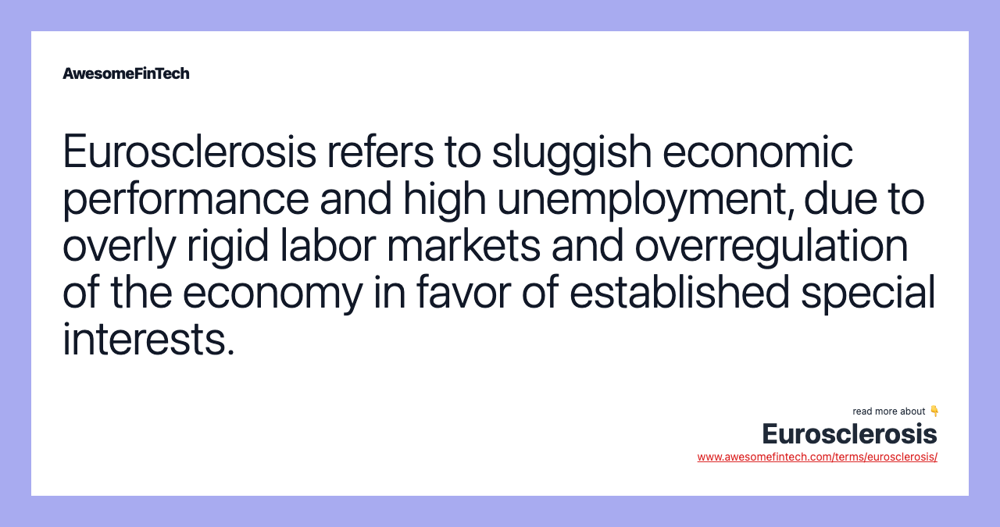

## Table of Contents

## What is Eurosclerosis?

Eurosclerosis is a term used to describe the economic problems that some European countries faced in the 1970s and 1980s. It means that these countries had trouble growing their economies and creating jobs. The word comes from "Europe" and "sclerosis," which is a medical term for a condition that makes it hard for things to move or work properly.

The main issues causing Eurosclerosis were high unemployment, slow economic growth, and rigid labor markets. Many people found it hard to get jobs because of strict rules about hiring and firing. Governments tried to help by spending more money, but this often led to higher debts and did not always solve the problems. Over time, some countries made changes to their laws and policies to make their economies more flexible and improve the situation.

## How did the term Eurosclerosis originate?

The term Eurosclerosis was first used in the 1970s. It was made up by combining the words "Europe" and "sclerosis." Sclerosis is a medical word that means something is hard and stiff. People started using this term to talk about the economic problems in Europe at that time. They felt that the economies were not growing well and were stuck, much like how sclerosis makes it hard for the body to move.

The word became popular because it described the situation well. Many European countries were struggling with high unemployment and slow growth. It was hard for businesses to create new jobs because of strict labor laws. People used Eurosclerosis to point out these problems and to push for changes that could help the economies become more flexible and grow better.

## What are the main symptoms of Eurosclerosis?

Eurosclerosis is a term that describes the economic problems some European countries had in the 1970s and 1980s. One of the main symptoms was high unemployment. Many people couldn't find jobs because the rules about hiring and firing were very strict. This made it hard for businesses to grow and create new jobs. Another symptom was slow economic growth. The economies were not expanding as much as they could because of these strict rules and other problems.

Another big issue was that governments tried to fix these problems by spending more money. This often led to higher debts, which made the situation even worse. The economies were stuck and not moving forward, much like how sclerosis makes it hard for the body to move. Over time, countries realized they needed to change their laws and policies to make their economies more flexible and improve the situation.

## Which countries are most affected by Eurosclerosis?

Eurosclerosis mostly affected countries in Western Europe during the 1970s and 1980s. Countries like Germany, France, and the United Kingdom felt the impact the most. These countries had strict rules about hiring and firing workers, which made it hard for businesses to create new jobs. As a result, many people were out of work, and the economies were not growing as fast as they could.

Other countries in Europe, like Italy and Belgium, also faced similar problems. High unemployment and slow growth were common issues. Governments tried to help by spending more money, but this often led to more debt and did not solve the problems right away. Over time, these countries made changes to their laws to make their economies more flexible and help them grow better.

## What economic factors contribute to Eurosclerosis?

Eurosclerosis is caused by many economic problems. One big problem is strict rules about hiring and firing workers. These rules make it hard for businesses to grow and create new jobs. When businesses can't grow, the economy does not grow as fast as it could. This leads to high unemployment because many people can't find jobs. Another problem is that governments try to fix these issues by spending more money. This can lead to higher debts, which makes the situation even worse.

Another [factor](/wiki/factor-investing) is slow economic growth. When the economy is not growing, it is hard for people to get better jobs and earn more money. This can make people feel stuck and unhappy. Countries with Eurosclerosis also often have a lot of rules and red tape, which makes it hard for new businesses to start and grow. All these problems together make the economy feel stiff and hard to move, much like how sclerosis affects the body. Over time, countries that faced Eurosclerosis had to change their laws to make their economies more flexible and help them grow better.

## How does Eurosclerosis impact employment rates?

Eurosclerosis makes it hard for people to find jobs. This happens because there are strict rules about hiring and firing workers. When businesses have a hard time letting go of workers who are not needed, they are less likely to hire new people. This leads to high unemployment because there are not enough new jobs being created. Many people stay out of work for a long time, which can make the economy even slower.

When governments see high unemployment, they sometimes try to help by spending more money. But this can lead to more debt, which does not always fix the problem. The strict rules and high debts together make it even harder for the economy to grow and create jobs. Over time, countries with Eurosclerosis had to change their laws to make it easier for businesses to hire and fire workers. This helped to lower unemployment and get the economy moving again.

## What role do labor market rigidities play in Eurosclerosis?

Labor market rigidities are a big reason for Eurosclerosis. They mean that there are strict rules about hiring and firing workers. When businesses can't easily let go of workers they don't need, they are scared to hire new people. This makes it hard for the economy to grow because new jobs are not being created. High unemployment happens because many people can't find work. This makes the economy slow down even more.

These rigidities also make it hard for businesses to change and grow. If a company needs to change what it does or how it works, it can't easily move workers around or let some go. This can stop the company from being able to do new things or grow bigger. When lots of companies face this problem, the whole economy can get stuck. This is why labor market rigidities are a big part of Eurosclerosis.

## Can Eurosclerosis be linked to welfare state policies?

Eurosclerosis can be linked to welfare state policies. These policies are when the government helps people with things like money if they are out of work or sick. While this help is good, it can sometimes make it harder for the economy to grow. If people get a lot of help from the government, they might not look for jobs as hard. This can lead to high unemployment, which is a big part of Eurosclerosis.

Also, welfare state policies can make the government spend a lot of money. If the government spends too much, it can get into a lot of debt. This debt can make the economy slow down because the government has less money to help businesses grow. When businesses can't grow, they don't create new jobs, and this can make Eurosclerosis worse.

## What are the proposed solutions to mitigate Eurosclerosis?

One way to help with Eurosclerosis is to make the rules about hiring and firing workers less strict. If businesses can easily hire and fire people, they will be more likely to start new jobs. This can help lower unemployment and make the economy grow faster. Another way is to cut down on the rules and red tape that make it hard for new businesses to start. When it's easier for new businesses to get going, they can create more jobs and help the economy grow.

Governments can also try to spend less money and get out of debt. When the government has less debt, it can help businesses more and make the economy stronger. Another idea is to change welfare state policies a bit. While it's good to help people who are out of work or sick, too much help can make people not look for jobs as hard. By making small changes, the government can help people find jobs and make the economy better.

These changes can take time, but they can help countries that have Eurosclerosis. By making the economy more flexible and helping businesses grow, countries can lower unemployment and make their economies stronger.

## How have different European countries attempted to address Eurosclerosis?

Many European countries have tried different ways to deal with Eurosclerosis. Germany made changes to their labor laws to make it easier for businesses to hire and fire workers. This helped lower unemployment and made the economy grow faster. France also tried to change some rules to make their economy more flexible. They worked on making it easier for new businesses to start and grow, which helped create more jobs. The United Kingdom made big changes too. They cut down on government spending and tried to get out of debt. This helped make their economy stronger and helped businesses grow.

Other countries like Italy and Belgium also made efforts to fix Eurosclerosis. Italy worked on making their labor market more flexible by changing some strict rules about hiring and firing. This helped businesses feel more comfortable creating new jobs. Belgium focused on cutting down red tape and making it easier for new businesses to start. They also tried to spend less money and reduce their debt. Over time, these changes helped these countries lower unemployment and make their economies grow better. By making their economies more flexible and helping businesses, these countries were able to fight Eurosclerosis and improve their economic situation.

## What are the long-term economic consequences of Eurosclerosis if left unaddressed?

If Eurosclerosis is not fixed, it can cause big problems for a country's economy over a long time. High unemployment can stay for many years, making it hard for people to find jobs and earn money. This can make people feel stuck and unhappy. When people don't have jobs, they can't spend money on things they need, which makes the economy slow down even more. Businesses don't grow because they are scared to hire new people because of strict rules. This can lead to less money being made in the country and more people living in poverty.

Also, if the government keeps spending a lot of money to help people who are out of work, it can get into a lot of debt. This debt can make it hard for the government to help businesses and make the economy better. Over time, the country might have a hard time growing and could fall behind other countries. The economy can stay stuck and not move forward, making life harder for everyone. It's important for countries to fix Eurosclerosis so they can have a strong and growing economy in the future.

## How does Eurosclerosis affect the global competitiveness of European economies?

Eurosclerosis makes it hard for European countries to compete with other countries around the world. When a country has high unemployment and slow economic growth because of strict rules about hiring and firing workers, businesses can't grow as fast as they need to. This means they can't make new products or services as quickly as businesses in other countries. When businesses can't grow, the whole country's economy can fall behind. Other countries might make better products or sell them for less money, making it hard for European businesses to keep up.

If Eurosclerosis is not fixed, European countries might lose their place in the global market. When businesses in Europe are stuck because of too many rules and too much government debt, they can't change and improve as fast as businesses in other places. This can make European products and services less attractive to people around the world. Over time, this can lead to fewer jobs and less money coming into the country, making it even harder for the economy to grow and compete globally. Fixing Eurosclerosis is important for European countries to stay strong and competitive in the world.

## References & Further Reading

[1]: Giersch, H. (1985). ["Eurosclerosis—The Malaise That Threatens Prosperity"](https://www.econstor.eu/bitstream/10419/48070/1/025296167.pdf). Institute of Economic Affairs.

[2]: "The European Economy Since 1945: Coordinated Capitalism and Beyond" by Barry Eichengreen.

[3]: Draghi, M. (2019). ["Europe's Growth Challenge"](https://www.iif.com/portals/0/Files/content/Research/32370132_gmv_100324_europe_needs_draghis_reforms_to_boost_growth.pdf?_cldee=-3l0WcLXO4v7HFl4_TVqDANz8pkOOj7nUCQ4ZwoMhbY&recipientid=contact-c8c50ae1e6f0e81180d102bfc0a80172-4f72c55e44c04c96a07cb13517c89399&esid=53a1c2b1-9381-ef11-ac21-7c1e520bdd0e). Speech at the ECB.

[4]: Botta, A., & Tarp, F. (2014). ["Structural Reforms and Economic Growth: A Case for African Eurosclerosis?"](https://web.econ.ku.dk/ftarp/Publications/Docs/Sacnned%20Pubs/imf%20and%20economic%20reform%20in%20developing%20countries.pdf). Development and Change.

[5]: Lopez de Prado, M. (2018). ["Advances in Financial Machine Learning"](https://www.amazon.com/Advances-Financial-Machine-Learning-Marcos/dp/1119482089).

[6]: Jansen, S. (2020). ["Machine Learning for Algorithmic Trading"](https://github.com/stefan-jansen/machine-learning-for-trading). Packt Publishing.

[7]: "Reforming the Labor Market in Japan to Cope with Increasing Dualism and Population Ageing" by Rand Corporation.

[8]: "Europe’s Economic Challenge: Reigniting Growth and Reform in the EU" by Daniel Gros.

[9]: Chan, E. P. (2009). ["Quantitative Trading: How to Build Your Own Algorithmic Trading Business"](https://github.com/ftvision/quant_trading_echan_book). Wiley Trading Series.