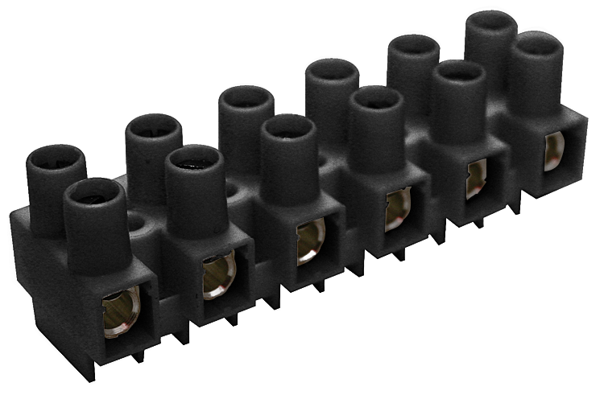

## Table of Contents

## What is Eurostrip?

Eurostrip is a term used to describe a type of entertainment that combines elements of European culture with striptease performances. It is popular in certain nightclubs and theaters across Europe, where performers often incorporate music, dance, and theatrical elements into their acts. The shows are designed to be more artistic and less explicit than typical strip shows, aiming to entertain a broader audience.

These performances often feature themes and costumes inspired by European history, folklore, and art. For example, a Eurostrip show might include a segment based on a famous European opera or a dance routine inspired by traditional European festivals. The goal is to create a more sophisticated and culturally rich experience, appealing to people who appreciate both the artistic and the sensual aspects of the performance.

## What are the main components of Eurostrip?

Eurostrip shows mix European culture with striptease. They use music, dance, and theater to make the performances more interesting. These shows are different from regular strip shows because they are less explicit and try to be more artistic. They want to attract a wider audience by making the shows entertaining and not just about taking off clothes.

The performers in Eurostrip shows often wear costumes that are inspired by European history, folklore, and art. They might do a dance based on a famous opera or a routine that shows off traditional European festivals. By doing this, they make the show more than just a striptease; it becomes a celebration of European culture. This way, people who like both art and a bit of sensuality can enjoy the performance.

## How does Eurostrip function in air traffic control?

Eurostrip in air traffic control is a tool used by controllers to manage flights. It's a paper strip that has important information about each flight, like the plane's number, where it's going, and what time it should arrive. Controllers use these strips to keep track of all the planes in the sky and make sure they stay safe and on schedule.

When a plane is ready to take off or land, the controller writes down the details on a Eurostrip. They then move the strip around on a board to show where the plane is and what it's doing. This helps them see the whole picture of air traffic and make quick decisions to keep everything running smoothly.

## What are the benefits of using Eurostrip for air traffic management?

Using Eurostrip in air traffic control helps controllers keep track of flights easily. Each strip has all the important details about a flight written on it, like the plane's number, where it's going, and its schedule. By having this information right in front of them, controllers can quickly see what each plane is doing and where it needs to go. This makes it easier to manage many flights at the same time without getting confused.

Eurostrip also helps controllers make quick decisions to keep flights safe and on time. They can move the strips around on a board to show where each plane is and what it's doing. This visual way of managing flights helps controllers spot any problems or delays faster. By using Eurostrip, air traffic control can run more smoothly and safely, making sure planes take off and land without any issues.

## How is Eurostrip integrated with other air traffic control systems?

Eurostrip works together with other air traffic control systems to help controllers manage flights. It fits in well with radar systems, which show where planes are on a screen. Controllers use the radar to see where planes are and then use Eurostrip to write down important details about each flight. This way, they can match what they see on the radar with the information on the strips, making it easier to keep track of everything.

Eurostrip also connects with computer systems that help with planning and communication. These systems can give controllers updates about flight schedules and any changes that need to be made. By using Eurostrip alongside these computer systems, controllers can quickly write down new information and move the strips around to show the updated flight plans. This helps keep everything organized and makes sure flights stay safe and on time.

## What are the safety features included in Eurostrip?

Eurostrip helps keep flights safe by giving controllers important information about each plane. They write down details like the plane's number, where it's going, and its schedule on the strip. This way, controllers can see at a glance what each plane is doing and where it needs to go. If there's a problem or a delay, they can quickly spot it and take action to fix it. This helps prevent mistakes and keeps the skies safe for everyone.

Eurostrip also works well with other safety tools like radar. The radar shows where planes are on a screen, and controllers use Eurostrip to match this with written information. By seeing both the radar and the strip, controllers can make sure they know exactly where each plane is and what it's doing. This combination helps them manage flights better and respond quickly if something goes wrong, making air travel safer.

## How does Eurostrip handle different types of aircraft?

Eurostrip helps air traffic controllers manage all kinds of aircraft, from small planes to big jets. Each strip has details like the plane's number, where it's going, and its schedule. This information stays the same no matter what type of aircraft it is. Controllers write down these details on the strip and use it to keep track of the plane's journey. This way, they can handle different aircraft easily because the Eurostrip system is flexible and works the same for all planes.

When controllers see a plane on the radar, they match it with the information on the Eurostrip. This helps them know exactly what type of aircraft they're dealing with and what it needs to do next. For example, a small plane might need a different runway than a big jet, and the controller can see this on the strip. By using Eurostrip, controllers can make sure all types of aircraft stay safe and follow their schedules, no matter how different they are.

## What training is required to operate Eurostrip effectively?

To operate Eurostrip effectively, air traffic controllers need to go through special training. This training teaches them how to read and write the information on the strips correctly. They learn about all the details they need to put on each strip, like the plane's number, where it's going, and its schedule. The training also shows them how to use the strips with other tools, like radar, to keep track of flights.

During the training, controllers practice using Eurostrip in different situations. They learn how to move the strips around on a board to show where each plane is and what it's doing. This helps them get ready for real-life situations where they need to manage many flights at the same time. By the end of the training, they know how to use Eurostrip to keep flights safe and on time.

## Can Eurostrip be customized for specific airport needs?

Yes, Eurostrip can be customized to fit the needs of different airports. Each airport might have its own way of doing things, like different runways or special flight paths. Controllers can change what information they write on the strips to match these needs. For example, if an airport has a lot of small planes, they might add details about the type of runway needed. This way, the strips help controllers manage flights better at their specific airport.

The customization of Eurostrip also helps with special events or busy times. If an airport is hosting a big event, like a festival, they might need to handle more flights than usual. Controllers can add extra information on the strips to keep track of these flights. This makes sure everything runs smoothly, even when things get busy. By customizing Eurostrip, airports can make sure their air traffic control works well for their unique situation.

## What are the common challenges faced when implementing Eurostrip?

When airports start using Eurostrip, one of the main challenges is training the controllers to use it right. They need to learn how to write all the important details on the strips quickly and correctly. This can take time, and mistakes can happen if they don't get enough practice. Another challenge is making sure the strips work well with other tools like radar. If the information on the strips doesn't match what the radar shows, it can cause confusion and safety issues.

Another problem is keeping the strips organized, especially during busy times. When there are a lot of flights, controllers need to move the strips around a lot. If they get mixed up, it can be hard to keep track of everything. Also, customizing Eurostrip for different airports can be tricky. Each airport has its own needs, and making sure the strips fit those needs can take a lot of work. But if done right, Eurostrip can help make air traffic control safer and more efficient.

## How does Eurostrip adapt to changing air traffic conditions?

Eurostrip helps air traffic controllers handle changes in the sky by letting them write down new information on the strips. If a plane needs to change its path or delay its landing, controllers can quickly update the strip with the new details. This way, they can keep track of what's happening and make sure all the planes stay safe and on time. The strips are easy to move around on a board, so when things change, controllers can rearrange them to show the new flight plans.

During busy times, like when there's a big event or bad weather, Eurostrip helps a lot. Controllers can add more details to the strips to manage the extra flights. They can see at a glance what each plane is doing and where it needs to go, even when the sky is crowded. By using Eurostrip, controllers can adapt to changing conditions quickly and keep everything running smoothly.

## What future developments are planned for Eurostrip to enhance its functionality?

In the future, Eurostrip might get better by using computers more. Right now, controllers write on paper strips, but soon they could use digital screens instead. This would make it easier to change information quickly and share it with other controllers. It could also connect better with radar and other computer systems, making everything work together more smoothly. This way, controllers could manage flights even better and keep the skies safer.

Another idea for Eurostrip is to make it smarter with new technology. For example, it could use [artificial intelligence](/wiki/ai-artificial-intelligence) to help controllers predict what might happen next. If a plane is going to be late, the system could suggest the best way to handle it. Also, Eurostrip could be made to work with different languages, so controllers from different countries could use it easily. These changes would help Eurostrip keep up with the busy and changing world of air traffic control.

## References & Further Reading

[1]: ["Advances in Financial Machine Learning"](https://www.amazon.com/Advances-Financial-Machine-Learning-Marcos/dp/1119482089) by Marcos Lopez de Prado

[2]: ["Machine Learning for Algorithmic Trading"](https://www.amazon.com/Machine-Learning-Algorithmic-Trading-alternative/dp/1839217715) by Stefan Jansen

[3]: ["Quantitative Trading: How to Build Your Own Algorithmic Trading Business"](https://www.amazon.com/Quantitative-Trading-Build-Algorithmic-Business/dp/1119800064) by Ernest P. Chan

[4]: "Eurodollar Futures and Options: The Complete Guide" by Burghardt, G. [CME Group Website on Eurodollar Futures](https://archive.org/details/eurodollarfuture0000burg)

[5]: Hull, J. C. (2018). "Options, Futures, and Other Derivatives." Pearson Education Limited.