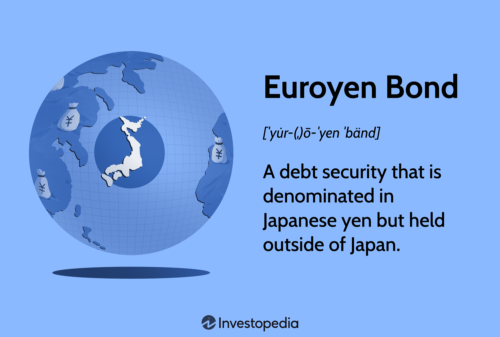

## Table of Contents

## What is a Euroyen bond?

A Euroyen bond is a type of bond that is issued in Japanese yen but outside of Japan. This means that companies or governments from any country can borrow money in yen from investors who are not in Japan. These bonds are popular because they allow issuers to tap into the Japanese market without being subject to Japanese regulations.

Euroyen bonds are attractive to investors because they can offer higher interest rates than similar bonds issued within Japan. They also provide a way for investors to diversify their portfolios by investing in yen-denominated securities without having to deal directly with the Japanese market. This can be beneficial for both the issuers and the investors, as it opens up new opportunities for raising and investing capital.

## How does a Euroyen bond differ from a regular yen bond?

A Euroyen bond is different from a regular yen bond mainly because of where it is issued and who can issue it. A regular yen bond is issued in Japan and follows Japanese rules. Only companies or the government in Japan can issue these bonds. On the other hand, a Euroyen bond is issued outside of Japan, in yen, and can be issued by any company or government from any country. This means that Euroyen bonds are not bound by Japanese regulations.

Another key difference is who can invest in these bonds. Regular yen bonds are mostly bought by investors in Japan. Euroyen bonds, however, can be bought by investors from anywhere in the world, as long as they are not in Japan. This makes Euroyen bonds a good choice for investors who want to invest in yen but do not want to deal with the Japanese market directly. It also allows issuers to reach a wider range of investors.

## Who are the typical issuers of Euroyen bonds?

Euroyen bonds are usually issued by companies and governments from countries outside Japan. These issuers want to borrow money in yen but do not want to follow Japan's rules. For example, a big company in Europe or America might issue a Euroyen bond to get money from investors all over the world who want to invest in yen.

These bonds are popular with issuers because they can reach a lot of different investors. This means they can get more money than if they only sold bonds in their own country. Also, sometimes the interest rates for Euroyen bonds can be better than other types of bonds, which makes them a good choice for borrowing money.

## What are the benefits of investing in Euroyen bonds for investors?

Investing in Euroyen bonds can be good for investors because they can offer higher interest rates than similar bonds in Japan. This means investors can earn more money from their investments. Also, since Euroyen bonds are issued outside of Japan, they are not controlled by Japan's rules. This can make it easier for investors from other countries to buy them.

Another benefit is that Euroyen bonds help investors spread out their investments. By buying bonds in yen, investors can have money in different currencies, which can protect them if their own currency loses value. This is called diversification, and it can make their investments safer. Plus, Euroyen bonds let investors get into the yen market without having to deal with the Japanese market directly, which can be tricky for people from other countries.

## How does the interest rate on Euroyen bonds compare to domestic Japanese bonds?

Euroyen bonds often have higher interest rates than domestic Japanese bonds. This is because they are issued outside of Japan and can attract investors from all over the world. When more people want to buy the bonds, the issuer can offer a higher [interest rate](/wiki/interest-rate-trading-strategies) to make them more appealing. So, if you're an investor looking to earn more from your money, Euroyen bonds might be a good choice.

The difference in interest rates can also come from the fact that Euroyen bonds are not controlled by Japanese rules. This means issuers can set the interest rates in a way that might be more attractive to investors who are not in Japan. For investors, this can mean a better return on their investment compared to what they would get from a bond issued inside Japan.

## What role do Euroyen bonds play in international finance?

Euroyen bonds play an important role in international finance because they help companies and governments from different countries borrow money in yen without following Japan's rules. This means that a company in Europe or America can get money from investors all over the world who want to invest in yen. This helps these companies and governments reach more investors and borrow money at good interest rates.

For investors, Euroyen bonds are a way to invest in yen without dealing with the Japanese market directly. This can be easier for people from other countries. Euroyen bonds also often have higher interest rates than similar bonds in Japan, which means investors can earn more money. By investing in Euroyen bonds, investors can also spread out their money across different currencies, which can make their investments safer.

## How are Euroyen bonds priced and what factors influence their pricing?

Euroyen bonds are priced based on a few important things. The main thing is the interest rate, which is what the bond pays to investors. If the interest rate is high, the bond will be more expensive because investors want to buy it to earn more money. Another thing that affects the price is how safe people think the bond is. If a company or government issuing the bond is seen as risky, the bond might be cheaper because investors want a higher interest rate to take that risk. The price can also change with the demand for the bond. If lots of investors want to buy it, the price goes up.

Other things that can change the price of Euroyen bonds are the overall economy and what's happening with the yen. If the economy is doing well, investors might feel more confident and be willing to pay more for bonds. But if the economy is doing badly, they might want a higher interest rate to feel safe investing. The value of the yen also matters. If the yen gets stronger, it might make Euroyen bonds more attractive to investors from other countries, which can push the price up. If the yen gets weaker, it might make the bonds less attractive, and the price could go down.

## What are the risks associated with investing in Euroyen bonds?

Investing in Euroyen bonds can be risky because the value of the yen can change. If the yen gets weaker compared to other currencies, the money you get back from the bond might be worth less when you change it back to your own currency. This is called currency risk. Also, if the company or government that issued the bond has problems, they might not be able to pay you back. This is called credit risk. If the economy is doing badly, it can make these risks even bigger.

Another risk is that interest rates can change. If interest rates go up after you buy a Euroyen bond, new bonds might offer better rates, making your bond less valuable. This is called interest rate risk. Also, Euroyen bonds might not be as easy to sell as other bonds because they are issued outside Japan. If you need to sell your bond quickly, you might have to sell it for less than you paid. This is called [liquidity](/wiki/liquidity-risk-premium) risk. All these risks can make investing in Euroyen bonds a bit tricky, but they also offer chances to earn more money if things go well.

## How does currency risk affect Euroyen bond investments?

Currency risk can make Euroyen bond investments tricky. If you buy a Euroyen bond, you're getting paid back in yen. But if the yen gets weaker compared to your own currency, the money you get back won't be worth as much when you change it back. This means you might end up with less money than you expected, even if the bond pays you back on time.

On the other hand, if the yen gets stronger, your investment could be worth more when you change it back to your own currency. But you can't predict which way the yen will go, so there's always a chance you could lose money because of changes in the exchange rate. This is something you need to think about before you decide to invest in Euroyen bonds.

## What is the process of issuing a Euroyen bond?

When a company or government wants to issue a Euroyen bond, they start by working with banks or other financial helpers called underwriters. These underwriters help the issuer decide things like how much money they want to borrow, what interest rate to offer, and how long the bond will last. They also help make sure everything follows the rules in the country where the bond is being issued, since Euroyen bonds are sold outside Japan.

Once everything is set up, the issuer and the underwriters work together to sell the bonds to investors all over the world. They might do this through a big sale called a public offering, or they might sell the bonds directly to certain investors. After the bonds are sold, the issuer gets the money they need, and the investors get the bonds. Then, the issuer has to pay back the money with interest over time, just like with any other bond.

## How do Euroyen bonds contribute to the diversification of an investment portfolio?

Euroyen bonds can help you spread out your money in different ways. When you invest in them, you're putting your money into bonds that are paid back in yen. This means you're not just keeping all your money in one currency, like dollars or euros. If the value of your own currency goes down, having some money in yen can help balance things out. This is called diversification, and it can make your investments safer because you're not putting all your eggs in one basket.

Also, Euroyen bonds let you invest in the yen market without having to deal with Japan's rules directly. This can be easier for people from other countries. By adding Euroyen bonds to your portfolio, you can get a mix of different types of investments. This mix can help protect you from big losses if one type of investment doesn't do well. So, Euroyen bonds can be a good way to make your investments more stable and less risky.

## What are the tax implications for investors in Euroyen bonds?

The tax rules for Euroyen bonds can be different depending on where you live. If you live in a country that has a tax treaty with Japan, you might not have to pay as much tax on the interest you earn from the bonds. But if your country doesn't have a treaty with Japan, you might have to pay more tax. It's a good idea to talk to a tax expert to understand how much tax you'll have to pay.

Also, some countries might tax the money you make when you sell the bond for more than you paid for it. This is called capital gains tax. The rules for this can be different in every country, so it's important to check what the rules are where you live. Knowing about these tax rules can help you decide if Euroyen bonds are a good choice for you.

## References & Further Reading

[1]: ["Eurocurrency Markets and International Finance"](https://en.wikipedia.org/wiki/Eurocurrency) by Keith Davies

[2]: ["The Handbook of European Fixed Income Securities"](https://www.amazon.com/Handbook-European-Income-Securities-Fabozzi/dp/0471430390) by Frank J. Fabozzi

[3]: Adrian, T., Fleming, M., Shachar, O., & Vogt, E. (2017). ["Understanding the Risks of High-Frequency Trading: Perspectives from the Recent Literature."](https://www.jstor.org/stable/26774081?read-now=1) Annual Review of Financial Economics, 9, 259-279.

[4]: Shelton, R. (2000). ["Foreign Currency-Denominated Borrowing in Japan: An Analysis of the Euroyen Market."](https://www.sciencedirect.com/science/article/pii/S0927538X24001896) Journal of Small Business Management, 38(3), 19-27.

[5]: Hasbrouck, J. & Saar, G. (2013). ["Low-latency trading."](https://www.sciencedirect.com/science/article/abs/pii/S1386418113000165) Journal of Financial Markets, 16(4), 646-679.

[6]: Aitken, M., Frino, A., & Hill, A. (2006). ["The Trading Performance of Alternative Market Participants in an Electronic Limit Order Market."](https://www-sre.wu.ac.at/ersa/ersaconfs/ersa14/e140826aFinal00867.pdf) Australian Journal of Management, 31(2), 279-300.