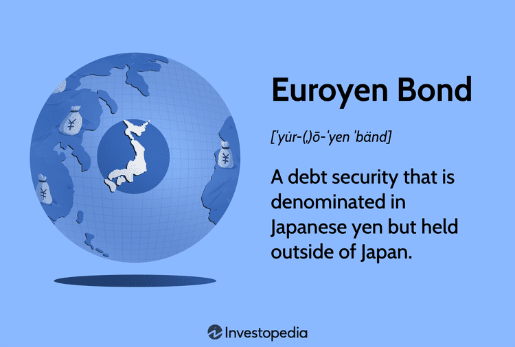

## Table of Contents

## What is Euroyen?

Euroyen is a term used to describe Japanese yen that is held or traded outside of Japan, mainly in Europe. It's like when you have dollars in a bank in Europe instead of the United States. This money can be used for different financial activities, like loans or investments, and it helps connect the Japanese and European economies.

The Euroyen market is important because it lets people and businesses in Europe use yen for their financial needs without going to Japan. This makes it easier for them to do business with Japan or invest in Japanese companies. The market also helps set the value of the yen compared to other currencies, which can affect international trade and investments.

## How did Euroyen originate?

Euroyen started in the 1980s when Japan's economy was growing fast. Many people and businesses in Europe wanted to use Japanese yen for their financial activities, but they didn't want to go all the way to Japan to do it. So, banks in Europe began to offer yen accounts and services, which made it easier for Europeans to use yen without leaving their continent.

This new way of using yen outside Japan helped connect the Japanese and European economies even more. It allowed businesses in Europe to borrow yen for their projects or invest in Japanese companies without any trouble. Over time, the Euroyen market grew bigger and became an important part of the global financial system.

## What is the difference between Euroyen and the Japanese yen?

Euroyen and Japanese yen are actually the same currency, but they are used in different places. Euroyen is just Japanese yen that people use or trade outside of Japan, especially in Europe. So, if you have yen in a bank account in Europe, that's Euroyen. But if you have yen in a bank account in Japan, that's just regular Japanese yen.

The main difference is where the yen is being used. Euroyen helps connect the Japanese and European economies because it lets people in Europe use yen without going to Japan. This makes it easier for them to do business with Japan or invest in Japanese companies. Regular Japanese yen, on the other hand, is used within Japan for everyday things like buying groceries or paying bills.

## Who are the primary users of Euroyen?

The primary users of Euroyen are businesses and investors in Europe who want to use Japanese yen for their financial activities. These could be companies that do business with Japan or want to invest in Japanese companies. By using Euroyen, they can borrow or invest in yen without having to go to Japan, which makes things easier for them.

Another group of users are banks and financial institutions in Europe. They offer Euroyen services to their customers, like yen accounts and loans. This helps them attract more business and connect with the Japanese market. The Euroyen market is important for these banks because it lets them offer more options to their customers and be part of the global financial system.

## How is Euroyen traded?

Euroyen is traded in the Euroyen market, which is a part of the global foreign exchange market. This market lets people and businesses in Europe buy and sell Japanese yen without going to Japan. They can do this through banks and financial institutions in Europe that offer Euroyen services. When someone wants to trade Euroyen, they can use these banks to exchange their money for yen or vice versa.

The trading of Euroyen happens a lot like trading any other currency. People can use different financial tools, like spot transactions, where they buy or sell yen right away, or forward contracts, where they agree to buy or sell yen at a future date. The price of Euroyen is set by how much people want to buy or sell it, just like with any other currency. This helps set the value of the yen compared to other currencies and can affect international trade and investments.

## What are the key financial instruments associated with Euroyen?

The main financial instruments used with Euroyen are Euroyen deposits and Euroyen loans. Euroyen deposits are when people or businesses in Europe put their money into a bank account that holds yen. This lets them save or invest in yen without going to Japan. Euroyen loans are when banks in Europe lend out yen to people or businesses who need it. This can help them do business with Japan or invest in Japanese companies.

Another important instrument is Euroyen bonds. These are like IOUs that companies or governments issue in Europe, but they're paid back in yen. People who buy these bonds get their money back plus interest, all in yen. Euroyen bonds are a way for companies to borrow money from investors in Europe who want to use yen. They help connect the Japanese and European economies even more.

Lastly, there are Euroyen derivatives, like futures and options. These are special agreements that let people bet on what the yen's value will be in the future. Futures are contracts to buy or sell yen at a set price later on, while options give people the choice to do this. Euroyen derivatives help people and businesses manage the risks of using yen in Europe, making it easier for them to do business with Japan.

## How does the Euroyen market impact global finance?

The Euroyen market plays a big role in global finance by making it easier for people and businesses in Europe to use Japanese yen. When Europeans can borrow, save, or invest in yen without going to Japan, it helps connect the Japanese and European economies. This means more trade and investment can happen between the two regions, which can grow the global economy. The Euroyen market also helps set the value of the yen compared to other currencies, which is important for international trade and investments.

Another way the Euroyen market impacts global finance is by offering different financial tools, like Euroyen bonds and derivatives. These tools let people and businesses manage the risks of using yen in Europe. For example, Euroyen bonds help companies borrow money from investors who want to use yen, while Euroyen derivatives let people bet on the yen's future value. By providing these options, the Euroyen market makes the global financial system more flexible and helps it work better.

## What are the risks involved in trading Euroyen?

Trading Euroyen can be risky because the value of the yen can go up and down a lot. This means if you buy yen with euros and the yen gets weaker, you could lose money when you want to change it back to euros. Also, the Euroyen market can be affected by things happening in Japan or Europe, like changes in interest rates or big economic news. These things can make the yen's value change quickly, which can be hard to predict and can lead to losses.

Another risk is that the banks and financial institutions you use to trade Euroyen might have their own problems. If a bank gets into trouble, it could affect your Euroyen accounts or loans. Plus, when you use financial tools like Euroyen derivatives, there's a chance you could lose more money than you put in. These tools can be complicated and need a good understanding of how they work, so it's important to be careful and know what you're doing when you use them.

## How do interest rates affect the Euroyen market?

Interest rates play a big role in the Euroyen market. When interest rates in Japan go up, it can make people and businesses in Europe want to borrow or save in yen more. This is because they can earn more money from their savings or pay less interest on their loans. More demand for yen can make the yen's value go up compared to other currencies. On the other hand, if interest rates in Japan go down, people might not want to use yen as much because they can't earn as much from their savings or they have to pay more interest on their loans. This can make the yen's value go down.

Interest rates in Europe can also affect the Euroyen market. If interest rates in Europe are higher than in Japan, people might not want to use yen as much because they can get better deals in euros. This can make the demand for yen go down and its value drop. But if interest rates in Europe are lower, people might want to use yen more because it's a better deal. This can make the demand for yen go up and its value rise. So, both Japanese and European interest rates can have a big impact on the Euroyen market and the value of the yen.

## What role do Euroyen futures play in financial hedging?

Euroyen futures are special agreements that help people and businesses manage the risks of using Japanese yen in Europe. When someone buys a Euroyen future, they agree to buy or sell yen at a set price on a future date. This can be useful if they're worried about the yen's value changing a lot. For example, if a business in Europe needs to pay a Japanese supplier in yen a few months from now, they can use Euroyen futures to lock in today's exchange rate. This way, they know exactly how much it will cost them in euros, even if the yen's value goes up or down.

By using Euroyen futures, people and businesses can protect themselves from unexpected changes in the yen's value. This is called financial hedging. It's like buying insurance for their money. If the yen gets weaker, they won't lose as much money because they locked in a good rate with the future. And if the yen gets stronger, they won't have to pay more than they expected. Euroyen futures help make financial planning easier and more predictable for those using yen in Europe.

## How has the Euroyen market evolved over the past decade?

Over the past decade, the Euroyen market has changed a lot. It has grown bigger because more people and businesses in Europe want to use Japanese yen. This is because Japan's economy has been doing well, and more companies in Europe want to do business with Japan or invest in Japanese companies. Also, banks in Europe have made it easier for people to use yen by offering more Euroyen services, like accounts and loans. This has made the Euroyen market more important for connecting the Japanese and European economies.

Another big change in the Euroyen market is the use of new financial tools. More people are using Euroyen bonds and derivatives to manage their money. Euroyen bonds let companies borrow money from investors who want to use yen, and Euroyen derivatives help people bet on what the yen's value will be in the future. These tools have made the Euroyen market more flexible and helped it work better. Overall, the Euroyen market has become a bigger and more important part of the global financial system over the past decade.

## What are the regulatory considerations for Euroyen transactions?

When people and businesses in Europe use Euroyen, they have to follow rules from both Europe and Japan. These rules are made by groups like the European Central Bank and the Bank of Japan. They help make sure that the Euroyen market is fair and safe for everyone. For example, banks in Europe that offer Euroyen services need to follow rules about how much money they can lend and how they should treat their customers. They also need to report their Euroyen activities to the right authorities.

Another important thing to think about is that the rules can change over time. This means people and businesses need to keep up with the latest rules and make sure they are following them. Sometimes, there might be new laws or changes in how the Euroyen market works, and everyone needs to adjust to these changes. Keeping up with the rules helps make sure that the Euroyen market stays a good place for people to use yen in Europe.

## References & Further Reading

[1]: ["The Eurocurrency Market: An Interpretation and Some Data"](https://link.springer.com/chapter/10.1007/978-1-349-86050-0_3) by Willem H. Buiter

[2]: ["Advances in Financial Machine Learning"](https://www.amazon.com/Advances-Financial-Machine-Learning-Marcos/dp/1119482089) by Marcos Lopez de Prado

[3]: ["Quantitative Trading: How to Build Your Own Algorithmic Trading Business"](https://www.amazon.com/Quantitative-Trading-Build-Algorithmic-Business/dp/1119800064) by Ernest P. Chan

[4]: ["Algorithmic Trading and DMA: An introduction to direct access trading strategies"](https://archive.org/details/algorithmictradi0000john) by Barry Johnson

[5]: ["International Financial Markets and the Firm"](https://www.amazon.com/International-Financial-Markets-Current-Finance/dp/0538840234) by Piet Sercu

[6]: ["The Euroyen Market: History, Structure, and Role in the International Money Markets"](https://fastercapital.com/content/Unraveling-the-Euroyen-s-Impact-on-the-Foreign-Exchange-Market.html) by Peter L. Berger and William T. Dickens