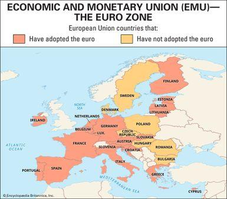

## Table of Contents

## What is the Eurozone?

The Eurozone is a group of countries in Europe that use the euro as their money. The euro is like the dollar in the United States, but it is used in many different countries. There are 20 countries in the Eurozone, including big ones like Germany, France, and Italy. These countries work together to make sure their money stays strong and helps their economies grow.

Being part of the Eurozone means these countries follow certain rules about how they spend and save money. They have a special group called the European Central Bank that helps manage the euro and makes decisions about things like interest rates. This helps keep prices stable and makes it easier for people and businesses in these countries to buy and sell things with each other.

## When was the Eurozone established?

The Eurozone was established when the euro started being used as money on January 1, 1999. At first, it was just used for things like bank accounts and big payments between businesses. People didn't use euro coins and notes until January 1, 2002.

The idea for the Eurozone came from a group called the European Union. They wanted to make it easier for countries in Europe to trade and work together. So, they decided to create a single currency that many countries could use. This helped make buying and selling things simpler and helped the economies of these countries grow.

## Which countries were the original members of the Eurozone?

The Eurozone started with 11 countries when it was created on January 1, 1999. These countries were Austria, Belgium, Finland, France, Germany, Ireland, Italy, Luxembourg, the Netherlands, Portugal, and Spain. They were the first to use the euro as their money.

These countries decided to join together because they thought it would help their economies grow stronger. By using the same money, it would be easier for them to buy and sell things with each other. This group of countries set the foundation for what the Eurozone is today.

## How does a country join the Eurozone?

A country that wants to join the Eurozone has to meet certain rules set by the European Union. These rules are called the Maastricht criteria. They check things like how much money the country owes, how stable its prices are, how long it has been using a stable money system, and how its interest rates compare to other countries in the Eurozone. The country also needs to have its laws match with the European Union's rules about money and finance.

Once a country thinks it meets these rules, it can apply to join. The European Commission and the European Central Bank will then check to see if the country really does meet all the criteria. If they say yes, then the leaders of the countries already in the Eurozone will vote on whether to let the new country join. If they agree, the country can start using the euro as its money. This whole process can take a long time and needs a lot of planning and changes in the country's laws and economy.

## What are the criteria for joining the Eurozone?

To join the Eurozone, a country must meet the Maastricht criteria, which are a set of rules set by the European Union. These rules check if the country's economy is stable enough to use the euro. The country needs to keep its prices stable, meaning inflation should not be too high. It also needs to have a low level of debt and keep its budget under control. The country's interest rates should be close to those of the countries already in the Eurozone. Additionally, the country must have been part of the European Union's money system, called the Exchange Rate Mechanism, for at least two years without big changes in its currency value.

Once a country thinks it meets these criteria, it can apply to join the Eurozone. The European Commission and the European Central Bank will then check to make sure the country really does meet all the rules. If they agree, the leaders of the countries already in the Eurozone will vote on whether to let the new country join. If they say yes, the country can start using the euro as its money. This process can take a long time because it involves a lot of planning and changes in the country's laws and economy.

## What are the benefits of being a member of the Eurozone?

Being a member of the Eurozone has many benefits for countries. One big benefit is that it makes trading easier. When countries use the same money, it's simpler for them to buy and sell things with each other. This can help businesses grow and create more jobs. Also, using the same money can make prices more stable. This means that the cost of things doesn't go up and down too much, which helps people plan their spending better.

Another benefit is that being part of the Eurozone can make a country's economy stronger. The Eurozone countries work together and help each other out. If one country has a problem, the others can help it get better. This teamwork can make the whole group stronger. Plus, being in the Eurozone can make it easier for a country to borrow money. Because the euro is seen as a strong money, countries in the Eurozone might get better deals when they need to borrow.

## What challenges do Eurozone countries face?

Being in the Eurozone can be tough for countries sometimes. One big challenge is that all the countries have to follow the same rules about money and spending. If a country is having a hard time with its economy, it can't just print more money or change its interest rates to help fix things. This can make it harder for them to solve their problems quickly. Also, if one country is doing really badly, it can affect all the other countries in the Eurozone too. This means that everyone has to work together to help fix the problem, which can be difficult and take a long time.

Another challenge is that not all countries in the Eurozone are the same. Some are richer and some are poorer. This can cause problems because the richer countries might not want to help the poorer ones as much as they need. It can also make it hard to agree on things like how much money to spend on helping the whole group. Plus, because they all use the same money, if one country's economy gets into trouble, it can make the euro weaker for everyone. This means that all the countries have to be careful and work together to keep their economies strong.

## How has the Eurozone evolved since its inception?

Since it started in 1999, the Eurozone has grown a lot. It began with 11 countries and now has 20. More countries have joined because they saw the benefits of using the same money. The Eurozone has also faced some big challenges, like the financial crisis in 2008. During that time, some countries had big money problems, and the whole group had to work together to help them. This showed that being part of the Eurozone means countries need to help each other out when things get tough.

Over the years, the Eurozone has made changes to become stronger. They created new rules to make sure countries keep their money and spending under control. They also set up ways to help countries that get into financial trouble. The European Central Bank has become more important in managing the euro and making sure it stays strong. Even though there are still challenges, the Eurozone keeps working to make things better for all its members.

## What major economic crises have impacted the Eurozone?

The Eurozone faced a big challenge during the global financial crisis that started in 2008. This crisis began in the United States but quickly spread to Europe. Many countries in the Eurozone, like Greece, Ireland, Spain, and Portugal, had big money problems. They had a lot of debt and their economies were not doing well. The Eurozone countries had to work together to help these countries. They gave them money and made new rules to try to fix the problems. It was a hard time, but it showed that the Eurozone countries needed to stick together and help each other out.

Another big challenge came with the European debt crisis, which was part of the 2008 financial crisis but lasted longer. Countries like Greece had so much debt that they couldn't pay it back. This made people worried about the euro and the whole Eurozone. The European Central Bank and other countries in the Eurozone had to step in with big plans to help. They made new rules to make sure countries wouldn't get into such big money trouble again. Even though it was tough, the Eurozone got through it by working together and making changes to be stronger in the future.

## How do Eurozone policies affect member countries' economies?

Eurozone policies have a big impact on the economies of the countries that are members. One way they do this is by setting rules about how much money countries can spend and how much debt they can have. These rules are meant to keep the economies of all the countries stable and strong. If a country spends too much or has too much debt, it can cause problems not just for that country but for the whole Eurozone. So, these rules help make sure everyone is doing their part to keep the group strong.

Another way Eurozone policies affect member countries is by managing the euro. The European Central Bank decides things like interest rates, which can affect how easy it is for people and businesses to borrow money. If interest rates are low, it's easier to borrow, and this can help the economy grow. But if they're too low, it might cause prices to go up too fast. The European Central Bank tries to find a balance that helps all the countries in the Eurozone. By working together and following these policies, the countries can help each other's economies grow and stay strong.

## What is the role of the European Central Bank in the Eurozone?

The European Central Bank, or ECB, is like a big boss for the money in the Eurozone. Its main job is to make sure the euro stays strong and that prices don't go up too fast. This is called keeping inflation under control. The ECB does this by setting interest rates, which is how much it costs to borrow money. If they think prices are going up too fast, they might make borrowing more expensive. But if they think the economy needs a boost, they might make borrowing cheaper. This helps keep the economy of all the countries in the Eurozone stable.

Another important thing the ECB does is help out if a country in the Eurozone gets into money trouble. It can lend money to banks in those countries to make sure they don't run out of cash. The ECB also works with other countries in the Eurozone to make plans and rules to help fix big problems. By doing all these things, the ECB helps make sure that the euro stays a strong and reliable money that people can trust.

## What future developments are anticipated for the Eurozone?

In the future, the Eurozone might see more countries joining it. Right now, there are 20 countries using the euro, but some other countries in the European Union might want to join too. They will need to meet the rules, like keeping their money and spending under control. If more countries join, it could make the Eurozone even stronger and help their economies grow together.

Another big change could be new rules to make the Eurozone more stable. After the big money problems in the past, like the 2008 financial crisis, the Eurozone made new plans to help countries in trouble. In the future, they might make even more rules to make sure countries don't get into big money trouble again. This could mean working together more closely and sharing the risks so that if one country has a problem, the others can help out more easily.

## References & Further Reading

[1]: De Grauwe, P. (2012). ["The Governance of a Fragile Eurozone."](https://onlinelibrary.wiley.com/doi/abs/10.1111/j.1467-8462.2012.00691.x) Economic Policy. 

[2]: Baldwin, R. & Wyplosz, C. (2015). ["The Economics of European Integration."](https://archive.org/details/economicsofeurop0000bald_b9o4) McGraw-Hill Education.

[3]: Lane, P. R. (2012). ["The European Sovereign Debt Crisis."](https://www.aeaweb.org/articles?id=10.1257/jep.26.3.49) Journal of Economic Perspectives, 26(3), 49-68.

[4]: Lahaye, J., Poon, S. H., & Galuch, A. M. (2011). ["High-Frequency Trading in a Limit Order Book."](https://www.tandfonline.com/doi/full/10.1080/14697680701381228) Quantitative Finance, 11(9), 1253-1261.

[5]: Pisani-Ferry, J. (2012). ["The Euro Crisis and Its Aftermath."](https://api.pageplace.de/preview/DT0400.9780199395804_A23607502/preview-9780199395804_A23607502.pdf) Oxford University Press.

[6]: European Central Bank. (2019). ["The Origins and Evolution of the Euro."](https://www.ecb.europa.eu/press/annual-reports-financial-statements/annual/html/ar2019~c199d3633e.en.html) 

[7]: European Union. (1992). ["Treaty on European Union (Maastricht Treaty)."](https://www.europarl.europa.eu/about-parliament/en/in-the-past/the-parliament-and-the-treaties/maastricht-treaty) 

[8]: McNamara, K. (1998). ["The Currency of Ideas: Monetary Politics in the European Union."](https://www.jstor.org/stable/10.7591/j.ctvv416nn) Cornell University Press.