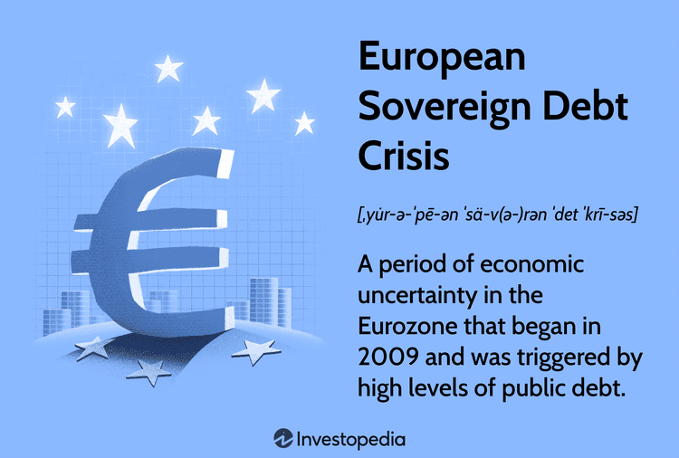

The European sovereign debt crisis, also referred to as the Eurozone crisis, marks a significant episode in the modern financial history of the European Union (EU). The crisis unfolded mainly between 2009 and 2012 and underscored the vulnerabilities within the EU's intricate financial systems. This period was characterized by multiple EU member states facing the dire prospect of defaulting on their national debts, which reverberated through the regional and global economies.

The crisis primarily impacted peripheral countries within the Eurozone, such as Greece, Ireland, and Italy. Each country faced distinct yet interconnected economic challenges, necessitating detailed examinations of their fiscal management practices and the consequential impact on regional stability. Moreover, the crisis influenced major political and economic events, including the United Kingdom’s Brexit decision, highlighting the broader implications for the EU's cohesion and economic strategies.



Within this context, technological advancements, particularly in algorithmic trading, played a pivotal role. Algorithmic trading, known for its capacity to provide high liquidity and quick trade execution, emerged as a crucial tool in managing market volatility during the crisis. Its role, both as a stabilizing force and a complex element of market behavior, offers valuable insights into how modern technology aids in navigating financial turmoil.

Analyzing the Eurozone crisis is imperative for various stakeholders, including investors, policymakers, and analysts. By understanding the intricate causes, key events, and outcomes, one can glean critical lessons aimed at preventing similar financial disruptions in the future. This investigation will also illuminate the potential of leveraging technological innovations, like algorithmic trading, in securing economic stability moving forward. As the EU progresses, these insights will be crucial in crafting robust economic policies and fortifying the union against future fiscal challenges.

## Table of Contents

## Understanding the Sovereign Debt Crisis

The European sovereign debt crisis, also known as the Eurozone crisis, was triggered by a series of events beginning with the collapse of Iceland’s banking system in 2008. This collapse acted as a precursor, highlighting vulnerabilities in banking systems across Europe and spreading fears of potential systemic failures. The crisis soon engulfed other peripheral Eurozone countries—Portugal, Ireland, Italy, Greece, and Spain, collectively known as the PIIGS. These nations faced severe financial instability and were unable to finance their debt without external assistance.

A significant contributor to the crisis was the misreporting of government deficits and national debt levels. For example, Greece's admission in 2009 that its budgetary deficit would be 12.7% of GDP, which was more than twice the previously estimated figure, led to a profound loss of investor confidence. As uncertainty grew, investors demanded higher yields on sovereign bonds as compensation for perceived risks, pushing the borrowing costs for these countries to unsustainable levels. The soaring bond yields reflected increasing skepticism about these nations' ability to meet their debt obligations without defaulting.

An illustrative case is the Greek debt crisis, a focal point of the broader Eurozone predicament. Greece's economic turmoil was underpinned by structural weaknesses such as tax evasion, excessive public sector spending, and minimal economic growth. These issues were compounded by external shocks from the global financial crisis of 2007-2008, leading to diminished revenues and an inability to service existing debts. The Greek crisis underscored the dangers of fiscal mismanagement and had cascading effects on the stability of the Eurozone itself.

In response to the escalating crisis, international financial institutions played crucial roles. The International Monetary Fund (IMF) and the European Central Bank (ECB), along with the European Commission—together referred to as the Troika—were instrumental in orchestrating bailout packages. The IMF provided financial support paired with austerity measures aimed at fiscal consolidation. The ECB took extraordinary measures, including long-term refinancing operations and securities market programs, to ensure [liquidity](/wiki/liquidity-risk-premium) in the banking system and stabilize sovereign debt markets. These interventions were pivotal in preventing the collapse of affected economies and maintaining the integrity of the Eurozone.

Overall, the sovereign debt crisis brought to light the frailties in fiscal management practices and the interconnectedness of financial markets within the Eurozone, prompting reforms aimed at enhancing fiscal discipline and economic governance among EU member states.

## Causes of the European Debt Crisis

The European debt crisis, particularly affecting the period from 2009 to 2012, was fueled by a confluence of several critical factors that began brewing with the global financial crisis of 2007-2008 and the subsequent Great Recession. These events unveiled significant vulnerabilities within various Eurozone economies.

One primary cause was poor fiscal management, wherein numerous countries within the Eurozone accumulated excessive public sector deficits over time. This lax fiscal discipline, coupled with creative accounting practices, often concealed the true extent of national debts, misleading investors and policymakers about the fiscal health of these countries. For instance, Greece's significant budget deficit was much larger than reported, leading to a dramatic loss of credibility and investor confidence.

The real estate market bubbles are another crucial [factor](/wiki/factor-investing) that exacerbated the crisis. Preceding the debt crisis, several Eurozone countries, notably Spain and Ireland, experienced rapid growth in their housing markets, which were largely fuelled by cheap credit. The bursting of these bubbles had a domino effect, resulting in massive layoffs, reduced consumer spending, and a banking crisis as mortgage defaults soared.

Adding to the woes were the legacies of lax lending practices. In the period leading up to the crisis, financial institutions engaged in high-risk lending, both domestically and internationally, without adequate consideration of borrowers' creditworthiness. The resulting high levels of non-performing loans further strained European banks' balance sheets, creating a banking crisis that coincided with government debt challenges.

Examining these causes reveals deeper issues related to fiscal policies, monetary union constraints, and structural flaws within the Eurozone. The monetary union created a complex dynamic by implementing a common currency, the euro, without having a unified fiscal policy across the member states. This constraint meant that countries could not devalue their currencies independently to recover competitiveness, a tool typically used by nations facing economic difficulties.

Additionally, the Eurozone's economic framework had inherent structural vulnerabilities. The stability and growth pact, which set the fiscal rules for the Eurozone countries with limits on deficits and debt levels, was often disregarded, undermining its effectiveness. The absence of a central fiscal authority obliged countries to manage their own fiscal policies even as they shared a common currency, leading to disparities and tensions.

In summary, the European debt crisis was a complex, multi-dimensional problem arising from a blend of global economic shocks and internal Eurozone challenges, including irresponsible fiscal behavior, real estate crashes, and the deficiencies inherent in a monetary union without adequate fiscal integration.

## Impact on EU Member States: Greece, Italy, and Beyond

The European sovereign debt crisis had profound impacts on EU member states, with Greece and Italy exemplifying the challenges and complexities faced during this period. Greece's economic struggle magnified the severe consequences of financial mismanagement, revealing how inadequate fiscal policies and lack of transparency can threaten both national and regional stability. By 2010, Greece's debt had reached unprecedented levels, peaking at around 146% of its GDP, largely resulting from chronic overspending and structural inefficiencies within the public sector. The lack of accurate fiscal reporting exacerbated these issues, leading to a loss of confidence among international creditors and necessitating multiple bailout packages from the European Union (EU) and the International Monetary Fund (IMF) to avert default.

Italy's situation, while not as acute as Greece's, still posed a substantial risk to the Eurozone due to its large public debt, which accounted for over 120% of GDP by 2011. The combination of political instability and sluggish economic growth made it challenging to implement necessary reforms. The Italian government's efforts to stabilize the economy included austerity measures and pension reforms, but these were often met with domestic resistance. Italy's strategic significance in the EU meant that its financial instability could have far-reaching implications, necessitating close monitoring and intervention by European financial institutions to maintain economic equilibrium.

Beyond Greece and Italy, the crisis's repercussions were felt across the Eurozone, each country responding differently depending on their economic vulnerabilities and political landscapes. Portugal, facing its own set of fiscal deficits and rising debt, required international assistance that came with conditions of stringent austerity measures, raising concerns about social stability and economic recovery. Spain confronted a housing market collapse, exemplifying the dangers of real estate bubbles, which led to a significant banking crisis. The Spanish government implemented reforms to restructure the banking sector, supported by EU financial aid, highlighting the interconnectedness of financial systems within the bloc.

Cyprus, though smaller in scale, also experienced financial turmoil, largely influenced by its exposure to Greek debt and an overinflated banking sector. The Cypriot government, in coordination with international bodies, adopted capital controls and sought bailout loans to stabilize its economy, illustrating the diverse set of challenges EU countries faced during the crisis.

Overall, the crisis underscored the necessity for improved fiscal governance and closer economic coordination within the Eurozone. It highlighted the need for transparent financial practices and effective policy implementations to safeguard against future disruptions, ensuring regional economic stability.

## The Role of Algorithmic Trading in the Crisis

During the European sovereign debt crisis, technological advancements in financial markets, particularly [algorithmic trading](/wiki/algorithmic-trading), emerged as pivotal tools. Algorithmic trading refers to the utilization of computer programs and algorithms to execute transactions at speeds and frequencies beyond human capability. This technology allowed traders to provide high liquidity and execute trades faster, thus playing a significant role in the financial environment shaped by the crisis.

Algorithmic trading strategies were crucial for mitigating risks and benefiting from [volatility](/wiki/volatility-trading-strategies) in the Eurozone financial markets. Traders employed various strategies to hedge against potential losses. One common approach was statistical [arbitrage](/wiki/arbitrage), where algorithms analyzed price discrepancies of correlated securities to identify profitable opportunities. At the heart of these operations were mathematical models that processed vast amounts of market data to forecast future price movements.

A simple example of a strategy could be a moving average crossover system, where trades are executed based on the relationship between different moving averages. For instance, if the short-term moving average exceeded the long-term average, the algorithm might trigger a buy signal. Here's a basic Python pseudocode implementation:

```python
def compute_moving_average(prices, window_size):
    return sum(prices[-window_size:]) / window_size

prices = [/* list of past stock prices */]
short_window = 5
long_window = 20

short_moving_avg = compute_moving_average(prices, short_window)
long_moving_avg = compute_moving_average(prices, long_window)

if short_moving_avg > long_moving_avg:
    print("Buy signal")
elif short_moving_avg < long_moving_avg:
    print("Sell signal")
```

Despite the apparent benefits, the rapid pace and complexity of algorithmic trading introduced additional challenges to financial markets during the crisis. One major concern was market liquidity; while algorithms provided liquidity, they could also contribute to sudden liquidity shortages during extreme volatility. This was evidenced by the "flash crash" phenomenon, where markets rapidly dropped and rebounded in minutes, largely attributed to high-frequency trading algorithms.

Moreover, the interconnected nature of modern financial systems meant that algorithms responding to erroneous signals or unable to process new information timely could exacerbate market instability. This raised regulatory and ethical issues about the oversight and transparency of algorithms operating in global financial arenas.

Overall, while algorithmic trading during the debt crisis enhanced liquidity and offering trade efficiencies, it also exposed markets to unforeseen risks and complexities requiring careful monitoring and management by regulatory bodies.

## Brexit and Its Implications for the Eurozone

The 2016 Brexit vote, in which the United Kingdom decided to leave the European Union, was a pivotal moment that stemmed partly from the underlying tensions exposed by the European sovereign debt crisis. The crisis had led to increased Euroscepticism, with many in the UK questioning the effectiveness and sustainability of EU membership. Economic uncertainty and the perception of a loss of national sovereignty were significant factors in the decision-making process during the Brexit referendum.

The economic instability caused by the Eurozone crisis had already highlighted the challenges of a monetary union without full fiscal integration, leading to calls for reforms within the EU. In the UK, skepticism regarding the economic benefits of staying in an increasingly integrated EU grew, despite the general recovery of the global economy. This Euroscepticism was intensified by fears that the potential for future crises could require more centralized control over member states' economic policies, potentially at the expense of national decision-making power.

Post-Brexit, the implications for the Eurozone were profound. Firstly, the departure of one of its largest economies raised questions about the future economic stability and cohesion of the EU. As a result, market perceptions shifted, leading to volatility in both currency and stock markets across Europe. The euro fell significantly against the dollar in the immediate aftermath, reflecting concerns over the potential economic fallout.

Moreover, Brexit forced EU policymakers to confront and address the structural weaknesses within the Eurozone. It underscored the necessity for deeper financial integration and coordination in areas such as banking regulations and fiscal policies to avoid similar crises in the future. Additionally, it emphasized the need for the EU to enhance political stability by addressing the concerns of member states regarding economic governance and sovereignty.

In terms of economic policies, Brexit required the EU to rethink its strategies concerning trade, regulatory standards, and labor mobility. The EU had to negotiate new trade agreements and establish clear regulatory frameworks to sustain its competitive position globally. Furthermore, Brexit led to a re-evaluation of the EU's budgetary contributions and fiscal priorities, as the UK had been a significant net contributor to the EU budget. 

In conclusion, while Brexit was a direct consequence of the various tensions exacerbated by the Eurozone crisis, it also served as a catalyst for the EU to re-examine its foundations and future direction. The need for enhanced cooperation and innovation in financial and economic policies became more apparent as the EU sought to prevent future destabilizing events.

## Lessons Learned and Future Outlook

The European sovereign debt crisis provided essential insights into fiscal management and economic governance within the Eurozone. It highlighted the necessity for strict fiscal discipline and the accurate reporting of financial data among member states. The crisis underscored how deviations from agreed fiscal constraints and misreporting could destabilize the entire economic structure of the Union. 

To mitigate similar challenges in the future, the Eurozone has focused on strengthening its financial infrastructure. Reforms have been implemented that emphasize better surveillance mechanisms, ensuring that fiscal policies are not only coordinated but also transparent and sustainable. Additionally, efforts were made to establish a banking union, aimed at centralizing supervision and resolution frameworks for financial institutions across member states.

Looking forward, the EU faces significant challenges. Managing high levels of public sector debt remains a priority, as such debts can pose risks to economic stability. This management requires careful balancing of fiscal policies to stimulate growth while ensuring long-term sustainability. Furthermore, there is growing pressure for enhanced international cooperation in financial regulation. This is particularly vital as financial markets are increasingly interdependent, and risks in one region can rapidly spread to others.

In conclusion, the lessons from the crisis have been instrumental in shaping current and future economic policies and ensuring the resilience of the Eurozone in the face of new challenges. The emphasis on robust economic structures and policies continues to be crucial in maintaining stability within the EU.

## Conclusion

The Eurozone crisis revealed significant structural and policy weaknesses within the European Union's economic framework. The crisis underscored a lack of fiscal integration coupled with monetary union constraints, highlighting the necessity for a more coordinated and robust economic strategy across member states. Despite its challenges, the crisis delivered crucial insights that have informed subsequent financial reforms and policy adjustments.

As the EU progresses, adopting technological advancements such as algorithmic trading will be essential in sustaining economic stability. These tools provide enhanced market liquidity and allow for more efficient risk management. However, they also demand a comprehensive regulatory framework to ensure they contribute positively to financial markets without introducing new risks. Effective deployment of such technology requires balanced regulation that preserves market integrity while promoting innovation.

In reinforcing fiscal policies, EU member states must prioritize sustainable fiscal discipline, transparent reporting, and coordinated economic strategies. This involves enhancing the European Stability Mechanism and fostering deeper financial integration to safeguard against future economic shocks. Developing a banking union with uniform regulatory standards is also pivotal in mitigating systemic vulnerabilities that were evident during the crisis.

By reflecting on past experiences, particularly from the Eurozone crisis, the EU can forge a robust economic blueprint to navigate potential future adversities. This involves not only learning from past policy missteps but also preemptively addressing the systemic deficiencies that could threaten economic cohesion. Crafting such a resilient economic strategy will enable the EU to uphold stability and prosperity in an increasingly interconnected and volatile global economy.

## References & Further Reading

[1]: Lane, P. R. (2012). ["The European Sovereign Debt Crisis."](https://www.aeaweb.org/articles?id=10.1257/jep.26.3.49) Journal of Economic Perspectives, 26(3), 49-68.

[2]: De Grauwe, P. (2011). ["Managing a Fragile Eurozone."](https://cepr.org/voxeu/columns/managing-fragile-eurozone) CEPR Policy Insight No. 56.

[3]: Arghyrou, M. G., & Kontonikas, A. (2012). ["The EMU Sovereign-Debt Crisis: Fundamentals, Expectations and Contagion."](https://www.sciencedirect.com/science/article/pii/S1042443112000236) Journal of International Financial Markets, Institutions and Money, 22(4), 658-677.

[4]: Botsch, A. (2012). ["The Effect of the Eurozone Sovereign Debt Crisis on Stock Volatilities: High-Frequency Evidence for France, Germany, Greece and Italy."](https://pmc.ncbi.nlm.nih.gov/articles/PMC8733696/) MPRA Paper No. 43520.

[5]: Hendershott, T., Jones, C. M., & Menkveld, A. J. (2011). ["Does Algorithmic Trading Improve Liquidity?"](https://onlinelibrary.wiley.com/doi/full/10.1111/j.1540-6261.2010.01624.x) The Review of Financial Studies, 24(8), 3025-3064.

[6]: Eichengreen, B. (2010). ["The Breakup of the Euro Area."](https://eml.berkeley.edu/~eichengr/breakup_euro_area.pdf) NBER Working Paper No. 13393.

[7]: Papademos, L., & Spiegel, M. (2010). ["The Debt Crisis in the Euro Area: Structural Weaknesses and the Institutional Architecture of EMU."](https://en.wikipedia.org/wiki/Goldman_Sachs) European Central Bank.

[8]: Pisani-Ferry, J. (2013). ["The Euro Crisis and Its Aftermath."](https://academic.oup.com/book/11388) Oxford University Press.