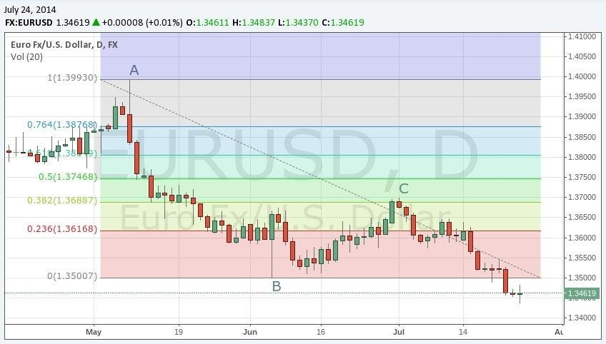

The EUR/USD currency pair is one of the most traded currency pairs in the global foreign exchange (forex) market. Representing the value of one euro in terms of the U.S. dollar, this pair serves as a crucial indicator of both European and U.S. economic health. The EUR/USD pair's significance stems from the sheer volume of trade between the Eurozone and the United States, making it a preferred choice for traders and investors worldwide. Its high liquidity results in tighter spreads, reduced risk of slippage, and the ability to execute large orders with minimal impact on the market. Furthermore, its volatility provides ample opportunities for traders to capitalize on price fluctuations, driven by economic data releases and geopolitical events.

Algorithmic trading has redefined the landscape of modern financial markets by using automated, rule-based systems to execute trades. Unlike manual trading, algorithmic trading maximizes efficiency by making rapid decisions based on market conditions, historical data, and predetermined rules, mitigating the influence of human emotions such as fear and greed. Programs are designed to capture fleeting market opportunities, sometimes executing trades in milliseconds, which is particularly advantageous in the highly liquid EUR/USD market.



The EUR/USD pair's prominence and attributes make it an ideal candidate for deploying algorithmic trading strategies. Its liquidity ensures minimal transaction costs, while its responsiveness to economic indicators allows for a dynamic interplay of fundamental and technical analyses. The integration of algorithmic trading in EUR/USD strategies paves the way for sophisticated approaches that blend economic news, technical indicators, and market sentiment analysis. This marriage of technology and forex trading not only enhances potential returns but also fosters a disciplined trading environment, essential for navigating the complexities of the global markets.

## Table of Contents

## Understanding the EUR/USD Pair

The EUR/USD currency pair, representing the Euro against the U.S. Dollar, is the most actively traded and liquid currency pair in the global foreign exchange (forex) market. Due to the economic strength and size of the Eurozone and the United States, their currencies naturally attract significant trading interest. The high liquidity of the EUR/USD means that transactions can be executed quickly at desired prices with minimal slippage, making it highly favorable for both individual and institutional traders.

### Economic Indicators Influencing EUR/USD Movements

Several critical economic indicators influence the movements of the EUR/USD pair:

1. **Gross Domestic Product (GDP)**: As an essential measure of economic health, GDP growth or contraction in the Eurozone or the United States can significantly impact the EUR/USD exchange rate. Strong GDP growth in the Eurozone relative to the U.S. is usually supportive of the euro, while stronger U.S. GDP growth tends to favor the dollar.

2. **Interest Rates**: The interest rate decisions by the European Central Bank (ECB) and the Federal Reserve (Fed) play a crucial role in the EUR/USD dynamics. An increase in interest rates typically strengthens the corresponding currency as it offers higher returns on investments.

3. **Central Bank Policies**: The monetary policies enacted by the ECB and the Fed, including quantitative easing and signaling of future rate changes, are closely monitored by traders. Dovish or hawkish stances from these institutions can signal future currency strength or weakness, respectively.

4. **Inflation Rates**: Inflation impacts purchasing power and can affect currency valuation. Higher inflation in the Eurozone compared to the U.S., without corresponding monetary intervention, might weaken the euro against the dollar.

5. **Political Stability and Economic Confidence**: Political events and economic confidence indicators like the Consumer Confidence Index can influence market perceptions and, consequently, the EUR/USD rate. Political or economic upheavals tend to lead to currency volatility, as traders seek to manage risks.

### Popularity of EUR/USD for Algorithmic Strategies

The EUR/USD pair is a favorite among algorithmic traders due to its consistency in [liquidity](/wiki/liquidity-risk-premium) and price movement data, which are crucial for developing, testing, and executing strategies without frequent disruptions that can lead to errors or slippage. Here are a few reasons why:

- **Consistent Volatility Patterns**: The EUR/USD pair exhibits predictable volatility patterns which algorithmic systems can capitalize on to predict market movements. It tends to have increased activity during the European and U.S. trading sessions when economic data releases are frequent.

- **Availability of Data**: Extensive historical data availability for EUR/USD makes it easier to backtest algorithms. This data is crucial for identifying trends and anomalies over different market cycles.

- **Tight Spreads**: The high level of liquidity ensures that spreads remain competitive, reducing the costs involved in executing a large number of trades, which is typical in algorithmic trading strategies.

- **Economic Interdependence**: The intertwined economies of the Eurozone and the U.S. provide ample opportunities for trading based on economic news and events that can impact the EUR/USD value.

In conclusion, the EUR/USD pair's prominence in the [forex](/wiki/forex-system) market, influenced by several robust economic indicators and supported by a vast data pool, facilitates its popularity for both manual and [algorithmic trading](/wiki/algorithmic-trading) endeavors.

## Fundamentals of Algo Trading

Algorithmic trading involves the use of computer algorithms to automate trading strategies. This method leverages computational efficiency to execute orders based on pre-defined criteria such as price, timing, and [volume](/wiki/volume-trading-strategy). Algorithmic trading offers several advantages over manual trading. Firstly, it removes human emotions from the trading process, ensuring consistent execution of strategies without the influence of psychological factors such as fear or greed. Secondly, algorithms can process vast amounts of market data and execute trades at high speed and frequency, enabling traders to capitalize on opportunities that might be missed manually. Lastly, algorithmic trading can operate 24/7, allowing continuous market participation without the need for human intervention.

The key components of an algorithmic trading system include:

1. **Programming**: This requires the development of strategies expressed through code. Programming languages such as Python, C++, or Java are commonly used to create these algorithms. A simple example using Python to calculate a moving average might be:

   ```python
   def moving_average(prices, window_size):
       return [sum(prices[i:i+window_size])/window_size for i in range(len(prices)-window_size+1)]
   ```

   This function calculates the moving average of a list of prices over a specified window size, showcasing how basic strategies can be programmed.

2. **Backtesting**: This involves testing the algorithm against historical data to evaluate its performance. Backtesting helps in assessing how the strategy would have performed in the past, thus providing insights into its potential future effectiveness. Statistical measures such as the Sharpe Ratio can be used to gauge the risk-adjusted returns of the strategy:
$$
   \text{Sharpe Ratio} = \frac{E[R_p - R_f]}{\sigma_p}

$$

   where $R_p$ is the return of the portfolio, $R_f$ is the risk-free rate, and $\sigma_p$ is the standard deviation of the portfolio returns.

3. **Risk Management**: This component is crucial to safeguard against excessive losses. Effective risk management might include setting stop-loss and take-profit levels, position sizing, and ensuring proper leverage use. Algorithms can be programmed to automatically reduce or close positions when certain risk parameters are breached.

The technological evolution supporting algorithmic trading platforms has been driven by advancements in computing power and network infrastructure. Increased processing speeds allow algorithms to react and execute trades in milliseconds, often faster than a human can blink. Modern trading platforms offer robust APIs, allowing seamless integration of algorithms and real-time data feeds. Additionally, cloud computing facilitates scalable data storage and processing capabilities, enabling analysis of large datasets. The development of [machine learning](/wiki/machine-learning) and [artificial intelligence](/wiki/ai-artificial-intelligence) algorithms further enhances the adaptive nature of these trading strategies, allowing them to learn and evolve from new data inputs, thus optimizing performance continuously.

In conclusion, algorithmic trading harnesses the power of technology to create a more efficient and systematic trading approach. By relying on pre-coded rules, [backtesting](/wiki/backtesting), and integrating effective risk management, traders can capitalize on advantages not feasible through manual trading. The continuous evolution of technology promises even greater efficiencies and capabilities in the future of algo trading.

## Crafting Effective EUR/USD Strategies

Blending [fundamental analysis](/wiki/fundamental-analysis) with technical indicators is crucial in crafting effective trading strategies for the EUR/USD currency pair. This combination allows traders to develop well-rounded strategies that leverage both the macroeconomic factors driving the currency's movements and the historical price patterns detectable through technical analysis.

### Importance of Combining Fundamental and Technical Analysis

Fundamental analysis involves evaluating economic indicators, such as GDP growth rates, employment figures, and [interest rate](/wiki/interest-rate-trading-strategies) policies from entities like the European Central Bank (ECB) and the Federal Reserve (Fed). These indicators provide insights into the economic health of the Eurozone and the United States, influencing the demand and supply dynamics of the EUR/USD pair.

Technical analysis, on the other hand, focuses on chart patterns and statistical indicators. It allows traders to predict future price movements based on historical data. When combined, fundamental and technical analyses offer a comprehensive view that can increase the accuracy of trading decisions by aligning long-term economic trends with short-term market behaviors.

### Technical Tools for EUR/USD

Several technical tools can be tailored for the EUR/USD pair to enhance strategy design:

1. **Moving Averages**: Moving averages, such as the Simple Moving Average (SMA) or the Exponential Moving Average (EMA), are employed to smooth out price data, identifying trends. For instance, a common strategy is using the crossover of a short-term EMA (e.g., 20-day) with a long-term EMA (e.g., 50-day) to signal buy or sell opportunities.

   **Python Example**:
   ```python
   import pandas as pd

   # Assume 'df' is a pandas DataFrame containing EUR/USD historical data with a 'close' column.
   df['EMA20'] = df['close'].ewm(span=20, adjust=False).mean()
   df['EMA50'] = df['close'].ewm(span=50, adjust=False).mean()

   df['Signal'] = 0
   df['Signal'][20:] = np.where(df['EMA20'][20:] > df['EMA50'][20:], 1, 0)
   df['Position'] = df['Signal'].diff()
   ```

2. **Moving Average Convergence Divergence (MACD)**: This momentum indicator highlights the relationship between two EMAs, providing signals to enter or exit trades based on crossovers and divergences. For EUR/USD, traders typically use a 12-day EMA, a 26-day EMA, and a 9-day EMA signal line.

### Integration of Market Sentiment and Economic News

Market sentiment and economic news have a significant impact on the EUR/USD pair. Sentiment analysis can gauge the market's mood via news headlines, economic reports, and geopolitical developments. Integrating these into trading algorithms involves parsing news feeds or sentiment data in real-time to make dynamic trading decisions.

For example, a sudden dovish announcement from the ECB or a positive economic report from the U.S. could be programmed to trigger an immediate trade, taking advantage of the expected currency movement. Sentiment indicators, often derived from news analytics, can be combined with traditional technical tools to optimize trade timing and direction.

By harmonizing fundamental insights with precise technical indicators and real-time sentiment analysis, traders can craft sophisticated and responsive trading algorithms for the EUR/USD pair. This multi-dimensional approach helps in capturing opportunities and managing risks effectively in the dynamic forex market.

## Backtesting EUR/USD Trading Strategies

Backtesting is a crucial step in the development and verification of EUR/USD trading strategies, allowing traders to assess the viability of their trading algorithms before deploying them in live markets. This process involves simulating the strategy on historical data to evaluate its performance over past market conditions.

The fundamental objective of backtesting is to determine the potential profitability and risk associated with a trading strategy. By using historical data, traders can analyze how the algorithm would have reacted to past market movements, providing insights into its strengths and weaknesses.

MetaTrader is one of the most popular platforms used for backtesting and strategy optimization in forex trading. It offers features like historical data testing, advanced charting capabilities, and automated execution of trading strategies through Expert Advisors (EAs). The platform allows users to input their trading algorithms and run simulations to observe how these strategies would have performed historically.

When evaluating the success of a strategy post-backtesting, several criteria should be considered:

1. **Profitability**: The primary measure of a strategy's success is its ability to generate profits over time. This includes assessing the total return and comparing it to benchmarks or other strategies.

2. **Risk-Adjusted Returns**: It's important to evaluate the returns in relation to the risk taken. Metrics like the Sharpe Ratio or Sortino Ratio can help assess the efficiency of a strategy in generating returns compared to the risk involved.

3. **Drawdown**: This measures the peak-to-trough decline during a specific period of an investment. A strategy with a high maximum drawdown might indicate excessive risk.

4. **Consistency**: The strategy should ideally produce steady and consistent results across different time periods. This includes examining the number of winning trades versus losing trades and the distribution of returns.

5. **Robustness**: A less sensitive strategy to changes in input parameters suggests robustness. This can be tested through various scenarios and sensitivity analysis.

6. **Execution Metrics**: Factors such as slippage, transaction costs, and latency should be considered as they can significantly impact strategy performance during live trading.

By thoroughly backtesting trading strategies using platforms like MetaTrader and evaluating them against these criteria, traders can improve their chances of executing successful and profitable EUR/USD trading strategies. This systematic approach helps in refining algorithms before they are subjected to current market movements, safeguarding against potential losses.

## Managing Risk in Algorithmic Trading

Risk management is a critical component in algorithmic trading to mitigate potential losses and ensure long-term profitability. Effective risk management protocols can provide stability to trading algorithms, especially when trading volatile currency pairs like EUR/USD.

**Risk Management Protocols**

Establishing robust risk management protocols is crucial in minimizing exposure to unfavorable market movements. These protocols typically involve setting predefined rules and parameters that trigger automated responses to specific market conditions. Standard practices include diversification of trading strategies, setting maximum loss limits, and using trailing stops to lock in profits. Implementing risk management protocols can help limit potential losses, ensuring that trading algorithms operate sustainably.

**Position Sizing and Leverage Management in EUR/USD Trading**

Position sizing refers to determining the amount of capital to allocate to a trade based on the risk tolerance and account size. For the EUR/USD pair, traders calculate position size using the formula:

$$
\text{Position Size} = \left( \frac{\text{Risk per Trade}}{\text{Pip Value} \times \text{Stop Loss in Pips}} \right)
$$

Leverage allows traders to control a larger position size with a smaller initial margin. However, excessive leverage can amplify losses. Therefore, prudent leverage management is essential. This involves using leverage ratios tailored to the trader's risk profile and the [volatility](/wiki/volatility-trading-strategies) of EUR/USD.

**Stop-Loss and Take-Profit Orders**

Stop-loss orders automatically close a position when it reaches a certain loss threshold, limiting the potential downside. For algorithmic systems, stop-loss levels are typically determined based on technical analysis or volatility measures. For instance, using the Average True Range (ATR) to set dynamic stop-losses can adjust for market volatility:

```python
import talib as ta
import pandas as pd

data = pd.DataFrame({'high': ..., 'low': ..., 'close': ...})
atr = ta.ATR(data['high'], data['low'], data['close'], timeperiod=14)

stop_loss = current_price - atr
```

Take-profit orders close a position when a target profit level is reached, securing gains before the market reverses. Integrating these orders into trading systems helps to manage returns systematically and reduces the emotional bias that could occur during trading.

The combination of these risk management tools in EUR/USD trading helps traders limit losses, maximize returns, and maintain consistent performance through volatile market periods. Understanding and implementing these protocols are fundamental steps in crafting a sound algorithmic trading strategy.

## Selecting the Right Forex Broker

When choosing a forex broker for algo trading in the EUR/USD market, several critical factors must be considered to ensure a seamless and effective trading experience. These include spreads, regulatory compliance, available trading platforms, customer service, and broker reliability.

### Spreads

Spreads are a fundamental aspect for traders, as they represent the cost of executing a trade. A narrower spread, meaning the difference between the bid and ask price, allows traders to maximize potential profits and minimize transaction costs. For algorithmic trading, where high-frequency and high-volume trades are common, selecting a broker offering competitive spreads on the EUR/USD pair is vital. It's important to monitor whether spreads are fixed or variable, as variable spreads can widen during volatile market periods, impacting the performance of trading algorithms.

### Regulatory Compliance

Regulatory compliance is crucial to ensure the safety and security of your investments. Brokers regulated by reputable financial authorities, such as the Commodity Futures Trading Commission (CFTC) in the United States, the Financial Conduct Authority (FCA) in the United Kingdom, or the Australian Securities and Investments Commission (ASIC), adhere to strict standards of conduct. This regulation provides an additional layer of protection for traders, ensuring that the broker operates with transparency and accountability.

### Trading Platforms

The choice of trading platform is another crucial consideration. An ideal platform for algorithmic trading should support automation via APIs and offer robust features for deploying and managing trading algorithms. Popular platforms such as MetaTrader 4, MetaTrader 5, and cTrader offer extensive support for algorithmic trading, allowing users to develop, test, and execute automated strategies effectively. These platforms also provide essential data feeds, charting tools, and analytical capabilities required for the dynamic environment of forex trading.

### Customer Service and Broker Reliability

Customer service quality and broker reliability are often underestimated but play a significant role in trading success. Efficient and responsive customer service can quickly resolve issues or answer questions, which is particularly important when trading algorithms execute trades automatically. Additionally, a reliable broker ensures robust server uptime and minimal latency, which is crucial to minimizing slippage and ensuring that trades are executed at desired prices. 

### Conclusion

Selecting the right forex broker involves a careful evaluation of several factors. By focusing on spreads, regulatory compliance, trading platforms, and broker reliability, traders can position themselves for a successful algorithmic trading experience in the EUR/USD market. Ultimately, the aim is to enhance profitability and minimize risks through a well-chosen partnership with a dependable broker.

## Live Trading Considerations

Transitioning from demo accounts to live trading represents a significant step in the trader's journey, especially when deploying algorithmic strategies. Key considerations are necessary to validate strategy performance in live market conditions. Successful transition typically involves understanding the nuances of live data, latency, and slippage, which are often not accounted for in simulation environments.

### Strategy Validation

Before fully committing capital, it's paramount to conduct a period of forward-testing on a small, live account. This helps to validate the strategy under real market conditions where factors such as transaction costs and execution speed can vary significantly. This phase is crucial for assessing the robustness of the trading algorithm and ensuring it performs as expected with real-time data.

### Emotional Discipline and Decision-Making

Automated trading systems are designed to remove the emotional element from trading decisions. However, human intervention is still required for system monitoring and maintenance. Traders must exercise discipline to avoid making impulsive adjustments during periods of temporary drawdowns or unexpected market events. Decision-making in algorithmic trading should be grounded in data-driven analysis and a thorough understanding of the strategy’s statistical edge.

### Continuous Monitoring and Strategy Adjustments

Live trading requires continuous monitoring to ensure that the algorithm is functioning as intended and that performance metrics are within acceptable thresholds. Regular analysis of trade logs and performance data can help identify any deviations from expected performance. It is essential to adjust strategies in response to evolving market dynamics. This might include fine-tuning parameters or adapting to new economic conditions.

For continuous monitoring and real-time adjustments, several technological tools are essential. Implementing alert systems and dashboards can enhance the trader’s ability to supervise multiple strategies effectively. Moreover, using software that can automatically pause trading if certain predefined risk thresholds are breached is advisable.

### Example in Python

Here is a simple example of a monitoring script in Python that checks if a trading algorithm is active and logs relevant performance metrics:

```python
import time
from datetime import datetime
import logging

# Configure logging
logging.basicConfig(filename='trade_monitor.log', level=logging.INFO)

def is_algorithm_active():
    # This function would contain logic to determine if the algorithm is running
    # For example, checking active orders or accessing system health
    return True  # Example response

def log_performance_metrics():
    # Logic to gather and log strategy performance metrics, such as PnL or risk limits
    logging.info(f"{datetime.now()} - Checking strategy performance...")
    # For demonstration purposes, here is a placeholder for actual performance data
    performance_data = {
        'profit_loss': 100,
        'num_trades': 5,
        'current_position': 'long'
    }
    logging.info(f"Performance Metrics: {performance_data}")

while is_algorithm_active():
    log_performance_metrics()
    time.sleep(60)  # Run monitoring every minute
```

This script serves as a basic monitoring tool by logging performance metrics at regular intervals, which can later be analyzed for strategy adjustments.

### Conclusion

Live trading of algorithmic strategies, particularly for the EUR/USD pair, demands a blend of technical acumen, emotional discipline, and proactive monitoring. As traders transition from simulation to reality, the ability to validate strategies, maintain emotional steadiness, and continuously refine algorithms ensures long-term success in the fast-paced forex markets.

## Advanced Strategies for EUR/USD

High-frequency trading ([HFT](/wiki/high-frequency-trading-strategies)) and stochastic models represent cutting-edge approaches within the domain of EUR/USD trading strategies. These advanced methods leverage technology and data analysis to exploit market inefficiencies and enhance trading performance.

### High-Frequency Trading (HFT)

HFT involves executing a large number of trades at extremely high speeds, often in fractions of a second. This approach is reliant on sophisticated algorithms and state-of-the-art computing infrastructure to identify and capitalize on minute price discrepancies in the EUR/USD market. HFT strategies typically involve market-making, [arbitrage](/wiki/arbitrage), and short-term [trend following](/wiki/trend-following). The success of HFT in EUR/USD trading is attributed to the pair's high liquidity, which allows for quick entry and [exit](/wiki/exit-strategy) at favorable prices without significantly impacting the market.

### Stochastic Models

Stochastic models incorporate randomness and uncertainty into their frameworks, providing a robust tool for modeling financial markets. In EUR/USD trading, such models are employed to predict price movements and volatility patterns. One common stochastic approach is the application of the stochastic differential equation (SDE), which can model the evolution of exchange rates. A basic form of an SDE for modeling financial markets is:

$$
dX_t = \mu X_t dt + \sigma X_t dW_t
$$

where $X_t$ is the exchange rate at time $t$, $\mu$ is the drift term representing expected return, $\sigma$ is the volatility, and $dW_t$ is a Wiener process representing random noise.

### Machine Learning Applications

Machine learning (ML) has become an integral part of developing sophisticated EUR/USD trading algorithms. ML techniques can analyze vast amounts of historical and real-time data to identify patterns and predict future price movements. Popular ML models used in forex trading include:

- **Neural Networks**: Capable of capturing nonlinear relationships in data, neural networks are used to predict price directions or generate buy/sell signals.
- **Support Vector Machines (SVM)**: Effective in classification tasks, SVMs can help in deciding whether to enter a trade based on historical patterns.
- **Reinforcement Learning (RL)**: RL models can optimize trading strategies by learning from interactions with the market environment to maximize cumulative rewards.

In Python, a basic example of using a [neural network](/wiki/neural-network) for predicting price movements might look like this:

```python
from keras.models import Sequential
from keras.layers import Dense

# Define neural network model
model = Sequential()
model.add(Dense(64, input_dim=input_shape, activation='relu'))
model.add(Dense(32, activation='relu'))
model.add(Dense(1, activation='sigmoid'))

# Compile and train the model
model.compile(optimizer='adam', loss='binary_crossentropy', metrics=['accuracy'])
model.fit(X_train, y_train, epochs=50, batch_size=10, validation_data=(X_test, y_test))
```

### Future Trends in Algorithmic Trading Technologies

The future of algorithmic trading, especially in EUR/USD, is poised to benefit from the rapid advancements in artificial intelligence and quantum computing. AI algorithms are expected to handle more complex data and generate insights that are beyond human cognition. Additionally, quantum computing may revolutionize data processing speeds, allowing for even more efficient strategy execution in forex markets.

Innovations also include improved integration of [alternative data](/wiki/best-alternative-data) sources, such as social media sentiment and news analytics, to enhance traditional algorithmic strategies. These technologies promise to provide traders with a competitive edge by enabling more informed decision-making processes.

Overall, while advanced strategies for EUR/USD trading offer significant potential, they also require continuous adaptation and refinement to keep pace with technological developments and evolving market dynamics.

## Conclusion

The EUR/USD currency pair remains a focal point for traders worldwide due to its significant liquidity and volatility, making it a prime candidate for algorithmic trading strategies. Throughout this article, we explored the intricate dynamics of the EUR/USD pair and the essential elements of algorithmic trading that provide a structured approach to exploiting these market conditions.

Algorithmic trading offers distinct advantages over manual trading methods, including enhanced speed, precision, and the removal of emotional decision-making. These benefits are particularly relevant in the fast-paced forex markets, where the EUR/USD pair often presents rapid price movements. Nevertheless, the implementation of algorithms also comes with challenges, such as the need for robust risk management and the continuous evolution of trading strategies in response to market changes.

The integration of fundamental analysis with technical indicators is crucial for developing successful algorithms. Effective strategies must consider the impact of economic indicators, market sentiment, and real-time news events on the EUR/USD. Furthermore, the importance of backtesting cannot be overstated, as it verifies the potential success of a strategy before risking real capital. Utilizing platforms like MetaTrader enhances strategy testing and optimization, ensuring that trader decisions are backed by solid data.

Risk management remains an essential part of algorithmic trading, with practices such as position sizing, leverage management, and the use of stop-loss and take-profit orders being imperative to safeguard against significant losses.

As the forex trading landscape continues to evolve, so too must the trading strategies and technologies employed. High-frequency trading and the application of machine learning to develop predictive models represent the forefront of advanced trading methodologies. These technologies, although promising, require continuous learning and adaptation by traders seeking to maintain their competitive edge in the forex market.

In summary, trading the EUR/USD through algorithms presents both opportunities and challenges. The potential for profitability is significant, but so is the need for diligent strategy development and risk management. Traders who embrace continual learning and adapt to the changing market conditions are more likely to succeed in this dynamic field. The future of forex trading promises innovation and advancement for those willing to invest the time and effort in mastering these sophisticated tools and techniques.

## Frequently Asked Questions

When trading the EUR/USD currency pair, many traders often query the optimal times to trade. The best times typically coincide with periods of peak market activity, which are often during the overlapping hours of key global financial centers. Most notably, the overlap between the London and New York sessions, which occurs between 13:00 and 17:00 GMT, provides high liquidity and volatility. This window often presents both opportunities and risks requiring careful strategy and management.

Choice indicators play a significant role in EUR/USD algo trading. Commonly used technical indicators include moving averages, which help identify trends by smoothing out price data. Simple moving averages (SMA) or exponential moving averages (EMA) can be employed. For instance, traders might look for crossovers, where a short-term moving average crosses above or below a long-term moving average, signaling potential buy or sell opportunities.

Another popular indicator is the Moving Average Convergence Divergence (MACD), which consists of the MACD line, the signal line, and a histogram representing the difference between these lines. The MACD can provide insights into the [momentum](/wiki/momentum), providing signals for potential entry or exit points. 

```python
# Example code for computing a simple moving average (SMA) using Python
import pandas as pd

def calculate_sma(data, window):
    return data.rolling(window).mean()

# assuming price_data is a pandas DataFrame with a 'Close' column for closing prices
sma_20 = calculate_sma(price_data['Close'], 20)
```

For beginners entering algo trading in forex, a few key tips can help set a solid foundation. It is essential to start with a comprehensive understanding of both forex markets and algorithmic trading principles. Beginners should:
- Start with a demo account to practice strategy implementation without financial risks.
- Develop a solid trading plan, integrating both technical and fundamental analysis, and stick to it.
- Keep risk management at the forefront, employing stop-loss and take-profit orders to mitigate potential losses.
- Continually backtest strategies using historical data to verify their effectiveness before applying them in live trading environments.
- Stay informed about global economic events and news that may impact the currency pair.

By carefully considering the timing, employing robust technical indicators, and adhering to disciplined trading practices, beginners can develop a structured approach to EUR/USD algorithmic trading.

## References & Further Reading

[1]: ["Advances in Financial Machine Learning"](https://www.amazon.com/Advances-Financial-Machine-Learning-Marcos/dp/1119482089) by Marcos Lopez de Prado

[2]: ["Machine Learning for Algorithmic Trading"](https://github.com/PacktPublishing/Machine-Learning-for-Algorithmic-Trading-Second-Edition) by Stefan Jansen

[3]: ["Quantitative Trading: How to Build Your Own Algorithmic Trading Business"](https://www.amazon.com/Quantitative-Trading-Build-Algorithmic-Business/dp/1119800064) by Ernest P. Chan

[4]: ["Evidence-Based Technical Analysis: Applying the Scientific Method and Statistical Inference to Trading Signals"](https://www.amazon.com/Evidence-Based-Technical-Analysis-Scientific-Statistical/dp/0470008741) by David Aronson

[5]: Taylor, S.J., & Allen, H.K. (1992). ["The Use of Technical Analysis in the Foreign Exchange Market"](https://www.sciencedirect.com/science/article/pii/0261560692900483). Journal of International Money and Finance.

[6]: Menkhoff, L. (2010). ["The Use of Technical Analysis by Fund Managers: International Evidence"](https://www.sciencedirect.com/science/article/pii/S0378426610001755). Journal of Banking & Finance.