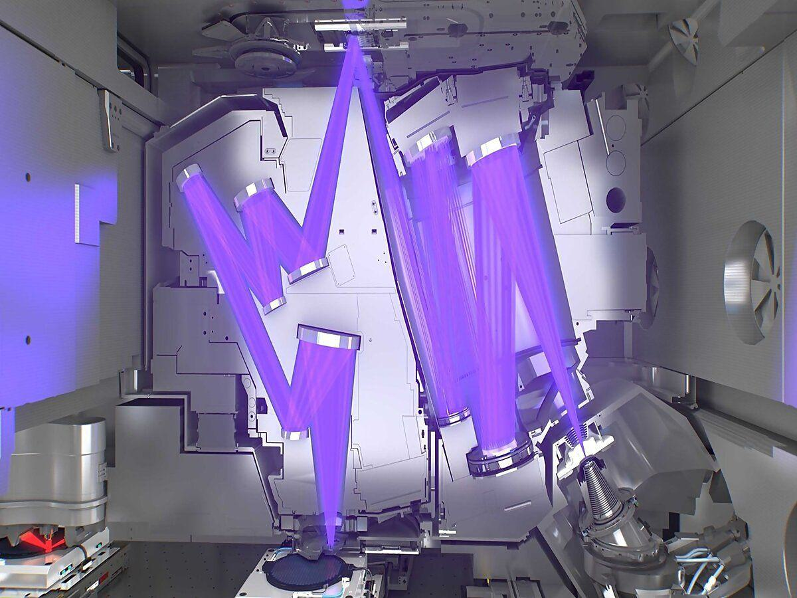

Extreme Ultraviolet (EUV) lithography has emerged as a pivotal innovation in semiconductor manufacturing. This technology utilizes extremely short wavelengths of light, approximately 13.5 nanometers, to produce highly detailed and complex microchips. These microchips are crucial for the advancement of technologies such as artificial intelligence (AI), 5G telecommunications, and automation systems. By offering a method to create smaller and more efficient chips, EUV lithography supports the miniaturization and performance enhancement of electronic devices, aligning with the industry's continuous push for more compact and powerful technology components.

One notable area that benefits from the advancement in computing power afforded by EUV lithography is algorithmic trading. Algorithmic trading involves the use of automated pre-programmed trading instructions to execute orders in financial markets. This method requires high computational efficiency and speed, essential for processing vast amounts of market data and executing trades in milliseconds, often at scales beyond human capability. The increased power and efficiency of microchips enabled by EUV technology directly contribute to the evolution of algorithmic trading, allowing for more sophisticated trading algorithms and strategies.



This article will explore the synergy between EUV technology and algorithmic trading, examining how state-of-the-art semiconductors enhance trading strategies by reducing latency and increasing processing capabilities. The intersection of these fields not only marks a significant advancement in the financial sector but also showcases the transformative potential of EUV lithography across various technological domains.

## Table of Contents

## Understanding EUV Technology

Extreme Ultraviolet (EUV) lithography represents a significant advancement in the field of semiconductor manufacturing. This technology utilizes extremely short wavelengths of light, approximately 13.5 nanometers, to etch intricate patterns onto semiconductor substrates, enabling the production of smaller and more complex microchips. Traditional photolithography, which used longer wavelengths, faced physical limitations in pattern resolution, thus constraining the size and capability of microchips. EUV lithography overcomes these limitations, allowing for the fabrication of more energy-efficient chips with finer details.

The transition from previous lithography techniques to EUV has been pivotal for achieving further miniaturization, a critical factor in sustaining Moore's Law—the empirical observation that the number of transistors on a microchip doubles approximately every two years. EUV technology enables the production of chips with node sizes smaller than 7 nanometers, an achievement unattainable with previous technologies.

ASML, a leading Dutch company, plays an integral role in the EUV lithography landscape. ASML holds a de facto monopoly in the production of EUV lithography machines, primarily due to the complexity and sophistication required in manufacturing these systems. The machines themselves are a marvel of engineering, involving thousands of components and advanced optics. The development and refinement of EUV machines are the results of extensive research and collaboration across multiple sectors.

This technological advancement not only supports the demands of miniaturization but also enhances the overall performance and energy efficiency of microchips. As a result, EUV lithography continues to drive progress in developing cutting-edge applications across various industries, fundamentally reshaping how semiconductor devices are designed and utilized.

## Impact of EUV in Semiconductor Manufacturing

Extreme Ultraviolet (EUV) lithography has become a cornerstone in semiconductor manufacturing, particularly in achieving the intricate process of miniaturization. This technological advancement is crucial for upholding Moore's Law, which predicts the doubling of transistors on a microchip approximately every two years, thereby enhancing computing power and energy efficiency. EUV lithography makes use of extremely short wavelengths, around 13.5 nm, to etch delicate and intricate patterns onto semiconductor wafers. This allows for the production of microchips with transistor nodes smaller than 5 nanometers, a feat not achievable with traditional photolithography processes.

The drive towards smaller nodes is pivotal as it directly correlates with the performance enhancement of processors. As transistors shrink, it enables the integration of more transistors onto a single chip, thereby increasing the processing capacity without enlarging the chip itself. These advancements lead to chips that are faster, consume less power, and generate less heat, which are vital attributes for the advancement of technologies such as [artificial intelligence](/wiki/ai-artificial-intelligence), 5G networks, and high-performance computing applications.

Moreover, the EUV lithography sector is benefiting from continuous technological innovations and substantial government investment, which are essential for maintaining and accelerating growth. Countries recognize the strategic importance of semiconductor manufacturing for economic and technological leadership. Consequently, they are providing substantial funding for research and development in EUV technology. Such governmental support is crucial for overcoming the technical challenges associated with EUV, such as the development of new photoresists, improvements in EUV source power, and enhancements in precision optics required for the EUV lithography process.

In summary, EUV technology is not only a technical breakthrough but also a pivotal [factor](/wiki/factor-investing) in the semiconductor industry's ability to maintain the pace of advancement as predicted by Moore's Law. It continues to drive innovation by enabling more efficient and powerful microchips, thereby cementing its role as an indispensable tool in modern semiconductor manufacturing.

## Algorithmic Trading and Computing Power

Algorithmic trading, a domain where speed and precision are paramount, fundamentally relies on the ability to process vast quantities of market data in real-time. The necessity for high computing speeds stems from the requirement to execute trades within milliseconds, a feat that demands substantial computational power. This is where the advancements in semiconductor technology, particularly those driven by Extreme Ultraviolet (EUV) lithography, become crucial.

EUV-driven chips have revolutionized the operational capabilities of [algorithmic trading](/wiki/algorithmic-trading) platforms. Companies like IBM and Intel are heavily investing in the development of these advanced chips to enhance both the speed and efficiency of trading algorithms. The EUV technology allows for the production of microchips with significantly smaller nodes, enabling more transistors to be packed into a single chip. This increase in transistor density translates into faster processing speeds and greater computational efficiency, essential for handling the intricate calculations required in algorithmic trading.

The benefit of using enhanced chips in trading manifests in several ways. Firstly, traders can harness advanced modeling techniques that were previously too computationally intensive to be executed in real-time. This includes strategies that leverage complex statistical analyses and [machine learning](/wiki/machine-learning) algorithms capable of identifying subtle market patterns and making predictive forecasts. Python and other high-level programming languages are often employed to implement these sophisticated models due to their versatility and wealth of available libraries.

Moreover, the capability of real-time data processing offered by EUV-enhanced chips provides traders with a competitive edge. High-frequency trading ([HFT](/wiki/high-frequency-trading-strategies)) systems, which operate at incredibly low latency, benefit significantly from the increased processing speeds. This allows these systems to capture price discrepancies across different markets and execute trades at lightning speeds, often before human traders can react.

Python code to illustrate a basic trading strategy using real-time data processing might look like this:

```python
import numpy as np
import pandas as pd
from sklearn.linear_model import LinearRegression

# Example: real-time moving average trading strategy
def calculate_moving_average(prices, window_size):
    return np.convolve(prices, np.ones(window_size), 'valid') / window_size

market_data = pd.Series([/* real-time market data goes here */])

# Compute moving averages
short_window = calculate_moving_average(market_data, window_size=5)
long_window = calculate_moving_average(market_data, window_size=20)

# Simple trading signal
signals = np.where(short_window > long_window, 1, 0)

# Execute trades based on signals
for i in range(len(signals)):
    if signals[i]:
        print("Buy signal at index:", i)
    else:
        print("Hold or sell signal at index:", i)
```

As demonstrated, the integration of EUV-powered semiconductors into trading infrastructures not only enhances computational throughput but also enables the adoption of more sophisticated and efficient trading strategies. This technological synergy is crucial for maintaining competitiveness in a rapidly evolving financial landscape, where milliseconds can determine the success or failure of trading operations.

## How EUV Technology is Transforming Algo Trading

As EUV technology enhances chip performance, it plays a crucial role in advancing algorithmic trading by providing faster data analysis and streamlined decision-making processes. EUV lithography enables the production of chips with nodes smaller than 5nm, which significantly increases the processing capabilities of semiconductors. This technological progress facilitates the implementation of machine learning and artificial intelligence in trading algorithms, allowing traders to detect patterns and capitalize on opportunities with unprecedented speed. 

Algorithmic trading systems benefit greatly from the accuracy and reliability provided by EUV-powered semiconductors. High-frequency trading, which requires rapid execution of large volumes of orders within fractions of a second, relies heavily on advanced computational power. The increase in processing capabilities due to EUV-driven chips means that these systems can process large datasets in real-time, providing traders with a significant competitive advantage. 

A practical example can be seen in the use of Python libraries such as NumPy and pandas for financial data analysis. The integration of EUV technology into processing chips accelerates calculations and data manipulation operations, enhancing the performance of scripts used in trading algorithms. Here is a simple Python code snippet that demonstrates how data can be processed efficiently:

```python
import pandas as pd
import numpy as np

# Generate a dummy dataset representing stock prices
data = pd.DataFrame({
    'Date': pd.date_range(start='1/1/2020', periods=100),
    'Price': np.random.randn(100).cumsum() + 100
})

# Simple moving average calculation
data['SMA_10'] = data['Price'].rolling(window=10).mean()

# Identify buy/sell signals
data['Signal'] = np.where(data['Price'] > data['SMA_10'], 'Buy', 'Sell')

print(data.tail())
```

This example showcases the importance of fast processing power in implementing complex models and real-time computations. Moreover, EUV-enhanced semiconductors ensure low latency and improved throughput, attributes that are essential for maintaining system stability and accuracy in intense trading environments.

The potential for algorithmic trading systems to use machine learning models more effectively opens doors for more complex prediction models, risk management strategies, and automated decision-making processes. With increased processing capabilities, traders can apply sophisticated techniques such as [deep learning](/wiki/deep-learning) and neural networks to continuously learn from historical data, enhancing predictive accuracy. Consequently, EUV technology not only transforms the hardware capabilities of trading systems but also elevates the strategic approaches traders can implement, fundamentally altering the landscape of financial markets.

## The Future of EUV Technology in Trading

The integration of Extreme Ultraviolet (EUV) technology into financial market infrastructures is poised for rapid acceleration, propelled by substantial technological advancements and the ever-increasing demand for high-performance computing. As semiconductor manufacturing continues to push the boundaries of miniaturization, the potential enhancements in EUV technology could introduce even smaller chip nodes. This progression is significant for algorithmic trading, where speed and efficiency are paramount.

EUV lithography, which utilizes light with a wavelength of approximately 13.5 nm, allows for the creation of semiconductor devices with features smaller than those achievable with previous photolithography methods. As EUV technology continues to evolve, it is expected that we will see microchips with nodes smaller than the current 5nm standard. The reduction in node size directly correlates with improvements in power efficiency and processing speed, which are critical for algorithmic trading systems that rely on rapid data processing and execution.

The miniaturization of chips facilitated by future EUV advancements could lead to significant enhancements in trading algorithms. Smaller and more efficient chips mean reduced latency in processing data and executing trades. This is particularly beneficial for high-frequency trading (HFT), where transaction speeds often determine profitability. For example, consider the following Python snippet that models the potential impact of node size reduction on processing speed:

```python
def processing_speed(node_size_nm, base_speed_ghz):
    # Assuming a simple inverse relationship
    speed_increase_factor = 5 / node_size_nm
    new_speed_ghz = base_speed_ghz * speed_increase_factor
    return new_speed_ghz

# Example usage
base_speed = 3.0  # in GHz
new_node_size = 3  # hypothetical future node size in nm
enhanced_speed = processing_speed(new_node_size, base_speed)
print(f"Enhanced Speed: {enhanced_speed:.2f} GHz")
```

This code snippet illustrates how reducing node size could theoretically enhance processing speeds, thus offering substantial gains in the execution of complex algorithms.

Moreover, the development of even smaller chip nodes through enhanced EUV technology will likely facilitate the integration of advanced machine learning and AI models into algorithmic trading platforms. As these models become more sophisticated, the computational power necessary to run them efficiently will also increase. The potential for incorporating vast datasets and real-time analytics in decision-making processes could revolutionize trading strategies, improving both accuracy and predictive capabilities.

Looking forward, financial institutions and technology companies are expected to increasingly invest in EUV-driven chip advancements to maintain competitive advantages. The synergy between EUV technology and algorithmic trading not only promises to push the frontier of high-frequency trading but also to transform financial markets through more efficient and intelligent trading paradigms. As such, the future of EUV technology in trading holds considerable promise, marking a pivotal evolution in the capability and scope of automated financial strategies.

## Conclusion

Extreme Ultraviolet (EUV) technology represents more than an advanced method in semiconductor manufacturing. It is a pivotal force driving transformative changes across numerous industries, with one of the most substantial impacts occurring in finance. The ability of EUV technology to create microchips with smaller, more efficient nodes opens new horizons in computational capabilities, providing a significant edge to sectors dependent on rapid data processing and complex calculations, such as algorithmic trading.

Algorithmic trading benefits tremendously from these enhanced computing capabilities. With EUV-driven semiconductors, the capacity to process immense volumes of market data and execute transactions at lightning speeds is vastly improved. This acceleration allows for the development of more sophisticated trading algorithms, which can analyze market trends and react in real-time with greater precision. The result is not only an increase in trading accuracy but also in the reliability of high-frequency trading systems where millisecond-level decisions can significantly impact outcomes.

The ongoing evolution of EUV technology and algorithmic trading is setting the stage for the next wave of innovations in financial strategies and data processing. New advancements in EUV-driven semiconductor technology, like the potential introduction of even smaller chip nodes, promise to enhance computational power and efficiency further. This progression will undoubtedly refine the analytics and execution strategies critical to maintaining a competitive advantage in fast-paced trading environments.

In conclusion, the intersection of EUV technology and algorithmic trading exemplifies a symbiotic relationship that promises to revolutionize the ways data is processed and decisions are executed. As both fields continue to advance, their synergy is expected to usher in unprecedented levels of sophistication in both semiconductor design and financial market operations.

## References & Further Reading

[1]: ["EUV Lithography: The Power of Extreme Light"](https://en.wikipedia.org/wiki/Extreme_ultraviolet_lithography) by MIT Technology Review

[2]: Borkar, D., Carey, M. J., & Li, C. (2020). ["Inside 'Big Data Management': Ogres, Onions, or Parfaits?"](https://www.openproceedings.org/2012/conf/edbt/BorkarCL12.pdf) Communications of the ACM, 63(9), 128-137. 

[3]: ["Advances in Financial Machine Learning"](https://www.amazon.com/Advances-Financial-Machine-Learning-Marcos/dp/1119482089) by Marcos Lopez de Prado

[4]: ["EUV Lithography's Time Has Finally Come"](https://en.wikipedia.org/wiki/Extreme_ultraviolet_lithography) by IEEE Spectrum

[5]: ["High-Frequency Trading and Flash Crashes"](https://www.jstor.org/stable/26652722) by Kumar, A., Mishra, A.K., & Arora, V. (published in Journal of Financial Markets)

[6]: ["Extreme Ultraviolet (EUV) Lithography"](https://en.wikipedia.org/wiki/Extreme_ultraviolet_lithography) edited by Vladmir. I. Mikhelashvili

[7]: ["Quantitative Trading: How to Build Your Own Algorithmic Trading Business"](https://www.amazon.com/Quantitative-Trading-Build-Algorithmic-Business/dp/1119800064) by Ernest P. Chan