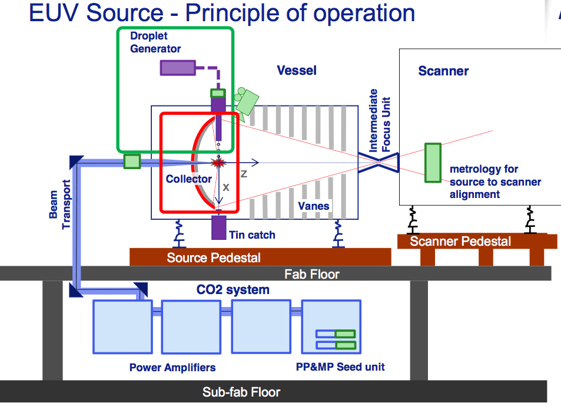

## Table of Contents

## What is EUV technology?

EUV technology, or Extreme Ultraviolet Lithography, is a method used to make computer chips smaller and more powerful. It uses very short wavelength light to create tiny patterns on silicon wafers. This allows chip makers to fit more transistors onto a chip, making it faster and more efficient. EUV machines are very expensive and complex, but they are important for keeping up with the demand for better technology.

The main part of an EUV machine is the light source, which creates the extreme ultraviolet light. This light is then focused through a series of mirrors to project the pattern onto the wafer. The whole process happens in a vacuum to prevent the light from being absorbed by air. EUV technology is a big step forward from older methods, which used longer wavelength light and couldn't make such small patterns.

## How does EUV technology work?

EUV technology, or Extreme Ultraviolet Lithography, is a way to make tiny parts on computer chips. It uses a special kind of light called extreme ultraviolet light. This light has a very short wavelength, which lets it create very small patterns on a silicon wafer. The light comes from a special source and then goes through a series of mirrors. These mirrors help focus the light and project the pattern onto the wafer.

The whole process happens inside a vacuum chamber. This is important because air can absorb the extreme ultraviolet light, and we don't want that to happen. Once the light hits the wafer, it creates a pattern that helps build the tiny parts of the chip. This technology is much better than older methods because it can make smaller and more detailed patterns. That's why it's used to make faster and more powerful computer chips.

## What are the main components of an EUV lithography system?

The main parts of an EUV lithography system include a light source, mirrors, and a vacuum chamber. The light source makes extreme ultraviolet light, which is special because it has a very short wavelength. This light is important for making tiny patterns on the silicon wafer. The mirrors are used to focus and direct this light. They are very important because they help make sure the light hits the wafer in just the right way.

The vacuum chamber is another key part. It's used to keep air out because air can absorb the extreme ultraviolet light. If the light gets absorbed, it can't make the patterns on the wafer. So, the vacuum chamber helps keep everything working right. All these parts work together to make the tiny parts on computer chips, which helps make them faster and more powerful.

## What industries primarily use EUV technology?

The main industry that uses EUV technology is the semiconductor industry. This industry makes computer chips that are used in many different devices like smartphones, computers, and cars. EUV technology helps make these chips smaller and more powerful. This is important because it lets companies make better and faster devices that people use every day.

Another industry that might use EUV technology is the research and development sector. Scientists and engineers use EUV machines to study and develop new ways to make even smaller and more efficient chips. This can lead to new technologies and improvements in the future. Even though it's mostly used in making chips, EUV technology can be important for other industries that need very small and precise parts.

## What are the advantages of EUV over other lithography technologies?

EUV technology has some big advantages over other ways of making computer chips. One of the main benefits is that it can make very small patterns on the silicon wafer. This is because EUV uses light with a very short wavelength. When the patterns are smaller, you can fit more tiny parts, called transistors, onto the chip. More transistors mean the chip can be faster and work better. This is why EUV is so important for making the latest and greatest computer chips.

Another advantage of EUV is that it can make these small patterns more easily than older methods. Older ways of making chips, like using deep ultraviolet (DUV) light, need more steps to get the same small size. This can make the process longer and more complicated. EUV, on the other hand, can do it in fewer steps, which saves time and money. This makes EUV a better choice for companies that want to make a lot of chips quickly and efficiently.

## What are the current challenges and limitations of EUV technology?

EUV technology faces some big challenges. One of the main problems is that EUV machines are very expensive. They cost a lot of money to buy and to keep running. This can make it hard for smaller companies to use EUV technology. Another challenge is that the process is very complex. Making the special light source and the mirrors that focus the light is difficult. If anything goes wrong with these parts, it can stop the whole machine from working.

Another limitation is that EUV technology still has some technical issues. For example, the light source can wear out over time, which means it needs to be replaced often. Also, the mirrors can get dirty or damaged, which can affect how well they work. These problems can slow down the production of chips and make it more expensive. Even though EUV technology is very advanced, these challenges mean that it's not perfect and still needs to be improved.

## How has EUV technology evolved over the years?

EUV technology has come a long way since it was first thought of. In the beginning, it was just an idea to use very short wavelength light to make smaller patterns on computer chips. Scientists and engineers worked hard to make this idea real. They had to figure out how to make a light source that could produce extreme ultraviolet light. They also had to create special mirrors that could focus this light without it getting absorbed. It took many years of research and a lot of money to make the first EUV machines.

Over time, EUV technology has gotten better and better. The first EUV machines were very slow and not very reliable. But as more people used them and learned how to make them work better, they became faster and more dependable. Companies like ASML, which makes EUV machines, have been working to make the light source last longer and the mirrors work better. They've also made the whole process simpler and cheaper. Even though EUV technology still has some challenges, it's a lot better than it used to be, and it keeps getting better every year.

## What are the future prospects for EUV technology in semiconductor manufacturing?

The future of EUV technology in making computer chips looks bright. As more and more devices need faster and smaller chips, EUV is becoming more important. Companies are working hard to make EUV machines better and cheaper. They want to make the light source last longer and the mirrors work better. This will help them make chips faster and at a lower cost. If they can do this, more companies will be able to use EUV technology, not just the big ones.

There are still some challenges to overcome. For example, the machines are still very expensive, and the process can be tricky. But scientists and engineers are finding new ways to solve these problems. They are also looking at ways to make even smaller patterns with EUV, which could lead to even better chips in the future. As long as people keep wanting smaller and faster chips, EUV technology will keep playing a big role in making them.

## How does EUV technology impact the cost of semiconductor production?

EUV technology can make semiconductor production more expensive. The machines that use EUV are very costly to buy and maintain. They need special parts like the light source and mirrors, which can wear out and need to be replaced often. This means companies have to spend a lot of money not just to get the machines, but also to keep them running smoothly. On top of that, the process of using EUV is complex and can take a lot of time and effort to get right, which adds to the overall cost.

However, EUV technology can also help lower the cost of making semiconductors in the long run. It can make chips faster and more efficiently than older methods. This means companies can produce more chips in less time, which can save money. Plus, because EUV can make smaller and more detailed patterns, it can lead to better and more powerful chips. This can make the products that use these chips more valuable, helping companies earn back the money they spent on EUV technology.

## What are the environmental considerations associated with EUV technology?

EUV technology has some environmental impacts that people need to think about. One big concern is the energy it uses. EUV machines need a lot of power to make the special light and to keep everything working right. This can mean more energy from power plants, which might use fossil fuels and create pollution. Also, the machines have parts that can wear out and need to be replaced. When these parts are thrown away, they can add to electronic waste, which is bad for the environment.

On the other hand, EUV technology can help the environment in some ways too. It makes computer chips smaller and more efficient. When chips use less power, the devices that use them, like smartphones and computers, also use less power. This can help reduce the overall energy use and lower the amount of pollution from power plants. So, while EUV technology has some negative impacts, it also has the potential to help the environment by making technology more efficient.

## Can you explain the role of EUV in producing smaller, more efficient chips?

EUV technology helps make computer chips smaller and more efficient by using a special kind of light. This light has a very short wavelength, which lets it create tiny patterns on the silicon wafer. When the patterns are smaller, you can fit more tiny parts called transistors onto the chip. More transistors mean the chip can work faster and use less power. This is important because it makes the devices that use these chips, like smartphones and computers, better and more energy-efficient.

Even though EUV technology is expensive and complex, it's worth it because it can make chips in a simpler way than older methods. Older ways of making chips needed more steps to get the same small size, which could make the process longer and more expensive. EUV can do it in fewer steps, which saves time and money. This makes it a good choice for companies that want to make a lot of chips quickly and efficiently, leading to smaller, faster, and more efficient chips.

## What are the latest advancements in EUV technology and their implications for the industry?

The latest advancements in EUV technology have made it even better at making computer chips. One big improvement is that the light source in EUV machines now lasts longer. This means the machines can keep working without needing to stop and fix things as often. Another advancement is that the mirrors used to focus the light have gotten better too. They can now make even smaller and more detailed patterns on the silicon wafer. These improvements help companies make more chips faster and at a lower cost.

These advancements have big implications for the semiconductor industry. Because EUV machines can now work better and longer, companies can make more chips in less time. This is good because it can help meet the growing demand for smaller and faster chips in things like smartphones and computers. Also, as the cost of using EUV technology goes down, more companies might start using it, not just the big ones. This could lead to even more innovation and better technology in the future.

## References & Further Reading

[1]: ["EUV Lithography: The Power of Extreme Light"](https://en.wikipedia.org/wiki/Extreme_ultraviolet_lithography) by MIT Technology Review

[2]: Borkar, D., Carey, M. J., & Li, C. (2020). ["Inside 'Big Data Management': Ogres, Onions, or Parfaits?"](https://www.openproceedings.org/2012/conf/edbt/BorkarCL12.pdf) Communications of the ACM, 63(9), 128-137. 

[3]: ["Advances in Financial Machine Learning"](https://www.amazon.com/Advances-Financial-Machine-Learning-Marcos/dp/1119482089) by Marcos Lopez de Prado

[4]: ["EUV Lithography's Time Has Finally Come"](https://en.wikipedia.org/wiki/Extreme_ultraviolet_lithography) by IEEE Spectrum

[5]: ["High-Frequency Trading and Flash Crashes"](https://www.jstor.org/stable/26652722) by Kumar, A., Mishra, A.K., & Arora, V. (published in Journal of Financial Markets)

[6]: ["Extreme Ultraviolet (EUV) Lithography"](https://en.wikipedia.org/wiki/Extreme_ultraviolet_lithography) edited by Vladmir. I. Mikhelashvili

[7]: ["Quantitative Trading: How to Build Your Own Algorithmic Trading Business"](https://www.amazon.com/Quantitative-Trading-Build-Algorithmic-Business/dp/1119800064) by Ernest P. Chan