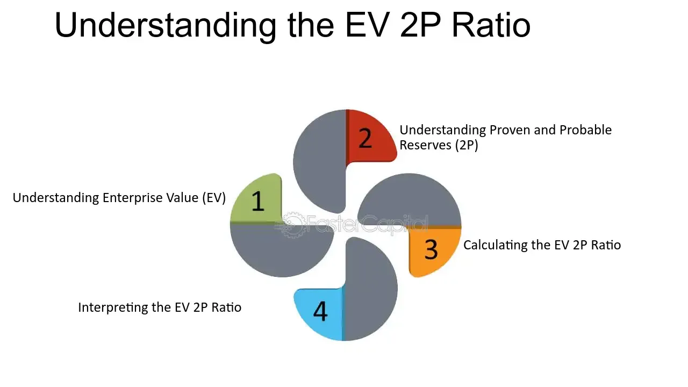

## Table of Contents

## What is the EV/2P Ratio and why is it important in financial analysis?

The EV/2P Ratio stands for Enterprise Value to Proved and Probable Reserves Ratio. It is a financial metric used mainly in the oil and gas industry. This ratio helps investors understand how much they are paying for the company's oil and gas reserves. The "EV" part means the total value of the company, including its debts and cash. The "2P" part stands for the company's proved and probable reserves, which are the amounts of oil and gas that the company believes it can extract with a reasonable level of certainty.

This ratio is important because it gives investors a way to compare different companies in the oil and gas sector. By looking at the EV/2P Ratio, investors can see which companies might be a better buy based on the value of their reserves. A lower ratio might mean the company's reserves are cheaper, which could be a good investment opportunity. On the other hand, a higher ratio might suggest that the company's reserves are more expensive, which could be a warning sign. Understanding this ratio helps investors make smarter choices about where to put their money in the oil and gas industry.

## How is the Enterprise Value (EV) calculated for the EV/2P Ratio?

Enterprise Value (EV) is a way to figure out the total value of a company. To calculate it, you start with the company's market value, which is the total value of all its shares. Then, you add the company's total debt, because if you were to buy the whole company, you'd have to take on its debts too. But you also subtract any cash the company has, because that cash could be used to pay off some of the debt. So, the formula for EV is: Market Value of Equity + Total Debt - Cash and Cash Equivalents.

This calculation is important for the EV/2P Ratio because it gives a complete picture of what it would cost to buy the company, including its oil and gas reserves. By using EV instead of just the market value of the company's shares, the ratio shows how much you're paying for the reserves, taking into account the company's financial situation. This helps investors see if the reserves are a good deal or not.

## What does '2P' stand for in the EV/2P Ratio, and how is it determined?

In the EV/2P Ratio, '2P' stands for 'Proved and Probable Reserves.' This means it includes two types of oil and gas reserves that a company might have. Proved reserves are the amounts of oil and gas that the company is pretty sure it can get out of the ground. These are the reserves that are almost certain to be there and can be extracted with today's technology and at current prices. Probable reserves are the amounts of oil and gas that the company thinks are likely to be there, but they're not as sure about these as they are about the proved reserves. 

To determine the 2P reserves, companies use a lot of data and technology. They look at things like past drilling results, geological studies, and seismic data to estimate how much oil and gas is in the ground. Engineers and geologists work together to make these estimates. They use special methods and follow rules set by groups like the Society of Petroleum Engineers (SPE) to make sure their estimates are as accurate as possible. By adding up the proved and probable reserves, they get the total 2P reserves, which is an important number for figuring out the EV/2P Ratio.

## Can you explain the basic formula for calculating the EV/2P Ratio?

The EV/2P Ratio is calculated by dividing the Enterprise Value (EV) of a company by its 2P reserves. The Enterprise Value is found by adding the market value of the company's equity and its total debt, then subtracting any cash and cash equivalents the company has. This gives you the total value of the company, debts included. The 2P reserves are the sum of the company's proved and probable oil and gas reserves, which are estimated based on detailed geological and engineering studies.

Once you have both numbers, you simply divide the Enterprise Value by the 2P reserves. This ratio tells investors how much they are paying for each unit of the company's oil and gas reserves. A lower EV/2P Ratio might mean the reserves are cheaper and could be a good investment, while a higher ratio could suggest the reserves are more expensive. This helps investors compare different companies and make better decisions about where to invest their money in the oil and gas industry.

## What industries commonly use the EV/2P Ratio for valuation?

The EV/2P Ratio is mainly used in the oil and gas industry. This is because this ratio helps investors see how much they are paying for a company's oil and gas reserves. The oil and gas industry is all about finding, extracting, and selling these resources, so knowing the value of the reserves is very important. Companies in this industry, like those involved in exploration and production, use this ratio to show investors that their reserves are a good deal.

Sometimes, other industries that deal with natural resources might also use the EV/2P Ratio. For example, mining companies that extract minerals from the ground could use a similar approach to value their reserves. But it's not as common in these other industries because the EV/2P Ratio is specifically designed for oil and gas. So, while it's mostly used in the oil and gas sector, the idea of valuing reserves can be applied in other natural resource industries too.

## How does the EV/2P Ratio help in comparing companies within the same sector?

The EV/2P Ratio helps investors compare different companies in the oil and gas sector by showing how much they are paying for each company's oil and gas reserves. This is important because it gives a clear picture of the value of the reserves, which is the main thing these companies are selling. By looking at the EV/2P Ratio, investors can see which company's reserves are cheaper or more expensive. If one company has a lower ratio, it might mean their reserves are a better deal, making it a more attractive investment.

Using the EV/2P Ratio also helps investors see how well a company is doing compared to others in the same industry. For example, if two companies have similar amounts of reserves but one has a much higher EV/2P Ratio, it could mean that investors are expecting bigger things from that company, or it might be overpriced. This ratio lets investors make smarter choices by comparing companies side by side, focusing on the value of their most important asset: their oil and gas reserves.

## What are the limitations of using the EV/2P Ratio in financial analysis?

The EV/2P Ratio is a helpful tool for investors, but it has some limitations. One big problem is that the estimates of 2P reserves can be wrong. Companies use a lot of data and technology to guess how much oil and gas is in the ground, but it's still just a guess. If the estimates are too high or too low, the EV/2P Ratio won't give a correct picture of the company's value. This can lead investors to make bad choices about where to put their money.

Another limitation is that the EV/2P Ratio doesn't look at other important things about a company. It only focuses on the value of the oil and gas reserves, but companies also have other assets and costs that matter. For example, a company might have good reserves but bad management or high debt, which could make it a risky investment. The EV/2P Ratio doesn't show these risks, so investors need to use other tools and information to get a full picture of a company's health.

## How can changes in commodity prices affect the EV/2P Ratio?

Changes in commodity prices, like the price of oil and gas, can have a big impact on the EV/2P Ratio. When the price of oil goes up, the value of a company's reserves also goes up. This makes the 2P part of the ratio bigger. But the Enterprise Value (EV) might not change as much right away, because it depends on the market value of the company's shares and its debts. So, if oil prices rise, the EV/2P Ratio will usually go down, which can make the company look like a better deal to investors.

On the other hand, if oil prices fall, the value of the reserves drops, making the 2P part of the ratio smaller. The Enterprise Value might not drop as quickly, so the EV/2P Ratio will go up. This makes the company's reserves look more expensive, which could scare investors away. Because commodity prices can change a lot, the EV/2P Ratio can be a bit tricky to use for making investment decisions. Investors need to keep an eye on these price changes to understand what the ratio really means at any given time.

## What are some common benchmarks or industry averages for the EV/2P Ratio?

The EV/2P Ratio can vary a lot depending on things like where the oil and gas are, what the market is like, and what people think about the future. But in general, an EV/2P Ratio between $5 and $15 per barrel of oil equivalent (BOE) is often seen as a good range. This means that if a company's ratio is in this range, it might be a good buy because the price for each unit of their reserves is not too high.

However, these numbers can change. For example, in times when oil prices are high, the average EV/2P Ratio might go up because people are willing to pay more for oil and gas reserves. On the other hand, if oil prices are low, the average ratio might drop because the reserves are not worth as much. So, it's important for investors to look at the current market and compare the EV/2P Ratio of different companies to see if they are getting a good deal.

## How do analysts adjust the EV/2P Ratio for risk and uncertainty in reserves?

Analysts adjust the EV/2P Ratio for risk and uncertainty in reserves by looking at how sure the company is about its oil and gas estimates. If the company thinks there's a lot of risk or uncertainty, analysts might use a lower number for the 2P reserves. This makes the EV/2P Ratio go up, showing that the reserves are more expensive and riskier. They might also look at things like the location of the reserves, the technology used to find them, and past results from similar projects to guess how much risk there is.

Another way analysts adjust the EV/2P Ratio is by adding a risk [factor](/wiki/factor-investing) to the Enterprise Value. If a company has a lot of debt or other financial problems, it might be riskier to invest in. So, analysts might add a higher risk factor to the EV, making the EV/2P Ratio go up. This shows that the company's reserves are more expensive when you think about the extra risk. By doing these adjustments, analysts can give a better picture of what the reserves are really worth, taking into account the risks and uncertainties.

## Can you discuss a case study where the EV/2P Ratio was crucial in a major corporate decision?

In 2016, Royal Dutch Shell made a big decision to buy BG Group, a company that also worked in oil and gas. The EV/2P Ratio was really important in helping Shell decide if buying BG Group was a good idea. Shell looked at how much they would have to pay for BG Group's oil and gas reserves. They used the EV/2P Ratio to see if the price was fair. After looking at the numbers, Shell saw that BG Group's reserves were a good deal, so they went ahead with the buy. This helped Shell grow bigger and get more reserves for their future.

The EV/2P Ratio was key because it showed Shell that BG Group's reserves were cheaper compared to other companies. Even though oil prices were low at the time, the ratio told Shell that BG Group's reserves were still a good buy. This made the deal look smart, even when things were tough in the oil and gas world. By using the EV/2P Ratio, Shell made a smart choice that helped them do better in the long run.

## What advanced techniques can be used to refine the EV/2P Ratio for more accurate financial analysis?

To make the EV/2P Ratio more accurate, analysts can use something called Monte Carlo simulations. This fancy-sounding method helps them see how different things like oil prices or how much oil is in the ground might change. By running a lot of different guesses through a computer, they can get a better idea of what might happen. This helps them see if the EV/2P Ratio might be too high or too low because of these changes. It's like playing "what if" with numbers to make better guesses about the future.

Another way to refine the EV/2P Ratio is by using something called probabilistic reserve estimates. Instead of just guessing how much oil or gas is in the ground, this method looks at how sure the company is about those guesses. If the company thinks there's a lot of uncertainty, they might use a lower number for the reserves. This makes the EV/2P Ratio go up, showing that the reserves are riskier and might be more expensive. By doing this, analysts can make the ratio more accurate and help investors see the real value of the company's oil and gas reserves.

## What is the Calculation and Example of the EV/2P Ratio?

The EV/2P ratio is an essential metric for evaluating oil and gas companies, calculated through a straightforward formula:

$$
\text{EV/2P Ratio} = \frac{\text{Enterprise Value (EV)}}{\text{2P Reserves}}
$$

Here, the enterprise value (EV) is the sum of a company's market capitalization, total debt, minority interest, and preferred shares, minus total cash and cash equivalents. This figure represents the total value of a company, providing a comprehensive picture since it covers liabilities and excludes cash, which could otherwise distort valuations.

2P reserves, an abbreviation for proven and probable reserves, offer a forward-looking measure of a company's oil and gas reserves. Proven reserves are quantities of oil and gas with a high degree of certainty to be recoverable, while probable reserves have a lower likelihood of recovery. The aggregation of these reserves into the 2P category reflects a company's resource potential, crucial for assessing future performance.

For example, if a company reports an enterprise value of $2 billion and has 2P reserves totaling 100 million barrels, the calculation for EV/2P would be:

$$
\text{EV/2P Ratio} = \frac{\$2,000,000,000}{100,000,000 \text{ barrels}} = 20 \text{ (EV per barrel)}
$$

This ratio indicates that each barrel of the company's 2P reserves is valued at 20 times its enterprise value per barrel. Consequently, this helps investors assess how the market is valuing a company's reserves, facilitating comparisons with industry peers. A higher EV/2P ratio might suggest that the market has a favorable view of a company's reserves, while a lower ratio could indicate undervaluation or concerns about reserve quality. Comparisons with industry benchmarks are invaluable for understanding relative valuations and market sentiment toward specific companies in the oil and gas sector.

## How does the EV/2P Ratio compare to other financial metrics?

The EV/2P ratio, primarily employed within the oil and gas industry, distinguishes itself through its focus on a company's reserves, specifically proven and probable reserves. This metric is valuable for assessing how the market values a company's resource base in relation to its enterprise value. However, for a comprehensive assessment of a company's standing, it is imperative to compare the EV/2P ratio against other financial metrics like EV/EBITDA and the price-to-earnings (P/E) ratio.

EV/EBITDA is a widely acknowledged metric that provides insights into a company's operational profitability without being affected by its capital structure or tax environments. This ratio is calculated as:

$$
\text{EV/EBITDA} = \frac{\text{Enterprise Value (EV)}}{\text{Earnings Before Interest, Taxes, Depreciation, and Amortization (EBITDA)}}
$$

This ratio is indispensable for drawing comparisons between companies with different debt levels, as it normalizes differences in capital structure and provides a clear view of operational performance.

The P/E ratio, on the other hand, offers a perspective on market sentiment by illustrating how much investors are willing to pay per dollar of earnings. It is given by:

$$
\text{P/E} = \frac{\text{Price Per Share}}{\text{Earnings Per Share (EPS)}}
$$

The P/E ratio is particularly useful for evaluating the relative value of a company's shares and understanding investor expectations on future earnings growth.

These ratios, when used alongside the EV/2P ratio, enable investors to perform a holistic financial evaluation. The EV/2P ratio focuses on the value of a company's reserves, rather than its earnings or profitability, thus providing a resource-centric view. Meanwhile, EV/EBITDA highlights operational profitability, and the P/E ratio captures market sentiment based on earnings. Together, these metrics serve different analytical purposes, making their combined use critical for comprehensive investment analysis. By employing these ratios in conjunction, investors can gain a well-rounded perspective of a company's financial health and market position.

## References & Further Reading

[1]: Otto, G. (2007). ["Enterprise Valuation of Oil and Gas Companies."](https://www.stout.com/en/insights/article/valuation-methodologies-oil-gas-industry) Energy Intelligence Group.

[2]: Ronn, E. I. (ed.). (1995). ["Real Options and Energy Management: Using Options Methodology to Enhance Capital Budgeting Decisions."](https://www.semanticscholar.org/paper/Real-Options-and-Energy-Management%3A-Using-Options-Ronn/48de6c15427b0fb9ff83356dbc6dbd5a1e45b896) Risk Books.

[3]: Hull, J. C. (2018). ["Options, Futures, and Other Derivatives"](https://www.semanticscholar.org/paper/Options%2C-Futures%2C-and-Other-Derivatives-Hull/89bdee500c8623864fc9eb7a471546aa713acc44) (10th Edition). Pearson.

[4]: Yoon, K. P. & Kim, T. (2020). ["Algorithmic Trading Techniques: Applications to Financial Markets."](https://www.researchgate.net/publication/351465873_Artificial_intelligence_techniques_in_finance_and_financial_markets_A_survey_of_the_literature) Springer.

[5]: Chandra, B. S., & Chatterjee, M. (2021). ["Mathematical Models and Algorithms for Energy and Finance"](https://pubs.acs.org/doi/10.1021/acsanm.1c02329). CRC Press.