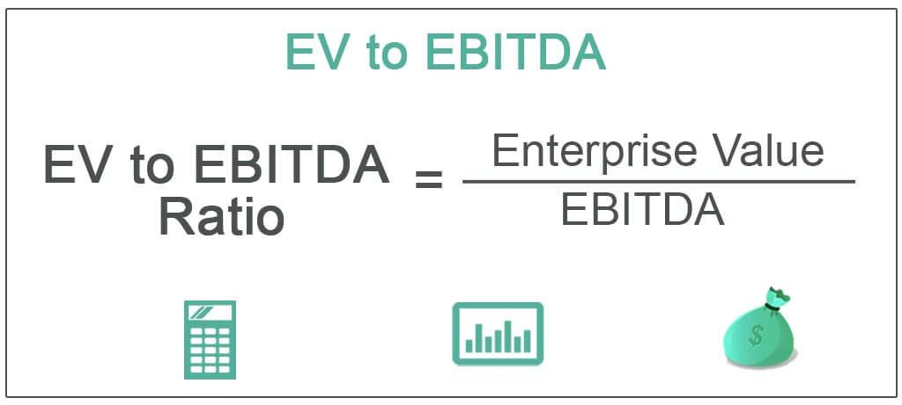

The EV/EBITDA ratio has emerged as a significant tool in the realm of algorithmic trading, offering traders insights into a company’s valuation and operational efficiency. As a financial metric, EV/EBITDA evaluates a firm's enterprise value against its earnings before interest, taxes, depreciation, and amortization. This ratio serves as an indicator of how much a company is valued per unit of operational cash flow.

Algorithmic trading, characterized by the rapid execution of trades using pre-programmed instructions, relies heavily on accurate and timely financial data. Ratios like EV/EBITDA are pivotal in making informed trading decisions, as they allow algorithms to swiftly assess a company's standing in the market. In environments where trading advantages hinge on speed and precision, integrating robust valuation ratios into trading strategies provides a competitive edge.



In modern investing, the speed and data accuracy facilitated by algorithmic trading can significantly enhance decision-making processes. With market anomalies corrected almost instantly, the need for comprehensive and real-time evaluation methods, such as the EV/EBITDA ratio, becomes pronounced. This leads to better detection of undervalued assets and opportunities for returns.

This article will explore how the EV/EBITDA ratio is calculated, emphasizing its components and practical application in algorithmic trading. It will also compare the ratio with other financial metrics, highlight variations across industries, and discuss innovative strategies in algorithmic trading. Through this examination, readers will gain an understanding of the relevance and application of EV/EBITDA in enhancing trading efficiency and valuation assessment.

## Table of Contents

## Understanding EV/EBITDA

Enterprise Value to Earnings Before Interest, Taxes, Depreciation, and Amortization (EV/EBITDA) is a financial metric used to evaluate a company's overall value and its ability to generate earnings from operations. This ratio is crucial for investors and financial analysts in assessing a company's financial health and valuation, especially when comparing companies across various industries.

### Components of EV and EBITDA

1. **Enterprise Value (EV):** 
   EV is a comprehensive measure of a company's total value. It is calculated as:
$$
   \text{EV} = \text{Market Capitalization} + \text{Total Debt} - \text{Cash and Cash Equivalents}

$$
   - **Market Capitalization** is the total market value of a company's outstanding shares.
   - **Total Debt** includes both short-term and long-term debt obligations.
   - **Cash and Cash Equivalents** are the company's liquid assets that can offset debt.

2. **Earnings Before Interest, Taxes, Depreciation, and Amortization (EBITDA):**
   EBITDA represents the company's earnings derived from its core business operations, excluding the effects of capital structure (interest), policy (taxes), and non-cash accounting items (depreciation and amortization). It is expressed as:
$$
   \text{EBITDA} = \text{Net Income} + \text{Interest} + \text{Taxes} + \text{Depreciation} + \text{Amortization}

$$

### Calculating the EV/EBITDA Ratio 

The EV/EBITDA ratio is calculated using the formula:
$$
\text{EV/EBITDA} = \frac{\text{Enterprise Value}}{\text{EBITDA}}
$$
This ratio gives a normalized view of company valuation, allowing comparisons across industries with different capital structures.

### Significance of Including Both Equity and Debt

EV/EBITDA considers both the equity (market capitalization) and debt components of a firm, offering a more holistic understanding of its valuation. Including debt ensures that the metric accounts for the company’s obligations, providing a clearer picture of financial health and facilitating like-for-like comparisons between companies that might have different levels of debt.

### Strengths of EV/EBITDA in Financial Valuation

The EV/EBITDA ratio is a robust tool in financial valuation due to several key advantages:

- **Normalization Across Industries:** By standardizing valuation across different companies, irrespective of their capital and tax structures or depreciation policies, the ratio helps analysts assess businesses operating in various sectors on a comparable basis.

- **Applicability to Capital-Intensive Industries:** This ratio is particularly insightful for industries with significant capital investments, like telecommunications and manufacturing, where depreciation and interest expenses might overshadow operational earnings. Here, EV/EBITDA offers a clear look at free cash flow generation potential.

Overall, the EV/EBITDA ratio serves as a valuable metric in evaluating enterprise valuation, cutting through complex financial structures to provide a focused view of a company's earnings capacity and operational performance, underlining its significance in financial analysis and investment decision-making.

## Significance in Company Valuation

The EV/EBITDA ratio is a critical tool in assessing company valuation, particularly when analyzing firms within the same industry. This ratio strips away complex financial elements, such as capital structure and tax regimes, to offer a clearer view of earnings derived from a company’s core operations. By focusing on Enterprise Value (EV), a measure that includes both equity and debt, and EBITDA, which excludes interest, taxes, depreciation, and amortization, this ratio presents an unbiased perspective on operational efficiency and profitability.

A lower EV/EBITDA ratio can indicate that a company is potentially undervalued. For investors, this signals an opportunity to invest in a firm whose market value does not fully reflect its [earning](/wiki/earning-announcement) potential. When a company exhibits a lower ratio than its peers, it suggests that the market has either underestimated the company's future cash flows or overestimated those of its competitors. This insight is particularly valuable in spotting companies with strong cash-flow-driven earnings potential.

For instance, a manufacturing company within an industry averaging an EV/EBITDA of 8 may appear attractive if its ratio stands at 6, provided other fundamentals remain sound. Investors might deduce that the company's operational capabilities are not fully recognized by the market, possibly due to temporary setbacks or overlooked strategic advantages. Therefore, the firm could offer significant long-term gains as the market adjusts its valuation.

However, context and additional financial indicators are crucial when interpreting the EV/EBITDA ratio. While this metric provides a normalized view of company valuation by minimizing the influence of accounting policies, it should not be used in isolation. Complementary metrics such as Price-to-Earnings (P/E) ratios, debt-to-equity ratios, and cash flow analyses are essential to build a comprehensive financial profile. Only this balanced view can reveal the full narrative behind a company's valuation, allowing for informed investment decisions and effective portfolio management.

## Application in Algorithmic Trading

The EV/EBITDA ratio is a crucial metric in [algorithmic trading](/wiki/algorithmic-trading), serving as a foundational tool for identifying undervalued securities. In algorithmic trading, this ratio helps traders make swift and informed decisions by offering insights into a company's operational efficiency relative to its market valuation. The integration of EV/EBITDA into algorithms leverages its ability to normalize valuations across industries, thereby facilitating comparisons that transcend sector-specific nuances.

In a typical algorithmic setup, the EV/EBITDA ratio is incorporated as a key variable in the decision-making process. Algorithms utilize this ratio to scan vast datasets, rapidly evaluating which securities might be trading at attractive valuations. The following Python code snippet illustrates a simplified version of how algorithms can automate the calculation of EV/EBITDA and flag potentially undervalued stocks:

```python
import pandas as pd

# Sample dataframe of company data
data = {
    'Company': ['A', 'B', 'C'],
    'EnterpriseValue': [5000, 7000, 6000],
    'EBITDA': [1000, 850, 1200]
}

# Create DataFrame
df = pd.DataFrame(data)

# Function to calculate EV/EBITDA
def calculate_ev_ebitda(row):
    return row['EnterpriseValue'] / row['EBITDA']

# Apply the function to the DataFrame
df['EV_EBITDA'] = df.apply(calculate_ev_ebitda, axis=1)

# Identify undervalued companies (example threshold: EV/EBITDA < 7)
undervalued_companies = df[df['EV_EBITDA'] < 7]

print("Undervalued Companies:")
print(undervalued_companies[['Company', 'EV_EBITDA']])
```

This script reads a dataset, computes the EV/EBITDA ratio, and identifies companies with a ratio below a specified threshold, suggesting potential undervaluation. By automating such calculations, algorithmic trading systems can efficiently sift through numerous securities and make swift, data-driven investment selections in ever-changing markets.

The use of the EV/EBITDA ratio in algorithmic models offers significant potential for crafting innovative trading strategies. Its ability to provide a normalized overview of valuation facilitates the identification of market inefficiencies, which can be exploited to generate alpha. Moreover, as market conditions evolve with technological advancements, the adaptability of this ratio ensures its continued relevance in contemporary trading strategies, enabling traders to maintain a competitive edge.

## Comparison with Other Valuation Metrics

When comparing the EV/EBITDA ratio to other valuation metrics such as the Price-to-Earnings (P/E) and Price-to-Sales (P/S) ratios, distinct advantages and specific applications emerge. Each metric offers unique insights into a company's financial health, but the EV/EBITDA ratio is particularly valuable due to its comprehensive approach in evaluating a firm's performance and obligations.

The EV/EBITDA ratio integrates debt into its calculation, unlike the P/E ratio, which only considers equity. This inclusion makes EV/EBITDA a more holistic measure of a company's valuation. Since Enterprise Value (EV) accounts for a company's market capitalization, debt, and cash, it delivers a clearer picture of the true cost to acquire a business. In contrast, the P/E ratio, calculated as:

$$
\text{P/E Ratio} = \frac{\text{Market Price per Share}}{\text{Earnings per Share (EPS)}}
$$

focuses solely on equity value, potentially missing the impact of a company's leverage. Similarly, the P/S ratio, which is defined as:

$$
\text{P/S Ratio} = \frac{\text{Market Capitalization}}{\text{Total Sales}}
$$

does not account for profitability or debt structure, limiting its effectiveness in providing a full picture of a company's financial commitments.

In capital-intensive industries, such as manufacturing or utilities, where companies often [carry](/wiki/carry-trading) substantial debt, EV/EBITDA serves as a critical metric. It adjusts for differences in capital structure and provides a normalized view across businesses with varying leverage, unlike the P/E ratio, which may be skewed by differences in financial leverage or non-operational earnings. The P/S ratio, while useful in early-stage companies without earnings, lacks the depth needed to evaluate mature businesses effectively, particularly those with significant fixed overheads and debt obligations.

Utilizing multiple metrics, including EV/EBITDA, P/E, and P/S ratios, is crucial for a comprehensive financial analysis. Each metric addresses different aspects of a company's performance—EV/EBITDA for operational efficiency and debt, P/E for profitability relative to share price, and P/S for revenue assessment. By integrating these perspectives, investors can gain a robust understanding of a company's valuation and operational health, leading to more informed investment decisions.

## EV/EBITDA Across Different Industries

Industry variations significantly impact the typical EV/EBITDA ratio, leading to different valuation norms across sectors such as technology, retail, energy, healthcare, and telecommunications. These differences stem from unique industry characteristics, capital intensity, growth prospects, and competition levels, which affect how investors perceive a company's operational efficiency and financial health.

In the technology sector, companies often exhibit higher EV/EBITDA ratios due to rapid growth rates, significant reinvestment, and strong profit margins. These firms typically rely on innovation and intellectual property, which can lead to substantial future revenue streams. As a result, even companies with currently modest earnings may be valued highly based on anticipated growth. Investors must consider the pace of technological advancements and the competitive landscape when assessing tech firms—elements that could render valuation norms dynamic and potentially inflated.

Retail industry valuations are influenced by consumer behavior and purchasing power. The EV/EBITDA ratio for retail companies tends to reflect cyclical demand patterns, operational efficiency, and scalability in response to shifting consumer trends. Investors should consider factors such as supply chain robustness, e-commerce integration, and inventory management practices to accurately interpret valuation significance. This sector's challenges, including price competition and variable consumer confidence, necessitate careful analysis of operating performance and earnings potential.

In the energy sector, the EV/EBITDA ratio often appears lower due to high capital expenditure and fluctuating commodity prices, which can impact profitability and cash flow stability. Energy companies operate in a capital-intensive environment where asset-heavy balance sheets are common. Investors need to focus on the sustainability of earnings, regulatory impacts, and macroeconomic factors like oil prices and geopolitical tensions to determine valuation accuracy. High fixed costs and environmental considerations also play a crucial role in analyzing energy firms' valuations.

Healthcare firms, particularly pharmaceuticals, and biotechnology companies, may exhibit variable EV/EBITDA ratios based on product pipelines, regulatory approvals, and R&D investment. This sector's valuations are highly contingent on patent expirations and the success of new drugs, which directly influence earnings potential. Investors should assess clinical trial outcomes, demographic shifts, and government policies affecting healthcare access and funding to derive meaningful insights from the EV/EBITDA ratio.

Telecommunications companies typically maintain stable EV/EBITDA ratios due to consistent cash flow generation from subscription-based models. However, the need for continual infrastructure upgrades and spectrum acquisition can affect profitability. Investors must consider competitive pressures, technological advancements like 5G, and regulatory adjustments when evaluating telecom firms. The focus on operational efficiency and customer retention strategies can significantly impact valuation assessments in this sector.

Understanding the EV/EBITDA ratio’s applicability across different industries emphasizes the need for sector-specific insights to accurately assess a company's value. Investors can apply this knowledge to identify inherent valuation drivers and assessment nuances that influence resource allocation decisions. This comprehension ensures a more informed approach to investing, allowing for strategic judgments that align with sectoral dynamics and future projections. By analyzing industry-specific elements and challenges, investors can more accurately evaluate operational efficiency and financial health for informed decision-making.

## When to Use and When to Be Cautious

The EV/EBITDA ratio is most useful for performing intra-industry comparisons, given its ability to normalize differences across companies with varying capital structures. This metric offers a clear view of operational efficiency and financial health by excluding the effects of capital expenditure, tax environments, and leverage differences. Its specific strength lies in evaluating similar companies within a sector, providing investors and analysts with a standardized tool for benchmarking financial performance across peer groups.

However, the EV/EBITDA ratio also has notable limitations. For firms with substantial capital expenditures, such as those in the utilities or telecommunications sectors, this ratio may not capture the full picture. Capital-intensive companies often have significant non-cash expenses—like depreciation—that can obscure true economic profitability. The metric does not account for these substantial capital commitments, potentially leading to misleading evaluations of a firm’s financial position.

Moreover, regional tax regimes can present structural complexities when applying the EV/EBITDA ratio. Differences in depreciation policies, taxation, and interest rates among countries can significantly affect the EBITDA component, complicating cross-border or multinational company assessments. A company operating in a region with favorable depreciation policies may appear more efficient compared to peers in less favorable regimes, not due to operational superiority but due to accounting variations.

To circumvent such challenges, it is advisable to use the EV/EBITDA ratio alongside other financial indicators. Metrics such as Free Cash Flow (FCF), Return on Capital Employed (ROCE), and Price-to-Earnings (P/E) ratios can provide additional perspectives for a balanced analysis. By integrating multiple metrics, analysts can obtain a more comprehensive understanding of a company's true financial standing and potential.

Careful interpretation of the EV/EBITDA ratio is crucial in financial evaluations, especially when assessing firms with unique business models or those subject to distinct fiscal regulations. It is important to delve into the context underlying the figures to ensure accurate interpretation. A nuanced analysis considering both quantitative metrics and qualitative business aspects offers investors a robust framework for making informed decisions.

## How EV/EBITDA Fits Into Modern Valuation Techniques

The EV/EBITDA ratio has become integral to modern valuation techniques, especially in analyses that aim to be neutral regarding capital structure. Its significance lies in its ability to provide a clear, comparable metric that accounts for both equity and debt, offering a comprehensive view of a company's operational performance. This makes EV/EBITDA a vital tool in assessing firms without being unduly affected by variations in capital structure. 

In light of evolving industry dynamics and market trends, the EV/EBITDA ratio demonstrates considerable adaptability. It is particularly beneficial in sectors characterized by rapid technological advancements and shifting consumer preferences, where traditional valuation metrics might not provide adequate insights. As markets react swiftly to new developments, the EV/EBITDA ratio helps investors and analysts maintain a balanced perspective on valuation.

Algorithmic trading models substantially benefit from the EV/EBITDA ratio, using it to quickly identify undervalued assets. Given its ability to normalize earnings across industries, it facilitates the rapid assessment of investment opportunities by algorithms designed to detect anomalies and capitalize on them. A typical application within algorithmic trading can be demonstrated through a Python example:

```python
# Python example to calculate EV/EBITDA
def calculate_ev_ebitda(market_cap, debt, cash, ebitda):
    enterprise_value = market_cap + debt - cash
    ev_ebitda_ratio = enterprise_value / ebitda
    return ev_ebitda_ratio

# Example values
market_cap = 1000000  # in currency units
debt = 200000  # in currency units
cash = 50000  # in currency units
ebitda = 150000  # in currency units

# Calculate EV/EBITDA ratio
ev_ebitda = calculate_ev_ebitda(market_cap, debt, cash, ebitda)
print("EV/EBITDA Ratio:", ev_ebitda)
```

The application of advanced technologies such as AI and [machine learning](/wiki/machine-learning) further enhances the use of EV/EBITDA in trading strategies. These technologies enable the processing of vast amounts of financial data to identify patterns and predict market movements. Machine learning models can continually refine their algorithms based on past performance data, improving the accuracy of EV/EBITDA-based predictions.

Future prospects for EV/EBITDA's application are promising, with ongoing research focused on expanding its efficacy in various market conditions. Scholars and financial professionals are investigating new methodologies to incorporate the ratio into more complex valuation frameworks and optimize its use in different market environments. This ongoing research and development ensure that the EV/EBITDA ratio remains a cornerstone of financial analysis, adapting to the needs of modern financial markets and supporting informed, strategic decision-making.

## Conclusion

The EV/EBITDA ratio stands as an instrumental metric in both traditional and algorithmic trading settings. This financial ratio serves to offer clear insights into a company's operational efficiency and overall valuation, effectively balancing the considerations of equity and debt. By stripping down financial complexities, EV/EBITDA allows traders and investors to focus on the core earnings generated from operations.

Utilizing the EV/EBITDA ratio alongside other financial metrics enriches the analytical framework, enabling a more comprehensive understanding of a company's financial health. Given its capacity to normalize valuations across varied industries, it is particularly valuable in assessing firms with significant capital expenditure.

In the fast-evolving landscape of modern trading, continuous learning and adaptation to technological advancements are imperative. The integration of the EV/EBITDA ratio in algorithmic trading demonstrates its relevance, offering a strategic edge through data-driven decision-making processes. For investors, this ratio serves as a cornerstone for making informed choices, ensuring competitive participation in dynamic market environments.

Ultimately, the continued evolution and application of the EV/EBITDA ratio reassure stakeholders of its enduring effectiveness. By maintaining a commitment to evolve with technological changes, market participants can harness this tool for strategic advantage and sustained market competitiveness.

## References & Further Reading

1. Damodaran, Aswath. *Investment Valuation: Tools and Techniques for Determining the Value of Any Asset*. 3rd Edition. Wiley, 2012. This book provides comprehensive instruction on the various valuation methods, with an emphasis on mastering the EV/EBITDA ratio.

2. Koller, Tim, Goedhart, Marc, and Wessels, David. *Valuation: Measuring and Managing the Value of Companies*. 6th Edition. Wiley, 2015. A foundational guide discussing various valuation techniques, emphasizing the importance of metrics like EV/EBITDA in different contexts.

3. Hull, John C. *Options, Futures, and Other Derivatives*. 10th Edition. Pearson, 2017. While primarily focused on derivatives, this text also outlines key strategies in algorithmic trading, which are relevant for incorporating financial ratios.

4. *Financial Analysts Journal*. Chartered Financial Analyst (CFA) Institute. This journal includes peer-reviewed articles that often explore advanced valuation techniques, including the application of EV/EBITDA in financial analysis.

5. Fabozzi, Frank J., and Drake, Pamela P. *The Basics of Finance: An Introduction to Financial Markets, Business Finance, and Portfolio Management*. Wiley, 2010. This resource addresses foundational financial concepts, emphasizing their practical applications in valuation and investment strategies.

6. *High-Frequency Trading: A Practical Guide to Algorithmic Strategies and Trading Systems* by Irene Aldridge. This book explains the mechanics of algorithmic trading systems, contextualizing the use of financial metrics within high-frequency trading frameworks.

7. de la Merced, Michael J. "The New Kings of the Trading Floor". *The New York Times*. An article discussing the modern implications of algorithmic trading and the adoption of financial ratios like EV/EBITDA in the trading strategies of major financial institutions.

8. *McKinsey & Company Insights*. This resource regularly publishes reports and articles analyzing emerging trends in corporate valuation and providing industry-specific insights on metrics such as EV/EBITDA.

9. *The CFA Institute Research Foundation*. This portal offers various research papers and insights that are instrumental for finance professionals focused on advanced valuation techniques.

10. Morningstar, Inc. The company’s website offers numerous resources on company analysis, investor education, and insights into valuation metrics, including detailed industry reports utilizing EV/EBITDA analysis.