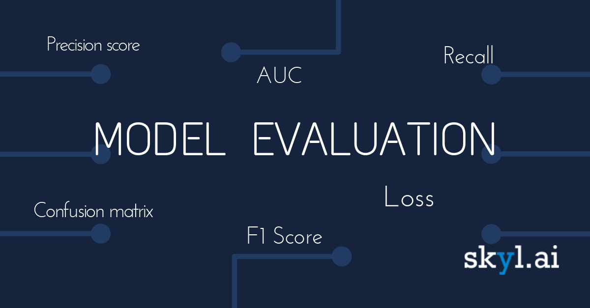

## Table of Contents

## What are Evals in the context of machine learning?

Evals, short for evaluations, are a way to check how well a machine learning model is doing its job. Think of it like a test for the model. When we train a model, we want to know if it can make good predictions or decisions. So, we use evals to see how accurate the model is, how well it can handle new data it hasn't seen before, and other important things. This helps us understand if the model is ready to use or if it needs more work.

There are different types of evals we can use, depending on what we want to measure. For example, we might use accuracy to see how often the model gets things right, or we might use a confusion matrix to see where the model is making mistakes. By looking at these evals, we can make the model better by fixing the problems we find. This process is really important because it helps us trust the model and use it in real-life situations where it can make a big difference.

## Why are Evals important for machine learning models?

Evals are super important for machine learning models because they tell us how well the model is doing. Imagine you're learning to ride a bike. You need to know if you're getting better or if you're still falling off a lot. Evals are like that for a model. They help us see if the model is making good guesses or if it's making a lot of mistakes. This is really helpful because it lets us know if the model is ready to use or if it needs more practice.

Also, evals help us make the model better. If we see that the model is getting a lot of things wrong, we can figure out why and fix it. For example, if a model is bad at recognizing cats in pictures, we can give it more cat pictures to learn from. By using evals, we can keep improving the model until it's really good at its job. This makes sure that when we use the model in real life, it will work well and help people in the best way possible.

## What are some common types of Evals used in machine learning?

In [machine learning](/wiki/machine-learning), there are several common types of evals that help us understand how well a model is doing. One popular eval is accuracy, which tells us the percentage of correct predictions out of all predictions. It's like getting a score on a test; if a model has high accuracy, it means it's getting most things right. Another common eval is precision and recall. Precision measures how many of the positive predictions the model made were actually correct, while recall measures how many of the actual positive cases the model was able to find. These are especially useful when we care about how the model performs on specific types of predictions.

Another important eval is the F1 score, which is the harmonic mean of precision and recall. It's calculated as $$F1 = 2 \times \frac{precision \times recall}{precision + recall}$$ and gives us a single number that balances both precision and recall. This is handy when we want to see how well the model is doing overall. Lastly, the confusion matrix is a table that shows the model's predictions compared to the actual results. It helps us see where the model is making mistakes, like confusing cats for dogs, and can guide us in making the model better. By using these evals, we can get a good picture of the model's strengths and weaknesses and keep improving it.

## How do you select appropriate Evals for a machine learning project?

Choosing the right evals for a machine learning project depends on what you want the model to do and the kind of data you have. If you're working on a project where you want to predict if something will happen or not, like whether it will rain or not, you might want to use accuracy, precision, and recall. Accuracy tells you how often the model gets it right, but sometimes, you might care more about not missing any rain predictions (recall) or making sure your rain predictions are correct (precision). If you're trying to balance both, the F1 score, calculated as $$F1 = 2 \times \frac{precision \times recall}{precision + recall}$$, can be a good choice.

For projects where you're trying to predict numbers, like guessing house prices, you might use different evals like Mean Absolute Error (MAE) or Root Mean Squared Error (RMSE). MAE tells you the average difference between the model's guesses and the actual prices, while RMSE gives more weight to bigger mistakes. It's important to pick evals that match what you're trying to achieve with your model. By choosing the right evals, you can make sure your model is doing well at what it needs to do and keep improving it until it's ready for real use.

## What is the difference between training, validation, and test Evals?

In machine learning, training, validation, and test evals are used at different stages to make sure a model is working well. When you're training a model, you use training evals to see how it's learning from the data you're giving it. This helps you adjust the model to make it better. But, you can't just rely on training evals because the model might just be memorizing the training data instead of learning to make good predictions on new data. That's where validation evals come in. You use a separate set of data, called the validation set, to check how well the model does on data it hasn't seen during training. This helps you tune the model without using the test data.

Once you're happy with how the model is doing on the validation set, you use test evals to do a final check. The test set is another separate set of data that the model hasn't seen during training or validation. Test evals give you a good idea of how the model will perform in the real world, on completely new data. By using these three types of evals, you can make sure your model is not just good at learning from the data you've given it, but also good at making predictions on new, unseen data. This helps you trust the model and use it confidently in real-life situations.

## How can Evals be used to prevent overfitting in machine learning models?

Evals are really helpful in stopping a machine learning model from overfitting. Overfitting is when a model learns the training data too well and doesn't do a good job with new data. To prevent this, we can use validation evals. We train the model on the training data and then check how well it does on the validation data, which it hasn't seen before. If the model does much worse on the validation data than on the training data, it might be overfitting. By watching the validation evals, we can adjust the model, like making it simpler or using less training data, to help it do better on new data.

Another way to use evals to prevent overfitting is by using techniques like cross-validation. In cross-validation, we split the data into several parts and train the model on different combinations of these parts. We then use the parts we didn't use for training to check how well the model does. This gives us a better idea of how the model will perform on new data. If the model's performance is consistent across all these different tests, it's less likely to be overfitting. By using these methods, we can make sure our model is good at making predictions, not just memorizing the data it was trained on.

## What are the challenges in designing effective Evals for complex models?

Designing effective evals for complex models can be tricky because these models often have many parts and can do many things. When a model is complex, it's hard to figure out what evals to use because you need to check if the model is doing well in all the different areas it's supposed to work in. For example, if you have a model that can recognize different animals in pictures, you need evals that can check how well it does with cats, dogs, and birds separately. Also, complex models might need special evals that look at how different parts of the model work together, which can be hard to set up.

Another challenge is that complex models can sometimes be good at some things but bad at others, so you need to use a mix of different evals to get a full picture. For instance, a model might be really good at recognizing cats but not so good with birds. You might use accuracy to see how often the model gets things right overall, but you also need to use precision and recall to check how well it does with each type of animal. The F1 score, calculated as $$F1 = 2 \times \frac{precision \times recall}{precision + recall}$$, can help balance these measures. By using a combination of evals, you can make sure the model is doing well in all the important areas, but it takes a lot of work to set up and understand all these different evals.

## How do metrics like accuracy, precision, recall, and F1 score relate to Evals?

Metrics like accuracy, precision, recall, and F1 score are types of evals that help us see how well a machine learning model is doing its job. Accuracy is like a score that tells us how often the model gets things right out of all its guesses. It's a simple way to check if the model is doing okay overall. Precision and recall are a bit more specific. Precision tells us how many of the positive guesses the model made were actually correct. It's useful when we want the model to be really sure about its positive guesses. Recall, on the other hand, tells us how many of the actual positive cases the model was able to find. It's important when we don't want to miss any positive cases.

The F1 score is a way to balance precision and recall into one number. It's calculated as $$F1 = 2 \times \frac{precision \times recall}{precision + recall}$$ and helps us see how well the model is doing overall without focusing too much on either precision or recall. By using these different metrics as evals, we can get a full picture of how the model is performing. This helps us know if the model is ready to use or if it needs more work to get better at making predictions.

## What advanced techniques can be used to improve the robustness of Evals?

One advanced technique to improve the robustness of evals is using cross-validation. Cross-validation is like doing multiple tests on the model. You split the data into several parts, train the model on different combinations of these parts, and then check how well it does on the parts you didn't use for training. This gives you a better idea of how the model will perform on new data. If the model's performance is consistent across all these different tests, it's more likely to be reliable. By using cross-validation, you can make sure your evals are giving you a true picture of how the model will work in the real world.

Another technique is using ensemble methods, where you combine the results of several models to make a better eval. For example, you might train a few different models and then use their combined predictions to see how well they do overall. This can help you catch any weaknesses that one model might have but others might not. By looking at the combined performance, you get a more robust eval that can help you trust the model more. Both cross-validation and ensemble methods help make your evals stronger and more reliable, so you can be confident that your model is ready for real use.

## How do Evals contribute to the ethical considerations in machine learning?

Evals help make sure machine learning models are fair and don't treat people unfairly. When we use evals, we can check if a model is making mistakes more often for certain groups of people, like people of different races or genders. If we find that the model is not treating everyone the same, we can fix it before it causes problems in real life. For example, if a model used for hiring is less accurate for women than for men, we can use evals to see this and make changes to the model to make it fair for everyone. By using evals, we can make sure the model follows ethical rules and helps people in a fair way.

Another way evals help with ethical considerations is by making sure the model is safe to use. Sometimes, a model might make predictions that could harm people if they're wrong. Evals like precision and recall, where precision is how many of the positive guesses were correct and recall is how many of the actual positive cases were found, can help us see if the model is making too many dangerous mistakes. The F1 score, calculated as $$F1 = 2 \times \frac{precision \times recall}{precision + recall}$$, can balance these measures and show us if the model is safe enough to use. By using these evals, we can make sure the model won't cause harm and that it's ethical to use in real life.

## What role do Evals play in continuous learning and model updating?

Evals are really important for keeping machine learning models up to date and improving them over time. When a model is used in the real world, it's always learning from new data. We use evals to check how well the model is doing with this new data. If the model starts making more mistakes, we can see that in the evals and fix it. For example, if the model is less accurate over time, we can retrain it with the new data to make it better. By using evals, we can keep the model learning and getting better, so it stays useful and accurate.

Another way evals help with continuous learning is by letting us compare different versions of the model. When we make changes to the model or try new ways to train it, we use evals to see if these changes make the model better. If the new version of the model has better evals, like higher accuracy or a better F1 score, calculated as $$F1 = 2 \times \frac{precision \times recall}{precision + recall}$$, we know it's an improvement. This helps us keep the model up to date and make sure it's always working as well as it can.

## How can one interpret and act on the results obtained from Evals in a machine learning pipeline?

When you get results from evals in a machine learning pipeline, it's like getting feedback on how well your model is doing. If you see that the accuracy of your model is high, it means the model is making a lot of correct predictions. But if the accuracy is low, it means the model is making too many mistakes, and you might need to go back and train it some more. Precision and recall are also important to look at. High precision means when the model says something is positive, it's usually right. High recall means the model is good at finding all the positive cases. If either of these is low, you can figure out why and fix the model. The F1 score, calculated as $$F1 = 2 \times \frac{precision \times recall}{precision + recall}$$, helps you balance precision and recall into one number. If the F1 score is low, you know the model needs work in both areas.

Once you have the results from the evals, you can take action to make your model better. If the model is doing well on the training data but not so well on the validation data, it might be overfitting. You can try making the model simpler or using less training data to fix this. If the model is doing poorly on the test data, you might need to collect more data or try different ways of training the model. By keeping an eye on the evals and making changes based on what they tell you, you can keep improving the model until it's ready to use in the real world. This way, you can trust that your model will work well and help people in the best way possible.