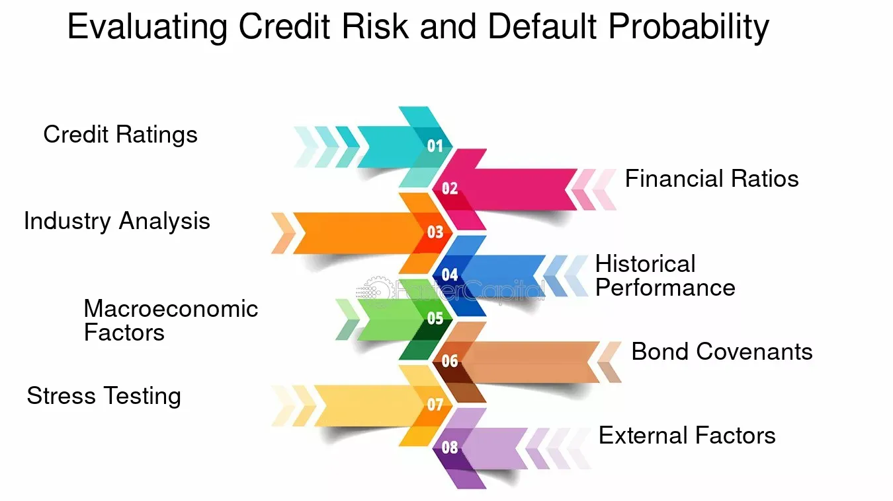

In a fast-paced financial world, making informed investment decisions is paramount. As financial markets become ever more complex, the need for a comprehensive understanding of various investment tools and techniques grows increasingly essential for investors and financial professionals. This article explores the intersection of financial analysis, investment performance, bond evaluation, and algorithmic trading, highlighting how these four components form a cohesive framework for maximizing returns and minimizing risks.

Financial analysis serves as the cornerstone of any informed investment strategy by offering insights into the potential value and risks associated with various financial instruments. It encompasses a range of techniques, such as ratio analysis and financial modeling, which help investors to make data-driven decisions. Understanding these metrics is crucial to assessing the true value of investments, thus laying a solid foundation for a robust investment strategy.



In tandem with financial analysis, the evaluation of investment performance provides a metric by which investors can gauge the success of their strategies. This process involves the employment of various performance indicators, such as Return on Investment (ROI), alpha, beta, and the Sharpe ratio, each offering unique perspectives on the efficiency and robustness of investment strategies. Continuous assessment using these metrics enables investors to adapt strategies to align with financial goals and market conditions, reinforcing their ability to achieve superior returns.

Bonds represent another vital component of diversified investment portfolios, providing stability and income. Effective bond evaluation requires an understanding of metrics such as credit risk, interest rate risk, and duration. Tools like yield to maturity and current yield aid investors in understanding bond performance and risk, guiding more informed decision-making in the face of varying market conditions.

The incorporation of algorithmic trading represents the cutting edge of modern investment practices. By utilizing computer programs to execute trades based on predefined criteria, algorithmic trading introduces speed, precision, and the ability to manage large datasets. This method reduces emotional biases in trading, ensuring more efficient and accurate execution. A deep understanding of different trading algorithms, such as trend-following and mean reversion, is essential for leveraging this technology effectively.

Understanding the synergies between financial analysis, investment performance evaluations, bond assessments, and algorithmic trading is vital. This collective framework allows for a more comprehensive approach to managing investment portfolios, where each component complements the others. By harnessing these synergies, investors can develop strategies that optimize returns while mitigating the associated risks. The interplay of these elements necessitates a mastery of robust data analytics, technology tools, and an understanding of market dynamics.

This comprehensive guide aims to illuminate the integration of these diverse and interconnected components, providing investors and financial professionals with the knowledge and tools necessary for adept financial management in our rapidly evolving market landscape.

## Table of Contents

## The Importance of Financial Analysis

Financial analysis serves as a crucial component in making informed investment decisions by methodically evaluating financial data. This process aids investors and financial professionals in identifying trends, forecasting future performance, and assessing potential risks. The use of specialized techniques such as ratio analysis, trend analysis, and financial modeling is imperative in deriving meaningful insights from complex financial datasets.

Ratio analysis involves the assessment of various financial ratios, which provide a quantitative basis for comparing financial statement items. Common ratios include the price-to-earnings (P/E) ratio, current ratio, and return on equity (ROE). For example, the ROE is calculated as:

$$

ROE = \frac{\text{Net Income}}{\text{Shareholder's Equity}} 
$$

This ratio indicates how effectively a company is utilizing its equity base to generate profits.

Trend analysis focuses on the movement of financial figures over a specific period. This analysis helps in identifying patterns that might imply future performance levels, allowing investors to anticipate changes in the market or a company's financial health.

Financial modeling is another essential technique that involves building mathematical models to represent the financial performance of an asset, business, or investment. These models can be used to simulate various scenarios, helping in predicting future earnings, evaluating the impact of strategic decisions, and analyzing comprehensive growth estimations.

Effective financial analysis provides a deeper understanding of the intrinsic value of investments, beyond mere market price considerations. By doing so, it plays a pivotal role in crafting and refining robust investment strategies that are tailored to the financial goals and risk tolerance of investors.

Moreover, understanding and applying these analytical techniques facilitate a comprehensive approach to investment decision-making, ultimately guiding investors in making judicious choices that align with their strategic objectives.

## Assessing Investment Performance

Investment performance evaluation is a fundamental process for determining the success of investment strategies. It involves analyzing various metrics to assess how well investments are performing relative to expectations and objectives.

One of the most common metrics is Return on Investment (ROI), which measures the gain or loss generated by an investment relative to its cost. ROI is calculated as:

$$
\text{ROI} = \left( \frac{\text{Net Profit}}{\text{Cost of Investment}} \right) \times 100
$$

This metric provides a straightforward measure of investment efficiency.

Another critical metric is alpha, which gauges a portfolio's excess return relative to a benchmark index. Alpha represents the value that a portfolio manager adds to or subtracts from a fund's return. A positive alpha indicates that the investment has outperformed its benchmark, while a negative alpha indicates underperformance.

Beta is used to assess the investment's [volatility](/wiki/volatility-trading-strategies) relative to the market. A beta greater than one indicates higher volatility than the market, while a beta less than one indicates less volatility. Understanding beta helps investors assess risk and manage portfolio sensitivity to market movements.

The Sharpe ratio is another key metric that evaluates investment return relative to its risk. It is calculated as:

$$
\text{Sharpe Ratio} = \frac{\text{Average Return of the Investment} - \text{Risk-Free Rate}}{\text{Standard Deviation of the Investment's Return}}
$$

A higher Sharpe ratio indicates a more attractive risk-adjusted return, making it a valuable tool for comparing investments with different risk profiles.

Performance evaluation is not limited to assessing single investments but extends to the entire portfolio level. It identifies strengths and weaknesses, facilitating adjustments to improve overall performance. Benchmarking against market indices provides a comparative measure, highlighting how well an investment or portfolio performs against the broader market.

Continuous performance assessment is essential for adapting investment strategies to align with financial goals. The dynamic nature of financial markets necessitates regular evaluation to respond effectively to changing conditions and maintain alignment with an investor’s risk tolerance and return expectations. Through meticulous performance evaluation, investors can make data-driven decisions to optimize their investment outcomes.

## Bond Evaluation Techniques

Bonds serve as essential instruments in investment portfolios, primarily due to their ability to provide stability and generate income. Proper bond evaluation requires a comprehensive understanding of key financial risks and metrics.

Credit risk is pivotal in bond assessment, referring to the likelihood that a bond issuer will default on its payment obligations. Investors often rely on credit ratings from agencies like Moody's, Standard & Poor's, or Fitch to gauge the creditworthiness of bond issuers. These ratings offer a quantified view of default risk, essential for making informed decisions.

Interest rate risk is another critical [factor](/wiki/factor-investing). It arises from fluctuations in market interest rates that inversely affect bond prices. When market interest rates rise, existing bonds with lower rates become less attractive, causing their prices to drop. Duration, a key metric in managing [interest rate](/wiki/interest-rate-trading-strategies) risk, measures the sensitivity of a bond's price to changes in interest rates. Mathematically, duration can be expressed as:

$$
\text{Duration} = \frac{\sum \left( \frac{C_t}{(1+y)^t} \times t \right) + \frac{M}{(1+y)^n} \times n}{\sum \left( \frac{C_t}{(1+y)^t} \right) + \frac{M}{(1+y)^n}}
$$

where $C_t$ is the coupon payment at time $t$, $y$ is the yield to maturity, $n$ is the number of periods until maturity, and $M$ is the maturity value. A longer duration indicates a higher sensitivity to interest rate changes.

Yield to maturity (YTM) and current yield are essential metrics for evaluating the potential return of a bond. YTM calculates the total return anticipated on a bond if held until it matures, considering both interest income and any capital gain or loss. It is the discount rate that equates the present value of a bond's future cash flows to its current price. Current yield, on the other hand, is simpler, focusing on the annual interest payment relative to the bond's current price, expressed as:

$$
\text{Current Yield} = \frac{\text{Annual Coupon Payment}}{\text{Current Market Price}}
$$

These metrics assist in comparing the profitability of different bonds and in deciding which bonds might best fit an investor's financial goals.

In-depth bond analysis, which incorporates these and other factors such as market conditions and economic forecasts, supports better investment decisions. By understanding and applying these evaluation techniques, investors can optimize their portfolios to counteract changing market conditions and mitigate potential risks.

## Algorithmic Trading: Transforming Investment Landscape

Algorithmic trading, often referred to as algo trading, revolutionizes the way financial markets operate by using advanced computer programs to execute trades based on predefined criteria. These algorithms bring unparalleled speed and precision to trading activities, enabling the management of vast datasets and fostering superior decision-making processes.

The key advantage of [algorithmic trading](/wiki/algorithmic-trading) lies in its ability to systematically execute trades without the interference of human emotions, which often lead to biases in decision-making. By using sophisticated algorithms, traders can capitalize on market inefficiencies and automate processes that are traditionally cumbersome and time-consuming.

### Types of Trading Algorithms

Different types of algorithms are employed to achieve various trading objectives. Among them, trend-following algorithms identify and exploit market trends. By analyzing historical price data, these algorithms predict future price movements and execute trades accordingly. They are particularly useful in markets with clear directional movements.

Arbitrage algorithms aim to profit from price discrepancies across different markets or instruments. They exploit the inefficiencies that arise when the same asset is priced differently in separate markets. By buying low and selling high almost simultaneously, these algorithms lock in profits with minimal risk.

Mean reversion algorithms operate on the assumption that asset prices will revert to their historical mean over time. These algorithms identify overbought or oversold conditions and execute trades that capitalize on the expected price correction.

### Enhancing Trading Efficiency

The introduction of algorithmic trading has significantly enhanced trading efficiency. The speed at which trades are executed reduces slippage and improves entry and [exit](/wiki/exit-strategy) points. Additionally, the precision of algorithms ensures that trading decisions are based on quantitative data and statistical evidence, rather than instinct or conjecture.

Python, a popular programming language in algo trading, offers libraries such as NumPy and Pandas for data manipulation, as well as libraries like TA-Lib for technical analysis. Below is a simple example of a moving average crossover strategy implemented in Python:

```python
import pandas as pd
import talib

# Load historical price data
df = pd.read_csv('historical_data.csv')

# Calculate short and long-term moving averages
short_ma = talib.SMA(df['Close'], timeperiod=10)
long_ma = talib.SMA(df['Close'], timeperiod=50)

# Generate trading signals
df['Signal'] = 0
df['Signal'][short_ma > long_ma] = 1
df['Signal'][short_ma < long_ma] = -1
```

### Adapting to Market Dynamics

Continuous refinement of these algorithms is crucial to ensure they remain effective amidst ever-evolving market conditions. This adaptability involves adjusting algorithms based on new insights, market changes, and technological advancements. As financial markets become more complex, the ability to incorporate [machine learning](/wiki/machine-learning) and [artificial intelligence](/wiki/ai-artificial-intelligence) into trading algorithms presents new opportunities and challenges.

In summary, algorithmic trading is shaping the landscape of modern financial markets by providing tools that enhance trading efficiency and decision-making capabilities. As technology progresses, the ongoing development and fine-tuning of trading algorithms will remain a pivotal component in realizing robust investment strategies.

## Synergies between Financial Analysis, Investment Performance, Bond Evaluation, and Algo Trading

Integrating financial analysis, investment performance evaluation, bond appraisal, and algorithmic trading can significantly enhance investment outcomes. This multidisciplinary approach leverages the strengths of each component, creating a comprehensive framework for portfolio management.

Financial analysis provides the foundational understanding of market trends and asset valuation, enabling investors to make informed decisions. By combining this with performance evaluation metrics such as return on investment (ROI), alpha, beta, and Sharpe ratio, investors can effectively measure the success and risk of their strategies against benchmarks. Here, financial analytics serve as the groundwork for identifying the value and risk inherent in investments.

Bond evaluation further contributes to this synergy by offering insights into credit risk, interest rate risk, and the duration of fixed-income securities. By analyzing metrics like yield to maturity and current yield, as well as considering credit ratings, investors can make more informed decisions about bond investments. This understanding is crucial as bonds often provide stability and income to an investment portfolio, balancing the risks of more volatile assets.

Algorithmic trading (algo trading) completes the equation by delivering speed, precision, and the ability to manage large datasets through automated processes. Algorithms based on predefined criteria allow for quick execution of trades, mitigating the emotional biases that can afflict human traders. Algo trading algorithms might include strategies like trend-following, [arbitrage](/wiki/arbitrage), or mean reversion, each tailored to capture specific market opportunities.

For successful integration, several challenges must be addressed. Robust data is pivotal, necessitating high-quality, real-time market information to fuel the algorithms and analysis models. Additionally, developing the analytical skills to interpret this data and leverage technology tools is essential. Investment in advanced analytics platforms and technical proficiency among investment professionals becomes critical.

The combined insights from financial analysis, performance evaluation, bond assessment, and algorithmic trading allow for a synergistic approach that optimizes returns while mitigating risks. This comprehensive strategy is more adaptive to varying market conditions and, when executed effectively, offers enhanced robustness in portfolio management. The future for investors lies in mastering these interconnected disciplines, with promising advancements in artificial intelligence and machine learning continuing to refine and evolve investment strategies.

## Conclusion

The integration of financial analysis, investment performance evaluation, bond assessment, and algorithmic trading forms the backbone of contemporary investment strategies. By combining these disciplines, investors can enhance their strategic decision-making capabilities within the financial markets. When investors employ a multifaceted approach that includes analyzing financial statements, gauging investment returns, understanding bond dynamics, and utilizing algorithmic models, they are more effectively equipped to outperform market trends and reach their financial objectives.

Continuous learning and adaptation are essential components of successful investment strategies. As financial landscapes evolve, staying abreast of technological advancements and market changes becomes a crucial investment task. This proactive stance allows investors to refine their tactics and maintain a competitive edge.

Furthermore, leveraging these methodologies offers a comprehensive toolkit for excelling in financial management. The synergistic effect of combining solid financial analysis with performance metrics, thorough bond examination, and precision algorithmic trading cannot be overemphasized. It ensures that investors not only navigate the complexities of modern markets effectively but also consistently seek opportunities for optimization and risk mitigation. Adapting these integrated approaches ultimately positions investors to achieve their financial goals amidst ever-changing market conditions.

## References & Further Reading

[1]: Bergstra, J., Bardenet, R., Bengio, Y., & Kégl, B. (2011). ["Algorithms for Hyper-Parameter Optimization."](https://proceedings.neurips.cc/paper/2011/file/86e8f7ab32cfd12577bc2619bc635690-Paper.pdf) Advances in Neural Information Processing Systems 24.

[2]: ["Advances in Financial Machine Learning"](https://www.amazon.com/Advances-Financial-Machine-Learning-Marcos/dp/1119482089) by Marcos Lopez de Prado

[3]: ["Evidence-Based Technical Analysis: Applying the Scientific Method and Statistical Inference to Trading Signals"](https://www.amazon.com/Evidence-Based-Technical-Analysis-Scientific-Statistical/dp/0470008741) by David Aronson

[4]: ["Machine Learning for Algorithmic Trading"](https://github.com/stefan-jansen/machine-learning-for-trading) by Stefan Jansen

[5]: ["Quantitative Trading: How to Build Your Own Algorithmic Trading Business"](https://www.amazon.com/Quantitative-Trading-Build-Algorithmic-Business/dp/1119800064) by Ernest P. Chan