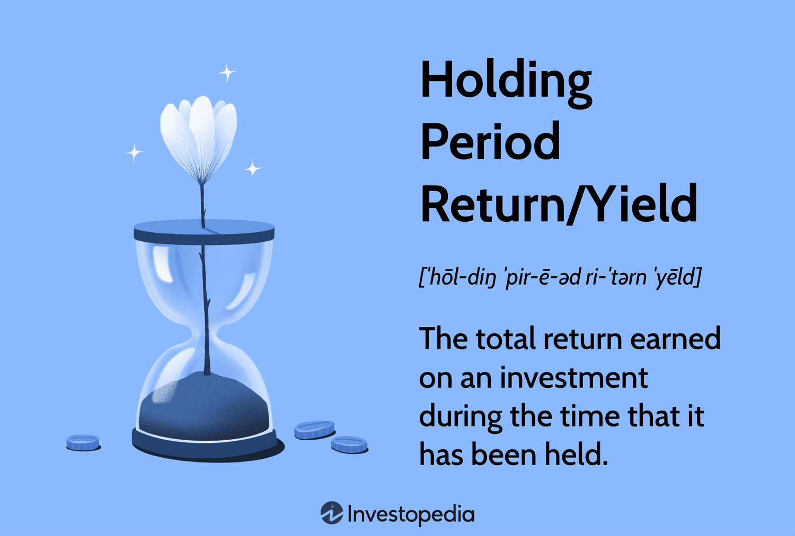

In the world of investing, evaluating the performance of a bond portfolio is crucial for making informed decisions. Investors seek to maximize returns and manage risks, and to do so effectively, they must use robust metrics such as the holding period return (HPR) and yield evaluation. These metrics are essential in assessing the financial performance of bond investments over specific periods. 

The HPR offers a comprehensive measure by accounting for total returns from capital gains, losses, and income generated, thus providing a clear picture of an investment's performance over a given timeframe. Meanwhile, yield evaluation enables investors to determine the profitability of their investments by comparing yields across different bonds, thereby guiding decisions on which assets to hold or sell.



Algorithmic trading, or algo trading, introduces advanced techniques for analyzing these critical metrics. By leveraging algorithmic systems, investors can process large datasets and execute trades based on predefined criteria, such as optimizing portfolio yields or balancing risks with returns. This data-driven approach provides insights and enhances the decision-making process, allowing investors to refine their strategies and ultimately optimize returns on their bond portfolios.

This article explores the key concepts of HPR, yield evaluation, and how algorithmic trading can enhance bond portfolio management. By understanding and implementing these methods, investors can make more informed strategic decisions and navigate the bond market more effectively.

## Table of Contents

## Understanding Holding Period Return (HPR)

Holding Period Return (HPR) is a critical metric in evaluating the performance of bond investments. It reflects the total return earned over the period an investment is held, encompassing capital gains, losses, and income such as interest payments. The formula to calculate HPR is straightforward: 

$$
\text{HPR} = \frac{(\text{Ending Value of Investment} - \text{Beginning Value} + \text{Income})}{\text{Beginning Value}}
$$

This metric is invaluable in allowing investors to assess and compare the performance of different bonds, even when they are held for varying durations. By providing a unified framework for performance comparison, HPR serves as a fundamental tool in bond portfolio management. It enables investors to ascertain the effectiveness of their investment strategies and make informed decisions about which bonds to retain or sell based on historical performance.

Moreover, HPR enhances the capability of investors to balance the trade-off between holding periods and realized returns, which is paramount in maximizing portfolio profitability. By considering both the income generated and the capital appreciation or depreciation, HPR offers a comprehensive view of total investment returns. This is particularly beneficial in diverse financial landscapes where bonds may exhibit volatile performance due to fluctuating market conditions. Understanding and applying HPR thus empowers investors to make more strategic and informed decisions in managing bond portfolios.

## Importance of Yield Evaluation

Yield evaluation is a critical component in determining the profitability of bond investments. It involves analyzing the income received from a bond, predominantly in the form of interest payments, relative to its cost or market value. By comparing yields, investors can discern which bonds in a portfolio generate the highest returns. This comparative analysis assists investors in making informed decisions about which bonds to hold or sell to maximize portfolio profitability.

The yield of a bond can be expressed through different measures, such as current yield, yield to maturity (YTM), and yield to call. Each provides unique insights into potential investment returns. Current yield, for example, is calculated as the annual interest payment divided by the bond's current price:

$$
\text{Current Yield} = \frac{\text{Annual Interest Payment}}{\text{Current Market Price}}
$$

Yield evaluation becomes especially valuable when assessing the impact of fluctuating market conditions on bond performance. For instance, changes in interest rates can significantly influence bond prices and yields. A rise in interest rates typically results in lower bond prices and higher yields, whereas a decrease in rates produces the opposite effect.

Algorithmic trading enhances yield evaluation by leveraging vast datasets and computational power to provide data-driven insights. Through sophisticated algorithms, traders can assess vast amounts of market data in real-time to identify trends, correlations, and opportunities that might not be apparent through manual analysis. These algorithms can rapidly compare yields across numerous bonds, taking into account factors such as [interest rate](/wiki/interest-rate-trading-strategies) changes, macroeconomic indicators, and market sentiment, allowing for a precise and timely adjustment of bond portfolios.

Python is widely used for implementing these algorithmic strategies due to its robust libraries and frameworks for data analysis, such as NumPy, pandas, and scikit-learn. For instance, a Python script can be designed to fetch bond data, calculate various yield metrics, and execute trades based on predefined yield thresholds:

```python
import pandas as pd

# Fetch bond data
data = pd.read_csv('bond_data.csv')

# Calculate current yield
data['Current Yield'] = data['Annual Interest Payment'] / data['Current Market Price']

# Define trading strategy based on yield
def trade_based_on_yield(bond_data, threshold):
    for index, bond in bond_data.iterrows():
        if bond['Current Yield'] > threshold:
            print(f"Consider holding bond: {bond['Bond Name']}")
        else:
            print(f"Consider selling bond: {bond['Bond Name']}")

# Execute trading strategy with a yield threshold of 5%
trade_based_on_yield(data, 0.05)
```

Through yield evaluation and the application of [algorithmic trading](/wiki/algorithmic-trading), investors can tailor their strategies to maximize returns, optimize bond selections, and mitigate risks associated with market [volatility](/wiki/volatility-trading-strategies). This systematic approach empowers investors to enhance the overall performance of their bond portfolios.

## Algorithmic Trading for Bond Portfolios

Algorithmic trading, also known as algo trading, utilizes automated systems designed to execute trades based on established criteria, facilitating the optimization of bond portfolio performance. This approach significantly benefits from the ability to analyze extensive datasets, enabling traders to efficiently evaluate crucial metrics such as Holding Period Return (HPR) and yield. By leveraging algorithms, investors can pinpoint the most successful bonds within their portfolios and make informed decisions to enhance overall returns.

One of the key advantages of algorithmic trading in bond portfolios is its capability to manage risk effectively. This is achieved by maintaining a balance between expected returns and market volatility. The automated nature of algo trading allows for swift adjustments to be made in response to real-time market conditions, thereby minimizing potential losses while striving for optimal performance.

The implementation of algorithmic trading strategies often involves sophisticated tools and platforms such as MATLAB and Python, both of which are renowned for their robust computational capabilities and extensive libraries. Python, in particular, offers a versatile ecosystem for developing trading algorithms, thanks to its wide range of libraries such as NumPy for numerical computations, pandas for data manipulation, and libraries like TA-Lib for technical analysis. 

A simple example of trading logic in Python might involve calculating the HPR of multiple bond investments and executing trades based on specified thresholds. Below is an illustrative snippet in Python:

```python
import pandas as pd

# Sample data representing bond prices and income
data = {'beginning_value': [100, 105, 110],
        'ending_value': [110, 108, 116],
        'income': [5, 4, 6]}
df = pd.DataFrame(data)

# Calculate the Holding Period Return (HPR) for each bond
df['HPR'] = (df['ending_value'] - df['beginning_value'] + df['income']) / df['beginning_value']

# Define a threshold for deciding on buying or selling
threshold = 0.10

# Generate trading signals based on HPR
df['signal'] = df['HPR'].apply(lambda x: 'buy' if x > threshold else 'sell')

print(df)
```

In this code, the algorithm evaluates each bond's HPR and determines whether to buy or sell based on a predefined threshold. Such automated strategies allow for agility in bond trading, adapting quickly to market changes and optimizing the portfolio accordingly.

Moreover, algorithmic trading frameworks often incorporate risk management components, such as stop-loss mechanisms and diversification strategies, to shield investments from excessive exposure and potential downturns. The intelligent application of these techniques ensures a balanced approach, aligning the portfolio's risk profile with investment objectives.

In summary, algorithmic trading offers a multifaceted suite of tools for enhancing bond portfolio management. By integrating advanced data analytics and automated trading strategies, investors can achieve superior returns while effectively managing associated risks. Through platforms like Python and MATLAB, these strategies are made accessible and actionable, driving more informed and strategic investment decisions.

## Case Study: Optimizing with Annualized HPR

Annualized Holding Period Return (HPR) is a vital tool for investors, enabling them to evaluate and compare the performance of investments held over various time periods. For hedge funds employing multiple algorithmic strategies, annualized HPR provides a standardized metric to objectively assess which strategy yields superior returns.

Consider a [hedge fund](/wiki/hedge-fund-trading-strategies) that implements diverse algorithmic strategies, each designed to optimize returns from a bond portfolio. These strategies may include techniques such as trend-following, mean reversion, or [arbitrage](/wiki/arbitrage), each with distinct risk-return profiles. To determine which strategy is most effective, the fund calculates the HPR for each strategy over a specific holding period. The formula for annualizing HPR is:

$$
\text{Annualized HPR} = \left(1 + \text{HPR}\right)^{\frac{1}{n}} - 1
$$

where $n$ represents the number of years the investment was held. This formula converts the HPR to an annualized rate, providing a consistent basis for comparison.

For instance, if Strategy A over one year has an HPR of 10% and Strategy B over two years has an HPR of 21%, their annualized HPRs would be calculated as follows:

- Strategy A: $(1 + 0.10)^{1/1} - 1 = 0.10$ or 10%
- Strategy B: $(1 + 0.21)^{1/2} - 1 \approx 0.10$ or 10%

Through this annualization, the hedge fund determines that both strategies yield equivalent annualized returns, bringing additional layers of insight into decision-making procedures.

Analyzing annualized HPR helps funds adapt strategies to leverage current market conditions, and when synchronized with algorithmic trading platforms, enhances decision-making through data-driven insights. Tools like Python can be harnessed to automate the calculation and comparison of HPRs across different strategies, handling complex datasets efficiently. Here's a simple example of how annualized HPR could be calculated in Python:

```python
def annualized_hpr(hpr, years):
    return ((1 + hpr) ** (1 / years)) - 1

strategies = {'Strategy A': (0.10, 1), 'Strategy B': (0.21, 2)}

for strategy, (hpr, years) in strategies.items():
    print(f"{strategy}: {annualized_hpr(hpr, years):.2%}")
```

By employing such analytical techniques, hedge funds can refine their strategies, taking advantage of rising interest rates or market volatility, and thus gain a competitive edge. The annualized HPR serves not only as a benchmarking tool but also as a mechanism to inform adjustments in algorithmic trading strategies, thereby optimizing the bond portfolio's performance. This case study illustrates the importance of integrating financial metrics with algorithmic methods in strategic investment management.

## Conclusion

Evaluating a bond portfolio's returns and yields is essential for investment success, as it aids in understanding the overall performance of investments. The holding period return (HPR) offers a comprehensive measure of total returns by accounting for capital gains, losses, and income such as interest received. This metric allows investors to make apples-to-apples comparisons of different bond investments, even when held over varying time periods.

Algorithmic trading elevates this evaluation process by leveraging data-driven insights. Algorithms enable investors to process large datasets efficiently, identifying optimal trading strategies and investment opportunities. By automating the analysis of HPR and yield, algorithmic trading minimizes human error and biases, facilitating more informed and strategic decision-making.

Investors can harness these methodologies to optimize their bond portfolios, balancing risk and return to achieve enhanced performance. Tools such as Python and MATLAB provide robust platforms for implementing these advanced trading strategies, thereby optimizing trading decisions and improving portfolio management. By mastering HPR calculations and yield evaluations, combined with the deployment of algorithmic trading, investors are better equipped to navigate market dynamics and economic fluctuations, ensuring superior investment outcomes. Understanding and applying these principles empowers investors to make strategic moves in the bond market, maximizing returns while managing risk effectively.

## References & Further Reading

[1]: ["Advances in Financial Machine Learning"](https://www.amazon.com/Advances-Financial-Machine-Learning-Marcos/dp/1119482089) by Marcos Lopez de Prado

[2]: ["Quantitative Trading: How to Build Your Own Algorithmic Trading Business"](https://www.amazon.com/Quantitative-Trading-Build-Algorithmic-Business/dp/1119800064) by Ernest P. Chan

[3]: ["Fixed Income Securities: Tools for Today's Markets"](https://www.amazon.com/Fixed-Income-Securities-Markets-Finance/dp/1119835550) by Bruce Tuckman and Angel Serrat

[4]: ["Algorithmic Trading and DMA: An Introduction to Direct Access Trading Strategies"](https://www.amazon.com/Algorithmic-Trading-DMA-introduction-strategies/dp/0956399207) by Barry Johnson

[5]: ["Fixed Income Analysis"](https://en.wikipedia.org/wiki/Fixed_income_analysis) by Barbara S. Petitt

[6]: ["Python for Finance: Mastering Data-Driven Finance"](https://www.amazon.com/Python-Finance-Mastering-Data-Driven/dp/1492024333) by Yves Hilpisch